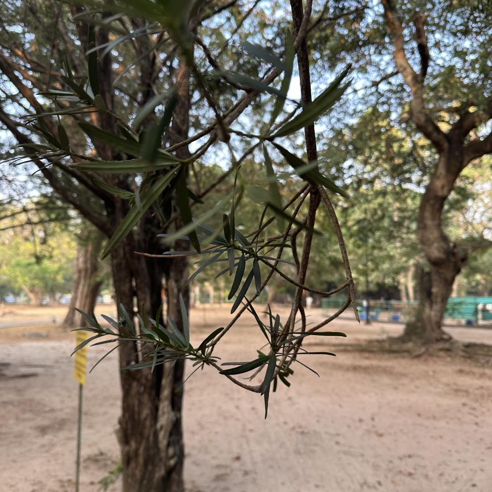
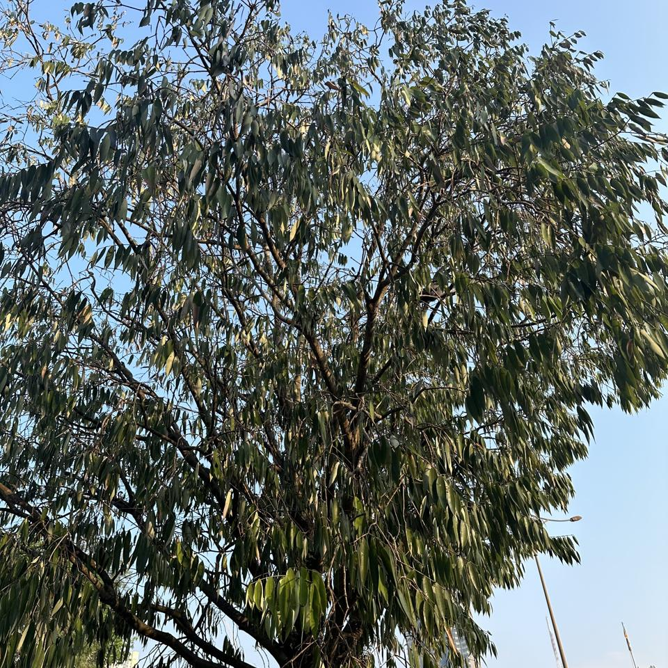
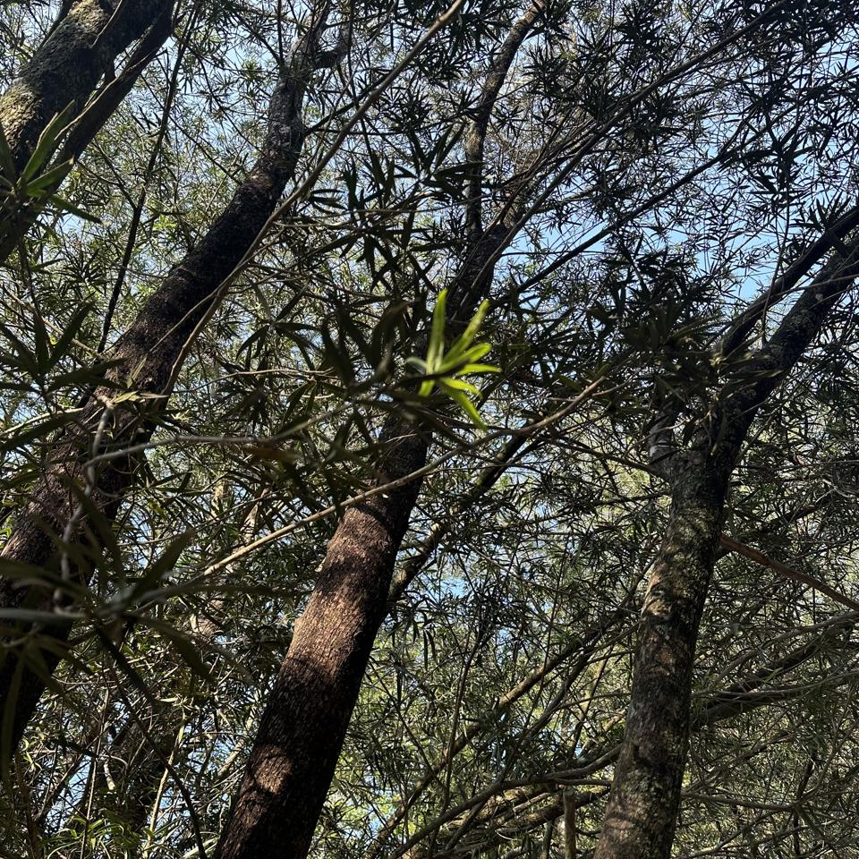
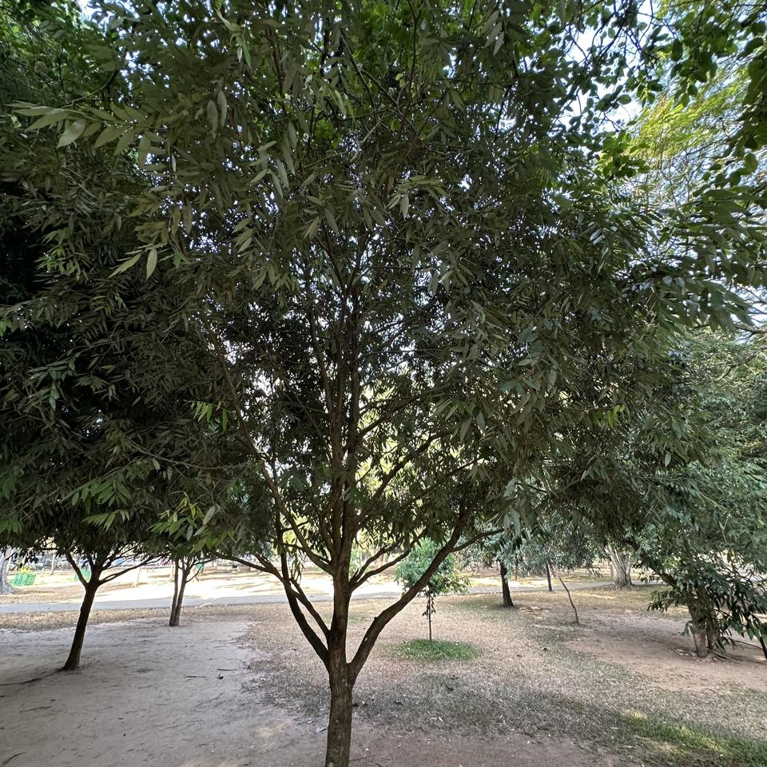
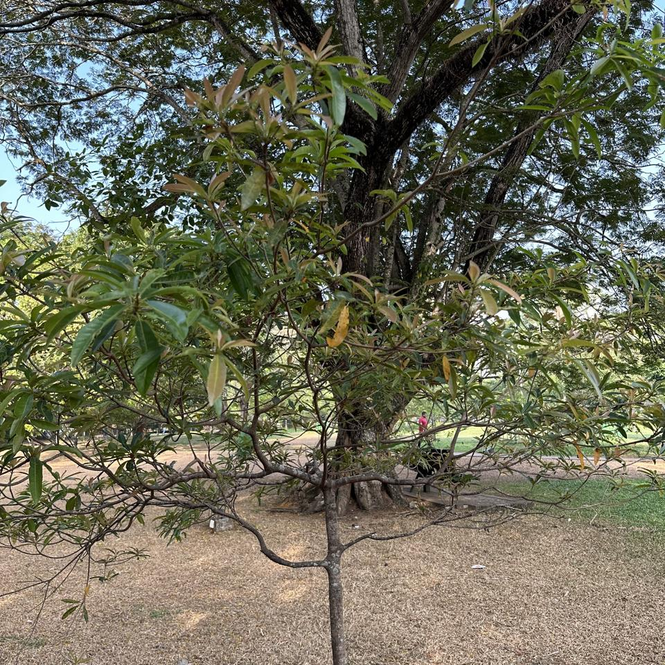
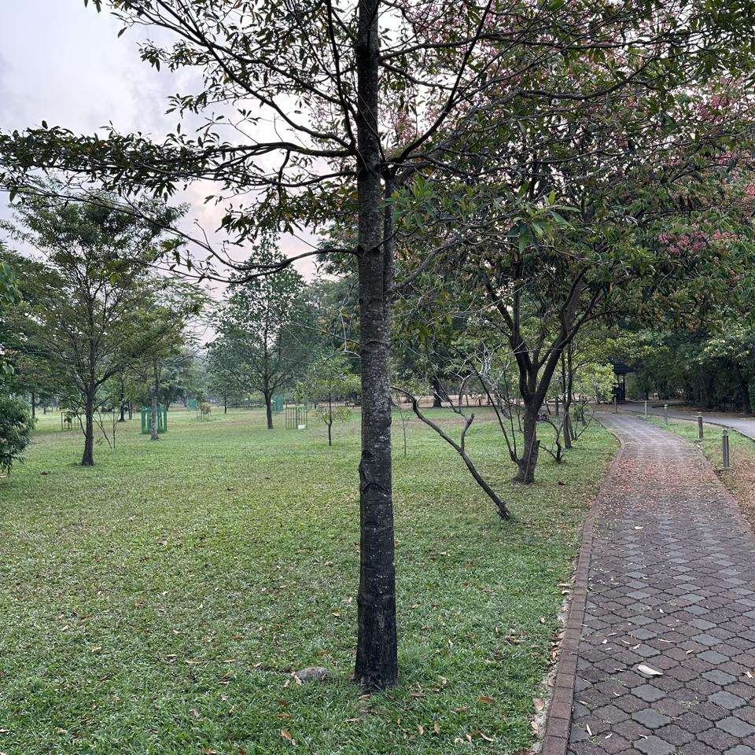
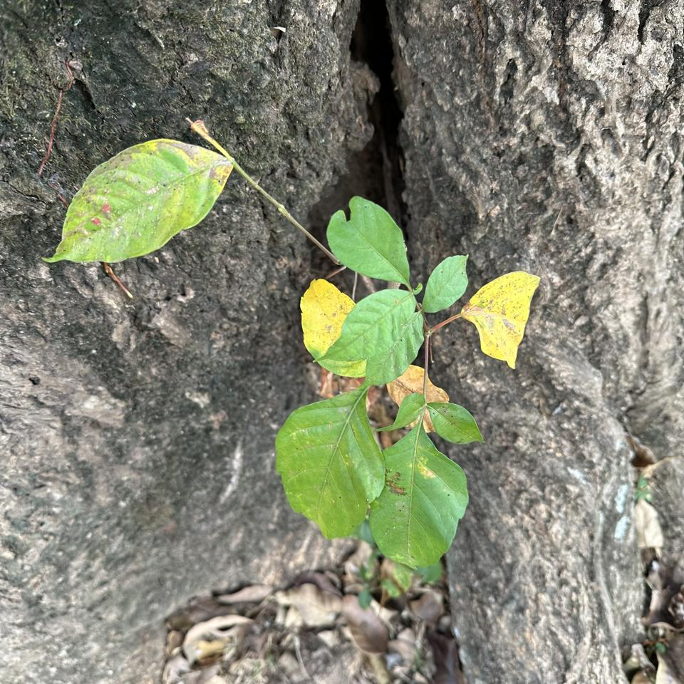
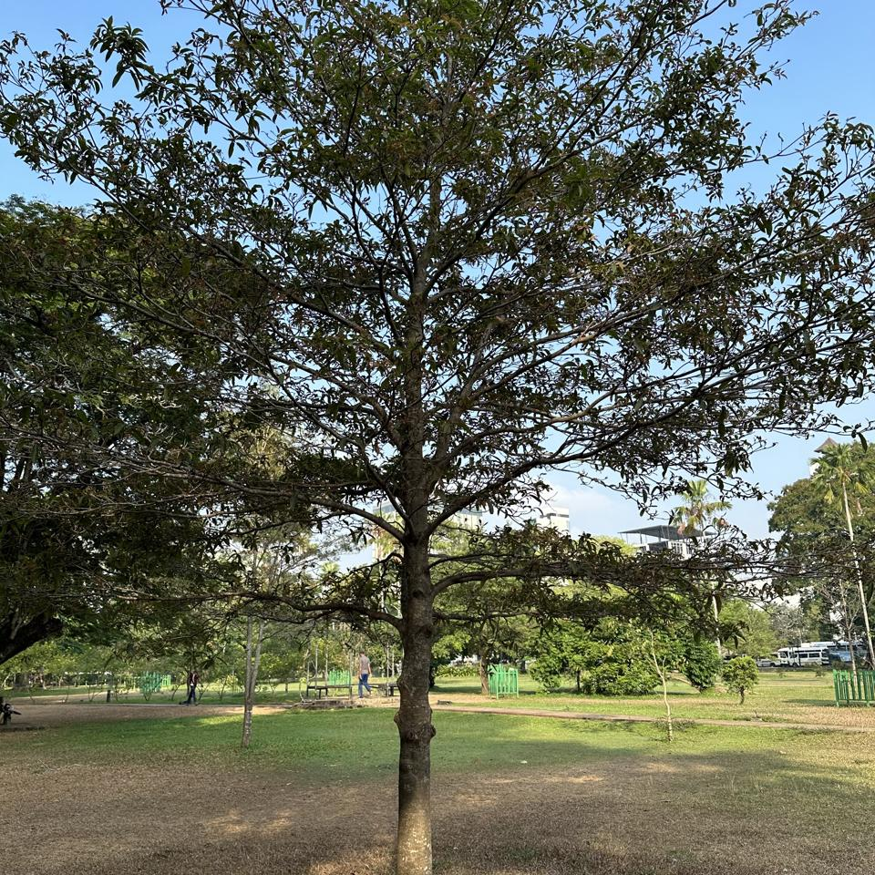

## Sample of Plant Photos difficult to Identify

Photos where the identification confidence is **< 20%**.

### Photo-2024-03-15-07-01-27

* 6.0% *Podocarpus neriifolius*
* 1.1% *Cascabela thevetia*
* 0.7% *Melaleuca viminalis*

### Photo-2024-03-08-07-06-50

* 17.5% *Mangifera indica*
* 5.0% *Chitalpa tashkentensis*
* 4.9% *Mimusops elengi*

### Photo-2024-03-15-07-19-33

* 13.1% *Mesua ferrea*
* 2.5% *Eucalyptus globulus*
* 2.2% *Syzygium cumini*

### Photo-2024-03-21-07-53-53

* 2.1% *Cinnamomum camphora*
* 1.6% *Pterocarpus macrocarpus*
* 0.9% *Quercus serrata*

### Photo-2024-03-20-07-40-12

* 16.7% *Bauhinia purpurea*
* 7.0% *Bauhinia tomentosa*
* 5.4% *Kleinhovia hospita*

### Photo-2024-03-17-08-04-33

* 2.9% *Melaleuca viminalis*
* 2.5% *Acacia confusa*
* 1.4% *Cascabela thevetia*

### Photo-2024-03-08-06-57-03

* 11.1% *Tabebuia rosea*
* 10.7% *Handroanthus heptaphyllus*
* 8.5% *Celtis australis*

### Photo-2024-03-17-08-09-01

* 0.4% *Acacia confusa*
* 0.2% *Schizolobium parahyba*
* 0.2% *Elaeocarpus angustifolius*

### Photo-2024-03-20-07-46-33

* 12.0% *Toona ciliata*
* 6.4% *Dimocarpus longan*
* 3.1% *Pongamia pinnata*

### Photo-2024-03-21-08-11-43

* 6.0% *Hymenaea courbaril*
* 4.0% *Bombax ceiba*
* 4.0% *Ceiba pentandra*

### Photo-2024-03-20-07-03-29

* 7.5% *Bougainvillea glabra*
* 4.4% *Citrus aurantium*
* 2.9% *Pongamia pinnata*

### Photo-2024-03-17-08-15-08

* 15.4% *Mesua ferrea*
* 4.1% *Senna siamea*
* 3.3% *Fraxinus angustifolia*

### Photo-2024-03-22-08-04-59

* 4.5% *Cerbera odollam*
* 2.7% *Cerbera manghas*
* 1.7% *Manilkara zapota*

### Photo-2024-03-20-07-04-16

* 13.4% *Moringa oleifera*
* 9.5% *Libidibia ferrea*
* 5.4% *Albizia procera*

### Photo-2024-03-20-07-38-47

* 3.7% *Pterocarpus indicus*
* 3.2% *Cassia fistula*
* 3.2% *Holarrhena pubescens*

### Photo-2024-03-11-06-38-04

* 15.2% *Quercus humboldtii*
* 5.1% *Prunus serrulata*
* 3.0% *Tabebuia rosea*

### Photo-2024-02-10-08-03-25

* 5.4% *Pittosporum undulatum*
* 3.3% *Melaleuca alternifolia*
* 2.6% *Camellia sinensis*

### Photo-2024-03-14-07-50-26

* 2.3% *Aegle marmelos*
* 0.6% *Nephelium lappaceum*
* 0.4% *Pisonia aculeata*

### Photo-2024-03-22-08-04-08

* 1.2% *Prunus avium*
* 1.0% *Prunus persica*
* 0.5% *Elaeocarpus floribundus*

### Photo-2024-03-12-07-31-52

* 11.1% *Mesua ferrea*
* 5.0% *Eucalyptus globulus*
* 4.9% *Tipuana tipu*

