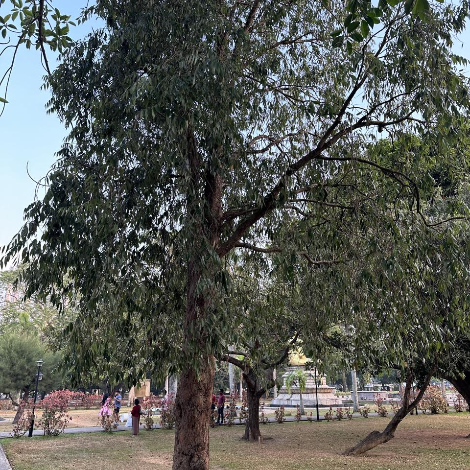

## Sample of Plant Photos difficult to Identify

Photos where the identification confidence is **< 20%**.

### Photo-2024-03-26-08-01-36

* 5.9% *Madhuca longifolia*
* 2.9% *Terminalia arjuna*
* 2.1% *Manilkara zapota*

### Photo-2024-03-22-08-05-10

* 1.6% *Durio zibethinus*
* 1.2% *Khaya senegalensis*
* 1.1% *Acacia melanoxylon*

### Photo-2024-03-20-07-45-54

* 6.1% *Psidium cattleyanum*
* 5.3% *Lagerstroemia indica*
* 5.1% *Erythroxylum coca*

### Photo-2024-03-20-07-38-47

* 3.7% *Pterocarpus indicus*
* 3.2% *Cassia fistula*
* 3.2% *Holarrhena pubescens*

### Photo-2024-03-17-08-02-25

* 3.3% *Melaleuca viminalis*
* 1.3% *Podocarpus neriifolius*
* 0.6% *Acacia melanoxylon*

### Photo-2024-03-12-07-31-52

* 11.1% *Mesua ferrea*
* 5.0% *Eucalyptus globulus*
* 4.9% *Tipuana tipu*

### Photo-2024-03-20-07-39-42

* 18.5% *Holarrhena pubescens*
* 7.6% *Cassia fistula*
* 1.7% *Oroxylum indicum*

### Photo-2024-03-08-06-49-11

* 6.4% *Melaleuca leucadendra*
* 5.6% *Celtis australis*
* 4.3% *Eucalyptus robusta*

### Photo-2024-03-15-07-41-20

* 5.6% *Ficus virens*
* 3.4% *Ficus altissima*
* 3.2% *Castilla elastica*

### Photo-2024-03-25-07-23-41

* 3.1% *Aegle marmelos*
* 3.0% *Vangueria madagascariensis*
* 2.0% *Crescentia cujete*

### Photo-2024-03-21-08-15-46

* 2.8% *Syzygium jambos*
* 2.6% *Madhuca longifolia*
* 1.9% *Manilkara zapota*

### Photo-2024-03-17-08-00-51

* 4.8% *Annona muricata*
* 2.3% *Artabotrys hexapetalus*
* 1.3% *Diospyros malabarica*

### Photo-2024-03-08-06-54-25

* 8.5% *Phillyrea latifolia*
* 3.5% *Terminalia mantaly*
* 2.9% *Quercus suber*

### Photo-2024-03-20-08-04-35

* 0.9% *Ficus religiosa*
* 0.8% *Hymenaea courbaril*
* 0.6% *Dipterocarpus alatus*

### Photo-2024-03-22-08-09-01

* 7.0% *Madhuca longifolia*
* 5.2% *Elaeocarpus angustifolius*
* 3.6% *Dillenia indica*

### Photo-2024-03-25-07-50-16

* 9.2% *Ficus benjamina*
* 6.4% *Ficus retusa*
* 4.0% *Mimusops elengi*

### Photo-2024-03-20-08-05-00

* 19.2% *Ficus virens*
* 4.7% *Ficus benghalensis*
* 4.1% *Ficus religiosa*

### Photo-2024-03-13-07-39-09

* 10.4% *Ficus benghalensis*
* 7.5% *Ficus elastica*
* 3.6% *Rhaphidophora decursiva*

### Photo-2024-03-08-07-12-19

* 4.0% *Delonix regia*
* 2.4% *Hymenaea courbaril*
* 2.4% *Elaeocarpus serratus*

### Photo-2024-03-11-06-38-22

* 11.1% *Cassia roxburghii*
* 10.6% *Brownea grandiceps*
* 6.6% *Jacaranda caucana*

