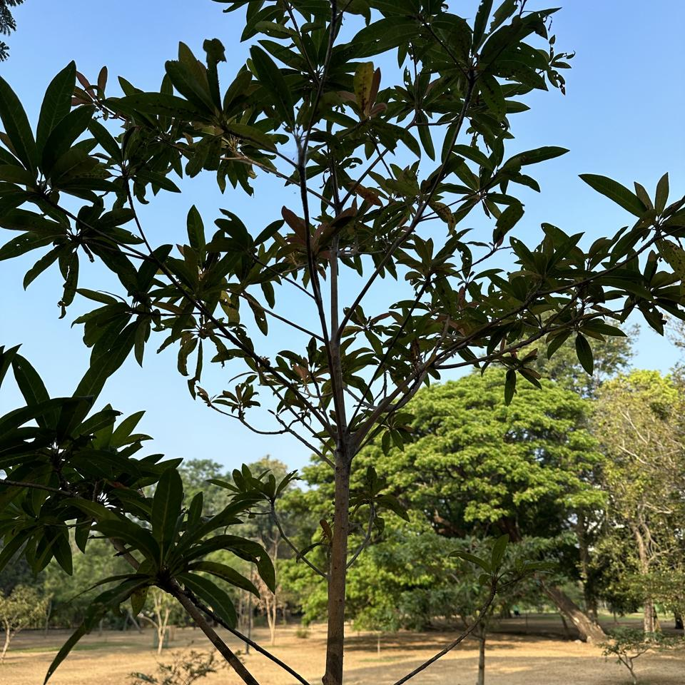

## Sample of Plant Photos difficult to Identify

Photos where the identification confidence is **< 20%**.

### Photo-2024-03-26-08-01-11

* 16.1% *Mimusops elengi*
* 10.5% *Ficus benjamina*
* 10.2% *Ficus retusa*

### Photo-2024-03-26-07-49-00

* 8.6% *Vitex altissima*
* 6.3% *Adansonia digitata*
* 5.5% *Vitex pinnata*

### Photo-2024-03-15-07-07-08

* 5.5% *Azadirachta indica*
* 2.6% *Tipuana tipu*
* 1.5% *Diospyros buxifolia*

### Photo-2024-03-19-07-15-40

* 4.3% *Peltophorum dubium*
* 3.4% *Peltophorum africanum*
* 1.7% *Samanea saman*

### Photo-2024-03-19-07-11-49

* 3.8% *Albizia lebbeck*
* 3.3% *Pometia pinnata*
* 2.1% *Pterocarpus indicus*

### Photo-2024-03-11-06-46-20

* 10.7% *Terminalia arjuna*
* 6.1% *Punica granatum*
* 2.6% *Nephelium lappaceum*

### Photo-2024-03-11-06-43-18

* 9.0% *Filicium decipiens*
* 6.0% *Prosopis glandulosa*
* 5.0% *Peronema canescens*

### Photo-2024-03-26-07-48-19

* 16.1% *Swietenia macrophylla*
* 5.0% *Swietenia mahagoni*
* 4.6% *Spondias mombin*

### Photo-2024-03-15-07-10-58

* 13.7% *Peltophorum pterocarpum*
* 6.1% *Libidibia ferrea*
* 1.9% *Biancaea sappan*

### Photo-2024-03-21-08-16-49

* 5.5% *Jacaranda mimosifolia*
* 3.1% *Pterocarpus indicus*
* 2.9% *Albizia procera*

### Photo-2024-03-20-07-44-37

* 8.0% *Lagerstroemia speciosa*
* 4.3% *Diospyros melanoxylon*
* 2.3% *Strychnos nux-vomica*

### Photo-2024-03-26-07-39-39

* 7.4% *Ficus altissima*
* 1.8% *Cassia grandis*
* 1.1% *Ficus virens*

### Photo-2024-03-08-06-55-50

* 12.9% *Hibiscus rosa-sinensis*
* 5.6% *Hibiscus fragilis*
* 4.4% *Hibiscus schizopetalus*

### Photo-2024-03-21-07-49-57

* 19.6% *Areca triandra*
* 3.6% *Dendrocalamus giganteus*
* 0.2% *Areca catechu*

### Photo-2024-03-21-08-16-00

* 4.7% *Terminalia arjuna*
* 2.7% *Syzygium samarangense*
* 1.9% *Psidium guajava*

### Photo-2024-03-15-07-06-42

* 5.7% *Madhuca longifolia*
* 4.9% *Alstonia macrophylla*
* 2.1% *Mangifera indica*

### Photo-2024-03-21-08-13-46

* 5.2% *Manilkara zapota*
* 3.9% *Madhuca longifolia*
* 0.6% *Elaeocarpus angustifolius*

### Photo-2024-03-15-07-09-14

* 14.3% *Terminalia arjuna*
* 6.1% *Syzygium cumini*
* 3.3% *Syzygium jambos*

### Photo-2024-03-26-07-59-09

* 1.6% *Syzygium jambos*
* 0.9% *Corymbia maculata*
* 0.5% *Syzygium cymosum*

### Photo-2024-02-10-08-03-25

* 5.3% *Pittosporum undulatum*
* 3.4% *Melaleuca alternifolia*
* 3.2% *Camellia sinensis*

