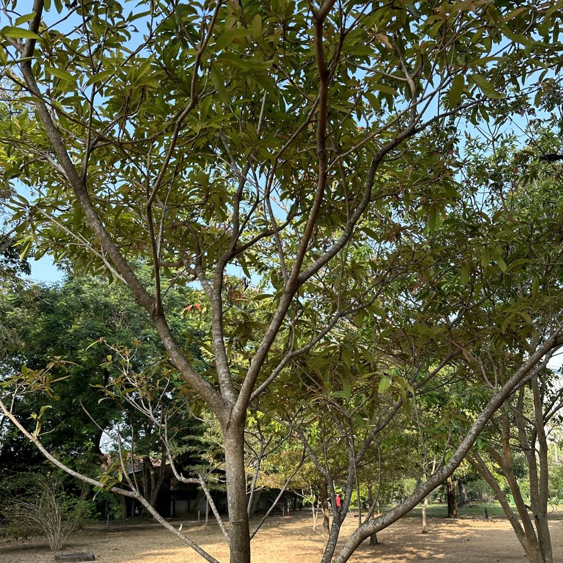
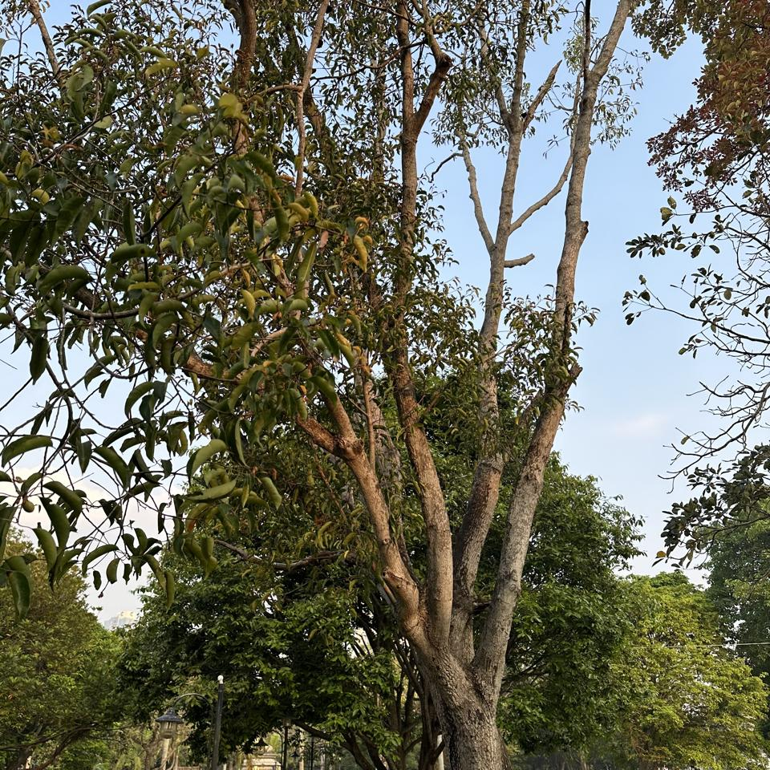
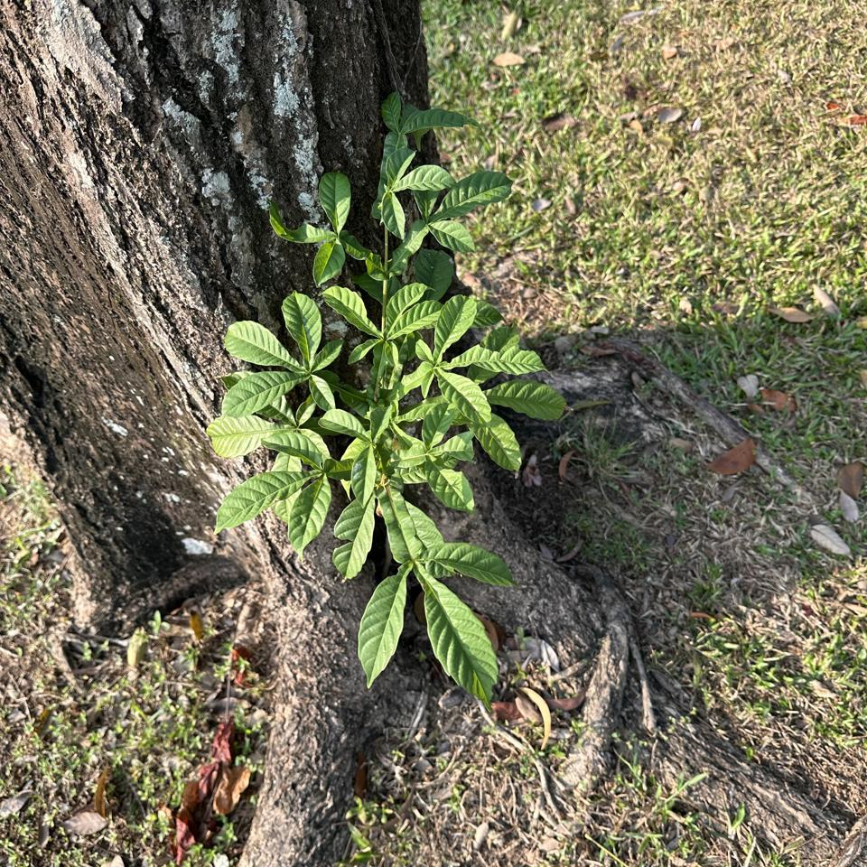
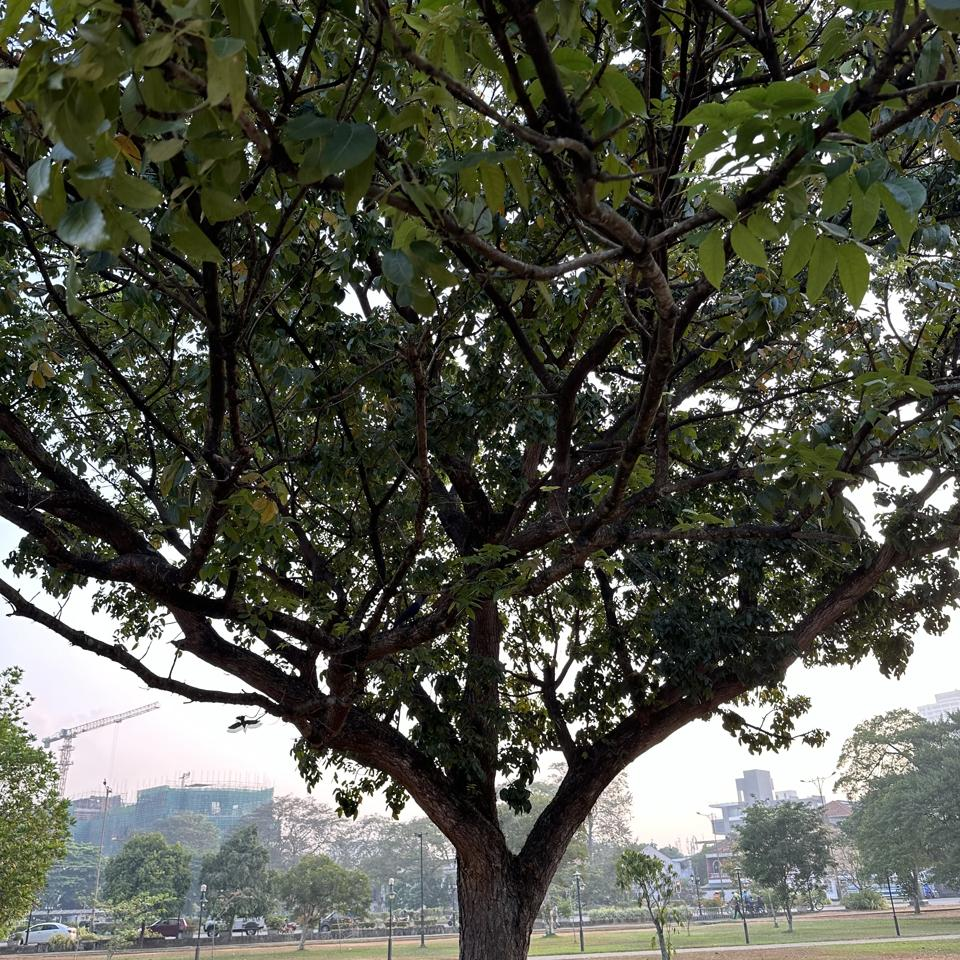

## Sample of Plant Photos difficult to Identify

Photos where the identification confidence is **< 20%**.

### Photo-2024-03-26-08-01-24

* 11.9% *Spathodea campanulata*
* 4.2% *Cananga odorata*
* 3.4% *Theobroma cacao*

### Photo-2024-03-14-08-00-09

* 18.9% *Areca triandra*
* 0.3% *Dendrocalamus giganteus*
* 0.3% *Dypsis lutescens*

### Photo-2024-03-22-08-04-41

* 7.0% *Saurauia napaulensis*
* 2.3% *Syzygium jambos*
* 1.0% *Plumeria rubra*

### Photo-2024-03-26-07-41-34

* 4.4% *Heritiera littoralis*
* 2.7% *Alangium salviifolium*
* 2.5% *Annona muricata*

### Photo-2024-03-08-07-00-57

* 8.6% *Cinnamomum camphora*
* 7.7% *Mimusops elengi*
* 7.1% *Syzygium cumini*

### Photo-2024-03-23-07-56-12

* 6.3% *Annona reticulata*
* 3.1% *Syzygium cumini*
* 2.7% *Santalum album*

### Photo-2024-03-11-06-49-39

* 6.9% *Alnus formosana*
* 4.3% *Ulmus pumila*
* 3.4% *Chrysophyllum oliviforme*

### Photo-2024-03-13-07-47-26

* 9.1% *Mangifera indica*
* 6.7% *Persea americana*
* 3.1% *Quercus acutissima*

### Photo-2024-03-21-08-10-57

* 5.3% *Manilkara zapota*
* 4.3% *Saurauia napaulensis*
* 2.4% *Terminalia arjuna*

### Photo-2024-03-12-06-51-02

* 12.1% *Manilkara zapota*
* 9.6% *Quercus humboldtii*
* 5.6% *Genipa americana*

### Photo-2024-03-15-07-07-22

* 16.5% *Barringtonia acutangula*
* 2.3% *Couroupita guianensis*
* 1.3% *Madhuca longifolia*

### Photo-2024-03-12-07-31-52

* 11.1% *Mesua ferrea*
* 5.0% *Eucalyptus globulus*
* 4.9% *Tipuana tipu*

### Photo-2024-03-26-07-49-00

* 8.6% *Vitex altissima*
* 6.3% *Adansonia digitata*
* 5.5% *Vitex pinnata*

### Photo-2024-03-15-07-01-43

* 13.5% *Podocarpus neriifolius*
* 4.7% *Melaleuca viminalis*
* 1.2% *Cascabela thevetia*

### Photo-2024-03-21-08-14-43

* 6.1% *Muntingia calabura*
* 4.8% *Brownea grandiceps*
* 3.7% *Tipuana tipu*

### Photo-2024-03-21-07-48-00

* 10.3% *Samanea saman*
* 5.0% *Tipuana tipu*
* 2.6% *Choerospondias axillaris*

### Photo-2024-03-20-07-03-23

* 7.8% *Cordia dichotoma*
* 7.4% *Pterocarpus santalinus*
* 3.9% *Dalbergia latifolia*

### Photo-2024-03-11-06-35-58

* 18.7% *Lagerstroemia speciosa*
* 8.2% *Toona ciliata*
* 4.6% *Terminalia arjuna*

### Photo-2024-03-17-08-09-01

* 0.4% *Acacia confusa*
* 0.2% *Schizolobium parahyba*
* 0.2% *Elaeocarpus angustifolius*

### Photo-2024-03-08-06-52-20

* 9.9% *Tabebuia rosea*
* 5.2% *Tabebuia pallida*
* 4.4% *Phytolacca dioica*

