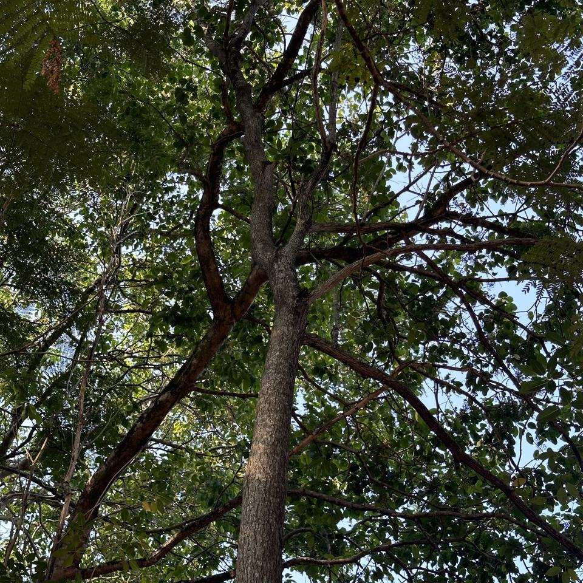
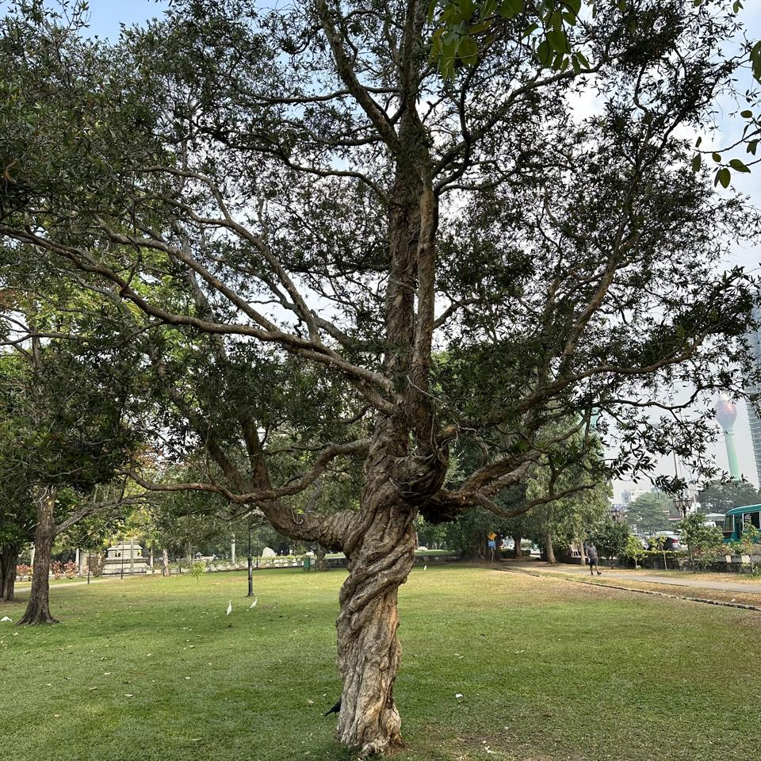
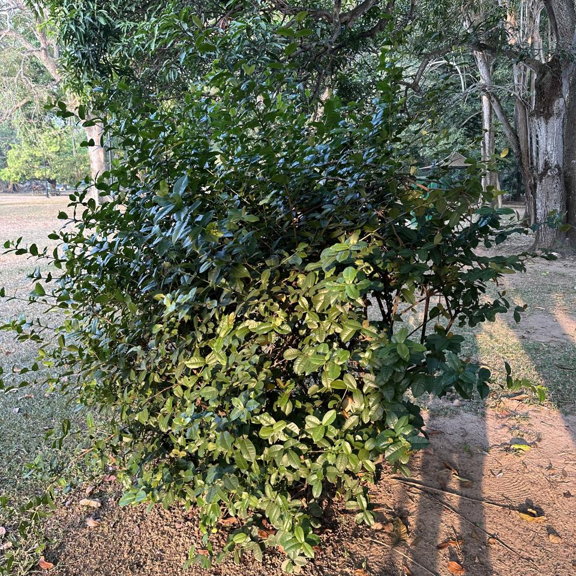

## Sample of Plant Photos difficult to Identify

Photos where the identification confidence is **< 20%**.

### Photo-2024-03-17-08-19-11

* 2.0% *Ochna integerrima*
* 0.2% *Malpighia glabra*

### Photo-2024-03-14-07-49-55

* 16.3% *Jacaranda mimosifolia*
* 7.2% *Delonix regia*
* 3.4% *Peltophorum pterocarpum*

### Photo-2024-03-26-07-59-09

* 1.6% *Syzygium jambos*
* 0.9% *Corymbia maculata*
* 0.5% *Syzygium cymosum*

### Photo-2024-03-21-07-33-18

* 14.6% *Terminalia arjuna*
* 3.7% *Brownea grandiceps*
* 3.3% *Diospyros blancoi*

### Photo-2024-03-15-07-20-43

* 18.5% *Ficus altissima*
* 7.8% *Neolamarckia cadamba*
* 2.0% *Juglans regia*

### Photo-2024-03-10-07-57-26

* 8.1% *Ficus hispida*
* 6.5% *Bridelia micrantha*
* 6.4% *Ficus racemosa*

### Photo-2024-03-11-06-49-51

* 9.1% *Citrus latifolia*
* 9.0% *Citrus hystrix*
* 7.6% *Jasminum fluminense*

### Photo-2024-03-17-08-18-48

* 4.7% *Bischofia javanica*
* 4.7% *Guazuma ulmifolia*
* 4.3% *Radermachera sinica*

### Photo-2024-03-21-07-48-00

* 10.3% *Samanea saman*
* 5.0% *Tipuana tipu*
* 2.6% *Choerospondias axillaris*

### Photo-2024-03-11-07-36-21

* 11.2% *Mimusops elengi*
* 9.2% *Eugenia myrcianthes*
* 2.2% *Balfourodendron riedelianum*

### Photo-2024-03-21-08-10-57

* 5.3% *Manilkara zapota*
* 4.3% *Saurauia napaulensis*
* 2.4% *Terminalia arjuna*

### Photo-2024-03-14-07-56-52

* 0.7% *Olea europaea*
* 0.3% *Ficus microcarpa*
* 0.2% *Terminalia arjuna*

### Photo-2024-03-21-07-47-53

* 2.2% *Guazuma ulmifolia*
* 1.4% *Holarrhena pubescens*
* 1.0% *Muntingia calabura*

### Photo-2024-03-08-07-11-11

* 10.0% *Trachelospermum jasminoides*
* 8.4% *Trachelospermum asiaticum*
* 4.9% *Ilex cornuta*

### Photo-2024-03-11-06-38-04

* 15.2% *Quercus humboldtii*
* 5.1% *Prunus serrulata*
* 3.0% *Tabebuia rosea*

### Photo-2024-03-21-07-47-35

* 14.0% *Peltophorum dubium*
* 10.8% *Peltophorum pterocarpum*
* 6.2% *Jacaranda mimosifolia*

### Photo-2024-03-20-07-33-46

* 13.6% *Terminalia arjuna*
* 11.0% *Psidium guajava*
* 5.4% *Bridelia tomentosa*

### Photo-2024-03-26-07-39-01

* 8.3% *Adenanthera pavonina*
* 7.3% *Jacaranda mimosifolia*
* 4.2% *Samanea saman*

### Photo-2024-03-21-07-44-59

* 14.9% *Alstonia macrophylla*
* 14.5% *Cerbera manghas*
* 13.3% *Cerbera odollam*

### Photo-2024-03-13-07-47-42

* 3.5% *Cinnamomum camphora*
* 1.8% *Quercus glauca*
* 1.2% *Osmanthus fragrans*

