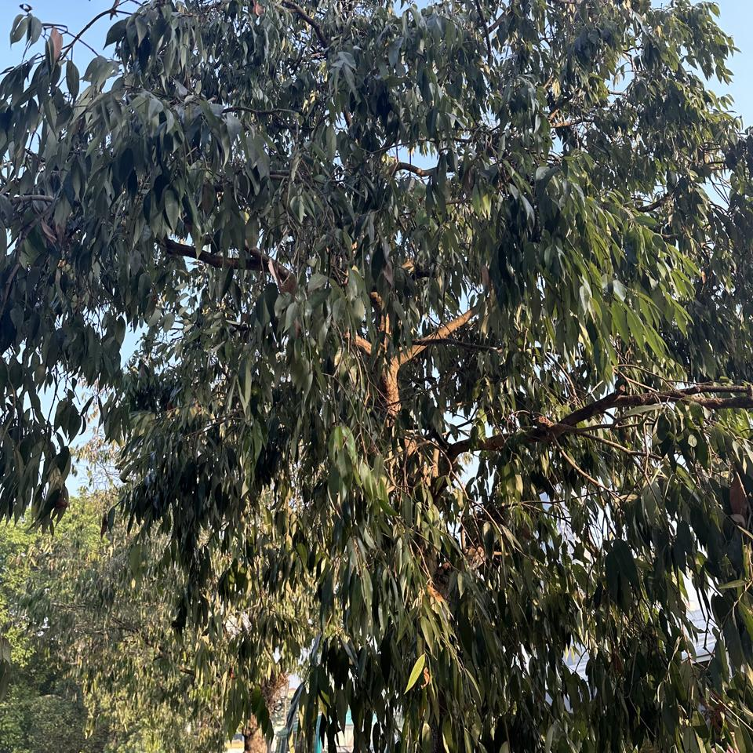
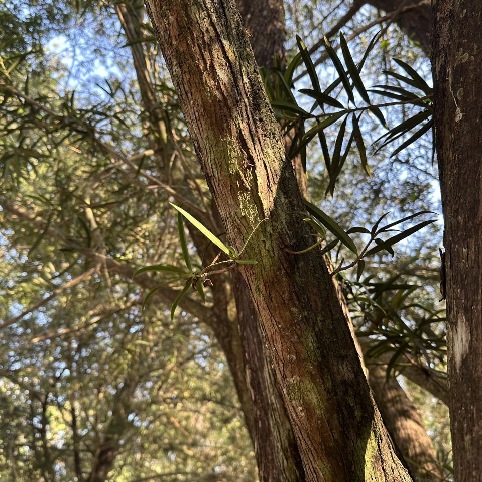
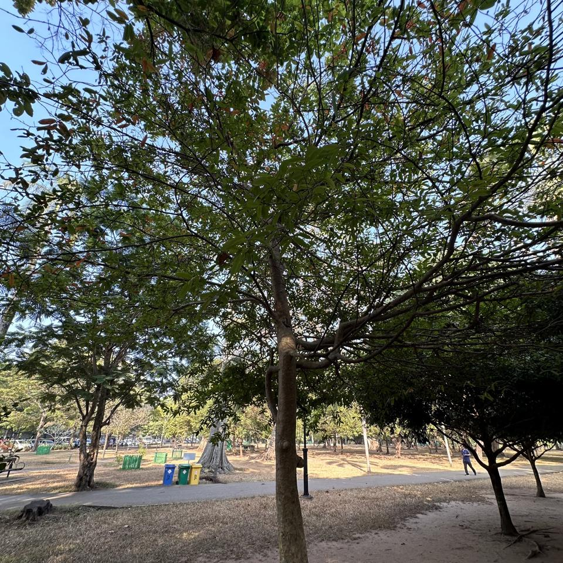
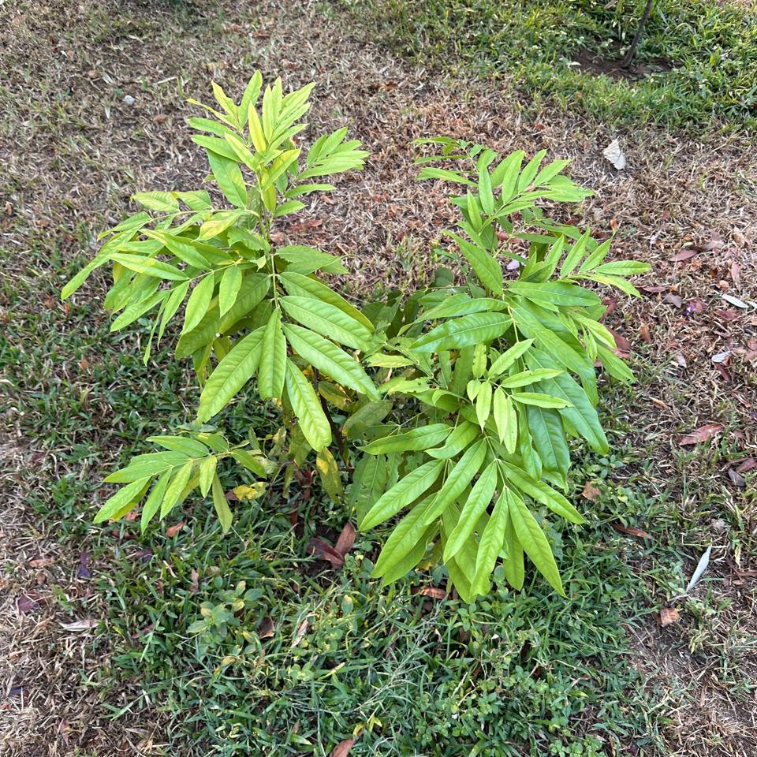
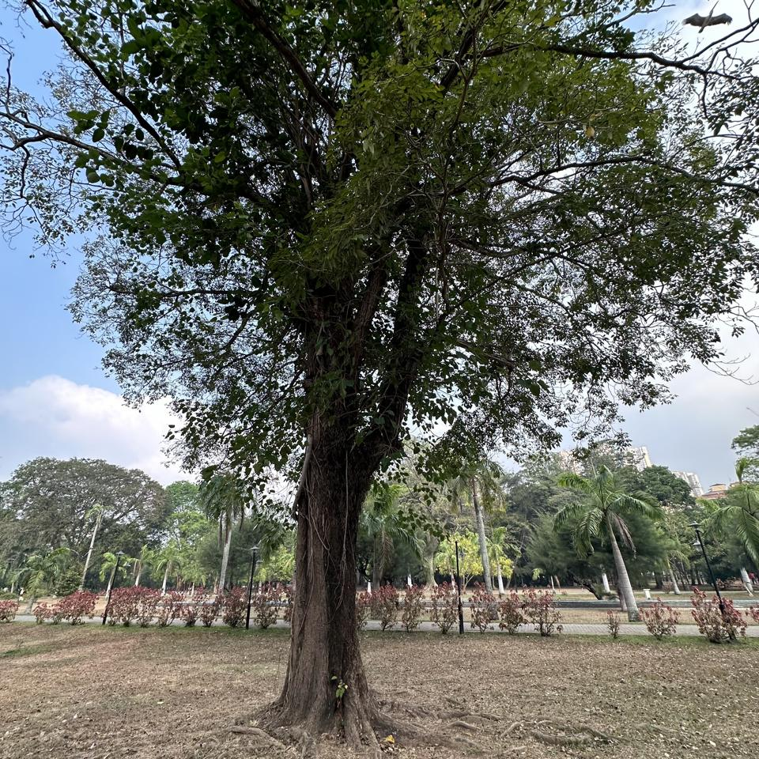
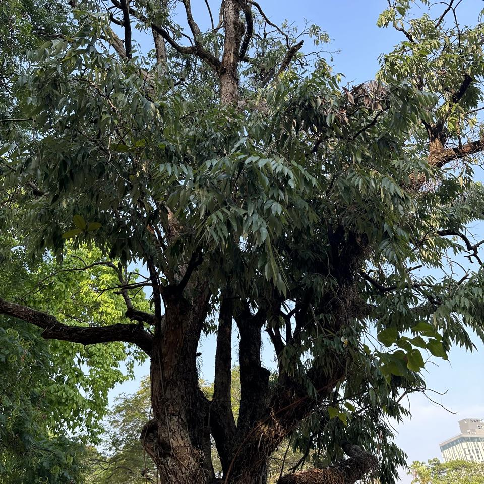

## Sample of Plant Photos difficult to Identify

Photos where the identification confidence is **< 20%**.

### Photo-2024-03-15-07-01-10

* 3.5% *Melaleuca viminalis*
* 3.4% *Bambusa vulgaris*
* 2.0% *Dendrocalamus giganteus*

### Photo-2024-03-08-07-06-01

* 11.3% *Bunchosia armeniaca*
* 10.4% *Ehretia anacua*
* 3.4% *Flacourtia jangomas*

### Photo-2024-03-15-07-19-26

* 8.7% *Eucalyptus globulus*
* 7.3% *Mesua ferrea*
* 2.4% *Eucalyptus sideroxylon*

### Photo-2024-03-27-07-40-31

* 19.6% *Cassia javanica*
* 3.8% *Pterocarpus indicus*
* 3.2% *Cassia moschata*

### Photo-2024-03-20-07-39-52

* 5.6% *Morus nigra*
* 3.6% *Pyrus calleryana*
* 2.9% *Ziziphus mauritiana*

### Photo-2024-03-17-08-04-11

* 1.1% *Melaleuca viminalis*
* 0.9% *Chamaecytisus prolifer*
* 0.9% *Podocarpus neriifolius*

### Photo-2024-03-08-06-55-50

* 12.9% *Hibiscus rosa-sinensis*
* 5.6% *Hibiscus fragilis*
* 4.4% *Hibiscus schizopetalus*

### Photo-2024-03-17-08-08-35

* 0.1% *Schizolobium parahyba*

### Photo-2024-03-20-07-46-15

* 11.5% *Peltophorum pterocarpum*
* 6.2% *Delonix regia*
* 3.4% *Jacaranda mimosifolia*

### Photo-2024-03-21-08-11-20

* 12.8% *Madhuca longifolia*
* 1.6% *Cestrum parqui*
* 1.4% *Asclepias curassavica*

### Photo-2024-03-20-07-03-23

* 7.8% *Cordia dichotoma*
* 7.4% *Pterocarpus santalinus*
* 3.9% *Dalbergia latifolia*

### Photo-2024-03-17-08-13-55

* 3.9% *Holarrhena pubescens*
* 2.8% *Annona squamosa*
* 2.4% *Citharexylum spinosum*

### Photo-2024-03-22-08-04-50

* 6.0% *Tabernaemontana divaricata*
* 3.4% *Syzygium jambos*
* 1.1% *Ludwigia octovalvis*

### Photo-2024-03-20-07-03-36

* 9.2% *Dimocarpus longan*
* 9.1% *Saraca indica*
* 7.4% *Saraca asoca*

### Photo-2024-03-20-07-38-35

* 3.1% *Quercus acutissima*
* 1.3% *Santalum album*
* 1.2% *Persea americana*

### Photo-2024-03-11-06-37-43

* 11.8% *Alnus formosana*
* 10.0% *Quercus humboldtii*
* 7.7% *Santalum album*

### Photo-2024-02-10-08-03-25

* 5.3% *Pittosporum undulatum*
* 3.4% *Melaleuca alternifolia*
* 3.2% *Camellia sinensis*

### Photo-2024-03-14-07-50-17

* 13.5% *Ficus religiosa*
* 1.9% *Strychnos nux-vomica*
* 1.8% *Spondias mombin*

### Photo-2024-03-22-08-03-23

* 17.3% *Mesua ferrea*
* 2.7% *Eucalyptus robusta*
* 2.2% *Toona ciliata*

### Photo-2024-03-12-07-19-55

* 11.8% *Calophyllum inophyllum*
* 11.0% *Tabebuia pallida*
* 4.2% *Ficus rubiginosa*

