## Sample of Recent Plant Photos difficult to Identify

Photos where the identification confidence is **< 20%**.

### Photo-2024-03-27-07-14-28

* 5.8% *Albizia procera*
* 3.9% *Cassia javanica*
* 2.6% *Toona ciliata*

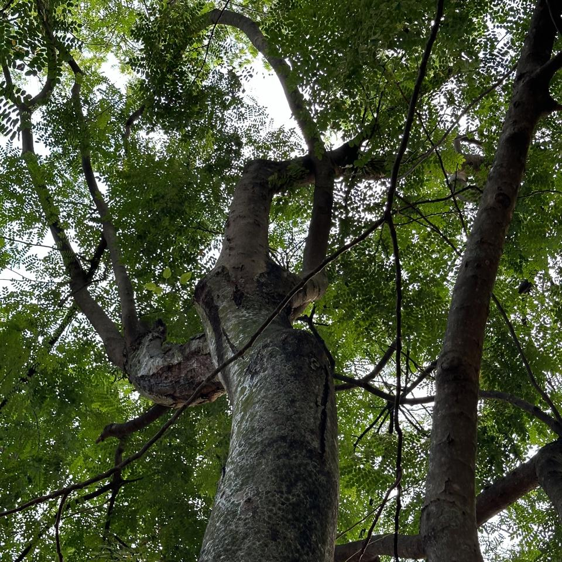

### Photo-2024-03-27-07-14-57

* 3.9% *Cassia fistula*
* 2.2% *Pterocarpus indicus*
* 1.7% *Oroxylum indicum*

### Photo-2024-03-27-07-15-33

* 3.5% *Madhuca longifolia*
* 2.4% *Ceiba pentandra*
* 1.7% *Rhododendron arboreum*

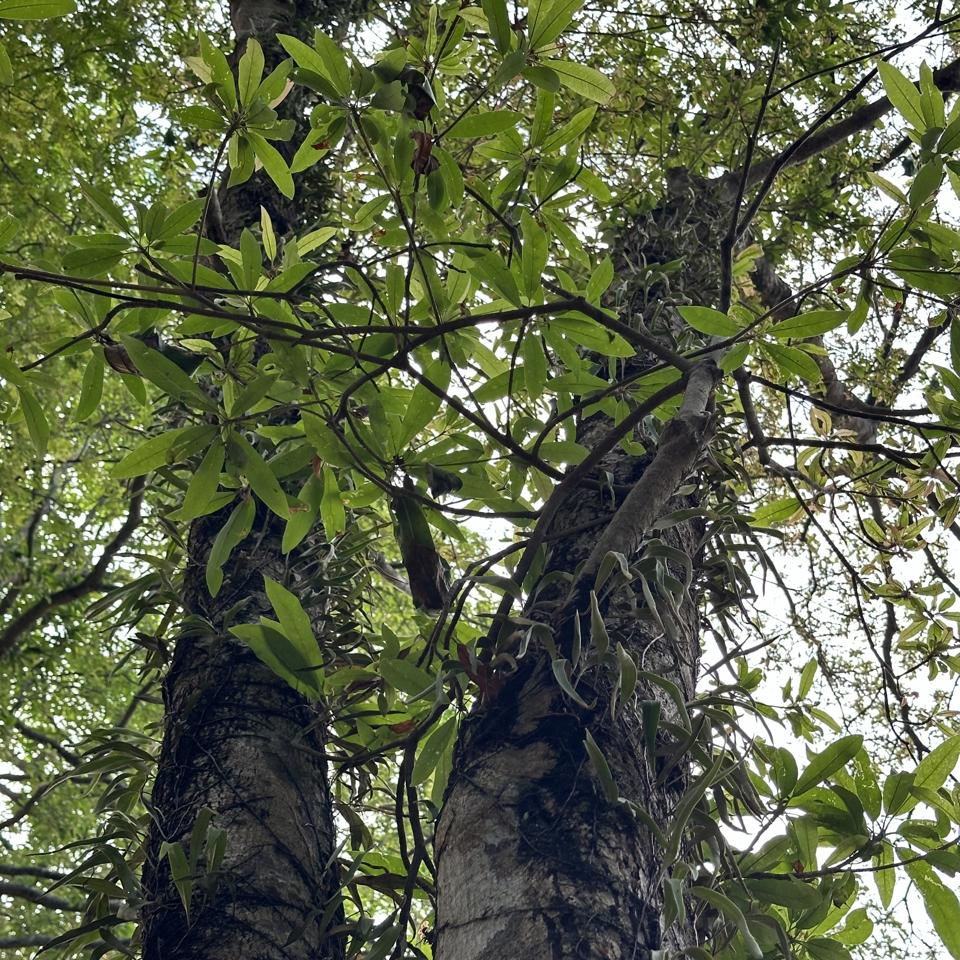

### Photo-2024-03-27-07-15-55

* 11.3% *Azadirachta indica*
* 3.5% *Toona ciliata*
* 3.5% *Tipuana tipu*

### Photo-2024-03-27-07-16-03

* 9.1% *Corymbia citriodora*
* 3.1% *Bombax ceiba*
* 2.8% *Terminalia arjuna*

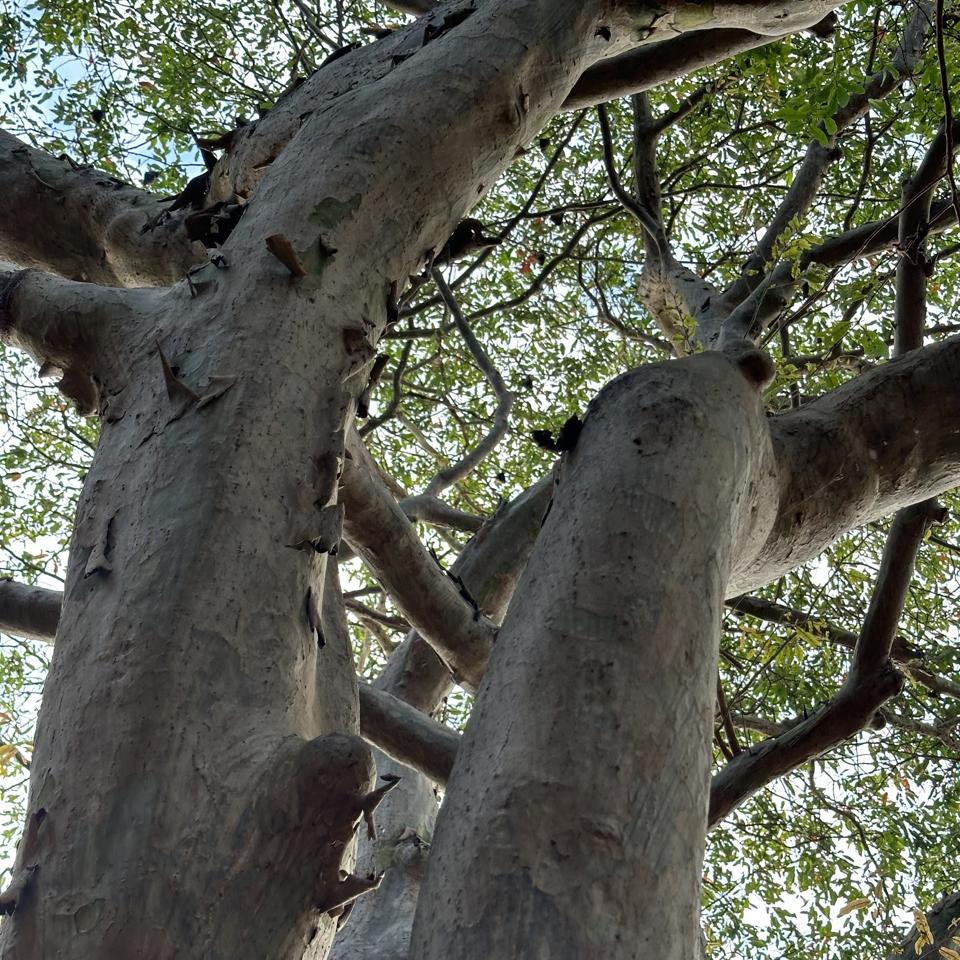

### Photo-2024-03-27-07-37-48

* 11.7% *Madhuca longifolia*
* 2.6% *Dillenia indica*
* 1.2% *Manilkara zapota*

### Photo-2024-03-27-07-38-08

* 0.3% *Adansonia digitata*
* 0.3% *Manilkara zapota*
* 0.2% *Ceiba pentandra*

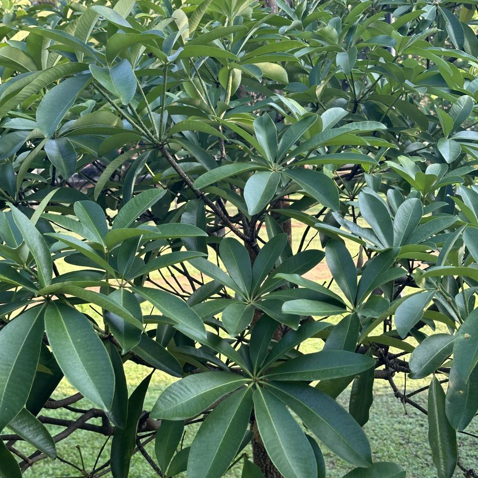

### Photo-2024-03-27-07-38-38

* 18.8% *Areca triandra*
* 8.1% *Areca catechu*
* 5.3% *Cocos nucifera*

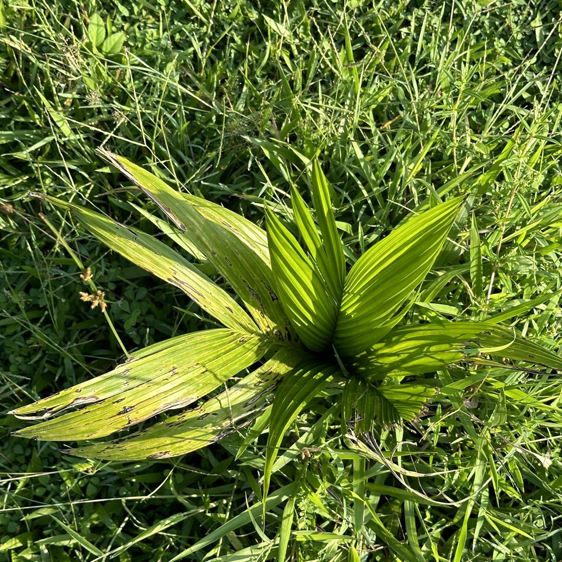

### Photo-2024-03-27-07-39-10

* 12.3% *Artocarpus heterophyllus*
* 5.0% *Petrea volubilis*
* 3.5% *Vangueria madagascariensis*

### Photo-2024-03-27-07-39-56

* 1.3% *Plumeria alba*
* 0.7% *Mangifera indica*
* 0.6% *Annona reticulata*

### Photo-2024-03-27-07-40-18

* 2.5% *Manilkara zapota*
* 1.4% *Quercus acutissima*
* 1.2% *Durio zibethinus*

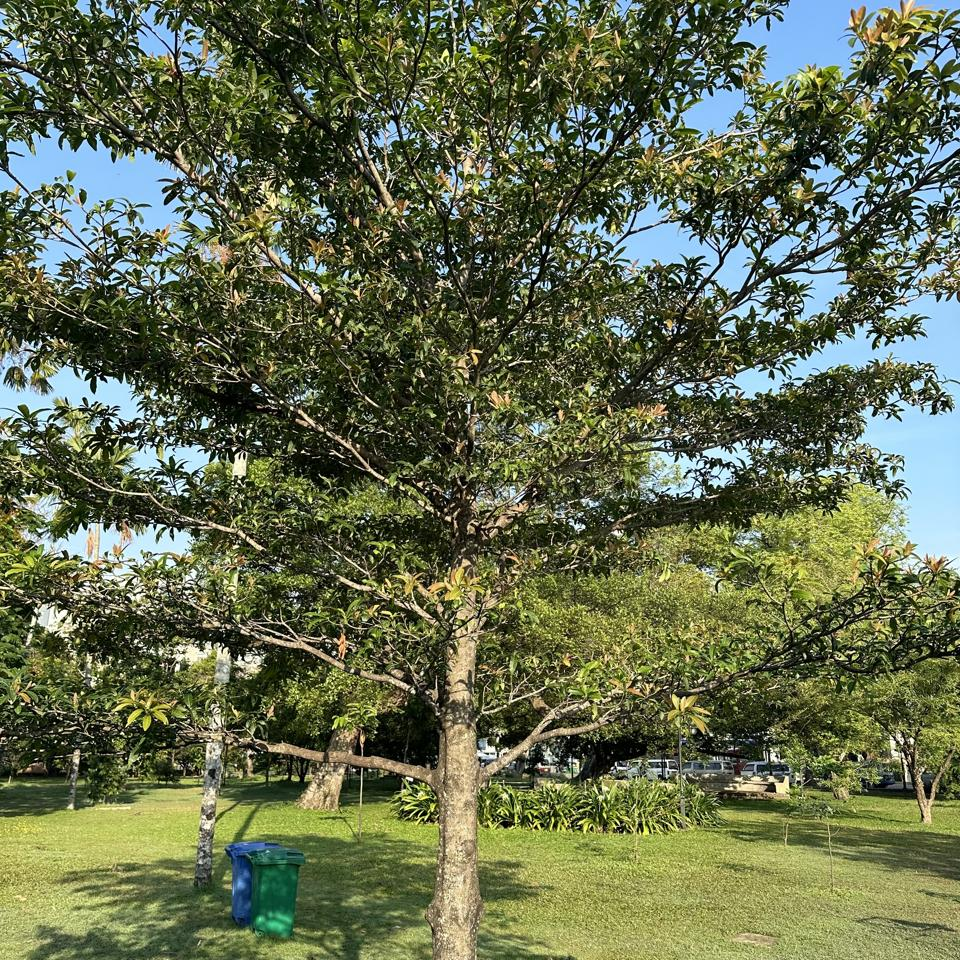

### Photo-2024-03-27-07-40-31

* 19.6% *Cassia javanica*
* 3.8% *Pterocarpus indicus*
* 3.2% *Cassia moschata*

### Photo-2024-03-27-07-40-39

* 5.4% *Citharexylum spinosum*
* 4.1% *Leycesteria formosa*
* 1.0% *Malpighia glabra*

### Photo-2024-03-27-07-40-52

* 6.4% *Flacourtia montana*
* 2.4% *Flacourtia jangomas*
* 2.3% *Camellia sinensis*

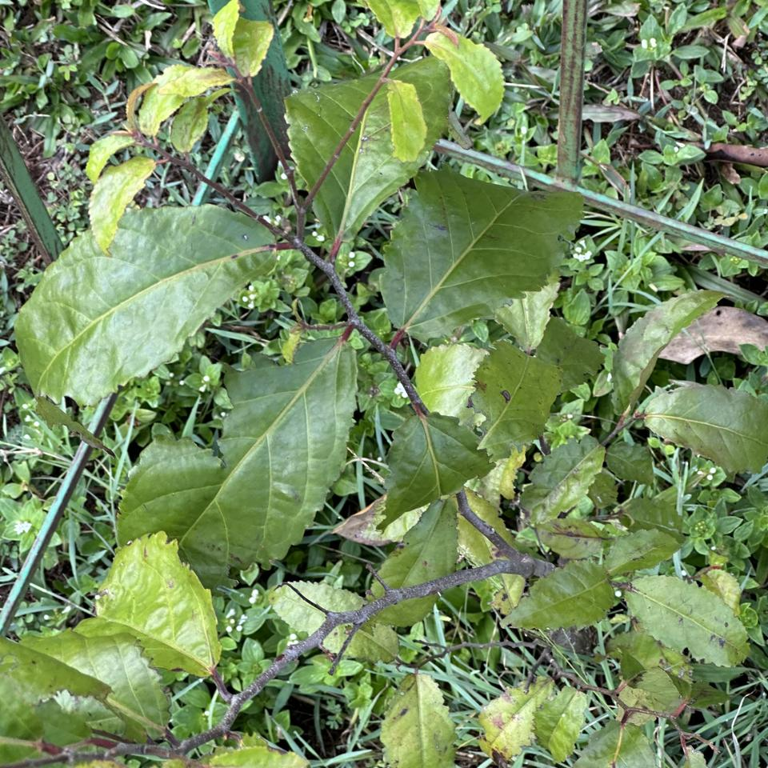

### Photo-2024-03-27-07-41-02

* 11.6% *Elaeocarpus angustifolius*
* 3.1% *Cerbera manghas*
* 1.8% *Syzygium jambos*

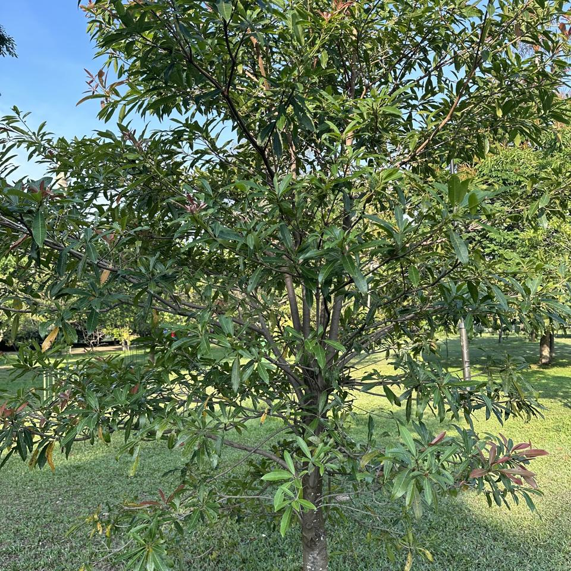

### Photo-2024-03-27-07-41-21

* 5.6% *Borassus flabellifer*
* 0.6% *Livistona chinensis*
* 0.4% *Livistona speciosa*

### Photo-2024-03-27-07-41-30

* 8.5% *Madhuca longifolia*
* 5.3% *Elaeocarpus angustifolius*
* 1.0% *Cestrum parqui*

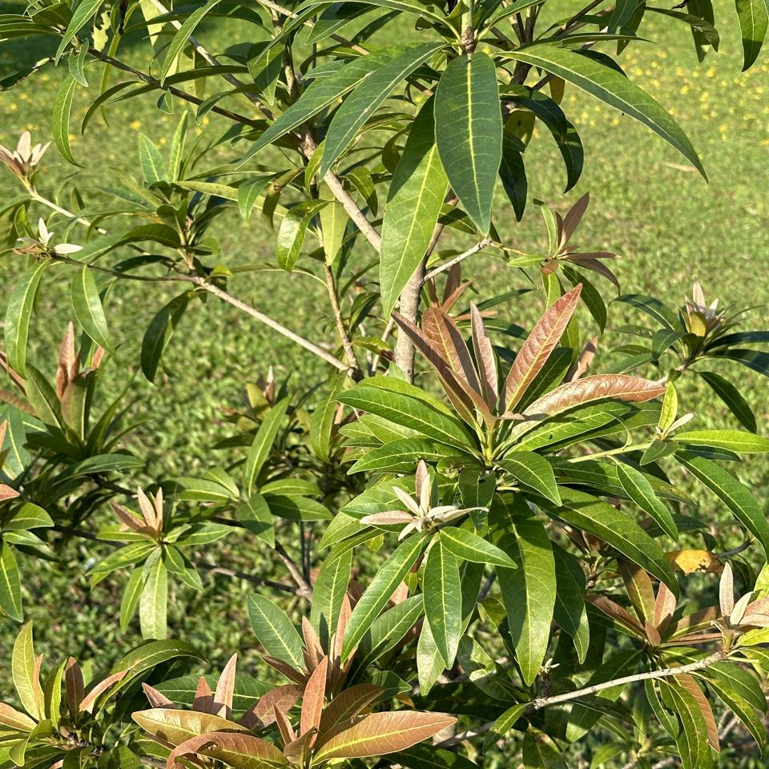

### Photo-2024-03-27-07-41-38

* 9.6% *Dillenia indica*
* 1.1% *Manilkara zapota*
* 1.0% *Plumeria alba*

### Photo-2024-03-27-07-41-43

* 3.6% *Manilkara zapota*
* 2.7% *Milicia excelsa*
* 2.2% *Dillenia indica*

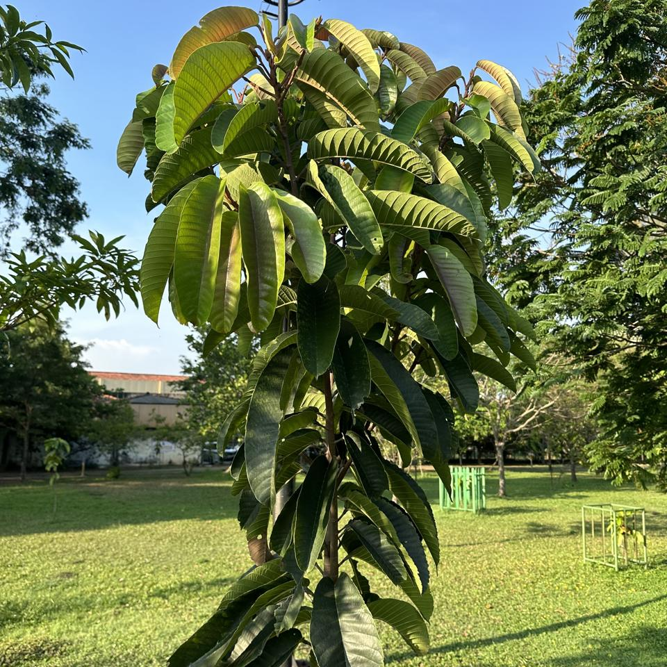

### Photo-2024-03-27-07-41-59

* 2.4% *Borassus flabellifer*
* 0.6% *Livistona speciosa*
* 0.4% *Corypha umbraculifera*

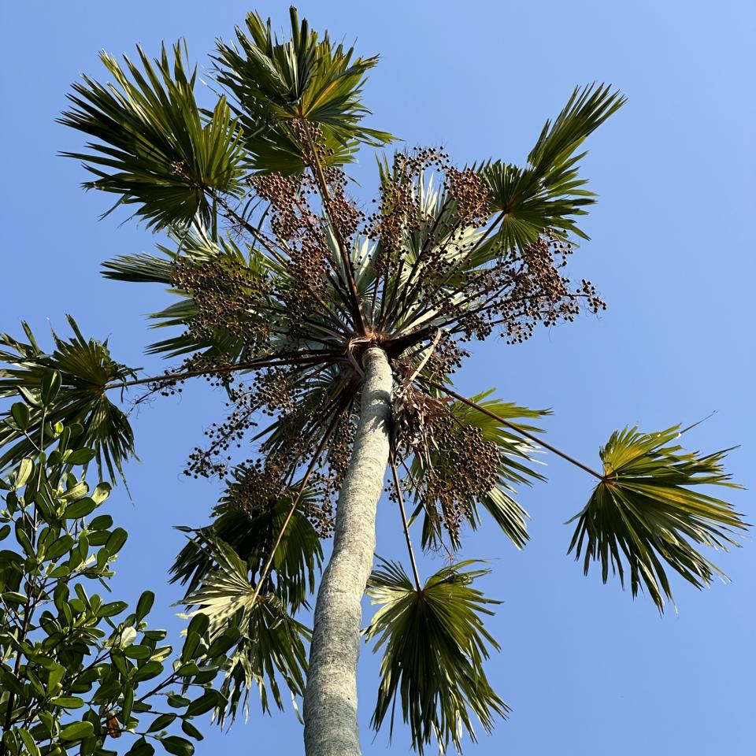
