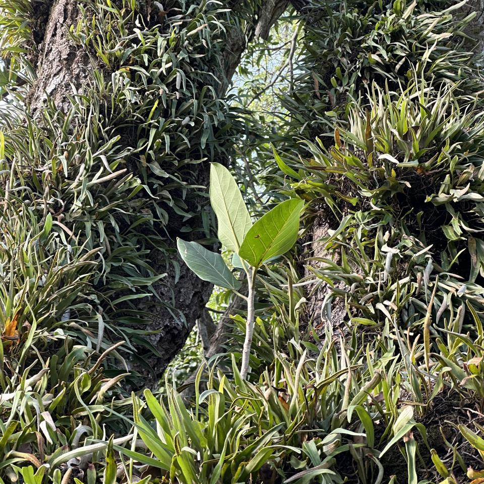
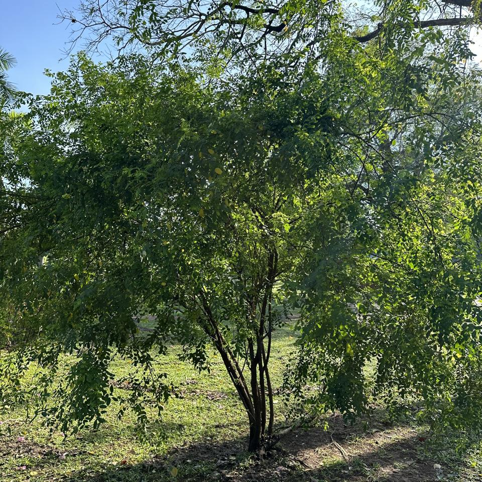
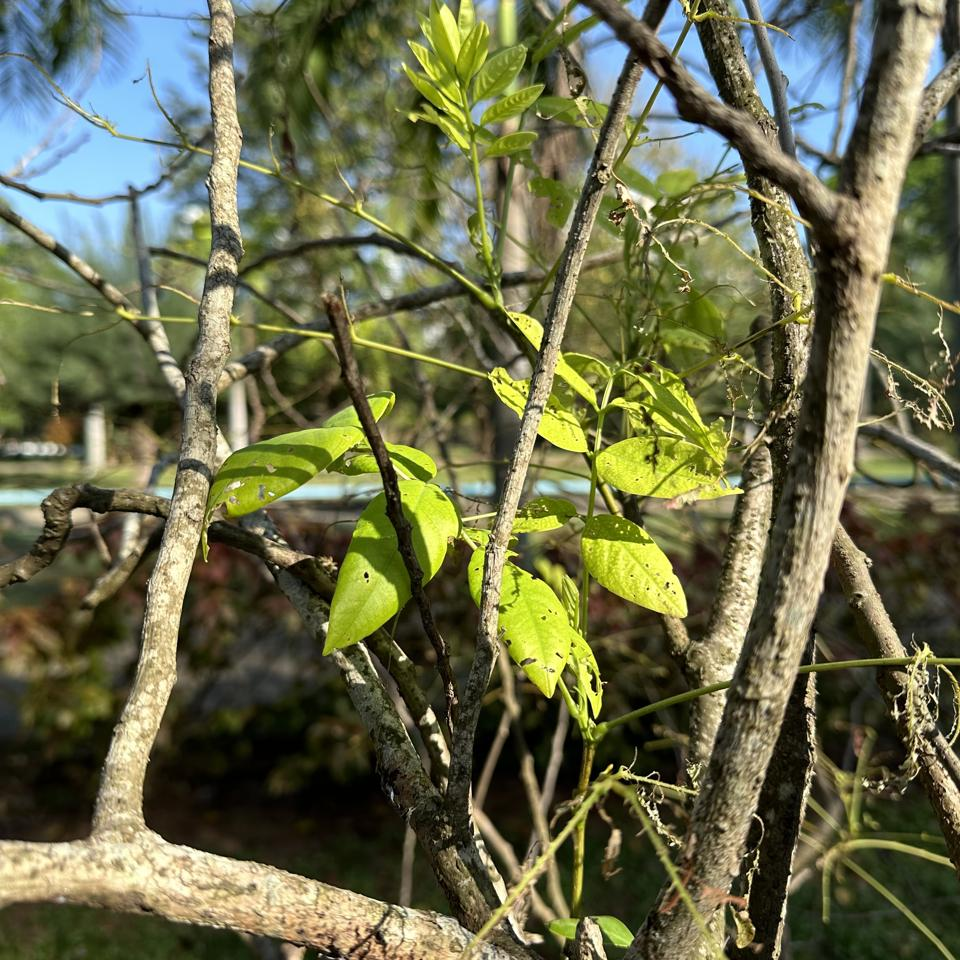
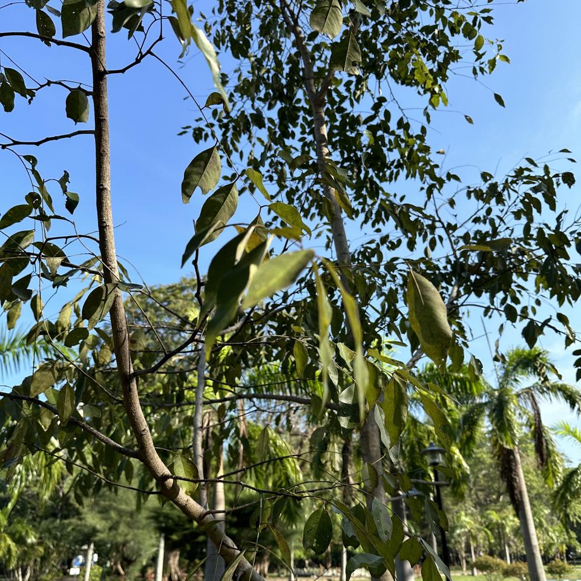
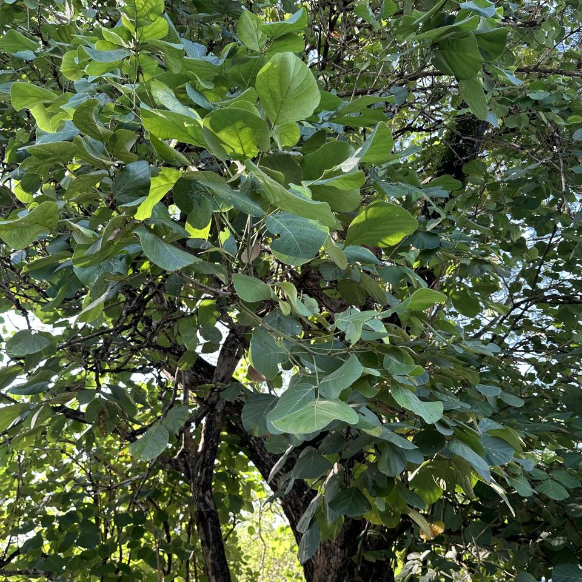
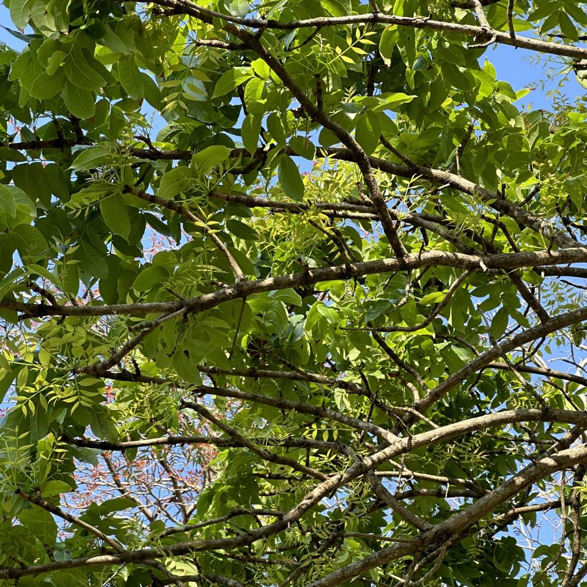

## Sample of Recent Plant Photos difficult to Identify

Photos where the identification confidence is **< 20%**.

### Photo-2024-03-29-08-09-30

* 6.7% *Eucalyptus microcorys*
* 5.1% *Eucalyptus pilularis*
* 3.9% *Eucalyptus robusta*

### Photo-2024-04-01-08-05-46

* 9.2% *Lepisorus thunbergianus*
* 5.9% *Pyrrosia lanceolata*
* 5.3% *Laelia gloriosa*

### Photo-2024-04-02-08-13-18

* 16.9% *Roystonea regia*
* 16.0% *Dictyosperma album*
* 13.4% *Roystonea oleracea*

### Photo-2024-04-02-08-15-19

* 13.0% *Robinia viscosa*
* 8.9% *Tipuana tipu*
* 8.0% *Caragana arborescens*

### Photo-2024-04-02-08-15-42

* 6.8% *Styphnolobium japonicum*
* 4.2% *Wisteria floribunda*
* 4.0% *Wisteria frutescens*

### Photo-2024-04-02-08-15-48

* 8.8% *Fraxinus velutina*
* 5.1% *Ulmus pumila*
* 4.5% *Salix amygdaloides*

### Photo-2024-04-02-08-16-07

* 16.2% *Psidium cattleyanum*
* 7.7% *Ficus retusa*
* 3.6% *Eugenia brasiliensis*

### Photo-2024-04-02-08-16-45

* 5.3% *Handroanthus impetiginosus*
* 4.1% *Cassia fistula*
* 3.0% *Machaerium brasiliense*

### Photo-2024-04-02-08-18-55

* 18.4% *Cassia fistula*
* 12.3% *Erythrina crista-galli*
* 6.2% *Melicoccus bijugatus*

### Photo-2024-04-02-08-19-08

* 9.3% *Fraxinus pennsylvanica*
* 8.0% *Sapindus saponaria*
* 7.2% *Pleiogynium timoriense*

### Photo-2024-04-02-08-19-18

* 4.1% *Tectona grandis*
* 1.3% *Tilia tomentosa*
* 1.0% *Philenoptera violacea*

### Photo-2024-04-02-08-21-41

* 12.3% *Markhamia zanzibarica*
* 4.4% *Phellodendron amurense*
* 4.0% *Lannea microcarpa*

### Photo-2024-04-02-08-22-03

* 19.6% *Swietenia macrophylla*
* 7.1% *Cedrela odorata*
* 7.1% *Swietenia humilis*

### Photo-2024-04-02-08-23-10

* 14.3% *Handroanthus impetiginosus*
* 9.4% *Tabebuia rosea*
* 8.3% *Ceiba speciosa*

### Photo-2024-04-02-08-24-46

* 8.2% *Dendrobium speciosum*
* 4.3% *Eucalyptus robusta*
* 3.7% *Cedrela odorata*

### Photo-2024-04-02-08-25-43

* 13.9% *Peltophorum africanum*
* 12.0% *Jacaranda mimosifolia*
* 5.7% *Kirkia acuminata*

### Photo-2024-04-02-08-26-58

* 6.1% *Juglans regia*
* 6.1% *Tabebuia rosea*
* 3.5% *Carya glabra*

### Photo-2024-04-02-08-36-55

* 7.0% *Feijoa sellowiana*
* 3.0% *Psidium guajava*
* 1.8% *Ficus aurea*

### Photo-2024-04-02-08-38-26

* 19.5% *Ficus retusa*
* 7.8% *Magnolia liliiflora*
* 7.2% *Ficus microcarpa*

### Photo-2024-04-02-08-39-11

* 8.2% *Lagerstroemia speciosa*
* 3.3% *Vitex altissima*
* 2.5% *Cordia alliodora*

