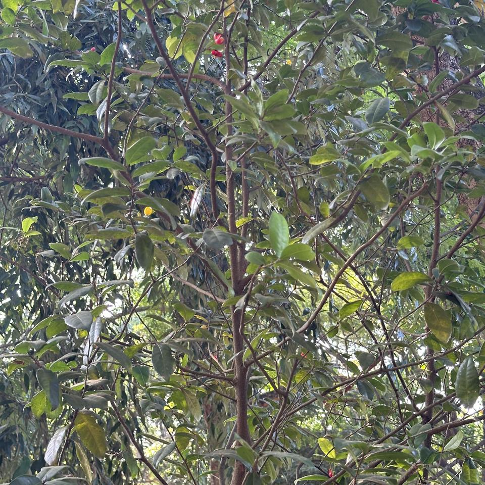

## Sample of Plant Photos difficult to Identify

Photos where the identification confidence is **< 20%**.

### Photo-2024-03-13-07-10-40

* 4.4% *Artabotrys hexapetalus*
* 2.8% *Myristica fragrans*
* 2.4% *Bergera koenigii*

### Photo-2024-03-25-07-23-04

* 18.1% *Mesua ferrea*
* 4.1% *Toona ciliata*
* 3.0% *Eucalyptus robusta*

### Photo-2024-03-17-08-19-05

* 1.0% *Viburnum odoratissimum*
* 0.9% *Malpighia glabra*
* 0.6% *Elaeagnus umbellata*

### Photo-2024-03-23-07-56-31

* 6.8% *Dillenia indica*
* 1.3% *Manilkara zapota*
* 1.3% *Magnolia champaca*

### Photo-2024-03-11-06-45-40

* 15.4% *Terminalia arjuna*
* 7.3% *Quercus phellos*
* 2.3% *Diospyros blancoi*

### Photo-2024-03-22-08-08-44

* 4.0% *Quercus acutissima*
* 1.6% *Madhuca longifolia*
* 1.2% *Dillenia indica*

### Photo-2024-03-08-07-05-52

* 16.5% *Vachellia nilotica*
* 5.1% *Vachellia farnesiana*
* 4.4% *Nothofagus antarctica*

### Photo-2024-03-26-07-48-19

* 16.1% *Swietenia macrophylla*
* 5.0% *Swietenia mahagoni*
* 4.6% *Spondias mombin*

### Photo-2024-03-11-06-45-18

* 18.2% *Terminalia arjuna*
* 5.1% *Quercus phellos*
* 4.9% *Umbellularia californica*

### Photo-2024-03-10-06-47-08

* 17.2% *Amorpha fruticosa*
* 14.4% *Cassia javanica*
* 3.8% *Senna spectabilis*

### Photo-2024-03-17-08-18-05

* 3.2% *Saraca indica*
* 2.5% *Brownea grandiceps*
* 2.5% *Trema orientale*

### Photo-2024-03-17-08-08-12

* 0.5% *Corypha umbraculifera*
* 0.5% *Livistona speciosa*
* 0.5% *Livistona jenkinsiana*

### Photo-2024-03-11-06-37-43

* 11.8% *Alnus formosana*
* 10.0% *Quercus humboldtii*
* 7.7% *Santalum album*

### Photo-2024-03-11-06-42-07

* 6.4% *Litsea monopetala*
* 4.6% *Ficus fistulosa*
* 4.4% *Byrsonima crassifolia*

### Photo-2024-03-10-08-14-03

* 7.9% *Pongamia pinnata*
* 4.7% *Copaifera langsdorffii*
* 4.5% *Guazuma ulmifolia*

### Photo-2024-03-13-07-36-49

* 9.9% *Pyrrosia lanceolata*
* 1.0% *Ophioglossum pendulum*
* 0.9% *Pleopeltis macrocarpa*

### Photo-2024-03-23-08-56-04

* 9.5% *Erythroxylum coca*
* 1.2% *Ficus microcarpa*
* 1.1% *Osmanthus fragrans*

### Photo-2024-03-21-08-16-49

* 5.5% *Jacaranda mimosifolia*
* 3.1% *Pterocarpus indicus*
* 2.9% *Albizia procera*

### Photo-2024-03-23-07-57-11

* 1.7% *Citharexylum spinosum*
* 1.2% *Haematoxylum campechianum*
* 0.9% *Gliricidia sepium*

### Photo-2024-03-21-08-17-10

* 3.1% *Syzygium jambos*
* 2.4% *Prunus persica*
* 1.7% *Cerbera odollam*

