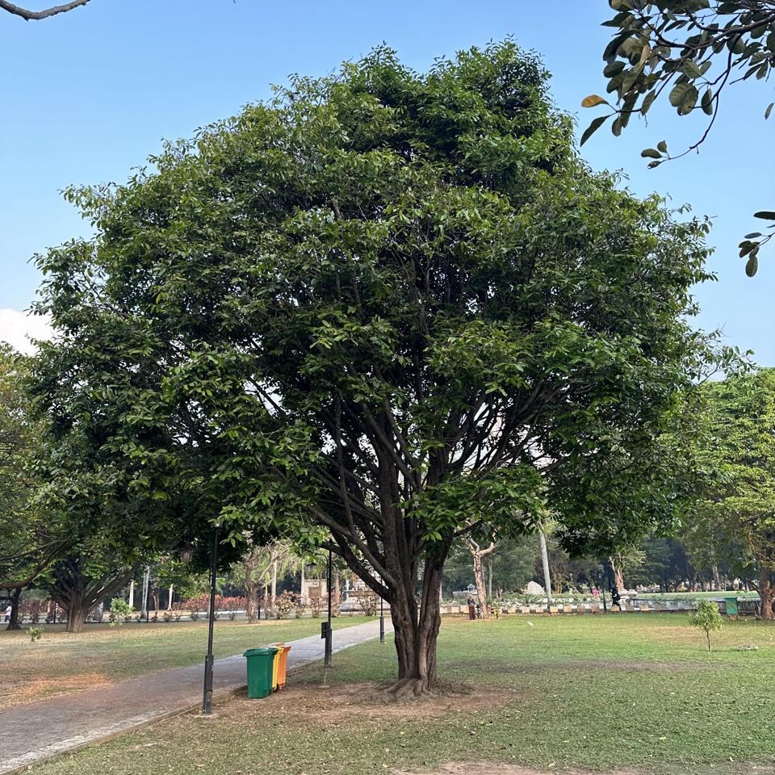
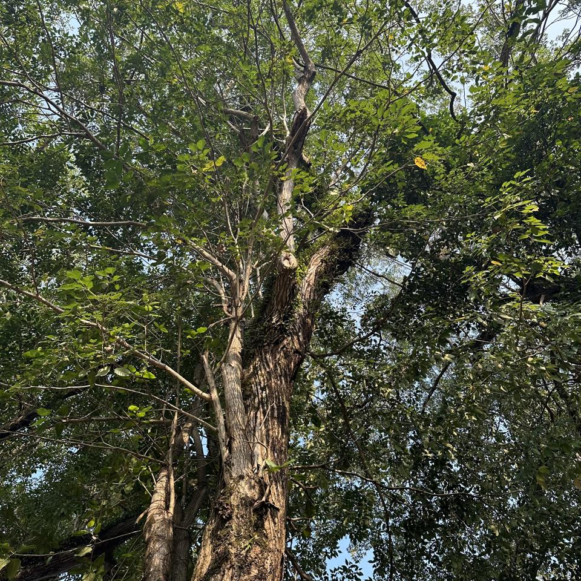

## Sample of Plant Photos difficult to Identify

Photos where the identification confidence is **< 20%**.

### Photo-2024-03-08-06-55-50

* 12.9% *Hibiscus rosa-sinensis*
* 5.6% *Hibiscus fragilis*
* 4.4% *Hibiscus schizopetalus*

### Photo-2024-03-13-07-39-09

* 10.4% *Ficus benghalensis*
* 7.5% *Ficus elastica*
* 3.6% *Rhaphidophora decursiva*

### Photo-2024-03-08-07-06-50

* 17.5% *Mangifera indica*
* 5.0% *Chitalpa tashkentensis*
* 4.9% *Mimusops elengi*

### Photo-2024-03-11-07-47-15

* 8.2% *Aspidosperma pyrifolium*
* 7.4% *Rauvolfia viridis*
* 6.7% *Vangueria madagascariensis*

### Photo-2024-03-21-08-12-00

* 3.0% *Ceiba pentandra*
* 2.4% *Tectona grandis*
* 1.8% *Ficus religiosa*

### Photo-2024-03-12-07-09-27

* 12.3% *Ficus hispida*
* 5.7% *Bridelia micrantha*
* 3.8% *Holarrhena pubescens*

### Photo-2024-03-14-08-02-59

* 3.2% *Ficus altissima*
* 0.7% *Ficus racemosa*
* 0.6% *Ficus retusa*

### Photo-2024-03-10-07-58-29

* 12.4% *Peltophorum pterocarpum*
* 6.7% *Jacaranda mimosifolia*
* 3.8% *Pterocarya stenoptera*

### Photo-2024-03-15-07-35-27

* 11.8% *Ficus religiosa*
* 4.9% *Pterocarpus indicus*
* 2.6% *Tipuana tipu*

### Photo-2024-03-17-08-02-43

* 1.0% *Cascabela thevetia*
* 0.9% *Melaleuca viminalis*
* 0.8% *Taxus wallichiana*

### Photo-2024-03-21-07-35-19

* 1.1% *Ficus virens*
* 0.9% *Cassia fistula*
* 0.9% *Toona ciliata*

### Photo-2024-03-23-07-55-17

* 2.4% *Viburnum odoratissimum*
* 1.2% *Ficus altissima*
* 0.9% *Ficus tinctoria*

### Photo-2024-03-08-07-06-01

* 11.3% *Bunchosia armeniaca*
* 10.4% *Ehretia anacua*
* 3.4% *Flacourtia jangomas*

### Photo-2024-03-08-07-01-24

* 7.5% *Mimusops elengi*
* 5.9% *Ligustrum lucidum*
* 5.6% *Syzygium cumini*

### Photo-2024-03-21-08-17-10

* 3.1% *Syzygium jambos*
* 2.4% *Prunus persica*
* 1.7% *Cerbera odollam*

### Photo-2024-03-21-07-52-04

* 1.5% *Ficus benghalensis*
* 1.3% *Ficus religiosa*
* 1.0% *Diospyros melanoxylon*

### Photo-2024-03-26-07-41-36

* 2.5% *Populus deltoides*
* 2.0% *Populus nigra*
* 1.4% *Symplocos paniculata*

### Photo-2024-03-14-07-44-39

* 17.2% *Euonymus japonicus*
* 3.9% *Euonymus fortunei*
* 1.9% *Cleyera japonica*

### Photo-2024-03-20-07-39-05

* 3.9% *Acacia melanoxylon*
* 3.8% *Terminalia arjuna*
* 2.9% *Vitex altissima*

### Photo-2024-03-13-07-21-24

* 3.3% *Eucalyptus robusta*
* 2.1% *Populus deltoides*
* 1.4% *Spondias mombin*

