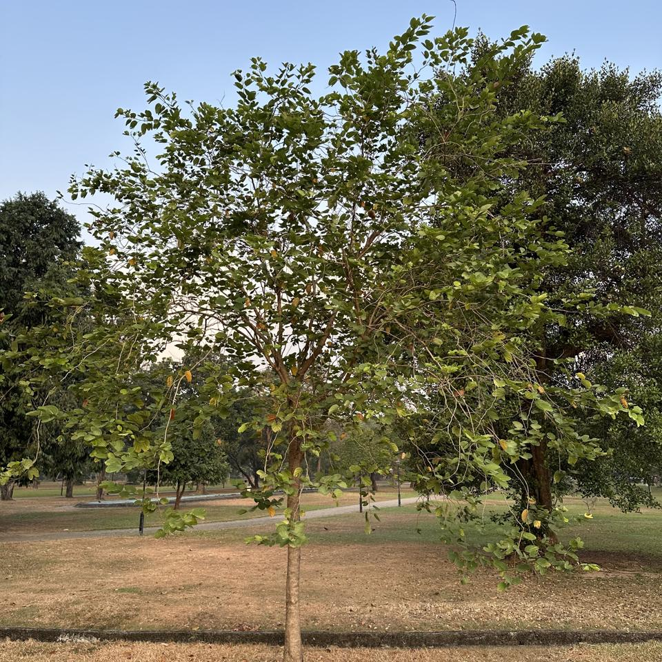
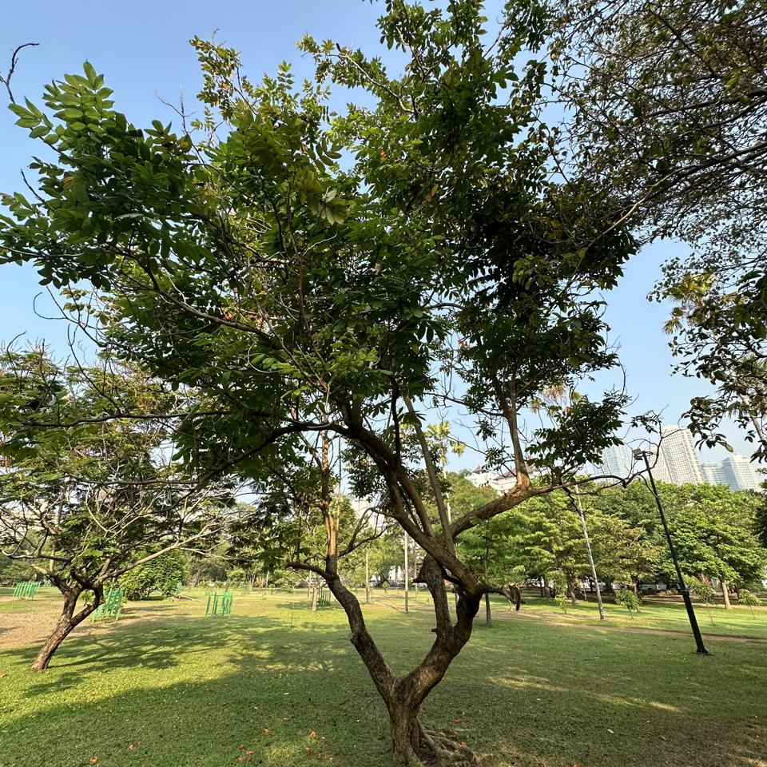

## Sample of Plant Photos difficult to Identify

Photos where the identification confidence is **< 20%**.

### Photo-2024-03-08-06-54-46

* 14.9% *Betula nigra*
* 5.3% *Platanus occidentalis*
* 3.9% *Ulmus americana*

### Photo-2024-03-20-07-04-16

* 13.4% *Moringa oleifera*
* 9.5% *Libidibia ferrea*
* 5.4% *Albizia procera*

### Photo-2024-03-21-07-35-57

* 8.2% *Areca triandra*
* 1.6% *Filicium decipiens*
* 0.6% *Dendrocalamus giganteus*

### Photo-2024-03-16-07-27-53

* 1.1% *Areca catechu*
* 0.2% *Phoenix dactylifera*
* 0.2% *Cocos nucifera*

### Photo-2024-03-08-07-06-50

* 17.5% *Mangifera indica*
* 5.0% *Chitalpa tashkentensis*
* 4.9% *Mimusops elengi*

### Photo-2024-03-21-08-10-45

* 4.1% *Guazuma ulmifolia*
* 2.3% *Triadica sebifera*
* 0.9% *Ficus religiosa*

### Photo-2024-03-11-06-48-00

* 17.4% *Chrysophyllum oliviforme*
* 9.1% *Annona muricata*
* 4.8% *Annona cherimola*

### Photo-2024-03-26-07-41-25

* 4.7% *Ficus virens*
* 1.7% *Diospyros melanoxylon*
* 0.8% *Guazuma ulmifolia*

### Photo-2024-03-20-07-45-46

* 13.1% *Peltophorum pterocarpum*
* 4.5% *Jacaranda mimosifolia*
* 2.3% *Cassia javanica*

### Photo-2024-03-21-08-15-46

* 2.8% *Syzygium jambos*
* 2.6% *Madhuca longifolia*
* 1.9% *Manilkara zapota*

### Photo-2024-03-13-07-21-24

* 3.3% *Eucalyptus robusta*
* 2.1% *Populus deltoides*
* 1.4% *Spondias mombin*

### Photo-2024-03-26-08-00-35

* 14.3% *Cassia fistula*
* 14.0% *Pterocarpus indicus*
* 1.9% *Sapindus saponaria*

### Photo-2024-03-13-07-38-04

* 7.8% *Saraca asoca*
* 3.9% *Sapindus mukorossi*
* 3.3% *Saraca indica*

### Photo-2024-03-20-08-05-07

* 10.1% *Spathodea campanulata*
* 4.7% *Dimocarpus longan*
* 4.2% *Lagerstroemia speciosa*

### Photo-2024-03-17-08-02-15

* 3.5% *Podocarpus neriifolius*
* 0.3% *Dodonaea viscosa*
* 0.2% *Searsia lancea*

### Photo-2024-03-17-08-32-35

* 18.2% *Adenanthera pavonina*
* 5.3% *Phyllanthus reticulatus*
* 4.1% *Moringa oleifera*

### Photo-2024-03-22-08-05-10

* 1.6% *Durio zibethinus*
* 1.2% *Khaya senegalensis*
* 1.1% *Acacia melanoxylon*

### Photo-2024-03-08-07-04-14

* 11.8% *Terminalia mantaly*
* 10.4% *Ficus microcarpa*
* 6.3% *Ficus elastica*

### Photo-2024-03-20-07-38-55

* 13.6% *Cassia fistula*
* 7.3% *Hevea brasiliensis*
* 2.2% *Holarrhena pubescens*

### Photo-2024-03-11-06-30-16

* 9.2% *Chamaedorea seifrizii*
* 8.6% *Chamaedorea elegans*
* 5.8% *Euterpe oleracea*

