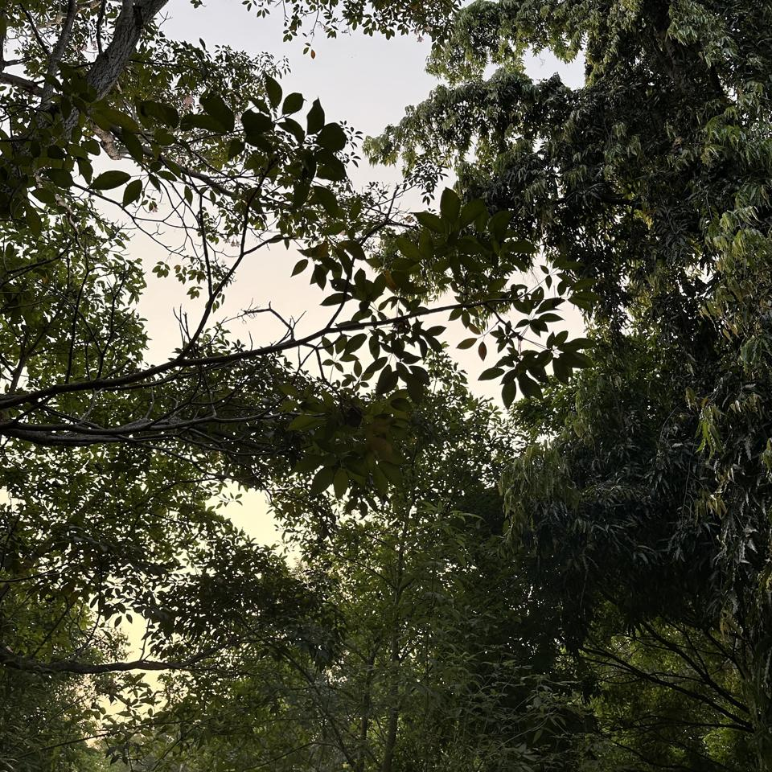
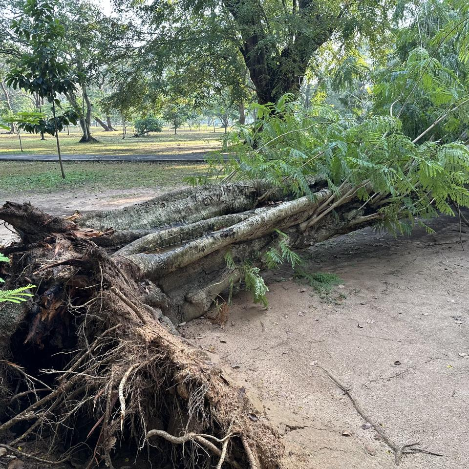
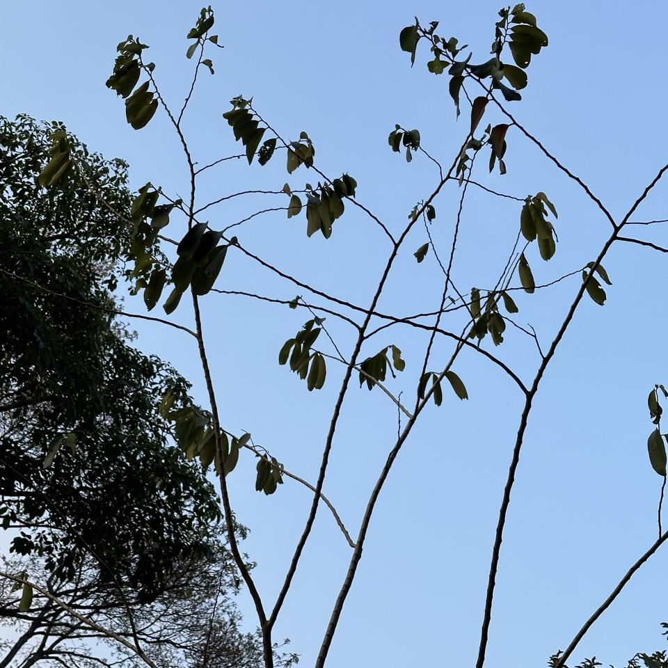
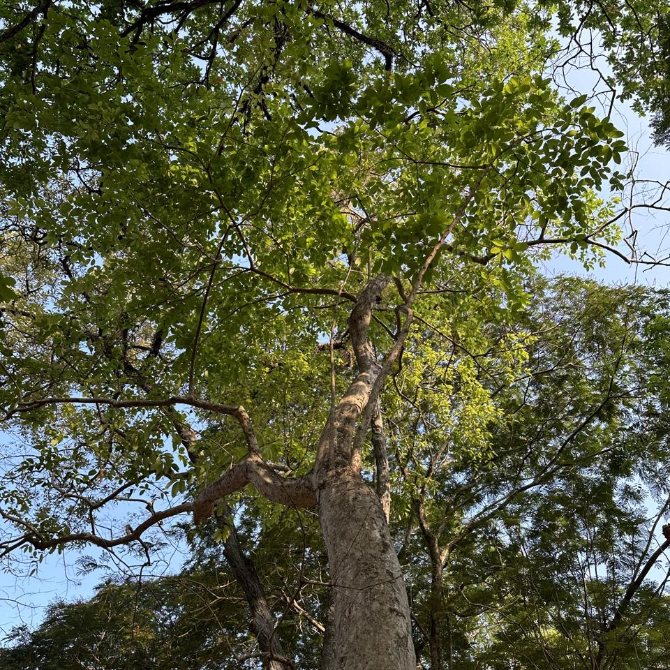
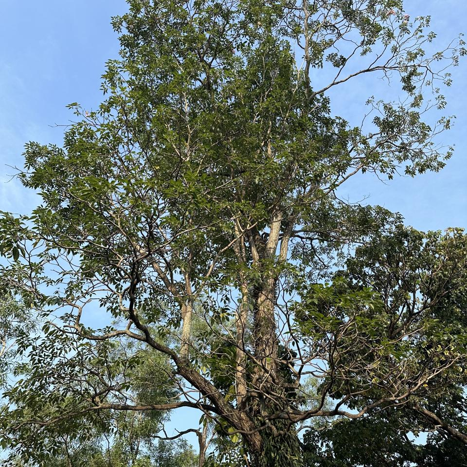
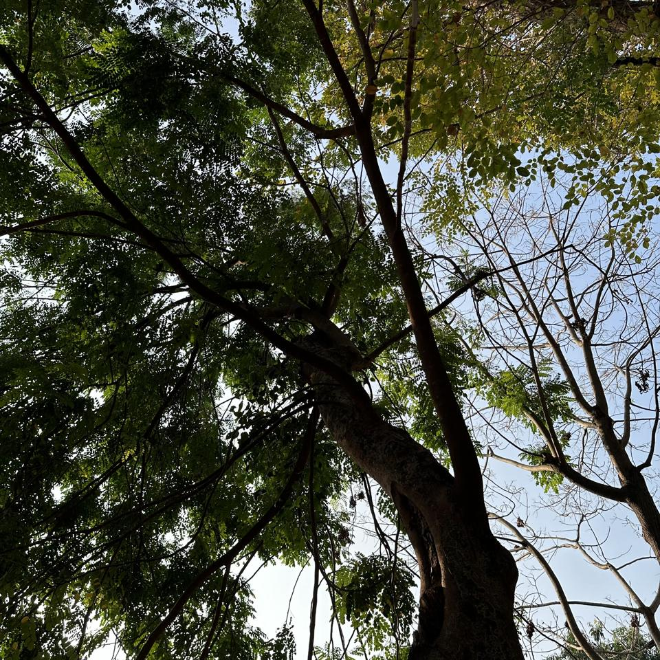
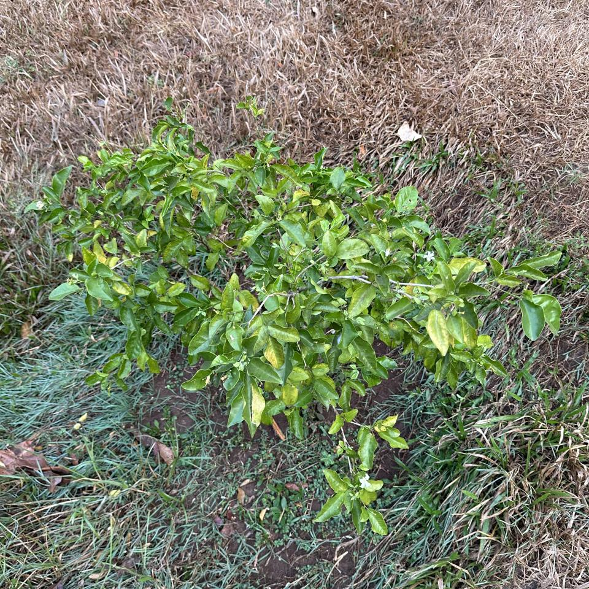

## Sample of Plant Photos difficult to Identify

Photos where the identification confidence is **< 20%**.

### Photo-2024-03-21-07-35-36

* 7.2% *Toona ciliata*
* 3.5% *Ficus altissima*
* 2.9% *Swietenia mahagoni*

### Photo-2024-03-13-06-59-42

* 8.5% *Cananga odorata*
* 6.1% *Pongamia pinnata*
* 2.8% *Annona squamosa*

### Photo-2024-03-17-08-19-05

* 1.0% *Viburnum odoratissimum*
* 0.9% *Malpighia glabra*
* 0.6% *Elaeagnus umbellata*

### Photo-2024-03-11-06-42-24

* 12.0% *Carya illinoinensis*
* 5.6% *Tabebuia rosea*
* 4.4% *Quercus glauca*

### Photo-2024-03-25-07-34-47

* 6.9% *Phyllanthus emblica*
* 5.8% *Senna multijuga*
* 5.3% *Senna spectabilis*

### Photo-2024-03-13-07-47-42

* 3.5% *Cinnamomum camphora*
* 1.8% *Quercus glauca*
* 1.2% *Osmanthus fragrans*

### Photo-2024-03-21-07-33-51

* 4.6% *Oroxylum indicum*
* 3.8% *Pterocarpus indicus*
* 2.4% *Choerospondias axillaris*

### Photo-2024-03-11-06-48-00

* 17.4% *Chrysophyllum oliviforme*
* 9.1% *Annona muricata*
* 4.8% *Annona cherimola*

### Photo-2024-03-20-07-42-03

* 3.2% *Toona ciliata*
* 2.7% *Cassia fistula*
* 2.7% *Ficus geniculata*

### Photo-2024-03-17-08-19-11

* 2.0% *Ochna integerrima*
* 0.2% *Malpighia glabra*

### Photo-2024-03-13-07-38-04

* 7.8% *Saraca asoca*
* 3.9% *Sapindus mukorossi*
* 3.3% *Saraca indica*

### Photo-2024-03-26-07-49-14

* 5.6% *Eucalyptus robusta*
* 0.3% *Ehretia acuminata*
* 0.3% *Swietenia macrophylla*

### Photo-2024-03-22-08-03-23

* 17.3% *Mesua ferrea*
* 2.7% *Eucalyptus robusta*
* 2.2% *Toona ciliata*

### Photo-2024-03-13-08-04-01

* 2.4% *Theobroma cacao*
* 1.0% *Lagerstroemia speciosa*
* 0.7% *Guazuma ulmifolia*

### Photo-2024-03-23-07-56-17

* 2.4% *Neolamarckia cadamba*
* 2.0% *Dipterocarpus retusus*
* 1.6% *Milicia excelsa*

### Photo-2024-03-25-07-23-11

* 7.5% *Eucalyptus robusta*
* 7.2% *Mesua ferrea*
* 5.3% *Eucalyptus camaldulensis*

### Photo-2024-03-20-07-40-45

* 5.9% *Azadirachta indica*
* 5.9% *Delonix regia*
* 3.7% *Jacaranda mimosifolia*

### Photo-2024-03-19-07-12-42

* 12.8% *Ficus religiosa*
* 2.5% *Populus euphratica*
* 2.1% *Ziziphus spina-christi*

### Photo-2024-03-11-06-49-51

* 9.1% *Citrus latifolia*
* 9.0% *Citrus hystrix*
* 7.6% *Jasminum fluminense*

### Photo-2024-03-17-08-18-48

* 4.7% *Bischofia javanica*
* 4.7% *Guazuma ulmifolia*
* 4.3% *Radermachera sinica*

