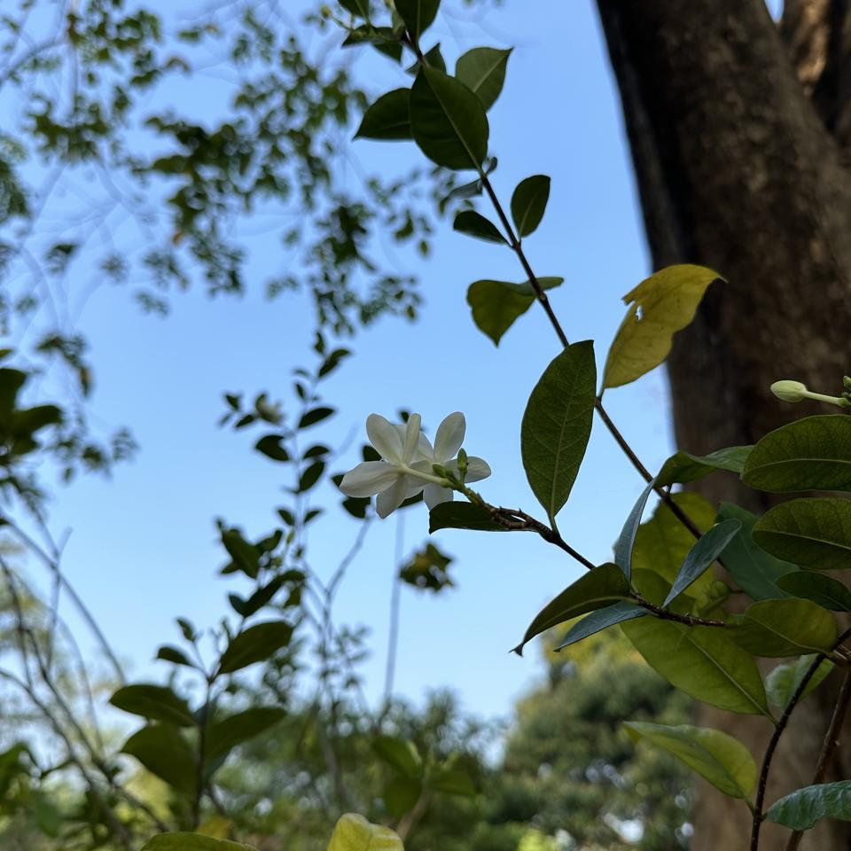
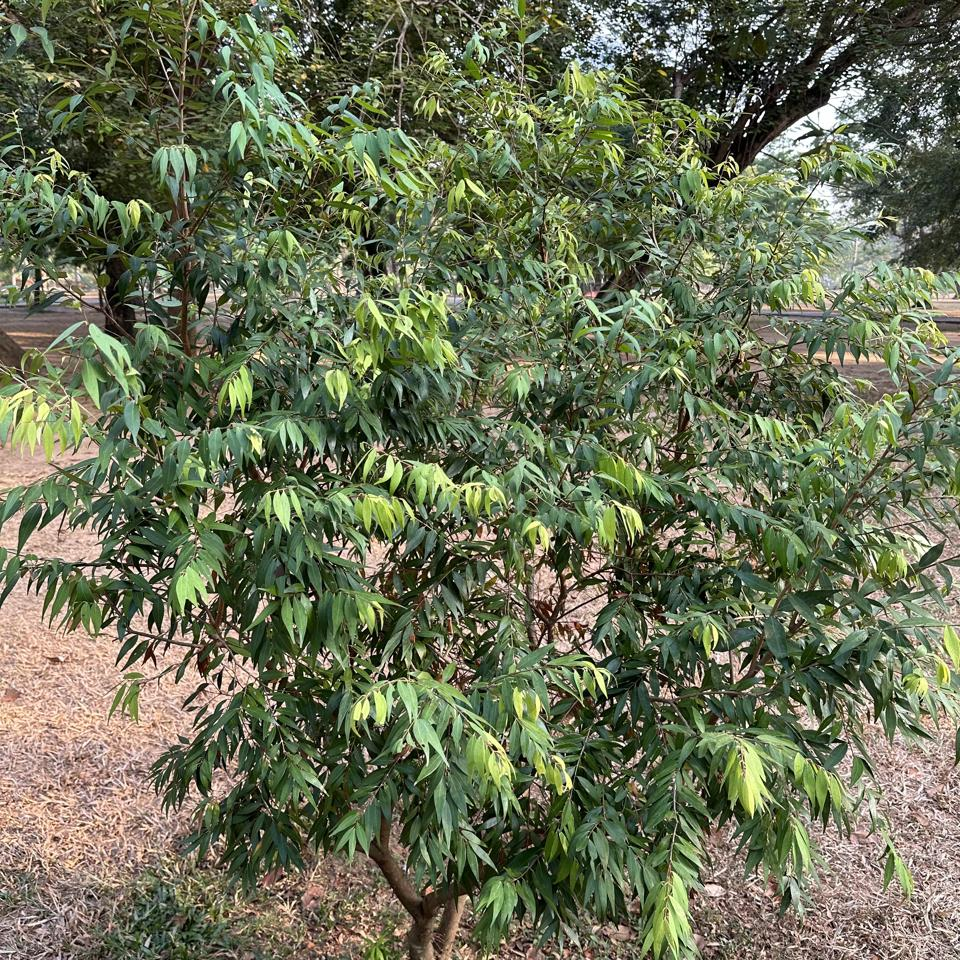
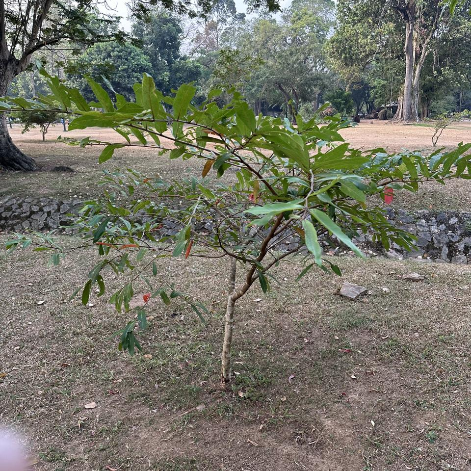

## Sample of Plant Photos difficult to Identify

Photos where the identification confidence is **< 20%**.

### Photo-2024-03-23-07-53-35

* 11.3% *Terminalia bellirica*
* 2.3% *Litsea monopetala*
* 1.1% *Artocarpus heterophyllus*

### Photo-2024-03-11-06-46-20

* 10.7% *Terminalia arjuna*
* 6.1% *Punica granatum*
* 2.6% *Nephelium lappaceum*

### Photo-2024-03-22-08-05-23

* 4.2% *Swietenia mahagoni*
* 4.0% *Pterocarpus indicus*
* 2.6% *Gliricidia sepium*

### Photo-2024-03-10-08-15-29

* 12.8% *Wrightia religiosa*
* 10.8% *Wrightia antidysenterica*
* 7.2% *Brunfelsia americana*

### Photo-2024-03-15-07-09-08

* 8.0% *Syzygium cumini*
* 0.9% *Holarrhena pubescens*
* 0.9% *Neolamarckia cadamba*

### Photo-2024-03-19-07-11-49

* 3.8% *Albizia lebbeck*
* 3.3% *Pometia pinnata*
* 2.1% *Pterocarpus indicus*

### Photo-2024-03-08-07-12-19

* 4.0% *Delonix regia*
* 2.4% *Hymenaea courbaril*
* 2.4% *Elaeocarpus serratus*

### Photo-2024-03-15-07-05-04

* 11.8% *Tipuana tipu*
* 8.5% *Pterocarpus indicus*
* 8.4% *Guazuma ulmifolia*

### Photo-2024-03-20-07-40-12

* 16.7% *Bauhinia purpurea*
* 7.0% *Bauhinia tomentosa*
* 5.4% *Kleinhovia hospita*

### Photo-2024-03-11-06-47-47

* 5.0% *Dipterocarpus alatus*
* 2.9% *Nyssa sylvatica*
* 2.5% *Byrsonima crassifolia*

### Photo-2024-03-25-07-23-41

* 3.1% *Aegle marmelos*
* 3.0% *Vangueria madagascariensis*
* 2.0% *Crescentia cujete*

### Photo-2024-03-12-07-33-55

* 16.3% *Syzygium jambos*
* 12.7% *Mesua ferrea*
* 4.8% *Xylopia frutescens*

### Photo-2024-03-26-07-47-04

* 8.8% *Citharexylum spinosum*
* 4.2% *Eucalyptus robusta*
* 2.3% *Acacia mangium*

### Photo-2024-03-17-08-32-42

* 5.0% *Lonicera ligustrina*
* 1.1% *Acacia acinacea*
* 0.9% *Myrsine africana*

### Photo-2024-03-21-07-49-57

* 19.6% *Areca triandra*
* 3.6% *Dendrocalamus giganteus*
* 0.2% *Areca catechu*

### Photo-2024-03-26-08-00-35

* 14.3% *Cassia fistula*
* 14.0% *Pterocarpus indicus*
* 1.9% *Sapindus saponaria*

### Photo-2024-03-08-06-44-01

* 16.2% *Terminalia arjuna*
* 10.4% *Quercus phellos*
* 9.0% *Polyalthia suberosa*

### Photo-2024-03-20-07-39-34

* 18.8% *Cassia fistula*
* 3.1% *Swietenia mahagoni*
* 1.6% *Ficus virens*

### Photo-2024-03-17-08-13-27

* 3.9% *Cocos nucifera*
* 2.0% *Schizolobium parahyba*
* 1.4% *Elaeocarpus angustifolius*

### Photo-2024-03-26-07-42-06

* 9.6% *Pterocarpus indicus*
* 9.1% *Cinnamomum camphora*
* 4.4% *Aegle marmelos*

