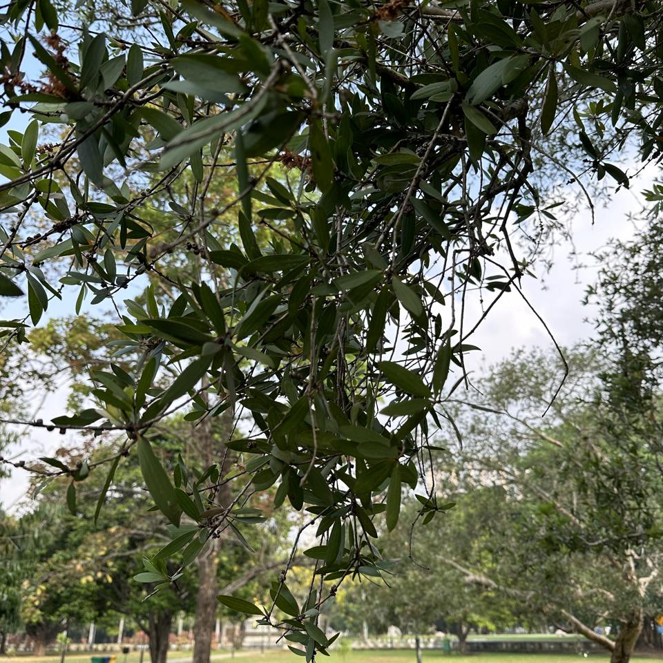
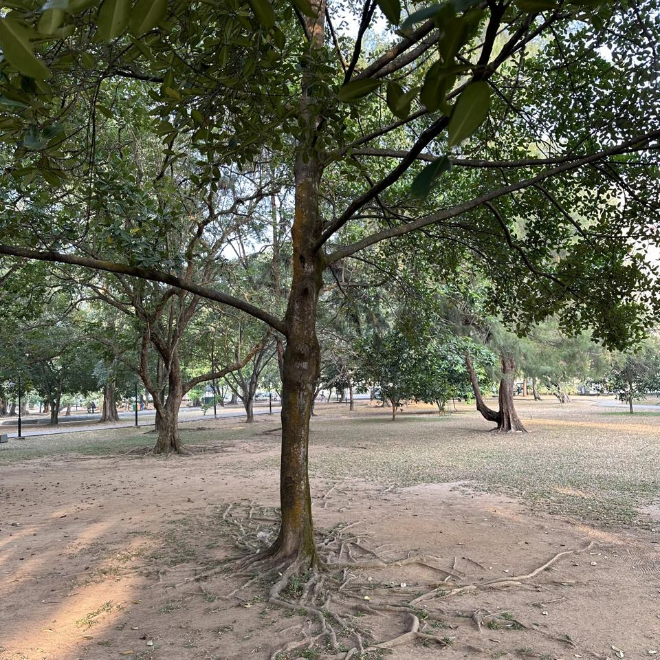

## Sample of Plant Photos difficult to Identify

Photos where the identification confidence is **< 20%**.

### Photo-2024-03-20-07-03-12

* 3.3% *Leea guineensis*
* 0.7% *Toona ciliata*
* 0.5% *Leea indica*

### Photo-2024-03-21-07-35-48

* 11.9% *Elaeis guineensis*
* 0.6% *Calamus erectus*
* 0.3% *Phoenix sylvestris*

### Photo-2024-03-25-07-51-24

* 3.1% *Ficus microcarpa*
* 0.9% *Artocarpus heterophyllus*
* 0.7% *Ficus exasperata*

### Photo-2023-12-30-07-59-02

* 11.9% *Erythrina poeppigiana*
* 10.6% *Erythrina fusca*
* 4.6% *Ficus benghalensis*

### Photo-2024-03-23-07-56-05

* 13.4% *Dillenia indica*
* 0.8% *Manilkara zapota*
* 0.7% *Dipterocarpus retusus*

### Photo-2024-03-26-08-00-54

* 7.7% *Spathodea campanulata*
* 5.3% *Theobroma cacao*
* 2.8% *Cananga odorata*

### Photo-2024-03-14-07-57-02

* 0.8% *Acacia longifolia*
* 0.4% *Olea europaea*
* 0.3% *Melaleuca citrina*

### Photo-2024-03-08-07-11-11

* 10.0% *Trachelospermum jasminoides*
* 8.4% *Trachelospermum asiaticum*
* 4.9% *Ilex cornuta*

### Photo-2024-03-11-07-40-34

* 6.5% *Ormocarpum kirkii*
* 4.3% *Vachellia nilotica*
* 4.2% *Pithecellobium dulce*

### Photo-2024-03-17-08-01-36

* 16.1% *Senna siamea*
* 8.5% *Toona ciliata*
* 2.6% *Khaya senegalensis*

### Photo-2024-03-20-07-39-34

* 18.8% *Cassia fistula*
* 3.1% *Swietenia mahagoni*
* 1.6% *Ficus virens*

### Photo-2024-03-23-07-55-17

* 2.4% *Viburnum odoratissimum*
* 1.2% *Ficus altissima*
* 0.9% *Ficus tinctoria*

### Photo-2024-03-21-07-39-43

* 4.5% *Acacia confusa*
* 1.3% *Melaleuca viminalis*
* 0.8% *Salix viminalis*

### Photo-2024-03-26-07-41-25

* 4.7% *Ficus virens*
* 1.7% *Diospyros melanoxylon*
* 0.8% *Guazuma ulmifolia*

### Photo-2024-03-17-08-16-45

* 11.2% *Ficus religiosa*
* 8.2% *Copaifera langsdorffii*
* 4.9% *Pterocarpus santalinus*

### Photo-2024-03-12-07-19-55

* 11.8% *Calophyllum inophyllum*
* 11.0% *Tabebuia pallida*
* 4.2% *Ficus rubiginosa*

### Photo-2024-03-11-06-48-00

* 17.4% *Chrysophyllum oliviforme*
* 9.1% *Annona muricata*
* 4.8% *Annona cherimola*

### Photo-2024-01-19-07-23-37

* 8.6% *Diospyros buxifolia*
* 3.0% *Zanthoxylum rhoifolium*
* 2.2% *Lagerstroemia speciosa*

### Photo-2024-03-21-07-53-30

* 5.4% *Litsea glutinosa*
* 4.6% *Alangium salviifolium*
* 4.3% *Annona muricata*

### Photo-2024-03-20-07-39-52

* 5.6% *Morus nigra*
* 3.6% *Pyrus calleryana*
* 2.9% *Ziziphus mauritiana*

