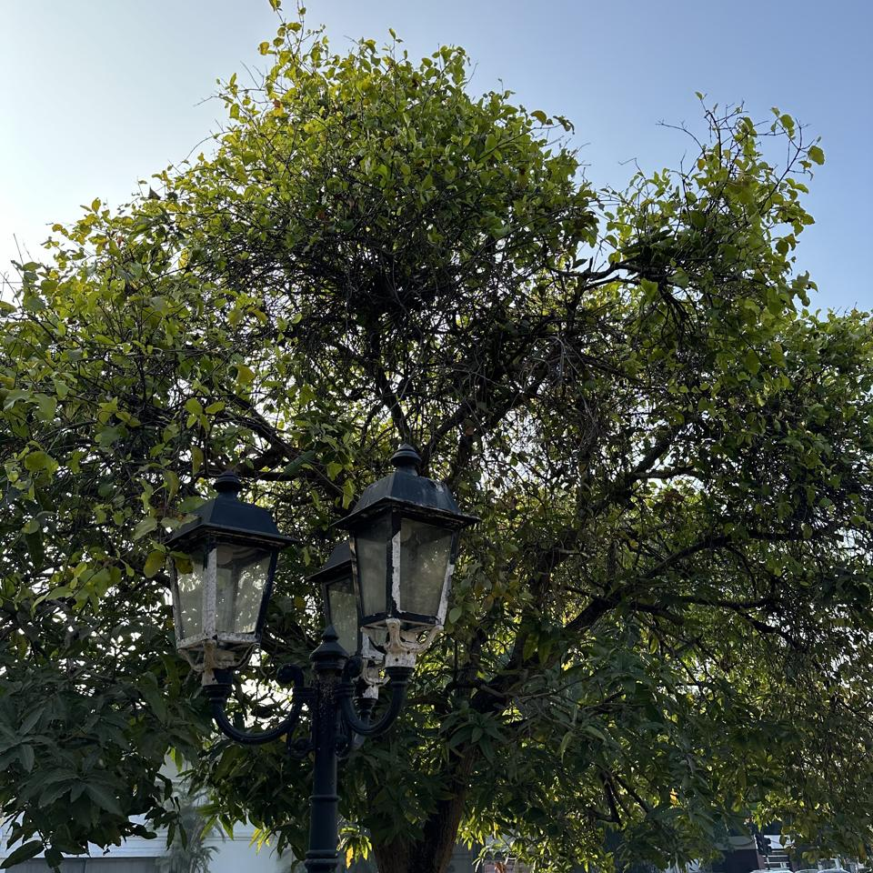

## Sample of Plant Photos difficult to Identify

Photos where the identification confidence is **< 20%**.

### Photo-2024-03-17-08-18-05

* 3.2% *Saraca indica*
* 2.5% *Brownea grandiceps*
* 2.5% *Trema orientale*

### Photo-2024-03-20-07-46-33

* 12.0% *Toona ciliata*
* 6.4% *Dimocarpus longan*
* 3.1% *Pongamia pinnata*

### Photo-2024-03-21-07-47-35

* 14.0% *Peltophorum dubium*
* 10.8% *Peltophorum pterocarpum*
* 6.2% *Jacaranda mimosifolia*

### Photo-2024-03-21-07-48-09

* 13.3% *Styphnolobium japonicum*
* 2.6% *Toona ciliata*
* 1.9% *Cassia grandis*

### Photo-2024-03-11-06-53-45

* 16.8% *Ficus benghalensis*
* 5.0% *Tipuana tipu*
* 4.0% *Ficus thonningii*

### Photo-2024-03-17-08-30-40

* 5.3% *Phyllanthus reticulatus*
* 1.4% *Flueggea virosa*
* 1.4% *Phyllanthus tenellus*

### Photo-2024-03-26-08-01-11

* 16.1% *Mimusops elengi*
* 10.5% *Ficus benjamina*
* 10.2% *Ficus retusa*

### Photo-2024-03-15-07-14-47

* 2.6% *Stachytarpheta jamaicensis*
* 0.8% *Petrea volubilis*
* 0.5% *Clerodendrum indicum*

### Photo-2024-03-25-07-50-16

* 9.2% *Ficus benjamina*
* 6.4% *Ficus retusa*
* 4.0% *Mimusops elengi*

### Photo-2024-03-20-07-35-10

* 5.0% *Myristica fragrans*
* 4.2% *Syzygium jambos*
* 1.5% *Santalum album*

### Photo-2024-03-08-07-03-42

* 6.6% *Caryocar brasiliense*
* 5.6% *Averrhoa carambola*
* 5.1% *Bauhinia variegata*

### Photo-2024-03-11-06-38-22

* 11.1% *Cassia roxburghii*
* 10.6% *Brownea grandiceps*
* 6.6% *Jacaranda caucana*

### Photo-2024-03-26-07-58-49

* 8.8% *Spathodea campanulata*
* 6.0% *Decaisnea insignis*
* 2.0% *Spondias purpurea*

### Photo-2024-03-17-08-02-25

* 3.3% *Melaleuca viminalis*
* 1.3% *Podocarpus neriifolius*
* 0.6% *Acacia melanoxylon*

### Photo-2024-03-12-07-19-55

* 11.8% *Calophyllum inophyllum*
* 11.0% *Tabebuia pallida*
* 4.2% *Ficus rubiginosa*

### Photo-2024-03-20-07-36-19

* 11.0% *Mimusops elengi*
* 4.6% *Hopea odorata*
* 1.0% *Neolamarckia cadamba*

### Photo-2024-03-20-07-39-42

* 18.5% *Holarrhena pubescens*
* 7.6% *Cassia fistula*
* 1.7% *Oroxylum indicum*

### Photo-2024-03-15-07-29-35

* 4.4% *Juglans regia*
* 4.1% *Lagerstroemia speciosa*
* 1.7% *Hovenia dulcis*

### Photo-2024-03-19-07-14-22

* 10.3% *Ficus virens*
* 7.2% *Ficus callosa*
* 1.6% *Ficus altissima*

### Photo-2024-03-20-07-39-52

* 5.6% *Morus nigra*
* 3.6% *Pyrus calleryana*
* 2.9% *Ziziphus mauritiana*

