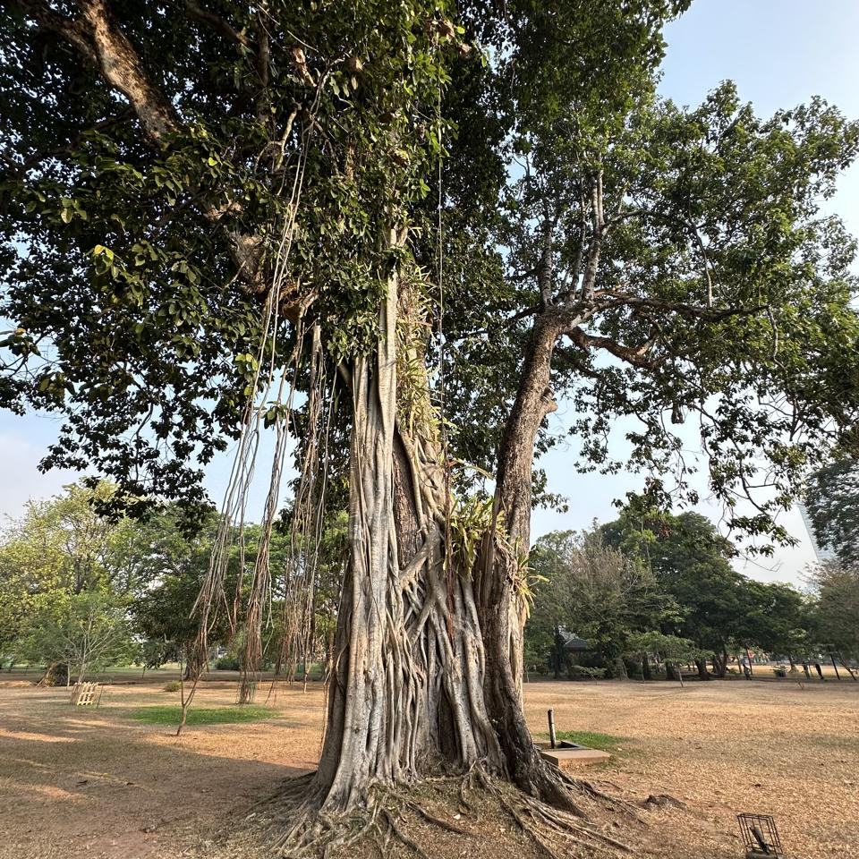
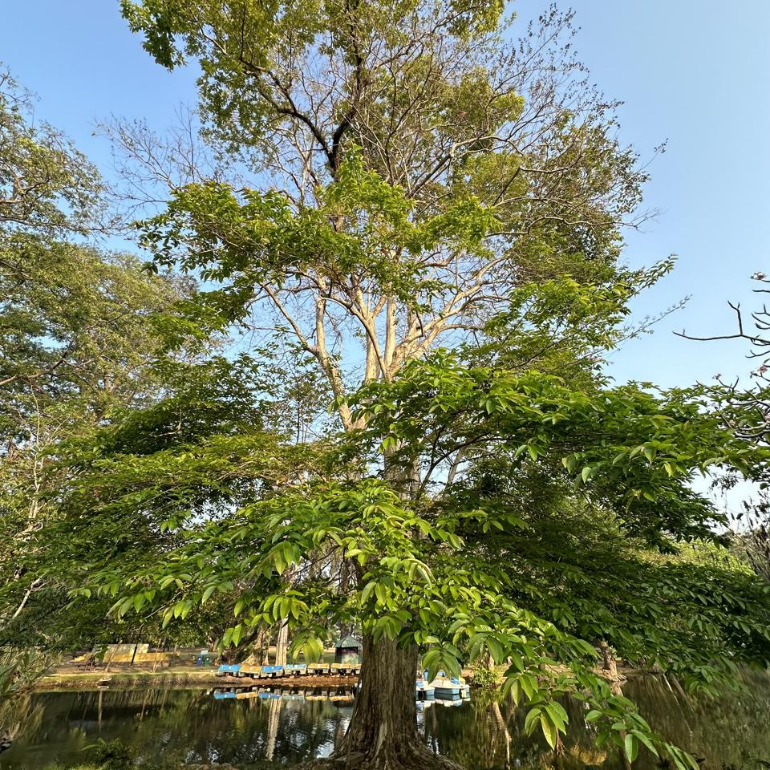

## Sample of Plant Photos difficult to Identify

Photos where the identification confidence is **< 20%**.

### Photo-2024-03-13-07-09-26

* 0.4% *Syngonium podophyllum*

### Photo-2024-03-13-07-38-46

* 18.0% *Ficus altissima*
* 11.6% *Ficus virens*
* 10.5% *Ficus benghalensis*

### Photo-2024-03-17-08-09-15

* 0.1% *Elaeis guineensis*

### Photo-2024-03-08-07-06-50

* 17.5% *Mangifera indica*
* 5.0% *Chitalpa tashkentensis*
* 4.9% *Mimusops elengi*

### Photo-2024-03-08-07-04-14

* 11.8% *Terminalia mantaly*
* 10.4% *Ficus microcarpa*
* 6.3% *Ficus elastica*

### Photo-2024-03-17-08-11-40

* 7.9% *Bischofia javanica*
* 2.9% *Ficus religiosa*
* 1.6% *Brachychiton populneus*

### Photo-2024-03-15-07-41-20

* 5.6% *Ficus virens*
* 3.4% *Ficus altissima*
* 3.2% *Castilla elastica*

### Photo-2024-03-12-07-04-02

* 17.3% *Elaeis guineensis*
* 7.2% *Butia capitata*
* 4.8% *Phoenix reclinata*

### Photo-2024-03-08-07-06-01

* 11.3% *Bunchosia armeniaca*
* 10.4% *Ehretia anacua*
* 3.4% *Flacourtia jangomas*

### Photo-2024-03-20-07-36-53

* 13.5% *Samanea saman*
* 9.8% *Juglans nigra*
* 8.8% *Robinia pseudoacacia*

### Photo-2024-03-23-07-55-44

* 13.5% *Tamarindus indica*
* 5.4% *Gleditsia triacanthos*
* 3.7% *Jacaranda mimosifolia*

### Photo-2024-03-27-06-55-14

* 6.0% *Eucalyptus robusta*
* 1.2% *Bischofia javanica*
* 0.8% *Erythrina crista-galli*

### Photo-2024-03-13-07-35-21

* 0.4% *Zea mays*
* 0.2% *Coix lacryma-jobi*
* 0.2% *Zingiber officinale*

### Photo-2024-03-11-06-48-33

* 6.4% *Averrhoa bilimbi*
* 4.7% *Tipuana tipu*
* 4.0% *Koelreuteria bipinnata*

### Photo-2024-03-20-07-03-36

* 9.2% *Dimocarpus longan*
* 9.1% *Saraca indica*
* 7.4% *Saraca asoca*

### Photo-2024-03-22-08-07-01

* 17.0% *Adenanthera pavonina*
* 15.6% *Caesalpinia pulcherrima*
* 8.4% *Biancaea sappan*

### Photo-2024-03-08-06-55-50

* 12.9% *Hibiscus rosa-sinensis*
* 5.6% *Hibiscus fragilis*
* 4.4% *Hibiscus schizopetalus*

### Photo-2024-03-12-07-19-28

* 11.4% *Psidium cattleyanum*
* 3.7% *Ficus microcarpa*
* 3.1% *Baloghia inophylla*

### Photo-2024-03-13-07-21-24

* 3.3% *Eucalyptus robusta*
* 2.1% *Populus deltoides*
* 1.4% *Spondias mombin*

### Photo-2024-03-15-07-29-35

* 4.4% *Juglans regia*
* 4.1% *Lagerstroemia speciosa*
* 1.7% *Hovenia dulcis*

