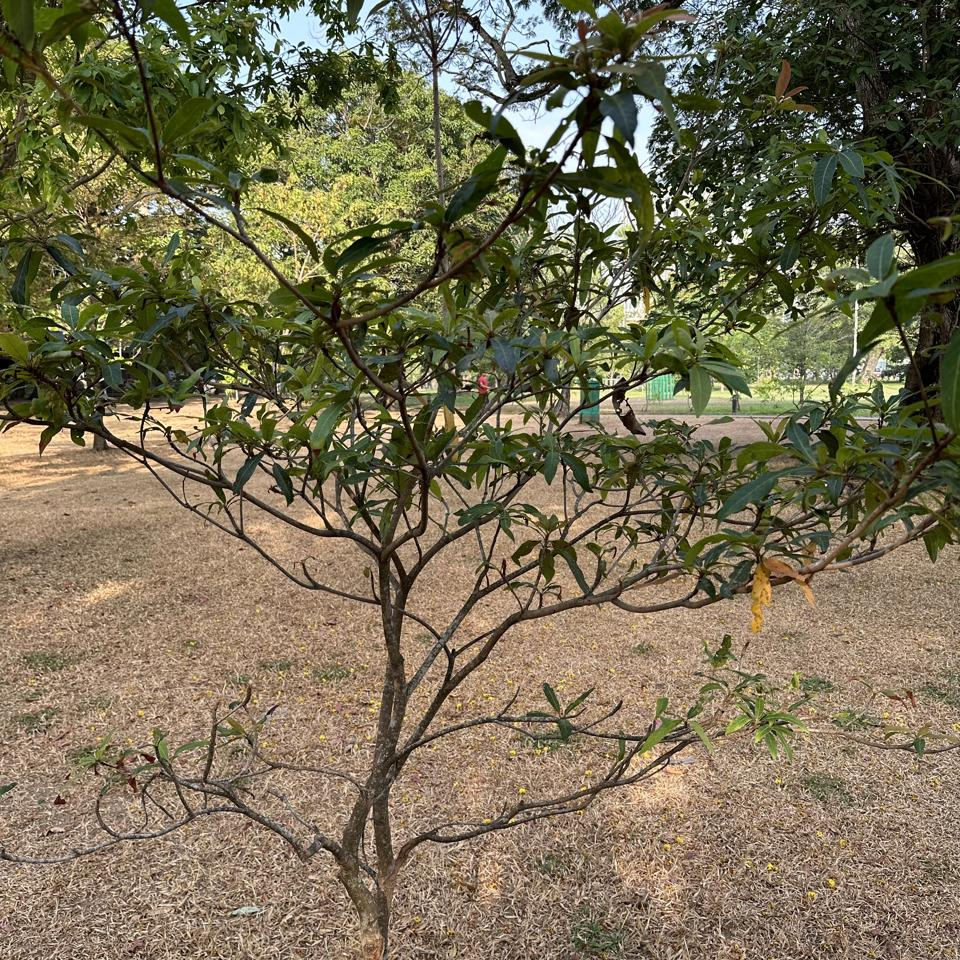

## Sample of Plant Photos difficult to Identify

Photos where the identification confidence is **< 20%**.

### Photo-2024-03-14-08-00-09

* 18.9% *Areca triandra*
* 0.3% *Dendrocalamus giganteus*
* 0.3% *Dypsis lutescens*

### Photo-2024-03-17-08-02-15

* 3.5% *Podocarpus neriifolius*
* 0.3% *Dodonaea viscosa*
* 0.2% *Searsia lancea*

### Photo-2024-03-20-07-33-58

* 12.1% *Ficus benghalensis*
* 1.9% *Ficus altissima*
* 1.5% *Cordia dichotoma*

### Photo-2024-03-08-07-03-42

* 6.6% *Caryocar brasiliense*
* 5.6% *Averrhoa carambola*
* 5.1% *Bauhinia variegata*

### Photo-2024-03-26-07-39-01

* 8.3% *Adenanthera pavonina*
* 7.3% *Jacaranda mimosifolia*
* 4.2% *Samanea saman*

### Photo-2024-03-21-07-35-57

* 8.2% *Areca triandra*
* 1.6% *Filicium decipiens*
* 0.6% *Dendrocalamus giganteus*

### Photo-2024-03-08-07-18-49

* 10.1% *Camellia sinensis*
* 9.2% *Eugenia brasiliensis*
* 3.8% *Eupomatia laurina*

### Photo-2024-03-21-08-10-57

* 5.3% *Manilkara zapota*
* 4.3% *Saurauia napaulensis*
* 2.4% *Terminalia arjuna*

### Photo-2024-03-17-08-00-45

* 5.5% *Hopea odorata*
* 3.0% *Shorea roxburghii*
* 2.6% *Garcinia atroviridis*

### Photo-2024-03-17-08-32-22

* 3.0% *Acacia acinacea*
* 0.9% *Lonicera ligustrina*
* 0.7% *Ehretia microphylla*

### Photo-2024-03-13-07-19-18

* 1.3% *Delonix regia*
* 1.2% *Elaeocarpus serratus*
* 1.0% *Syzygium cymosum*

### Photo-2024-03-20-07-59-34

* 5.6% *Delonix regia*
* 3.3% *Hymenaea courbaril*
* 2.0% *Cinnamomum camphora*

### Photo-2024-03-17-08-19-11

* 2.0% *Ochna integerrima*
* 0.2% *Malpighia glabra*

### Photo-2024-03-17-08-30-30

* 5.8% *Terminalia arjuna*
* 0.7% *Eclipta prostrata*
* 0.7% *Alternanthera philoxeroides*

### Photo-2024-03-08-06-58-01

* 7.8% *Tectona grandis*
* 7.2% *Lagerstroemia speciosa*
* 5.4% *Magnolia kobus*

### Photo-2024-03-11-06-47-53

* 15.6% *Strychnos nux-vomica*
* 9.2% *Swietenia mahagoni*
* 8.2% *Pterocarpus indicus*

### Photo-2024-03-22-08-04-50

* 6.0% *Tabernaemontana divaricata*
* 3.4% *Syzygium jambos*
* 1.1% *Ludwigia octovalvis*

### Photo-2024-03-21-07-40-01

* 5.3% *Podocarpus neriifolius*
* 1.7% *Melaleuca viminalis*
* 0.7% *Cascabela thevetia*

### Photo-2024-03-08-07-12-19

* 4.0% *Delonix regia*
* 2.4% *Hymenaea courbaril*
* 2.4% *Elaeocarpus serratus*

### Photo-2024-03-26-07-59-09

* 1.6% *Syzygium jambos*
* 0.9% *Corymbia maculata*
* 0.5% *Syzygium cymosum*

