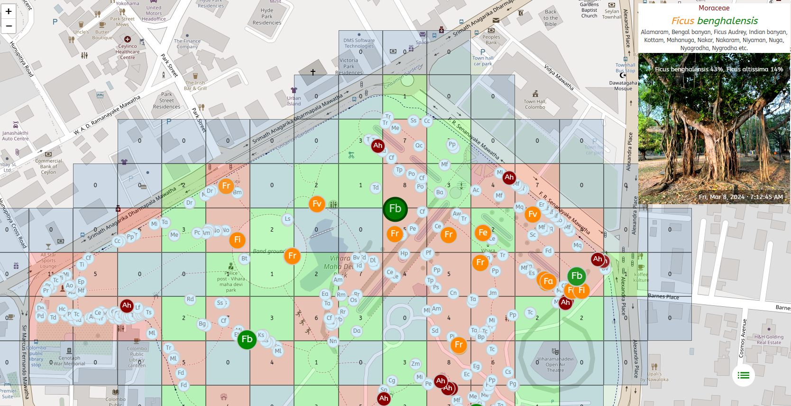

# Plants of Vihaaramahadevi Park :sri_lanka:

## Background

Viharamahadevi Park (Sinhala: විහාරමහාදේවී උද්‍යානය; formerly Victoria Park, Sinhala: වික්ටෝරියා පාක්) is a public park located in Cinnamon Gardens, in [Colombo](https://en.wikipedia.org/wiki/Colombo), situated in front of the colonial-era Town Hall in Sri Lanka. It was built by the British colonial administration and is the oldest and largest park of Colombo. The park was originally named "Victoria Park" after Queen Victoria but was renamed after Queen Viharamahadevi, the mother of King Dutugamunu on July 18, 1958. [[Wikipedia](https://en.wikipedia.org/wiki/Viharamahadevi_Park)]

Viharamahadevi Park is 24.27ha, and has an estimated [green cover](https://en.wikipedia.org/wiki/Vegetation) of 14.39ha (59% from the total area). The estimated crown cover 12.25ha (50%). [[Madurapperum et al](https://www.researchgate.net/publication/282250239_CrownTree_cover_of_Viharamahadevi_Park_Colombo)]

*This analysis was automatically generated on  **Mar 20, 2024 (07:52 PM)**, and is based on  **766** plant photos.*

Results can be directly inspected using [this app](https://nuuuwan.github.io/plants).

## Summary Statistics

### Families

**73** unique Families.

| # | Families | n(Photos) | % |
|---:|:---|---:|---:|
| 1 | *Fabaceae* | 154 | 20.1% |
| 2 | *Moraceae* | 66 | 8.6% |
| 3 | *Calophyllaceae* | 50 | 6.5% |
| 4 | *Combretaceae* | 46 | 6.0% |
| 5 | *Bignoniaceae* | 41 | 5.4% |
| 6 | *Myrtaceae* | 41 | 5.4% |
| 7 | *Apocynaceae* | 39 | 5.1% |
| 8 | *Meliaceae* | 36 | 4.7% |
| 9 | *Anacardiaceae* | 28 | 3.7% |
| 10 | *Arecaceae* | 24 | 3.1% |
| 11 | *Lamiaceae* | 21 | 2.7% |
| 12 | *Sapotaceae* | 20 | 2.6% |
| 13 | *Annonaceae* | 15 | 2.0% |
| 14 | *Sapindaceae* | 14 | 1.8% |
| 15 | *Fagaceae* | 10 | 1.3% |
| 16 | *Malvaceae* | 9 | 1.2% |
| 17 | *Phyllanthaceae* | 9 | 1.2% |
| 18 | *Lauraceae* | 8 | 1.0% |
| 19 | *Lythraceae* | 8 | 1.0% |
| 20 | *Casuarinaceae* | 7 | 0.9% |
| | (All Others) | 120 | 15.7% |

### Genera

**181** unique Genera.

| # | Genera | n(Photos) | % |
|---:|:---|---:|---:|
| 1 | *Ficus* | 51 | 6.7% |
| 2 | *Mesua* | 44 | 5.7% |
| 3 | *Terminalia* | 44 | 5.7% |
| 4 | *Cassia* | 25 | 3.3% |
| 5 | *Peltophorum* | 23 | 3.0% |
| 6 | *Mangifera* | 18 | 2.3% |
| 7 | *Tectona* | 17 | 2.2% |
| 8 | *Tecoma* | 16 | 2.1% |
| 9 | *Tabebuia* | 16 | 2.1% |
| 10 | *Pterocarpus* | 15 | 2.0% |
| 11 | *Artocarpus* | 14 | 1.8% |
| 12 | *Syzygium* | 14 | 1.8% |
| 13 | *Melaleuca* | 13 | 1.7% |
| 14 | *Tabernaemontana* | 12 | 1.6% |
| 15 | *Plumeria* | 12 | 1.6% |
| 16 | *Azadirachta* | 12 | 1.6% |
| 17 | *Delonix* | 10 | 1.3% |
| 18 | *Quercus* | 10 | 1.3% |
| 19 | *Pongamia* | 10 | 1.3% |
| 20 | *Eucalyptus* | 9 | 1.2% |
| | (All Others) | 381 | 49.7% |

### Species

**251** unique Species.

| # | Species | n(Photos) | % |
|---:|:---|---:|---:|
| 1 | *Mesua ferrea* | 44 | 5.7% |
| 2 | *Terminalia arjuna* | 32 | 4.2% |
| 3 | *Cassia fistula* | 20 | 2.6% |
| 4 | *Mangifera indica* | 18 | 2.3% |
| 5 | *Peltophorum pterocarpum* | 18 | 2.3% |
| 6 | *Tectona grandis* | 17 | 2.2% |
| 7 | *Tecoma stans* | 16 | 2.1% |
| 8 | *Ficus religiosa* | 16 | 2.1% |
| 9 | *Artocarpus heterophyllus* | 14 | 1.8% |
| 10 | *Pterocarpus indicus* | 13 | 1.7% |
| 11 | *Azadirachta indica* | 12 | 1.6% |
| 12 | *Tabernaemontana divaricata* | 11 | 1.4% |
| 13 | *Tabebuia rosea* | 11 | 1.4% |
| 14 | *Ficus benghalensis* | 11 | 1.4% |
| 15 | *Delonix regia* | 10 | 1.3% |
| 16 | *Pongamia pinnata* | 10 | 1.3% |
| 17 | *Syzygium cumini* | 9 | 1.2% |
| 18 | *Terminalia catappa* | 9 | 1.2% |
| 19 | *Plumeria rubra* | 9 | 1.2% |
| 20 | *Mimusops elengi* | 8 | 1.0% |
| | (All Others) | 458 | 59.8% |

## Identification Confidence (by Species with at least 5 Photos)

| Species | n(Photos) | Confidence (25th pctl.) | Confidence (Median) | Confidence (75th pctl.) |
|:---|---:|---:|---:|---:|
| *Tabernaemontana divaricata* | 11 | 71.9% | 85.9% | 97.7% |
| *Anacardium occidentale* | 7 | 66.9% | 92.4% | 94.9% |
| *Monoon longifolium* | 6 | 71.0% | 85.4% | 92.2% |
| *Terminalia catappa* | 9 | 50.6% | 88.2% | 94.1% |
| *Tectona grandis* | 17 | 30.8% | 80.4% | 93.9% |
| *Tecoma stans* | 16 | 55.0% | 69.0% | 76.7% |
| *Casuarina equisetifolia* | 6 | 42.3% | 62.2% | 75.0% |
| *Filicium decipiens* | 7 | 12.5% | 77.9% | 83.6% |
| *Artocarpus heterophyllus* | 14 | 23.9% | 78.3% | 80.4% |
| *Mesua ferrea* | 44 | 41.3% | 59.9% | 76.6% |
| *Plumeria rubra* | 9 | 42.8% | 60.8% | 65.5% |
| *Pongamia pinnata* | 10 | 7.9% | 42.0% | 82.6% |
| *Mangifera indica* | 18 | 17.5% | 49.7% | 72.4% |
| *Saraca indica* | 6 | 26.3% | 52.2% | 66.8% |
| *Terminalia arjuna* | 32 | 16.2% | 35.7% | 70.6% |
| *Samanea saman* | 6 | 13.5% | 38.5% | 84.4% |
| *Ficus religiosa* | 16 | 11.8% | 19.7% | 89.1% |
| *Azadirachta indica* | 12 | 12.4% | 45.1% | 67.3% |
| *Cocos nucifera* | 6 | 3.9% | 46.0% | 78.7% |
| *Tabebuia rosea* | 11 | 11.5% | 40.8% | 59.6% |
| *Mimusops elengi* | 8 | 11.0% | 28.6% | 74.9% |
| *Bauhinia purpurea* | 5 | 16.7% | 43.1% | 48.3% |
| *Cassia fistula* | 20 | 9.0% | 27.4% | 68.7% |
| *Calophyllum inophyllum* | 6 | 13.3% | 27.3% | 38.5% |
| *Syzygium cumini* | 9 | 10.1% | 24.1% | 42.2% |
| *Lagerstroemia speciosa* | 8 | 8.0% | 18.7% | 72.2% |
| *Pterocarpus indicus* | 13 | 14.0% | 23.0% | 41.3% |
| *Delonix regia* | 10 | 5.6% | 39.9% | 47.8% |
| *Ficus benghalensis* | 11 | 10.4% | 19.5% | 48.5% |
| *Schleichera oleosa* | 5 | 22.3% | 24.2% | 26.1% |
| *Holarrhena pubescens* | 5 | 14.0% | 18.5% | 43.7% |
| *Khaya senegalensis* | 6 | 10.5% | 13.4% | 28.0% |
| *Swietenia mahagoni* | 5 | 16.8% | 20.4% | 39.1% |
| *Madhuca longifolia* | 5 | 16.3% | 25.2% | 28.3% |
| *Jacaranda mimosifolia* | 7 | 16.3% | 22.7% | 26.2% |
| *Peltophorum pterocarpum* | 18 | 12.7% | 21.6% | 31.6% |
| *Manilkara zapota* | 5 | 12.1% | 12.3% | 28.3% |
| *Schizolobium parahyba* | 5 | 1.8% | 12.5% | 30.0% |
| *Psidium cattleyanum* | 5 | 6.1% | 7.9% | 11.4% |
| *Toona ciliata* | 7 | 3.2% | 15.8% | 25.5% |
| *Eucalyptus robusta* | 5 | 3.3% | 4.7% | 6.6% |
| *Ficus virens* | 7 | 3.7% | 10.3% | 22.7% |
| *Podocarpus neriifolius* | 6 | 3.5% | 13.5% | 15.3% |
| *Melaleuca viminalis* | 7 | 2.9% | 3.3% | 10.7% |

## Pairs of Plant Species, likely confused during identification (at least 2 times)

| Species 1 | Species 2 | n(Photos) |
|:---|:---|---:|
| *Jacaranda mimosifolia* | *Peltophorum pterocarpum* | 7 |
| *Ficus benghalensis* | *Ficus elastica* | 3 |
| *Pterocarpus indicus* | *Tipuana tipu* | 3 |
| *Peltophorum dubium* | *Peltophorum pterocarpum* | 3 |
| *Cassia fistula* | *Pterocarpus indicus* | 3 |
| *Ficus religiosa* | *Ficus virens* | 3 |
| *Ficus aurea* | *Ficus luschnathiana* | 2 |
| *Psidium guajava* | *Terminalia arjuna* | 2 |
| *Delonix regia* | *Hymenaea courbaril* | 2 |
| *Casuarina cunninghamiana* | *Casuarina equisetifolia* | 2 |
| *Jacaranda mimosifolia* | *Peltophorum dubium* | 2 |
| *Plumeria alba* | *Plumeria rubra* | 2 |
| *Pongamia pinnata* | *Pterocarpus indicus* | 2 |
| *Delonix regia* | *Peltophorum pterocarpum* | 2 |
| *Ficus altissima* | *Ficus virens* | 2 |
| *Swietenia macrophylla* | *Swietenia mahagoni* | 2 |
| *Cascabela thevetia* | *Podocarpus neriifolius* | 2 |
| *Brownea grandiceps* | *Saraca indica* | 2 |
