# Plants of Vihaaramahadevi Park :sri_lanka:

## About

This project aims to use Computer Vision and Artificial Intelligence to identify plants in Sri Lanka's public parks, beginning with Viharamahadevi Park, Colombo.

This report was automatically generated on  **Mar 26, 2024 (12:47 PM)**, and is based on **590** plant photos.*

## [PlantNet](https://plantnet.org)

Plant Identifications are from  [PlantNet](https://plantnet.org), a citizen science project for automatic plant identification through photographs and based on machine learning.

*We only consider results where the model's identification confidence is **≥ 20%.***

## The [Plants](https://nuuuwan.github.io/plants) App

Results can be directly inspected using our [Plants](https://nuuuwan.github.io/plants) App.

## Viharamahadevi Park

Viharamahadevi Park (Sinhala: විහාරමහාදේවී උද්‍යානය; formerly Victoria Park, Sinhala: වික්ටෝරියා පාක්) is a public park located in Cinnamon Gardens, in [Colombo](https://en.wikipedia.org/wiki/Colombo), situated in front of the colonial-era Town Hall in Sri Lanka. It was built by the British colonial administration and is the oldest and largest park of Colombo. The park was originally named "Victoria Park" after Queen Victoria but was renamed after Queen Viharamahadevi, the mother of King Dutugamunu on July 18, 1958. [[Wikipedia](https://en.wikipedia.org/wiki/Viharamahadevi_Park)]

Viharamahadevi Park is 24.27ha, and has an estimated [green cover](https://en.wikipedia.org/wiki/Vegetation) of 14.39ha (59% from the total area). The estimated crown cover 12.25ha (50%). [[Madurapperuma et al](https://www.researchgate.net/publication/282250239_CrownTree_cover_of_Viharamahadevi_Park_Colombo)]

## Most Common Species

### [*Mesua ferrea*](https://en.wikipedia.org/wiki/Mesua_ferrea) ([*Calophyllaceae*](https://en.wikipedia.org/wiki/Calophyllaceae))

*46 Photos*

 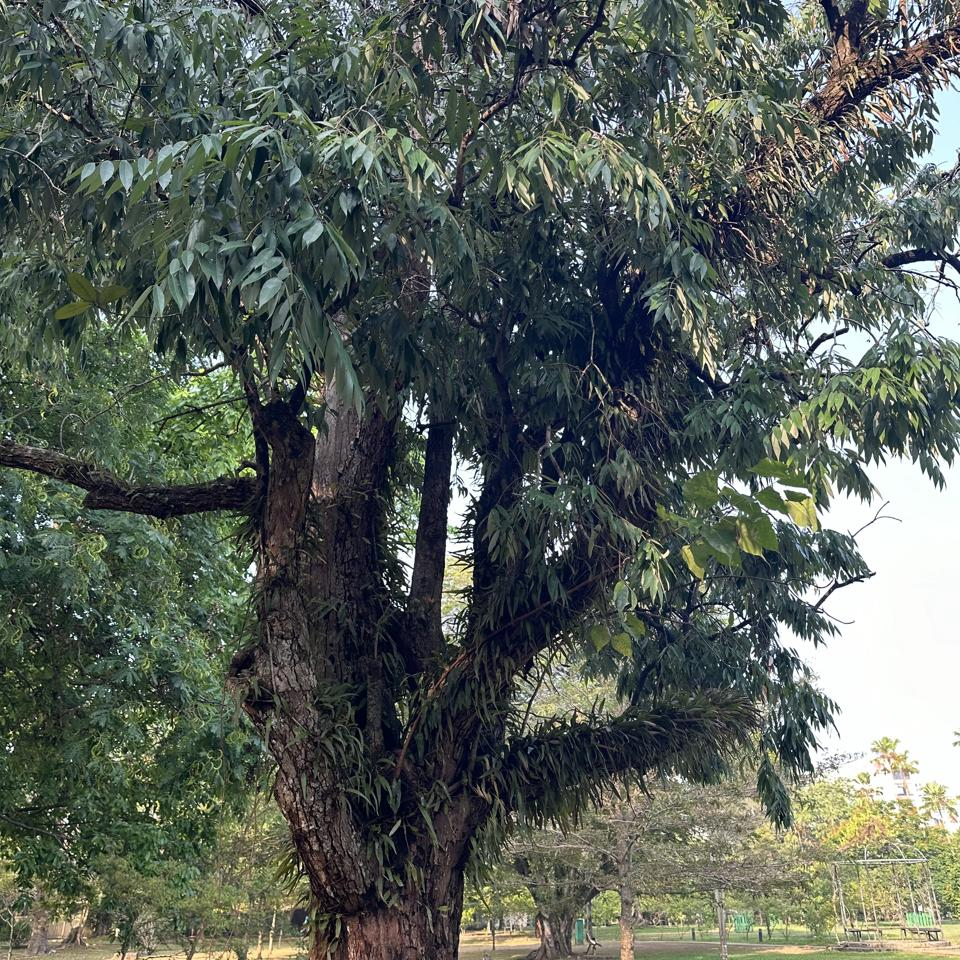 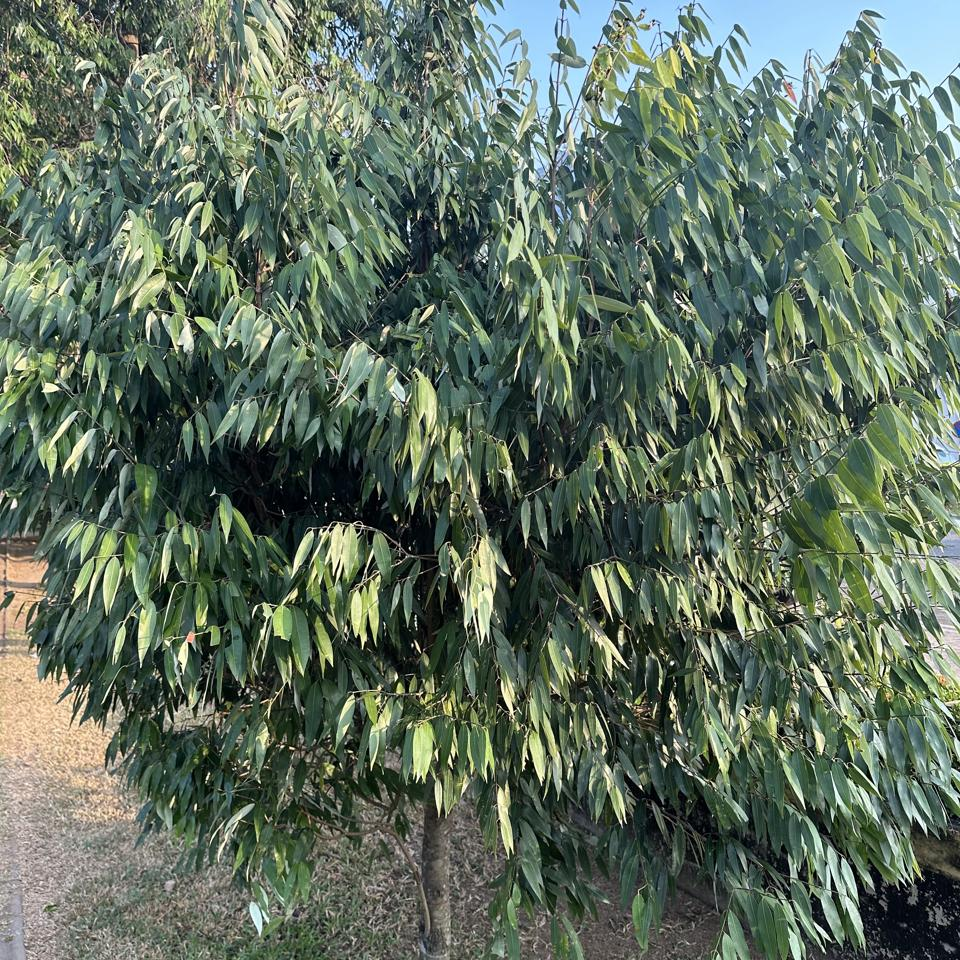

*Ceylon Ironwood, Cirunakappu, Iron Wood Tree, Mesua, Na, Naa, Nagakesarah Nagapuspa, Nangu*

Mesua ferrea, the Ceylon ironwood,  or cobra saffron, is a species in the family Calophyllaceae native to the Indomalayan realm. This slow-growing tree is named after the heaviness and hardness of its timber. It is widely cultivated as an ornamental for its graceful shape, grayish-green foliage with a beautiful pink to red flush of drooping young leaves, and large, fragrant white flowers. It is the national tree of Sri Lanka, as well as the state tree of Mizoram and state flower of Tripura in India. [[Wikipedia](https://en.wikipedia.org/wiki/Mesua_ferrea)]

### [*Terminalia arjuna*](https://en.wikipedia.org/wiki/Terminalia_arjuna) ([*Combretaceae*](https://en.wikipedia.org/wiki/Combretaceae))

*29 Photos*

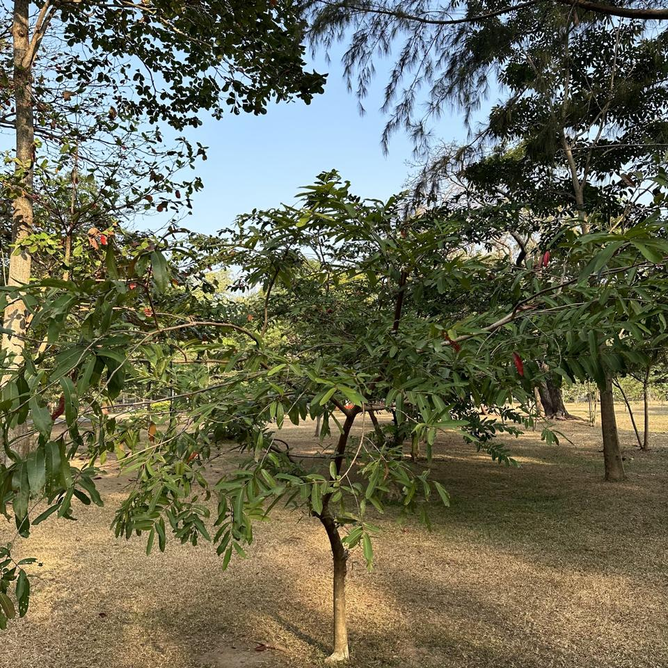 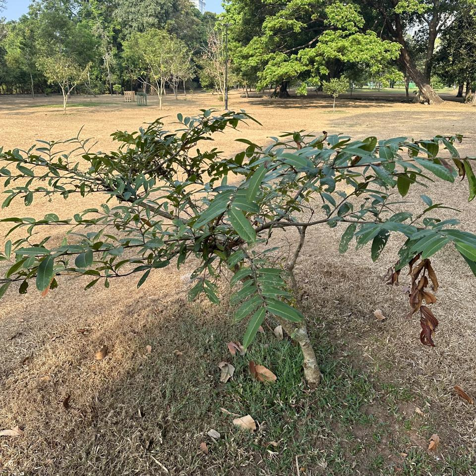 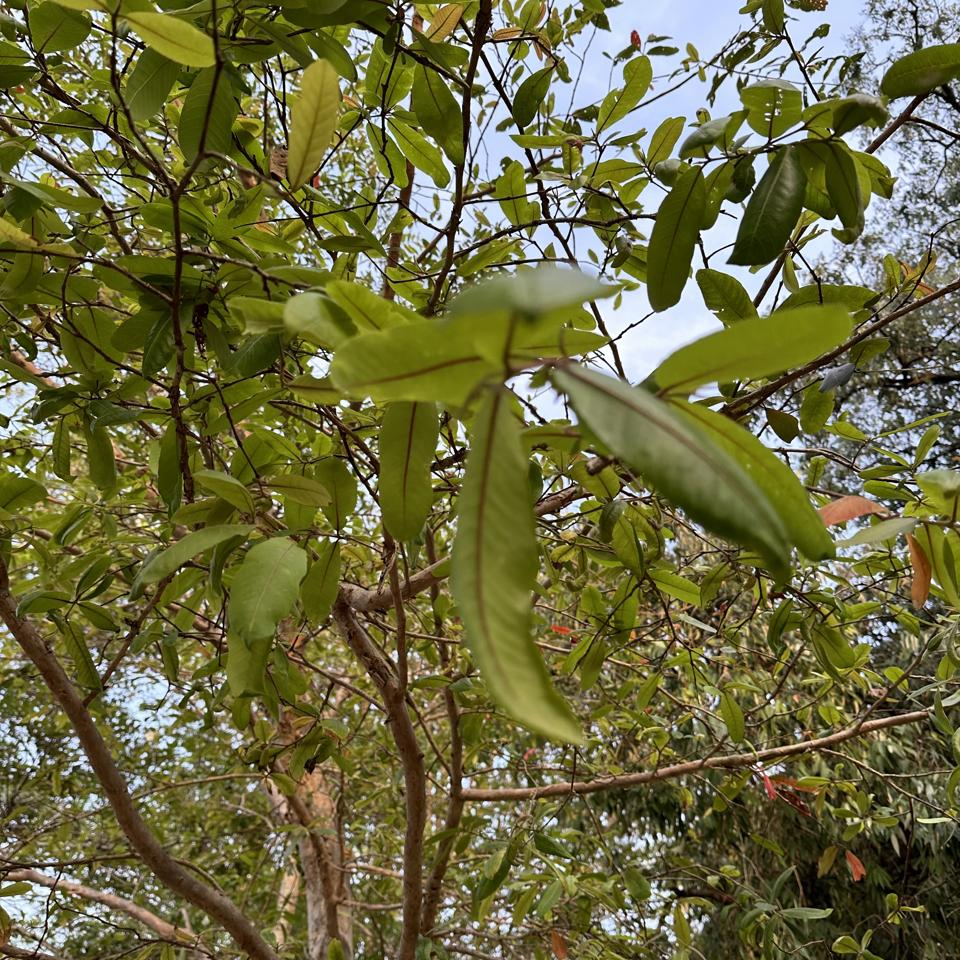

*Arjun, Kakubha, Kumbuk, Maruthu, Marutu, White murdh*

Terminalia arjuna is a tree of the genus Terminalia. It is commonly known as arjuna or arjun tree in English. [[Wikipedia](https://en.wikipedia.org/wiki/Terminalia_arjuna)]

### [*Mangifera indica*](https://en.wikipedia.org/wiki/Mangifera_indica) ([*Anacardiaceae*](https://en.wikipedia.org/wiki/Anacardiaceae))

*25 Photos*

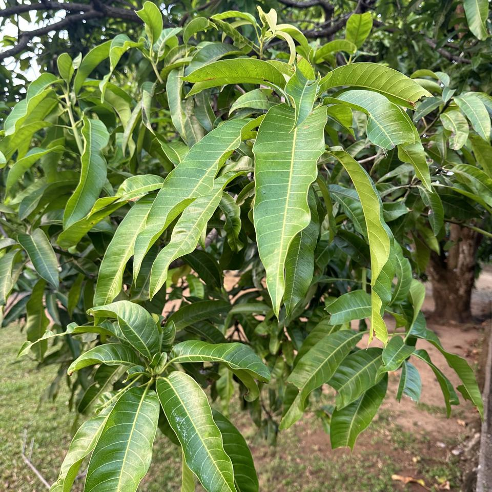 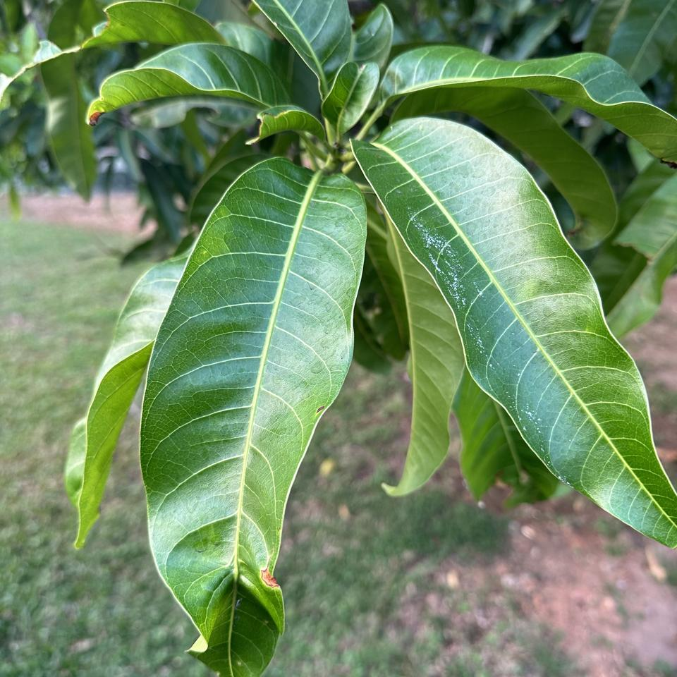 

*Amba, Amiram, Amra, Ma, Mamaram, Mangai, Mango, Mango Tree, Mee Amba, Sahakara, आम*

Mangifera indica, commonly known as mango, is a species of flowering plant in the family Anacardiaceae. It is a large fruit tree, capable of growing to a height of 30 metres (100 feet). There are two distinct genetic populations in modern mangoes – the "Indian type" and the "Southeast Asian type". [[Wikipedia](https://en.wikipedia.org/wiki/Mangifera_indica)]

### [*Tectona grandis*](https://en.wikipedia.org/wiki/Tectona_grandis) ([*Lamiaceae*](https://en.wikipedia.org/wiki/Lamiaceae))

*20 Photos*

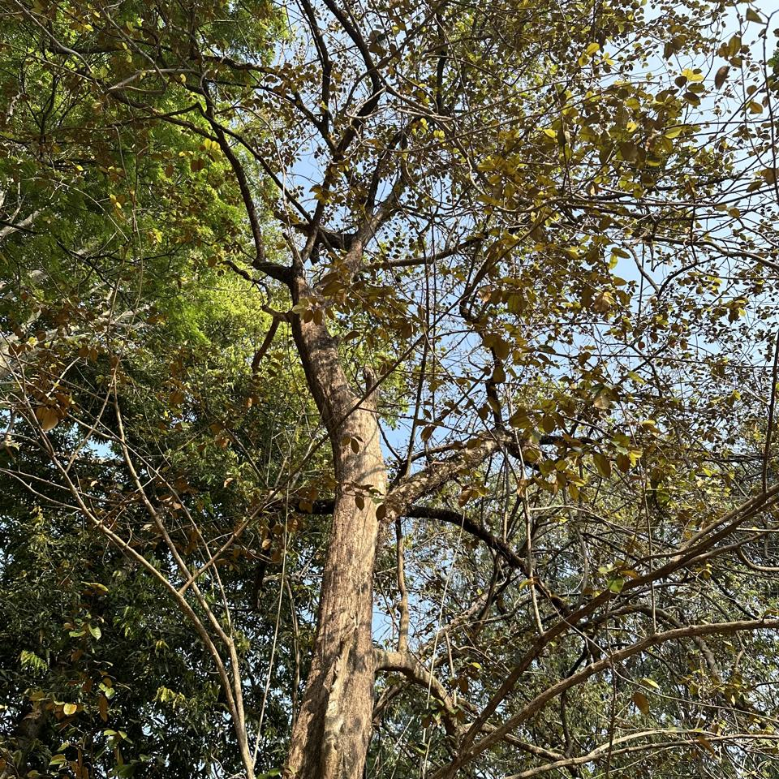  

*Bankok teak, Bardaru, Bhumisah, Dwardaru, Indian-oak, Kharchchada, Kolaphala, Saaka, Sabarasaara, Teak, The Kka Signify Long Sound, Thekku*

Teak (Tectona grandis) is a tropical hardwood tree species in the family Lamiaceae. It is a large, deciduous tree that occurs in mixed hardwood forests. Tectona grandis has small, fragrant white flowers arranged in dense clusters (panicles) at the end of the branches. These flowers contain both types of reproductive organs (perfect flowers). The large, papery leaves of teak trees are often hairy on the lower surface. Teak wood has a leather-like smell when it is freshly milled and is particularly valued for its durability and water resistance. The wood is used for boat building, exterior construction, veneer, furniture, carving, turnings, and various small projects.Tectona grandis is native to south and southeast Asia, mainly Bangladesh, India, Indonesia, Malaysia, Myanmar, Thailand, and Sri Lanka, but is naturalised and cultivated in many countries in Africa and the Caribbean. Myanmar's teak forests account for nearly half of the world's naturally occurring teak. Molecular studies show that there are two centres of the genetic origin of teak: one in India and the other in Myanmar and Laos. [[Wikipedia](https://en.wikipedia.org/wiki/Tectona_grandis)]

### [*Artocarpus heterophyllus*](https://en.wikipedia.org/wiki/Artocarpus_heterophyllus) ([*Moraceae*](https://en.wikipedia.org/wiki/Moraceae))

*19 Photos*

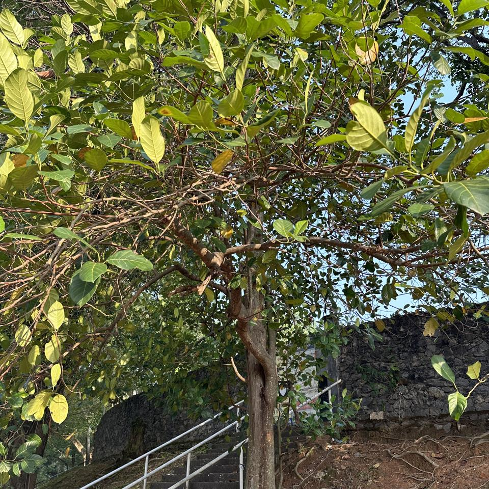 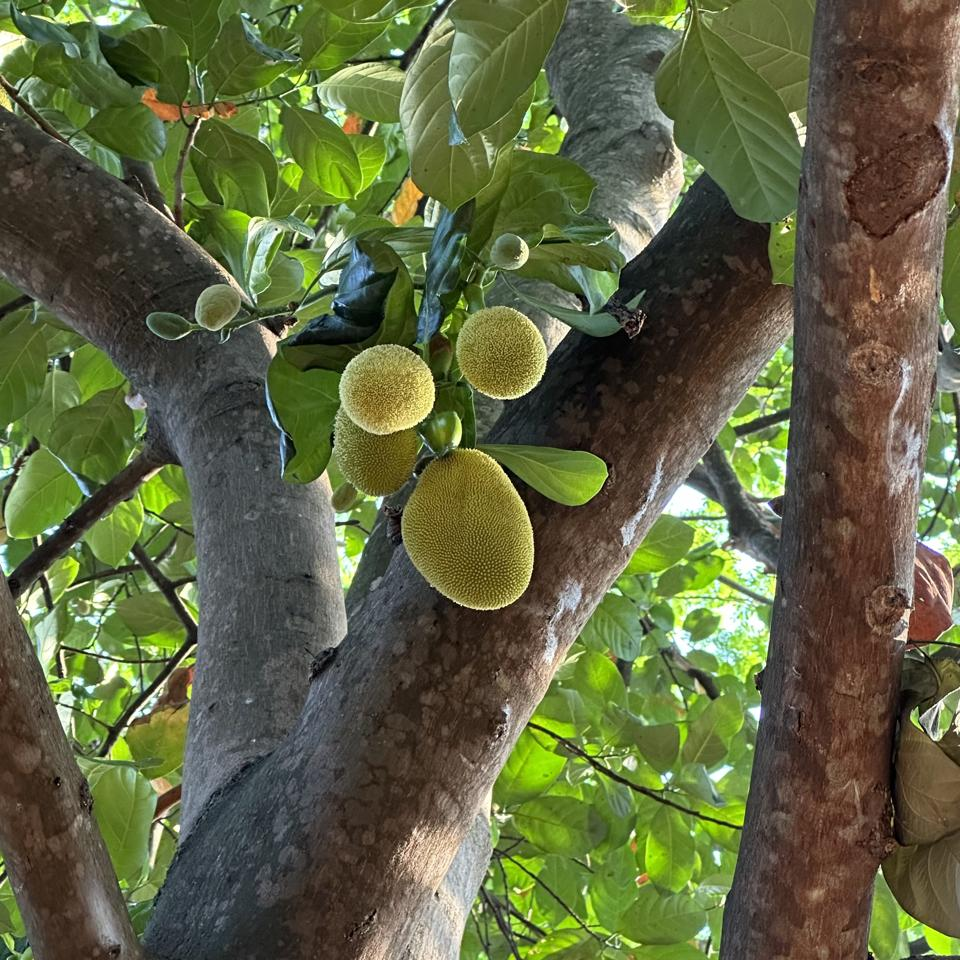 

*Herali, Jackfruit, Kos, Pala, Palavu, Panasam, Pila, Vaela, Waraka See Artocarpus Indica, কাঠাল, పనస*

The jackfruit is the fruit of jack tree Artocarpus heterophyllus, a species of tree in the fig, mulberry, and breadfruit family (Moraceae). The jackfruit is the largest tree fruit, reaching as much as 55 kg (120 pounds) in weight, 90 cm (35 inches) in length, and 50 cm (20 inches) in diameter. A mature jackfruit tree produces some 200 fruits per year, with older trees bearing up to 500 fruits in a year. The jackfruit is a multiple fruit composed of hundreds to thousands of individual flowers, and the fleshy petals of the unripe fruit are eaten.The jackfruit tree is well-suited to tropical lowlands and is widely cultivated throughout tropical regions of the world, including India, Bangladesh, Sri Lanka, and the rainforests of the Philippines, Indonesia, Malaysia, and Australia.The ripe fruit is sweet (depending on variety) and is commonly used in desserts. Canned green jackfruit has a mild taste and meat-like texture that lends itself to being called "vegetable meat". Jackfruit is commonly used in South and Southeast Asian cuisines. Both ripe and unripe fruits are consumed. It is available internationally, canned or frozen, and in chilled meals, as are various products derived from the fruit, such as noodles and chips. [[Wikipedia](https://en.wikipedia.org/wiki/Artocarpus_heterophyllus)]

### [*Tabernaemontana divaricata*](https://en.wikipedia.org/wiki/Tabernaemontana_divaricata) ([*Apocynaceae*](https://en.wikipedia.org/wiki/Apocynaceae))

*18 Photos*

 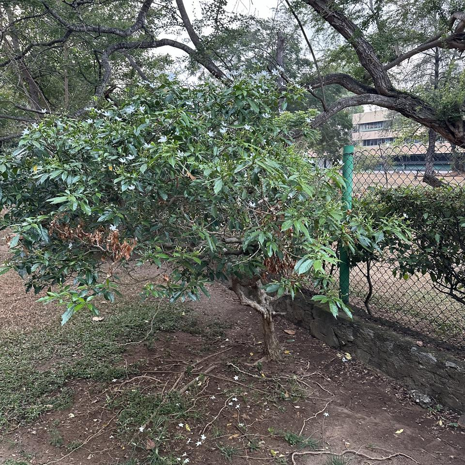 

*Adukkunandiyavattai, Butterfly-gardenia, Crape-jasmine, Nandi Battai, Nandiar Vattai, Nandivrksah, Vathu Sudda, Wathu Sudda, Watu Sudda, Watusudda, నందివర్ధనం*

Tabernaemontana divaricata, commonly called pinwheel flower, crape jasmine, East India rosebay, and Nero's crown, is an evergreen shrub or small tree native to South Asia, Southeast Asia and China. In zones where it is not hardy it is grown as a house/glasshouse plant for its attractive flowers and foliage. The stem exudes a milky latex when broken, whence comes the name milk flower [[Wikipedia](https://en.wikipedia.org/wiki/Tabernaemontana_divaricata)]

### [*Terminalia catappa*](https://en.wikipedia.org/wiki/Terminalia_catappa) ([*Combretaceae*](https://en.wikipedia.org/wiki/Combretaceae))

*17 Photos*

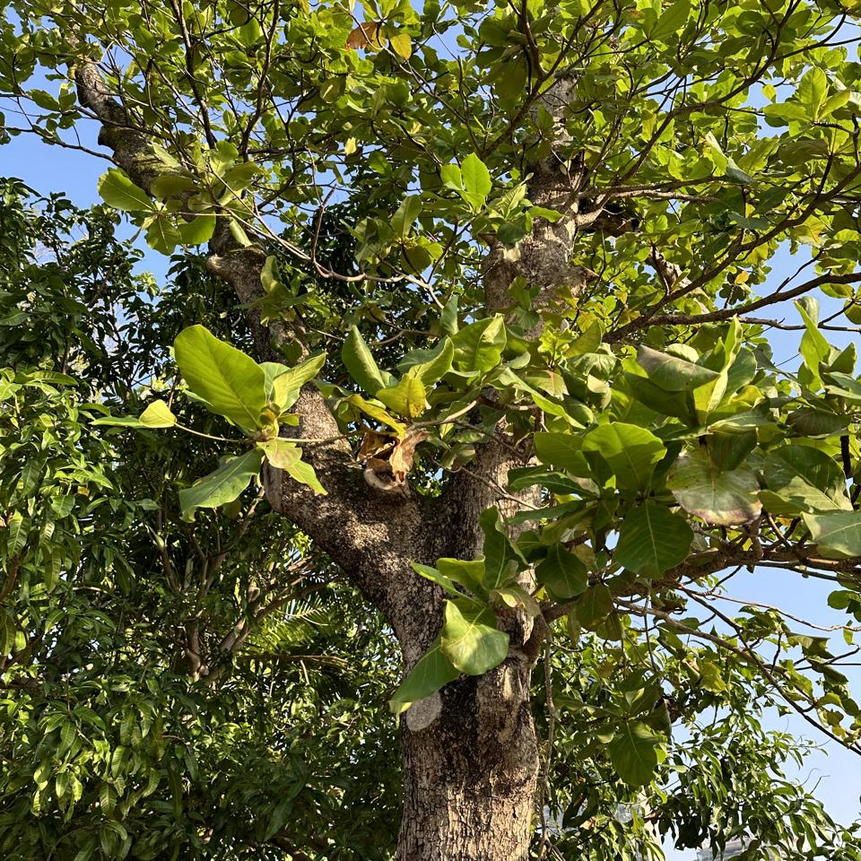 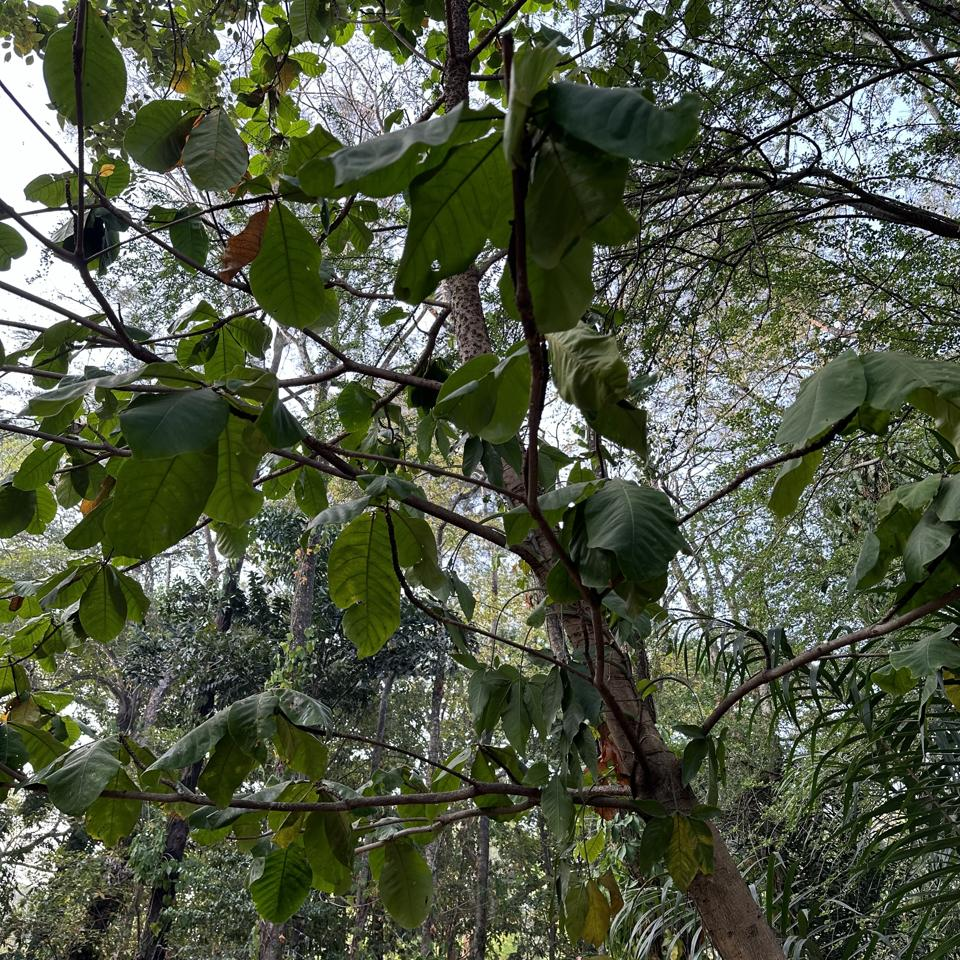 

*Country-almond, Indian-almond, Kottamba, Kottan, Nattu Vadam, Nattuvadumai, Tailaphala, Tropical almond*

Terminalia catappa is a large tropical tree in the leadwood tree family, Combretaceae, native to Asia, Australia, the Pacific, Madagascar and Seychelles. Common names in English include country almond, Indian almond, Malabar almond, sea almond, tropical almond, beach almond and false kamani. [[Wikipedia](https://en.wikipedia.org/wiki/Terminalia_catappa)]

### [*Tecoma stans*](https://en.wikipedia.org/wiki/Tecoma_stans) ([*Bignoniaceae*](https://en.wikipedia.org/wiki/Bignoniaceae))

*16 Photos*

  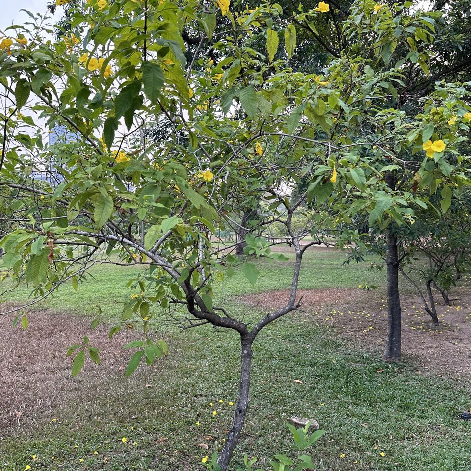

*Kaelanitissa, Kelantissa, Rankaerali, Swarnaptti, Tankarali, Trumpet-flower, Yellow trumpet flower, Yellow-bells*

Tecoma stans is a species of flowering perennial shrub in the trumpet vine family, Bignoniaceae, that is native to the Americas.  Common names include yellow trumpetbush, yellow bells, yellow elder, ginger Thomas. Tecoma stans is the official flower of the United States Virgin Islands and the floral emblem of The Bahamas. [[Wikipedia](https://en.wikipedia.org/wiki/Tecoma_stans)]

### [*Peltophorum pterocarpum*](https://en.wikipedia.org/wiki/Peltophorum_pterocarpum) ([*Fabaceae*](https://en.wikipedia.org/wiki/Fabaceae))

*16 Photos*

  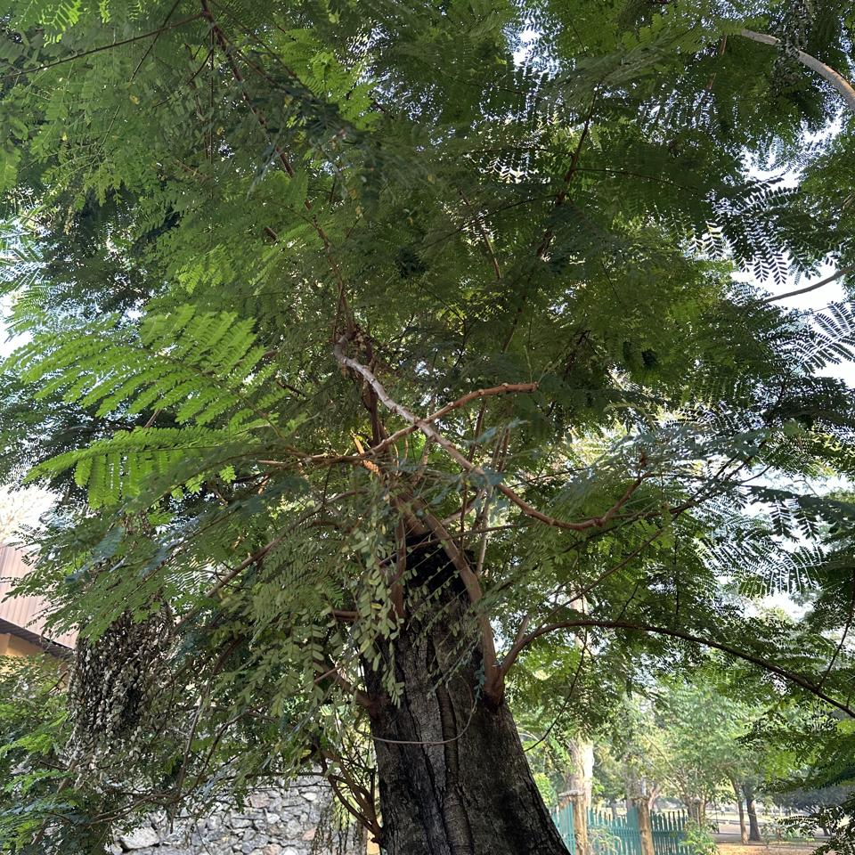

*Copperpod, Kaha Maara, Kona Maram, Maara, Nilalvakai, Yellow flame, Yellow flametree*

Peltophorum pterocarpum (commonly known as copperpod, yellow-flamboyant, yellow flametree, yellow poinciana or yellow-flame) is a species of Peltophorum, native to tropical southeastern Asia and a popular ornamental tree grown around the world. [[Wikipedia](https://en.wikipedia.org/wiki/Peltophorum_pterocarpum)]

### [*Pongamia pinnata*](https://en.wikipedia.org/wiki/Pongamia_pinnata) ([*Fabaceae*](https://en.wikipedia.org/wiki/Fabaceae))

*15 Photos*

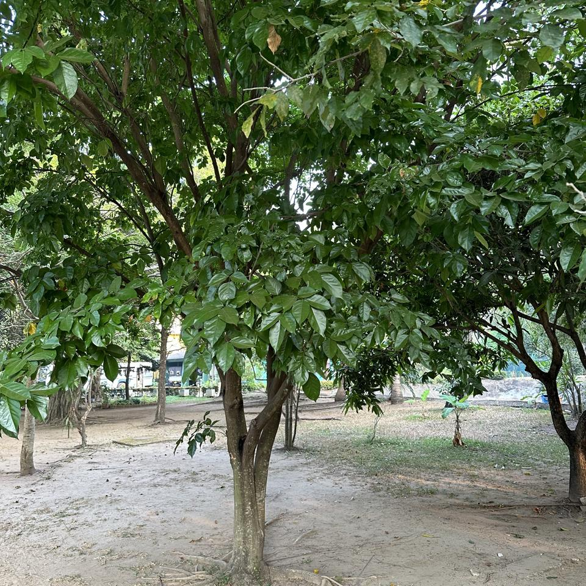  

*Indian Beech, Karanda, Karanj, Kolliyam, Naktamaala, Pomka, Pongam, Punku*

Pongamia pinnata is a species of tree in the pea family, Fabaceae, native to eastern and tropical Asia, Australia, and the Pacific islands. It is the sole species in genus Pongamia. It is often known by the synonym Millettia pinnata. Its common names include Indian beech and Pongame oiltree. [[Wikipedia](https://en.wikipedia.org/wiki/Pongamia_pinnata)]

## Statistics by Taxonomy

### Species

**164** unique Species.

| # | Species | n(Photos) | % |
| ---: | :--- | ---: | ---: |
| 1 | [*Mesua ferrea*](https://en.wikipedia.org/wiki/Mesua_ferrea) | 46 | 7.8% |
| 2 | [*Terminalia arjuna*](https://en.wikipedia.org/wiki/Terminalia_arjuna) | 29 | 4.9% |
| 3 | [*Mangifera indica*](https://en.wikipedia.org/wiki/Mangifera_indica) | 25 | 4.2% |
| 4 | [*Tectona grandis*](https://en.wikipedia.org/wiki/Tectona_grandis) | 20 | 3.4% |
| 5 | [*Artocarpus heterophyllus*](https://en.wikipedia.org/wiki/Artocarpus_heterophyllus) | 19 | 3.2% |
| 6 | [*Tabernaemontana divaricata*](https://en.wikipedia.org/wiki/Tabernaemontana_divaricata) | 18 | 3.1% |
| 7 | [*Terminalia catappa*](https://en.wikipedia.org/wiki/Terminalia_catappa) | 17 | 2.9% |
| 8 | [*Tecoma stans*](https://en.wikipedia.org/wiki/Tecoma_stans) | 16 | 2.7% |
| 9 | [*Peltophorum pterocarpum*](https://en.wikipedia.org/wiki/Peltophorum_pterocarpum) | 16 | 2.7% |
| 10 | [*Pongamia pinnata*](https://en.wikipedia.org/wiki/Pongamia_pinnata) | 15 | 2.5% |
|  | *(All Others)* | 308 | 52.2% |

### Genera

**127** unique Genera.

| # | Genera | n(Photos) | % |
| ---: | :--- | ---: | ---: |
| 1 | [*Terminalia*](https://en.wikipedia.org/wiki/Terminalia) | 48 | 8.1% |
| 2 | [*Mesua*](https://en.wikipedia.org/wiki/Mesua) | 46 | 7.8% |
| 3 | [*Ficus*](https://en.wikipedia.org/wiki/Ficus) | 28 | 4.7% |
| 4 | [*Mangifera*](https://en.wikipedia.org/wiki/Mangifera) | 25 | 4.2% |
| 5 | [*Tectona*](https://en.wikipedia.org/wiki/Tectona) | 20 | 3.4% |
| 6 | [*Artocarpus*](https://en.wikipedia.org/wiki/Artocarpus) | 19 | 3.2% |
| 7 | [*Peltophorum*](https://en.wikipedia.org/wiki/Peltophorum) | 19 | 3.2% |
| 8 | [*Tabernaemontana*](https://en.wikipedia.org/wiki/Tabernaemontana) | 18 | 3.1% |
| 9 | [*Cassia*](https://en.wikipedia.org/wiki/Cassia) | 17 | 2.9% |
| 10 | [*Tecoma*](https://en.wikipedia.org/wiki/Tecoma) | 16 | 2.7% |
|  | *(All Others)* | 234 | 39.7% |

### Families

**58** unique Families.

| # | Families | n(Photos) | % |
| ---: | :--- | ---: | ---: |
| 1 | [*Fabaceae*](https://en.wikipedia.org/wiki/Fabaceae) | 112 | 19.0% |
| 2 | [*Calophyllaceae*](https://en.wikipedia.org/wiki/Calophyllaceae) | 50 | 8.5% |
| 3 | [*Combretaceae*](https://en.wikipedia.org/wiki/Combretaceae) | 50 | 8.5% |
| 4 | [*Moraceae*](https://en.wikipedia.org/wiki/Moraceae) | 47 | 8.0% |
| 5 | [*Apocynaceae*](https://en.wikipedia.org/wiki/Apocynaceae) | 38 | 6.4% |
| 6 | [*Bignoniaceae*](https://en.wikipedia.org/wiki/Bignoniaceae) | 37 | 6.3% |
| 7 | [*Anacardiaceae*](https://en.wikipedia.org/wiki/Anacardiaceae) | 36 | 6.1% |
| 8 | [*Myrtaceae*](https://en.wikipedia.org/wiki/Myrtaceae) | 21 | 3.6% |
| 9 | [*Lamiaceae*](https://en.wikipedia.org/wiki/Lamiaceae) | 21 | 3.6% |
| 10 | [*Meliaceae*](https://en.wikipedia.org/wiki/Meliaceae) | 20 | 3.4% |
|  | *(All Others)* | 96 | 16.3% |

## Plant Photos difficult to Identify

Examples of Plant Photos where the identification confidence is < 10%.

### Photo-2024-03-15-07-06-16

* 3.7% *Ficus virens*
* 2.6% *Ficus religiosa*
* 1.6% *Ficus benghalensis*
* 1.4% *Terminalia arjuna*
* 0.8% *Ficus racemosa*
* 0.7% *Neolamarckia cadamba*
* 0.7% *Ficus altissima*
* 0.3% *Erythrina fusca*
* 0.3% *Salix acmophylla*
* 0.3% *Ficus geniculata*
* 0.2% *Strychnos nux-vomica*
* 0.1% *Pterygota alata*
* 0.1% *Ficus concinna*
* 0.1% *Guazuma ulmifolia*

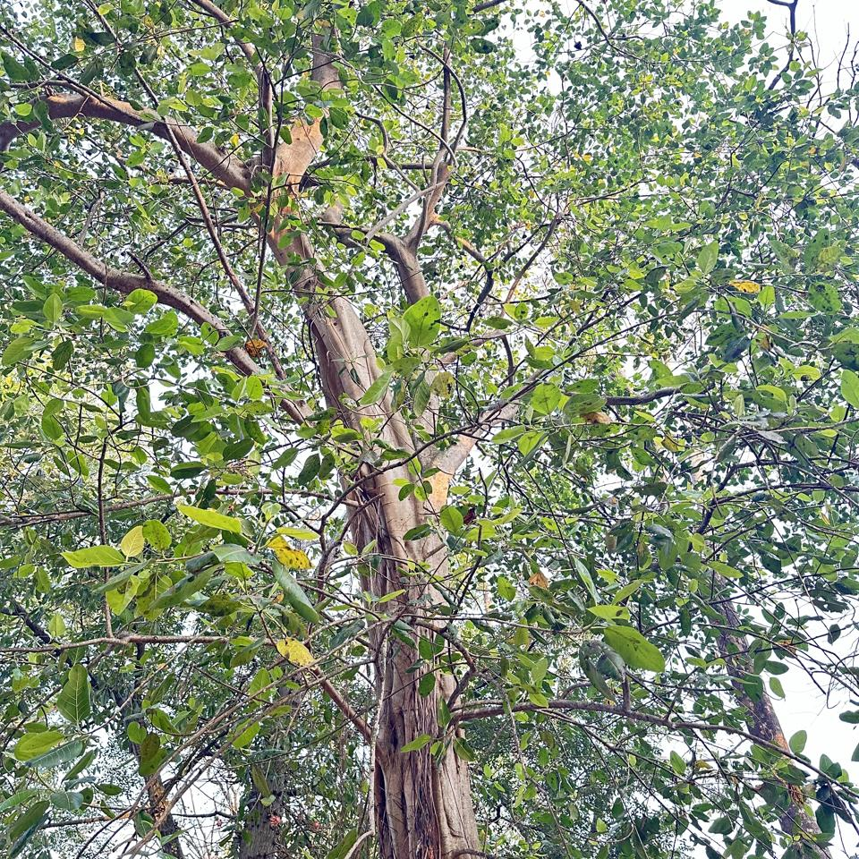

### Photo-2024-03-20-07-42-03

* 3.2% *Toona ciliata*
* 2.7% *Cassia fistula*
* 2.7% *Ficus geniculata*
* 1.1% *Hymenaea courbaril*
* 0.5% *Sapindus saponaria*
* 0.3% *Juglans regia*
* 0.2% *Pterocarpus indicus*
* 0.2% *Albizia procera*
* 0.2% *Schleichera oleosa*
* 0.2% *Strychnos nux-vomica*
* 0.2% *Khaya senegalensis*
* 0.2% *Cedrela odorata*
* 0.2% *Harpullia cupanioides*
* 0.2% *Ficus racemosa*
* 0.1% *Aegle marmelos*
* 0.1% *Terminalia arjuna*
* 0.1% *Strychnos potatorum*
* 0.1% *Dillenia pentagyna*
* 0.1% *Crateva religiosa*
* 0.1% *Cassia grandis*
* 0.1% *Ficus variegata*

### Photo-2024-03-26-07-42-06

* 9.6% *Pterocarpus indicus*
* 9.1% *Cinnamomum camphora*
* 4.4% *Aegle marmelos*
* 3.6% *Choerospondias axillaris*
* 1.7% *Pterocarpus macrocarpus*
* 0.9% *Acer negundo*
* 0.6% *Juglans nigra*
* 0.5% *Radermachera xylocarpa*
* 0.3% *Tipuana tipu*
* 0.2% *Guazuma ulmifolia*
* 0.2% *Swietenia mahagoni*
* 0.2% *Cinnamomum glanduliferum*
* 0.2% *Koelreuteria paniculata*
* 0.2% *Santalum album*
* 0.1% *Neolamarckia cadamba*
* 0.1% *Swietenia macrophylla*
* 0.1% *Fraxinus angustifolia*
* 0.1% *Hovenia acerba*
* 0.1% *Quercus serrata*
* 0.1% *Millingtonia hortensis*

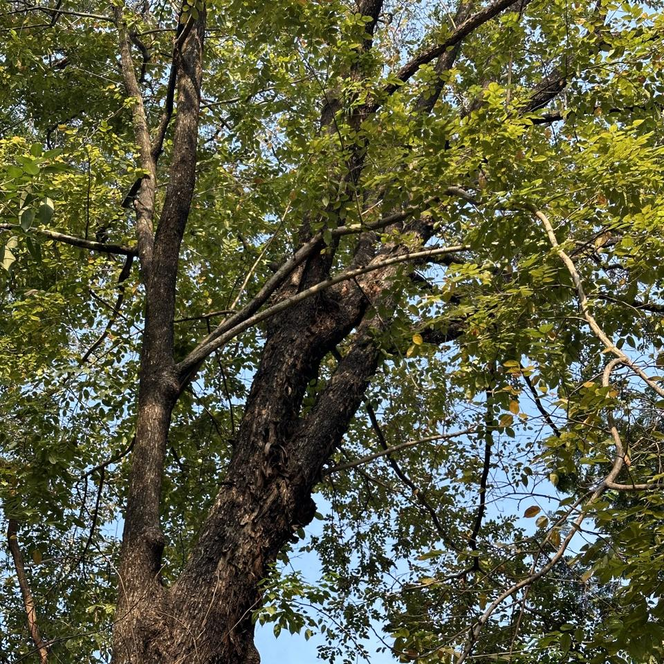

### Photo-2024-03-20-07-43-45

* 7.6% *Terminalia catappa*
* 6.6% *Holarrhena pubescens*
* 3.4% *Ficus religiosa*
* 2.6% *Erythrina crista-galli*
* 2.4% *Lagerstroemia speciosa*
* 1.8% *Syzygium cumini*
* 1.5% *Ficus virens*
* 1.4% *Erythrina poeppigiana*
* 1.1% *Nephelium lappaceum*
* 1.1% *Neolamarckia cadamba*
* 1.0% *Psidium cattleyanum*
* 1.0% *Eucalyptus robusta*
* 1.0% *Syzygium aqueum*
* 0.9% *Bombax ceiba*
* 0.8% *Eugenia uniflora*
* 0.8% *Gluta usitata*
* 0.6% *Syzygium malaccense*
* 0.6% *Anacardium occidentale*
* 0.5% *Terminalia arjuna*
* 0.4% *Diospyros melanoxylon*
* 0.4% *Syzygium samarangense*
* 0.4% *Ficus benghalensis*
* 0.4% *Euphorbia pulcherrima*
* 0.3% *Erythrina fusca*
* 0.3% *Hymenaea courbaril*
* 0.3% *Toxicodendron succedaneum*
* 0.3% *Artocarpus lacucha*
* 0.2% *Syzygium cymosum*
* 0.2% *Citharexylum spinosum*
* 0.1% *Erythrina variegata*
* 0.1% *Tectona grandis*
* 0.1% *Careya arborea*
* 0.1% *Bridelia tomentosa*
* 0.1% *Spondias mombin*
* 0.1% *Miconia calvescens*
* 0.1% *Couroupita guianensis*
* 0.1% *Passiflora ligularis*
* 0.1% *Psidium guajava*

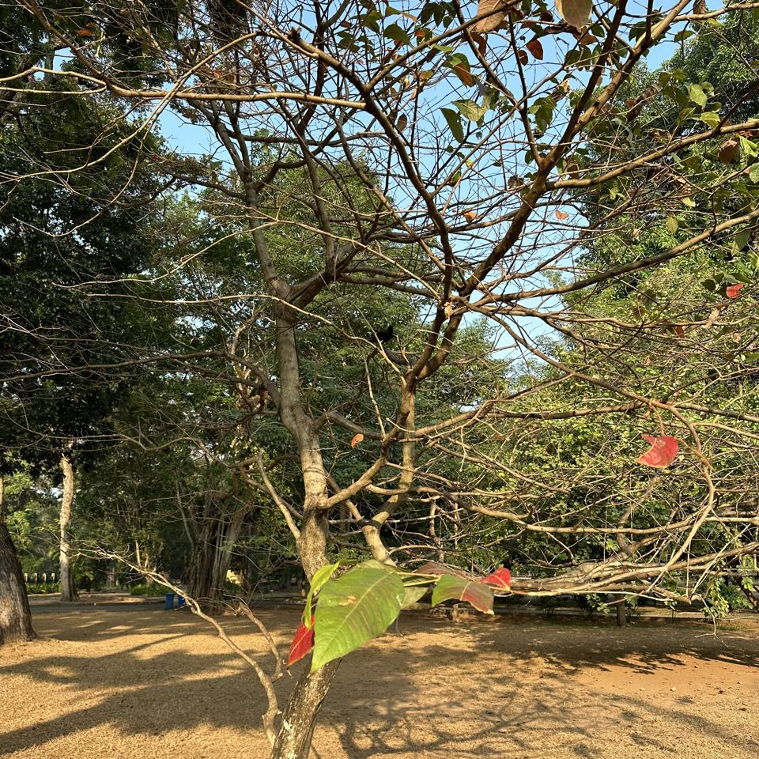

### Photo-2024-03-17-08-07-27

* 1.8% *Schizolobium parahyba*
* 0.3% *Cocos nucifera*
* 0.1% *Elaeis guineensis*

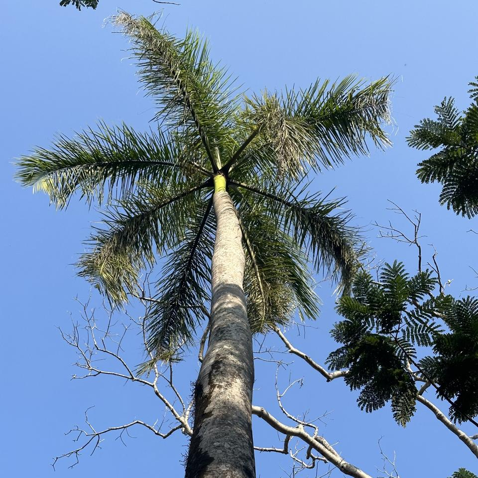

### Photo-2024-03-21-07-39-43

* 4.5% *Acacia confusa*
* 1.3% *Melaleuca viminalis*
* 0.8% *Salix viminalis*
* 0.4% *Salix alba*
* 0.4% *Olea europaea*
* 0.3% *Acacia melanoxylon*
* 0.2% *Acacia longifolia*
* 0.2% *Salix rosmarinifolia*
* 0.2% *Podocarpus neriifolius*
* 0.2% *Acacia auriculiformis*
* 0.1% *Hydrocotyle sibthorpioides*
* 0.1% *Syzygium jambos*

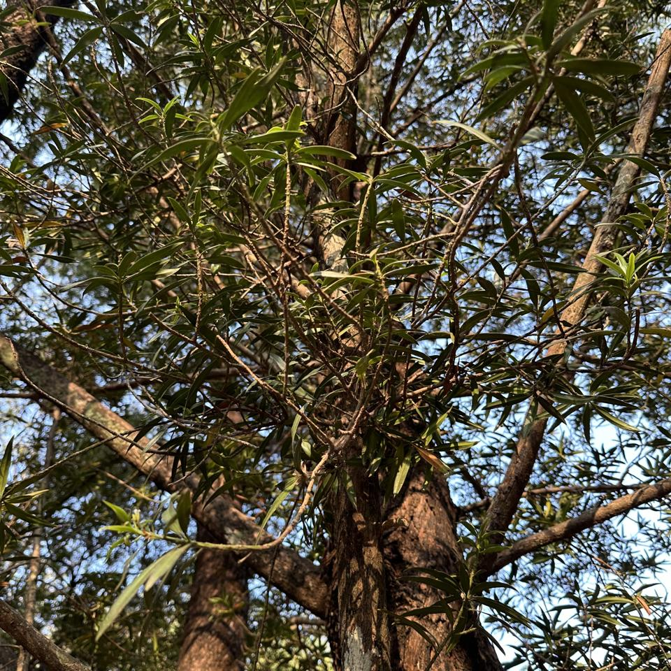

### Photo-2024-03-15-07-41-20

* 5.6% *Ficus virens*
* 3.4% *Ficus altissima*
* 3.2% *Castilla elastica*
* 2.0% *Anacardium occidentale*
* 1.6% *Sterculia foetida*
* 1.1% *Neolamarckia cadamba*
* 1.1% *Juglans regia*
* 1.1% *Ficus lacor*
* 0.6% *Ficus callosa*
* 0.5% *Artocarpus lacucha*
* 0.5% *Holarrhena pubescens*
* 0.4% *Ficus benghalensis*
* 0.3% *Madhuca longifolia*
* 0.3% *Ficus religiosa*
* 0.3% *Mangifera indica*
* 0.3% *Milicia excelsa*
* 0.2% *Terminalia catappa*
* 0.2% *Hevea brasiliensis*
* 0.2% *Alstonia macrophylla*
* 0.2% *Couroupita guianensis*
* 0.1% *Vangueria madagascariensis*
* 0.1% *Plumeria alba*
* 0.1% *Hymenaea courbaril*
* 0.1% *Cedrela odorata*

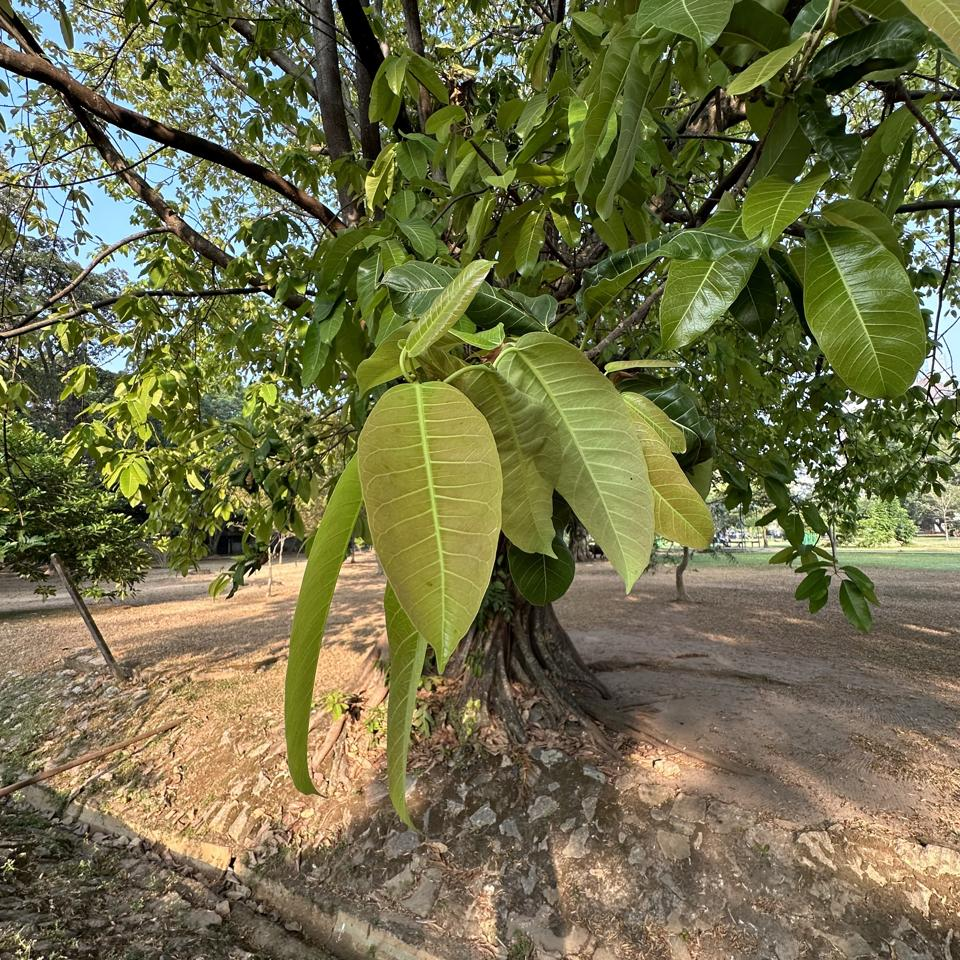

### Photo-2024-03-17-08-32-22

* 3.0% *Acacia acinacea*
* 0.9% *Lonicera ligustrina*
* 0.7% *Ehretia microphylla*
* 0.2% *Crescentia cujete*
* 0.2% *Pyracantha crenulata*
* 0.2% *Ipomoea obscura*
* 0.2% *Phyllanthus emblica*
* 0.2% *Myrsine africana*
* 0.2% *Buxus sempervirens*
* 0.2% *Nephrolepis cordifolia*
* 0.1% *Parkinsonia aculeata*
* 0.1% *Dalbergia melanoxylon*
* 0.1% *Malpighia coccigera*

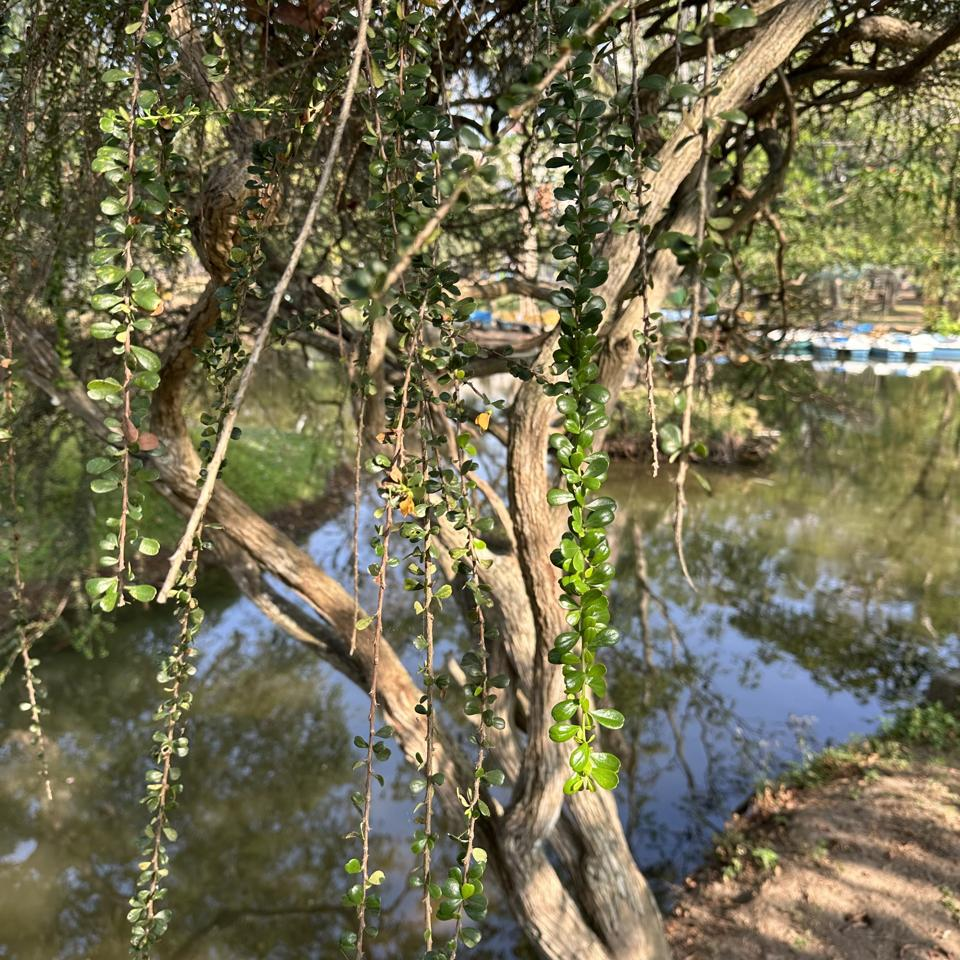

### Photo-2024-03-17-08-13-27

* 3.9% *Cocos nucifera*
* 2.0% *Schizolobium parahyba*
* 1.4% *Elaeocarpus angustifolius*
* 0.6% *Ceiba pentandra*
* 0.2% *Zapoteca portoricensis*
* 0.2% *Couroupita guianensis*
* 0.2% *Caryota obtusa*
* 0.1% *Limnophila rugosa*
* 0.1% *Grevillea robusta*
* 0.1% *Cassia grandis*
* 0.1% *Peltophorum dubium*
* 0.1% *Myriophyllum spicatum*

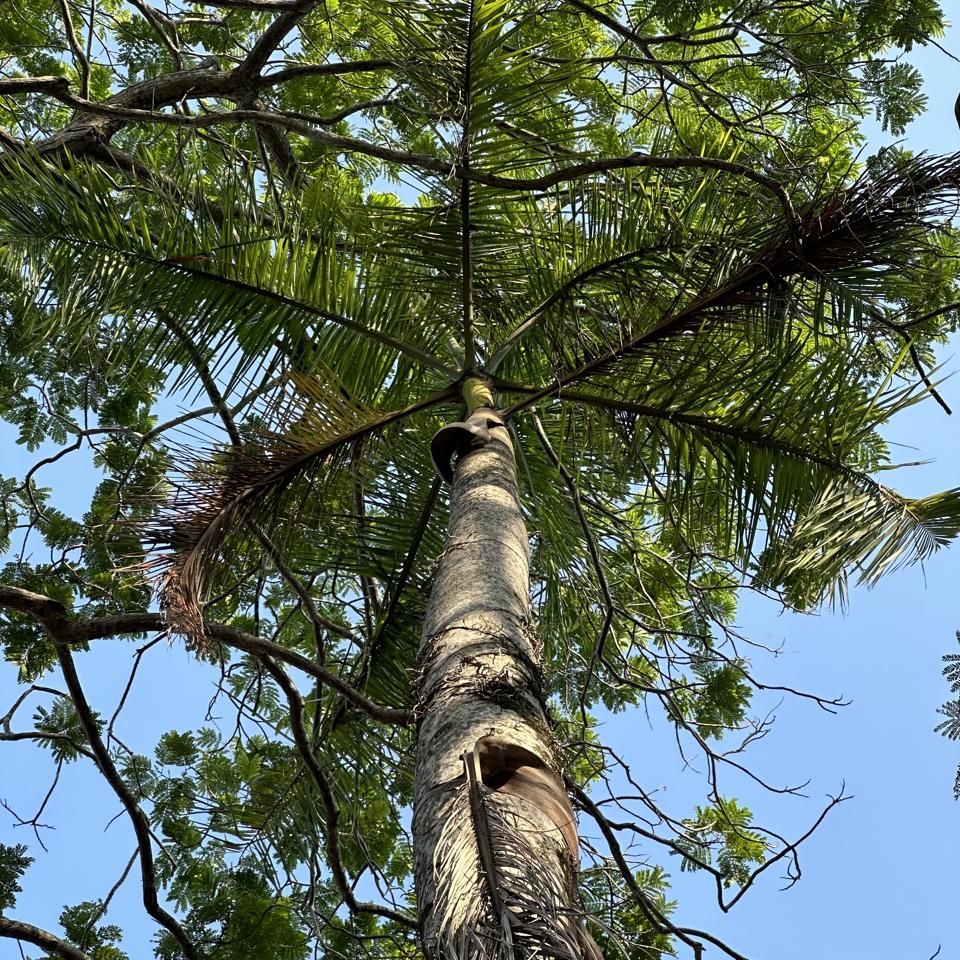

### Photo-2024-03-26-07-40-37

* 8.0% *Dalbergia latifolia*
* 5.3% *Ficus religiosa*
* 1.8% *Dalbergia sissoo*
* 1.7% *Cassia fistula*
* 1.3% *Bischofia javanica*
* 0.9% *Moringa oleifera*
* 0.7% *Cinnamomum camphora*
* 0.5% *Pterocarpus indicus*
* 0.5% *Millingtonia hortensis*
* 0.5% *Firmiana colorata*
* 0.3% *Erythrina rubrinervia*
* 0.3% *Shorea robusta*
* 0.3% *Triadica sebifera*
* 0.3% *Radermachera sinica*
* 0.3% *Oroxylum indicum*
* 0.2% *Cordia dichotoma*
* 0.2% *Brachychiton populneus*
* 0.2% *Swietenia mahagoni*
* 0.2% *Dactylicapnos scandens*
* 0.2% *Erythrophleum suaveolens*
* 0.2% *Mayodendron igneum*
* 0.2% *Erythrina poeppigiana*
* 0.2% *Populus tremula*
* 0.1% *Thespesia populnea*
* 0.1% *Firmiana simplex*
* 0.1% *Pterocarpus santalinus*
* 0.1% *Intsia bijuga*
* 0.1% *Broussonetia papyrifera*
* 0.1% *Hymenaea courbaril*

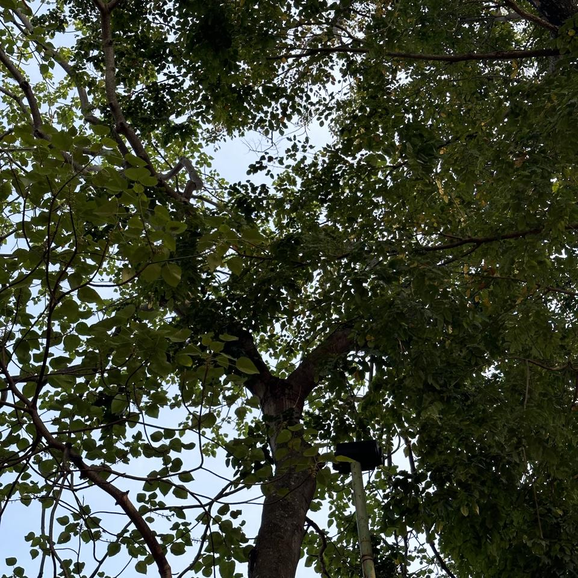

### Photo-2024-03-22-08-04-41

* 7.0% *Saurauia napaulensis*
* 2.3% *Syzygium jambos*
* 1.0% *Plumeria rubra*
* 0.8% *Manilkara zapota*
* 0.7% *Madhuca longifolia*
* 0.6% *Durio zibethinus*
* 0.5% *Anisoptera scaphula*
* 0.4% *Dillenia indica*
* 0.4% *Mangifera indica*
* 0.4% *Syzygium cumini*
* 0.3% *Syzygium aqueum*
* 0.2% *Cerbera manghas*
* 0.2% *Plumeria alba*
* 0.2% *Dipterocarpus alatus*
* 0.1% *Syzygium cymosum*
* 0.1% *Rhaphiolepis bibas*
* 0.1% *Tabernaemontana alternifolia*
* 0.1% *Terminalia arjuna*
* 0.1% *Dicranopteris linearis*

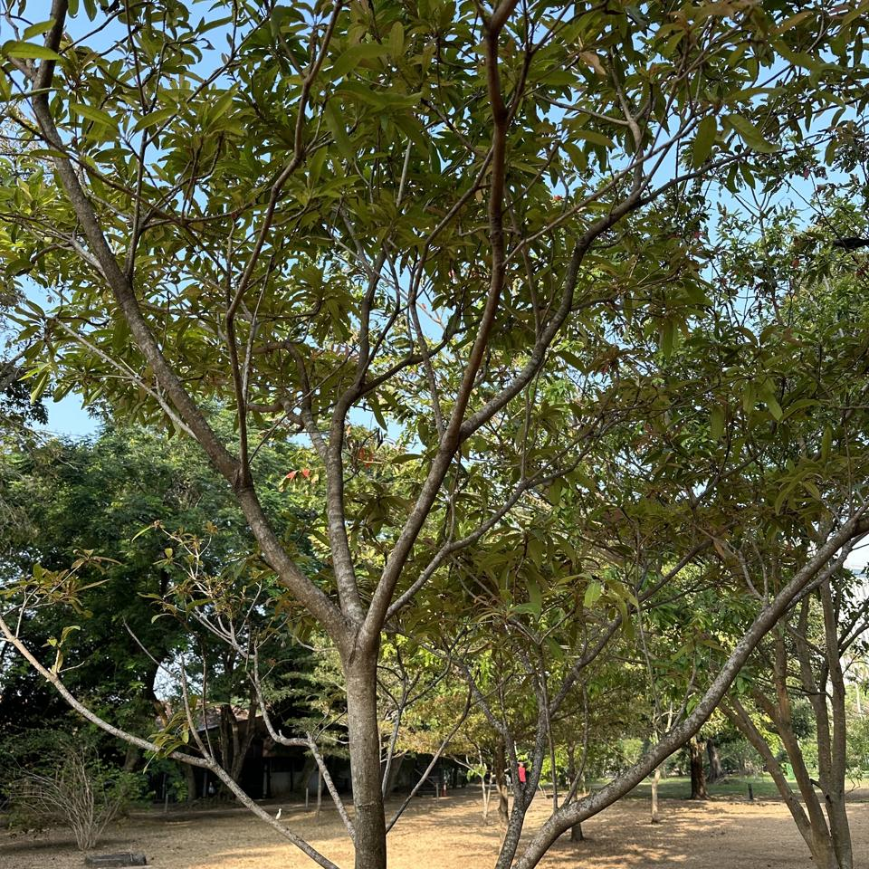

### Photo-2024-03-20-08-03-35

* 3.9% *Terminalia arjuna*
* 1.8% *Albizia procera*
* 1.0% *Tectona grandis*
* 0.9% *Erythrina poeppigiana*
* 0.5% *Terminalia bellirica*
* 0.5% *Lagerstroemia parviflora*
* 0.5% *Lagerstroemia speciosa*
* 0.5% *Spathodea campanulata*
* 0.4% *Litsea monopetala*
* 0.4% *Erythrina rubrinervia*
* 0.4% *Eucalyptus robusta*
* 0.3% *Toxicodendron succedaneum*
* 0.3% *Ficus virens*
* 0.3% *Harpullia cupanioides*
* 0.3% *Erythrina variegata*
* 0.3% *Strychnos nux-vomica*
* 0.3% *Adina cordifolia*
* 0.3% *Citharexylum spinosum*
* 0.2% *Decaisnea fargesii*
* 0.2% *Schleichera oleosa*
* 0.2% *Terminalia catappa*
* 0.2% *Erythrina fusca*
* 0.2% *Oligomeris linifolia*
* 0.2% *Pterygota alata*
* 0.2% *Ficus racemosa*
* 0.2% *Psidium guajava*
* 0.1% *Psidium guineense*
* 0.1% *Tecomella undulata*
* 0.1% *Kleinhovia hospita*
* 0.1% *Toona ciliata*
* 0.1% *Schismus barbatus*
* 0.1% *Eugenia uniflora*
* 0.1% *Strychnos potatorum*
* 0.1% *Cedrela odorata*
* 0.1% *Swietenia macrophylla*
* 0.1% *Juncus gracilicaulis*
* 0.1% *Quercus serrata*
* 0.1% *Hypericum majus*

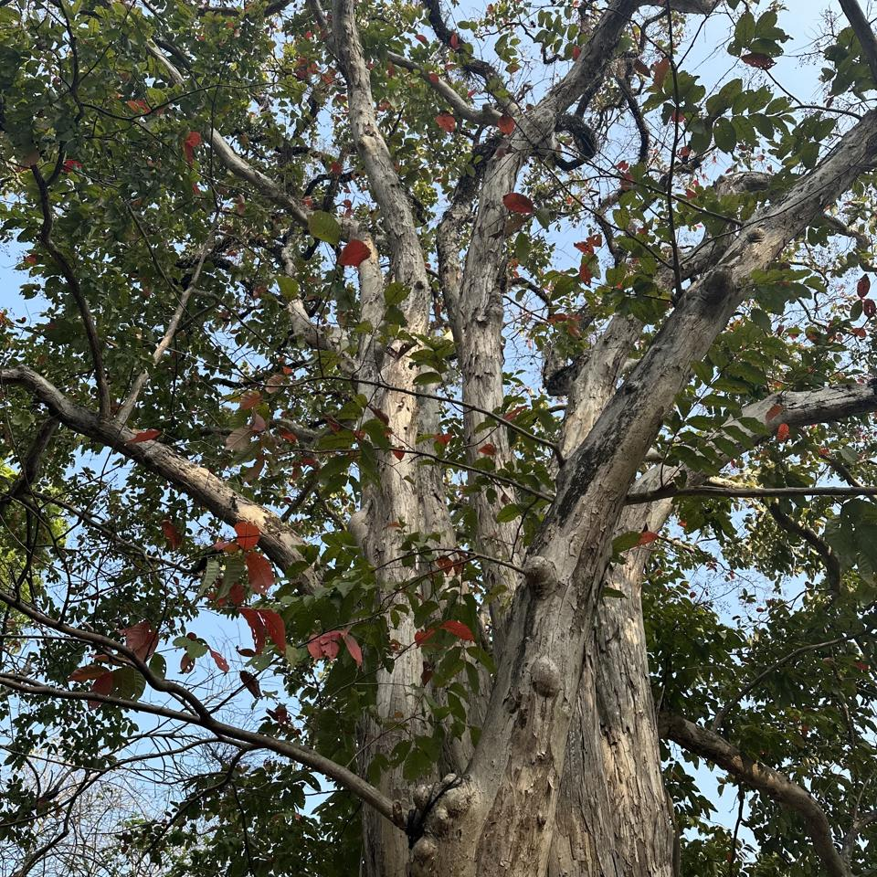

### Photo-2024-03-21-07-40-01

* 5.3% *Podocarpus neriifolius*
* 1.7% *Melaleuca viminalis*
* 0.7% *Cascabela thevetia*
* 0.7% *Madhuca longifolia*
* 0.4% *Olea europaea*
* 0.3% *Hippophae salicifolia*
* 0.1% *Hippophae rhamnoides*

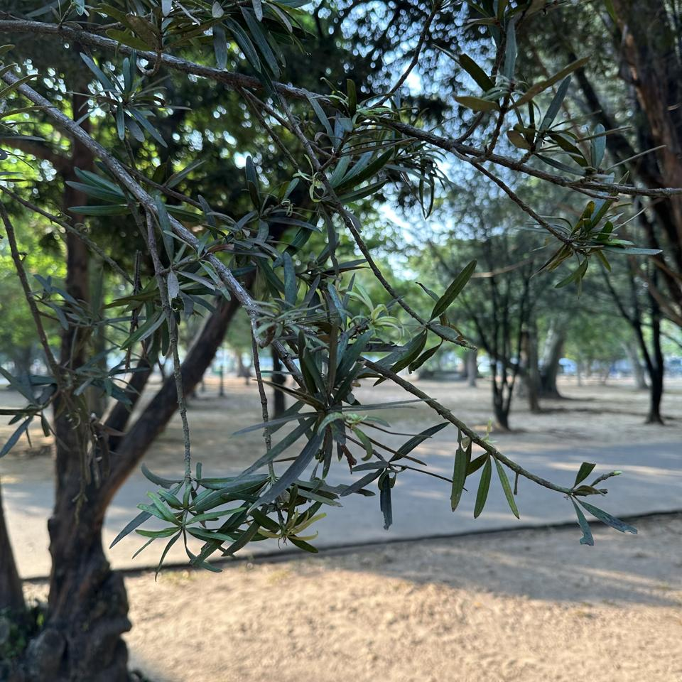

### Photo-2024-03-11-06-47-47

* 5.0% *Dipterocarpus alatus*
* 2.9% *Nyssa sylvatica*
* 2.5% *Byrsonima crassifolia*
* 2.1% *Alphitonia neocaledonica*
* 2.0% *Photinia davidiana*
* 1.9% *Magnolia virginiana*
* 1.4% *Cotoneaster frigidus*
* 1.2% *Cotoneaster salicifolius*
* 1.1% *Aroniaria dippelii*
* 1.0% *Sterculia monosperma*
* 1.0% *Terminalia arjuna*
* 1.0% *Litsea monopetala*
* 0.9% *Cotoneaster watereri*
* 0.8% *Elaeocarpus serratus*
* 0.7% *Ficus virens*
* 0.7% *Sterculia lanceolata*
* 0.7% *Ficus benghalensis*
* 0.6% *Geissois balansae*
* 0.5% *Fontainea pancheri*
* 0.5% *Ilex cassine*
* 0.5% *Bridelia micrantha*
* 0.5% *Terminalia catappa*
* 0.5% *Magnolia grandiflora*
* 0.5% *Clusia lanceolata*
* 0.5% *Basselinia velutina*
* 0.4% *Sedum magellense*
* 0.4% *Dipterocarpus verrucosus*
* 0.4% *Mimusops elengi*
* 0.4% *Excoecaria agallocha*
* 0.4% *Anisoptera scaphula*
* 0.4% *Garcinia indica*
* 0.4% *Hexalobus monopetalus*
* 0.3% *Sterculia parviflora*
* 0.3% *Ilex opaca*
* 0.3% *Ficus callosa*
* 0.3% *Triplaris americana*
* 0.3% *Arbutus menziesii*
* 0.3% *Foetidia comorensis*
* 0.3% *Nemacladus tenuis*
* 0.3% *Norantea guianensis*
* 0.3% *Bridelia tomentosa*
* 0.3% *Alphitonia excelsa*
* 0.3% *Tabernaemontana catharinensis*
* 0.3% *Sterculia foetida*
* 0.2% *Adansonia za*
* 0.2% *Ficus insipida*
* 0.2% *Elaeocarpus grandiflorus*
* 0.2% *Aesculus bushii*
* 0.2% *Frangula californica*
* 0.2% *Dipterocarpus retusus*
* 0.2% *Kopsia flavida*
* 0.2% *Embothrium coccineum*
* 0.2% *Punica granatum*
* 0.2% *Mosla scabra*
* 0.2% *Woodfordia fruticosa*
* 0.2% *Ficus elastica*
* 0.2% *Elaeocarpus angustifolius*
* 0.2% *Clarisia racemosa*
* 0.2% *Camellia fraterna*
* 0.2% *Rhaphiolepis deflexa*
* 0.2% *Bombax buonopozense*
* 0.2% *Dipterocarpus sublamellatus*
* 0.2% *Eugenia punicifolia*
* 0.2% *Polyalthia stenopetala*
* 0.2% *Eugenia speciosa*
* 0.2% *Sideroxylon foetidissimum*
* 0.2% *Syzygium cumini*
* 0.2% *Erythrina crista-galli*
* 0.2% *Melocactus deinacanthus*
* 0.2% *Sterculia quadrifida*
* 0.2% *Fagus grandifolia*
* 0.1% *Erythrina poeppigiana*
* 0.1% *Crataegus germanica*
* 0.1% *Erythroxylum campinense*
* 0.1% *Tabernaemontana macrocarpa*
* 0.1% *Diospyros melanoxylon*
* 0.1% *Erythrina senegalensis*
* 0.1% *Pachystachys coccinea*
* 0.1% *Artocarpus lacucha*
* 0.1% *Moronobea coccinea*
* 0.1% *Helianthus heterophyllus*
* 0.1% *Tecomella undulata*
* 0.1% *Croton urucurana*
* 0.1% *Tillandsia multicaulis*
* 0.1% *Prunus avium*
* 0.1% *Hymenaea courbaril*
* 0.1% *Syzygium malaccense*
* 0.1% *Tabernaemontana hystrix*
* 0.1% *Morisonia indica*
* 0.1% *Citharexylum montevidense*
* 0.1% *Manilkara concolor*
* 0.1% *Ocotea puberula*
* 0.1% *Terminalia australis*
* 0.1% *Fritillaria recurva*
* 0.1% *Vochysia haenkeana*
* 0.1% *Delonix regia*
* 0.1% *Croton insularis*
* 0.1% *Tillandsia oaxacana*
* 0.1% *Nectandra turbacensis*
* 0.1% *Echinocereus grandis*
* 0.1% *Hopea pubescens*
* 0.1% *Hirtella arenosa*
* 0.1% *Terminalia buceras*
* 0.1% *Diospyros fasciculosa*
* 0.1% *Fragaria virginiana*
* 0.1% *Silene virginica*
* 0.1% *Triplaris weigeltiana*

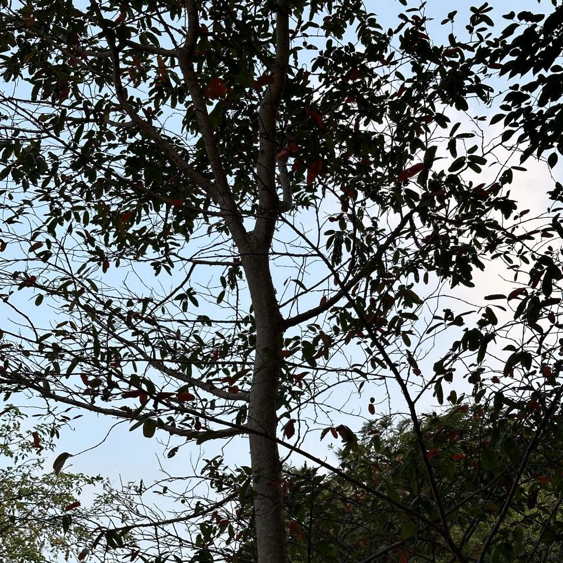

### Photo-2024-03-14-07-57-02

* 0.8% *Acacia longifolia*
* 0.4% *Olea europaea*
* 0.3% *Melaleuca citrina*
* 0.2% *Melaleuca viminalis*
* 0.2% *Acacia melanoxylon*

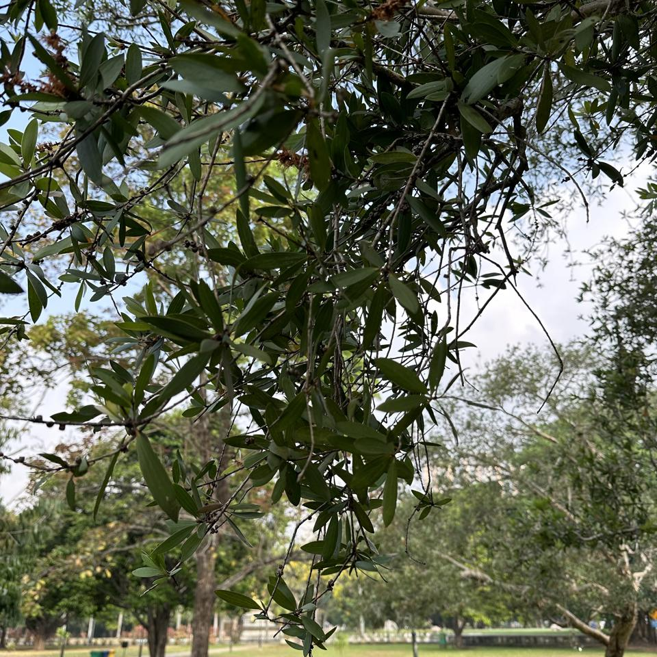

### Photo-2024-03-21-08-17-32

* 9.4% *Holarrhena pubescens*
* 8.5% *Pongamia pinnata*
* 6.0% *Gliricidia sepium*
* 1.2% *Juglans regia*
* 0.9% *Cordia dichotoma*
* 0.7% *Nephelium lappaceum*
* 0.7% *Tecoma stans*
* 0.6% *Broussonetia papyrifera*
* 0.6% *Cassia fistula*
* 0.5% *Aegle marmelos*
* 0.4% *Pterocarpus indicus*
* 0.4% *Sapindus saponaria*
* 0.3% *Jatropha integerrima*
* 0.3% *Annona squamosa*
* 0.3% *Croton tiglium*
* 0.2% *Cordia sebestena*
* 0.2% *Dendrolobium umbellatum*
* 0.2% *Ficus variegata*
* 0.2% *Nyctanthes arbor-tristis*
* 0.2% *Brugmansia candida*
* 0.2% *Tabernaemontana alternifolia*
* 0.2% *Heynea trijuga*
* 0.2% *Neolamarckia cadamba*
* 0.1% *Catalpa bignonioides*
* 0.1% *Cordia subcordata*
* 0.1% *Ficus erecta*
* 0.1% *Guazuma ulmifolia*
* 0.1% *Ficus geniculata*
* 0.1% *Millingtonia hortensis*
* 0.1% *Psidium guajava*

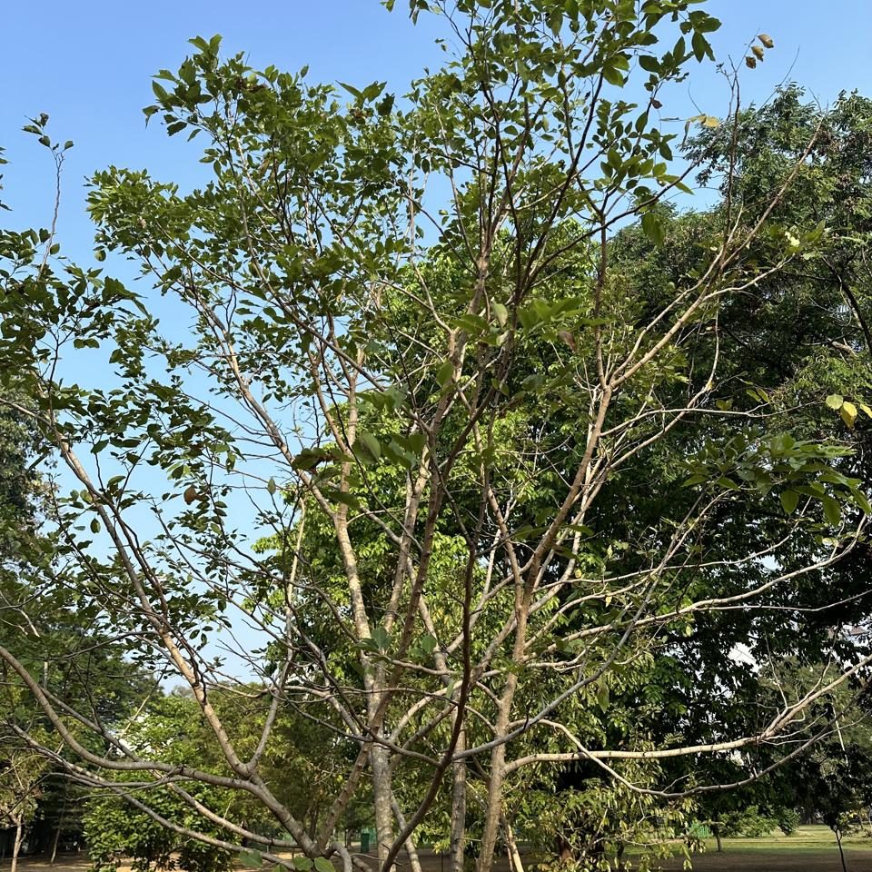

### Photo-2024-03-26-07-49-00

* 8.6% *Vitex altissima*
* 6.3% *Adansonia digitata*
* 5.5% *Vitex pinnata*
* 2.5% *Schleichera oleosa*
* 2.0% *Crescentia cujete*
* 2.0% *Aesculus indica*
* 1.7% *Tecoma stans*
* 1.0% *Aegle marmelos*
* 0.5% *Barringtonia acutangula*
* 0.4% *Swietenia macrophylla*
* 0.3% *Theobroma cacao*
* 0.3% *Cleome spinosa*
* 0.3% *Lagerstroemia speciosa*
* 0.3% *Spondias mombin*
* 0.2% *Couroupita guianensis*
* 0.2% *Ipomoea cairica*
* 0.2% *Swietenia mahagoni*
* 0.2% *Pometia pinnata*
* 0.2% *Sterculia foetida*
* 0.2% *Careya arborea*
* 0.1% *Distimake aegyptius*
* 0.1% *Spathodea campanulata*
* 0.1% *Sandoricum koetjape*

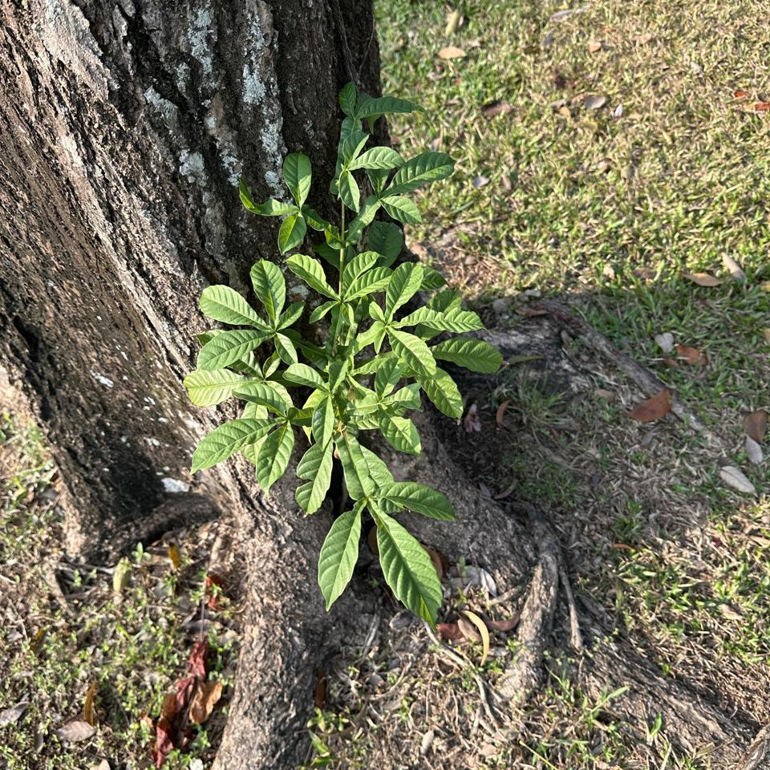

### Photo-2024-03-26-07-41-00

* 9.4% *Ficus altissima*
* 5.2% *Ficus virens*
* 4.2% *Ficus benghalensis*
* 3.0% *Ficus elastica*
* 1.0% *Ficus religiosa*
* 0.6% *Ficus concinna*
* 0.2% *Ficus maclellandii*
* 0.2% *Ficus microcarpa*

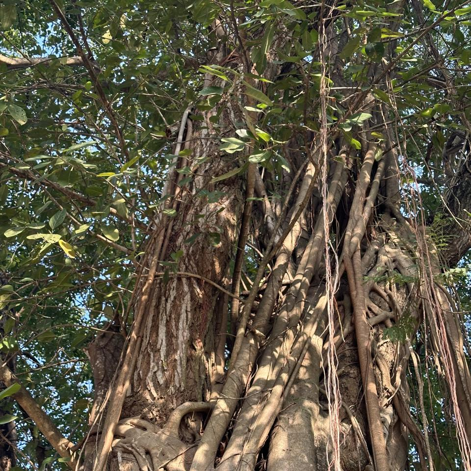

### Photo-2024-03-10-07-55-56

* 4.4% *Terminalia arjuna*
* 2.2% *Polyalthia suberosa*
* 2.1% *Holarrhena pubescens*
* 1.7% *Cassia roxburghii*
* 1.4% *Schotia brachypetala*

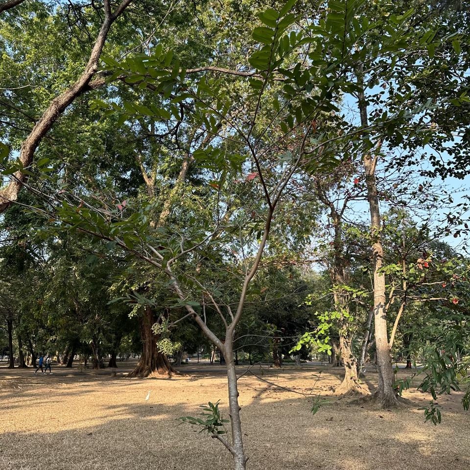

### Photo-2024-03-26-07-58-49

* 8.8% *Spathodea campanulata*
* 6.0% *Decaisnea insignis*
* 2.0% *Spondias purpurea*
* 1.8% *Ailanthus altissima*
* 1.4% *Cedrela odorata*
* 1.0% *Averrhoa carambola*
* 0.9% *Decaisnea fargesii*
* 0.8% *Phyllanthus acidus*
* 0.7% *Averrhoa bilimbi*
* 0.7% *Juglans nigra*
* 0.6% *Lepisanthes rubiginosa*
* 0.6% *Senna spectabilis*
* 0.5% *Swietenia macrophylla*
* 0.4% *Toona ciliata*
* 0.4% *Oroxylum indicum*
* 0.3% *Muntingia calabura*
* 0.3% *Bergera koenigii*
* 0.3% *Tecoma stans*
* 0.3% *Harpullia arborea*
* 0.2% *Guazuma ulmifolia*
* 0.2% *Swietenia mahagoni*
* 0.2% *Holarrhena pubescens*
* 0.2% *Markhamia stipulata*
* 0.2% *Pterocarpus indicus*
* 0.2% *Pistacia chinensis*
* 0.1% *Acer negundo*
* 0.1% *Sapindus saponaria*
* 0.1% *Wisteria sinensis*

