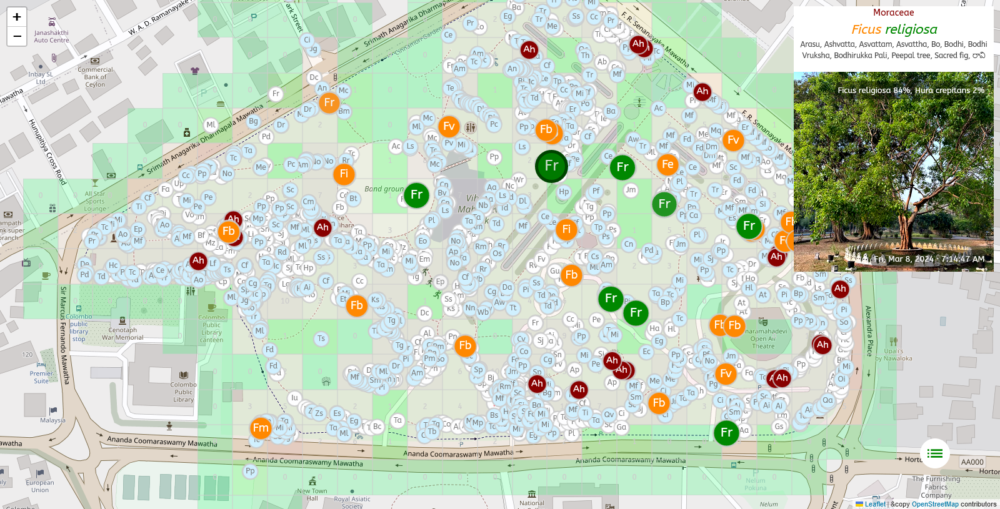
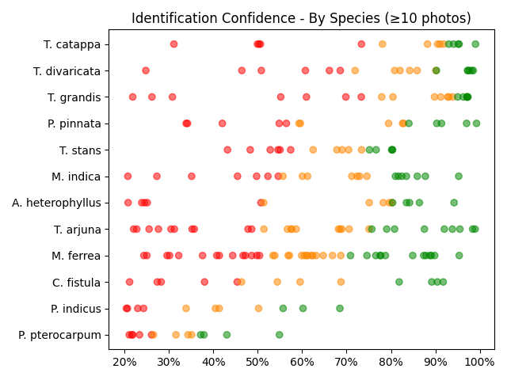

# Plants of Vihaaramahadevi Park :sri_lanka:

*This analysis was automatically generated on  **Mar 21, 2024 (03:39 PM)**, and is based on  **883** plant photos.*

Results can be directly inspected using [this app](https://nuuuwan.github.io/plants)

## Background

Viharamahadevi Park (Sinhala: විහාරමහාදේවී උද්‍යානය; formerly Victoria Park, Sinhala: වික්ටෝරියා පාක්) is a public park located in Cinnamon Gardens, in [Colombo](https://en.wikipedia.org/wiki/Colombo), situated in front of the colonial-era Town Hall in Sri Lanka. It was built by the British colonial administration and is the oldest and largest park of Colombo. The park was originally named "Victoria Park" after Queen Victoria but was renamed after Queen Viharamahadevi, the mother of King Dutugamunu on July 18, 1958. [[Wikipedia](https://en.wikipedia.org/wiki/Viharamahadevi_Park)]

Viharamahadevi Park is 24.27ha, and has an estimated [green cover](https://en.wikipedia.org/wiki/Vegetation) of 14.39ha (59% from the total area). The estimated crown cover 12.25ha (50%). [[Madurapperuma et al](https://www.researchgate.net/publication/282250239_CrownTree_cover_of_Viharamahadevi_Park_Colombo)]

## Summary Statistics

### Families

**78** unique Families.

| # | Families | n(Photos) | % |
| ---: | :--- | ---: | ---: |
| 1 | [*Fabaceae*](https://en.wikipedia.org/wiki/Fabaceae) | 178 | 20.2% |
| 2 | [*Moraceae*](https://en.wikipedia.org/wiki/Moraceae) | 75 | 8.5% |
| 3 | [*Combretaceae*](https://en.wikipedia.org/wiki/Combretaceae) | 60 | 6.8% |
| 4 | [*Calophyllaceae*](https://en.wikipedia.org/wiki/Calophyllaceae) | 51 | 5.8% |
| 5 | [*Bignoniaceae*](https://en.wikipedia.org/wiki/Bignoniaceae) | 44 | 5.0% |
| 6 | [*Apocynaceae*](https://en.wikipedia.org/wiki/Apocynaceae) | 44 | 5.0% |
| 7 | [*Myrtaceae*](https://en.wikipedia.org/wiki/Myrtaceae) | 44 | 5.0% |
| 8 | [*Meliaceae*](https://en.wikipedia.org/wiki/Meliaceae) | 39 | 4.4% |
| 9 | [*Anacardiaceae*](https://en.wikipedia.org/wiki/Anacardiaceae) | 35 | 4.0% |
| 10 | [*Arecaceae*](https://en.wikipedia.org/wiki/Arecaceae) | 31 | 3.5% |
|  | *(All Others)* | 136 | 15.4% |

### Genera

**194** unique Genera.

| # | Genera | n(Photos) | % |
| ---: | :--- | ---: | ---: |
| 1 | [*Ficus*](https://en.wikipedia.org/wiki/Ficus) | 58 | 6.6% |
| 2 | [*Terminalia*](https://en.wikipedia.org/wiki/Terminalia) | 58 | 6.6% |
| 3 | [*Mesua*](https://en.wikipedia.org/wiki/Mesua) | 45 | 5.1% |
| 4 | [*Peltophorum*](https://en.wikipedia.org/wiki/Peltophorum) | 28 | 3.2% |
| 5 | [*Cassia*](https://en.wikipedia.org/wiki/Cassia) | 27 | 3.1% |
| 6 | [*Mangifera*](https://en.wikipedia.org/wiki/Mangifera) | 25 | 2.8% |
| 7 | [*Tectona*](https://en.wikipedia.org/wiki/Tectona) | 20 | 2.3% |
| 8 | [*Pongamia*](https://en.wikipedia.org/wiki/Pongamia) | 18 | 2.0% |
| 9 | [*Syzygium*](https://en.wikipedia.org/wiki/Syzygium) | 17 | 1.9% |
| 10 | [*Pterocarpus*](https://en.wikipedia.org/wiki/Pterocarpus) | 17 | 1.9% |
|  | *(All Others)* | 368 | 41.7% |

### Species

**267** unique Species.

| # | Species | n(Photos) | % |
| ---: | :--- | ---: | ---: |
| 1 | [*Mesua ferrea*](https://en.wikipedia.org/wiki/Mesua_ferrea) | 45 | 5.1% |
| 2 | [*Terminalia arjuna*](https://en.wikipedia.org/wiki/Terminalia_arjuna) | 42 | 4.8% |
| 3 | [*Mangifera indica*](https://en.wikipedia.org/wiki/Mangifera_indica) | 25 | 2.8% |
| 4 | [*Cassia fistula*](https://en.wikipedia.org/wiki/Cassia_fistula) | 21 | 2.4% |
| 5 | [*Peltophorum pterocarpum*](https://en.wikipedia.org/wiki/Peltophorum_pterocarpum) | 21 | 2.4% |
| 6 | [*Tectona grandis*](https://en.wikipedia.org/wiki/Tectona_grandis) | 20 | 2.3% |
| 7 | [*Pongamia pinnata*](https://en.wikipedia.org/wiki/Pongamia_pinnata) | 18 | 2.0% |
| 8 | [*Tecoma stans*](https://en.wikipedia.org/wiki/Tecoma_stans) | 16 | 1.8% |
| 9 | [*Artocarpus heterophyllus*](https://en.wikipedia.org/wiki/Artocarpus_heterophyllus) | 16 | 1.8% |
| 10 | [*Ficus religiosa*](https://en.wikipedia.org/wiki/Ficus_religiosa) | 16 | 1.8% |
|  | *(All Others)* | 514 | 58.2% |

## Identification Confidence

## Pairs of Plant Species, likely confused during identification (at least 3 times)

| Species 1 | Species 2 | n(Photos) |
| :--- | :--- | ---: |
| *Jacaranda mimosifolia* | *Peltophorum pterocarpum* | 7 |
| *Peltophorum dubium* | *Peltophorum pterocarpum* | 5 |
| *Ficus benghalensis* | *Ficus elastica* | 3 |
| *Jacaranda mimosifolia* | *Peltophorum dubium* | 3 |
| *Pterocarpus indicus* | *Tipuana tipu* | 3 |
| *Cassia fistula* | *Pterocarpus indicus* | 3 |
| *Ficus religiosa* | *Ficus virens* | 3 |
