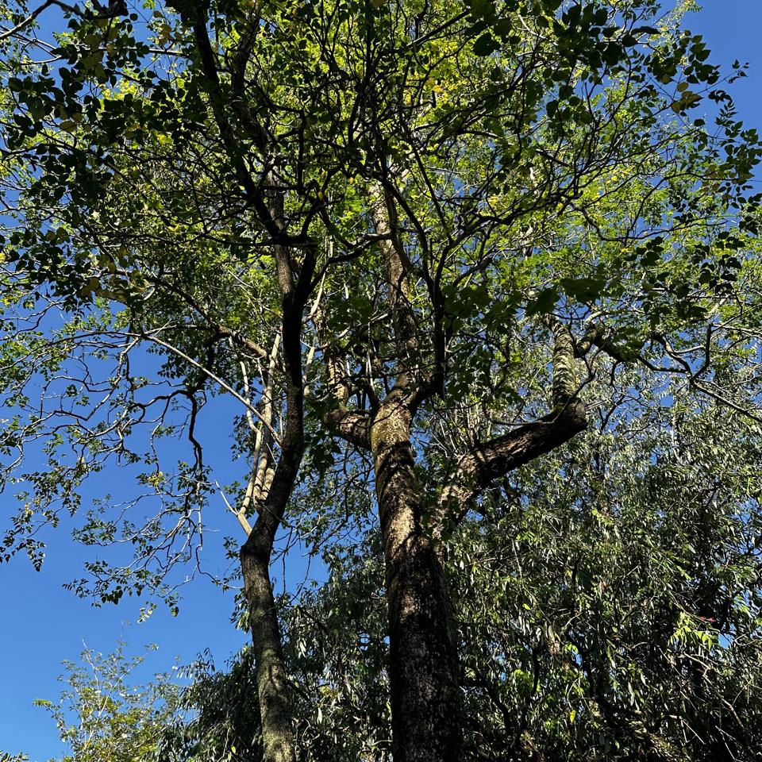
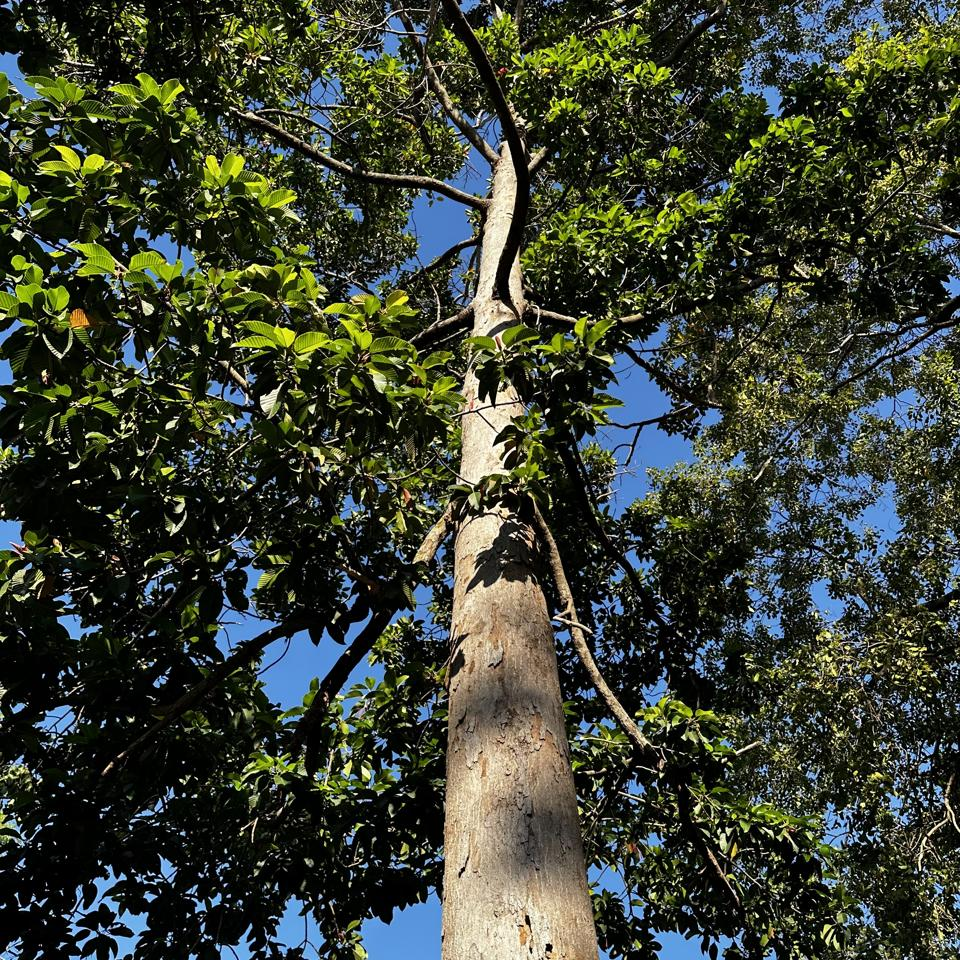

# Plants of Sri Lanka :sri_lanka:

## About

This project aims to use Computer Vision and Artificial Intelligence to identify plants in Sri Lanka's public parks, beginning with Viharamahadevi Park, Colombo.

🤖 *This report was automatically generated on  **May 09, 2024 (07:34 AM)**, and is based on **932** plant photos.*

You can also follow us on our Twitter/X page [@lk_plants](https://twitter.com/lk_plants)

## [PlantNet](https://plantnet.org)

Plant Identifications are from  [PlantNet](https://plantnet.org), a citizen science project for automatic plant identification through photographs and based on machine learning.

*We only consider results where the model's identification confidence is **≥ 20%.***

## The [Plants](https://nuuuwan.github.io/plants) App

Results can be directly inspected using our [Plants](https://nuuuwan.github.io/plants) App.

## Viharamahadevi Park

Viharamahadevi Park (Sinhala: විහාරමහාදේවී උද්‍යානය; formerly Victoria Park, Sinhala: වික්ටෝරියා පාක්) is a public park located in Cinnamon Gardens, in [Colombo](https://en.wikipedia.org/wiki/Colombo), situated in front of the colonial-era Town Hall in Sri Lanka. It was built by the British colonial administration and is the oldest and largest park of Colombo. The park was originally named "Victoria Park" after Queen Victoria but was renamed after Queen Viharamahadevi, the mother of King Dutugamunu on July 18, 1958. [[Wikipedia](https://en.wikipedia.org/wiki/Viharamahadevi_Park)]

Viharamahadevi Park is 24.27ha, and has an estimated [green cover](https://en.wikipedia.org/wiki/Vegetation) of 14.39ha (59% from the total area). The estimated crown cover 12.25ha (50%). [[Madurapperuma et al](https://www.researchgate.net/publication/282250239_CrownTree_cover_of_Viharamahadevi_Park_Colombo)]

## Plant Photo Funnel

Of all the photos taken (**All**),
 we filter photos that are
 within the desired geographical area (**In Geo**)

Next, we filter photos that are likely not 
duplicates (**Deduped**).

Finally, we only consider identifications
 where the model confidence is at least 
20% (**≥ 20%**). 
We list statistics for 5%, 10% and 50% as well.

## Funnel by Day

## Overview of Taxonomies

This sunburst chart shows the distribution of plant photos, by family, genus and species, weighted by number of trees.

## Statistics by Taxonomy

### Species

**224** unique Species(s).

| # | Species | n(Photos) | % | Description |
| ---: | :--- | ---: | ---: | :--- |
| 1 | [*Mesua ferrea*](https://en.wikipedia.org/wiki/Mesua_ferrea) | 66 | 7.1% | **Common Names:** *Ceylon Ironwood, Cirunakappu, Iron Wood Tree, Mesua, Na, Naa, Nagakesarah Nagapuspa, Nangu*. **Mesua ferrea**, the Ceylon ironwood, or cobra saffron, is a species in the family Calophyllaceae native to the Indomalayan realm. This slow-growing tree is named after the heaviness and hardness of its timber. It is widely cultivated as an ornamental for its graceful shape, grayish-green foliage with a beautiful pink to red flush of drooping young leaves, and large, fragrant white flowers. It... |
| 2 | [*Terminalia arjuna*](https://en.wikipedia.org/wiki/Terminalia_arjuna) | 50 | 5.4% | **Common Names:** *Arjun, Kakubha, Kumbuk, Maruthu, Marutu, White murdh*. **Terminalia arjuna** is a tree of the genus Terminalia. It is commonly known as arjuna or arjun tree in English. |
| 3 | [*Mangifera indica*](https://en.wikipedia.org/wiki/Mangifera_indica) | 38 | 4.1% | **Common Names:** *Amba, Amiram, Amra, Ma, Mamaram, Mangai, Mango, Mango Tree, Mee Amba, Sahakara, आम*. **Mangifera indica**, commonly known as mango, is a species of flowering plant in the family Anacardiaceae. It is a large fruit tree, capable of growing to a height of 30 metres (100 feet). There are two distinct genetic populations in modern mangoes – the "Indian type" and the "Southeast Asian type". |
| 4 | [*Terminalia catappa*](https://en.wikipedia.org/wiki/Terminalia_catappa) | 29 | 3.1% | **Common Names:** *Country-almond, Indian-almond, Kottamba, Kottan, Nattu Vadam, Nattuvadumai, Tailaphala, Tropical almond*. **Terminalia catappa** is a large tropical tree in the leadwood tree family, Combretaceae, native to Asia, Australia, the Pacific, Madagascar and Seychelles. Common names in English include country almond, Indian almond, Malabar almond, sea almond, tropical almond, beach almond and false kamani. |
| 5 | [*Pongamia pinnata*](https://en.wikipedia.org/wiki/Pongamia_pinnata) | 27 | 2.9% | **Common Names:** *Indian Beech, Karanda, Karanj, Kolliyam, Naktamaala, Pomka, Pongam, Punku*. **Pongamia pinnata** is a species of tree in the pea family, Fabaceae, native to eastern and tropical Asia, Australia, and the Pacific islands. It is the sole species in genus Pongamia. It is often known by the synonym Millettia pinnata. Its common names include Indian beech and Pongame oiltree. |
| 6 | [*Artocarpus heterophyllus*](https://en.wikipedia.org/wiki/Artocarpus_heterophyllus) | 26 | 2.8% | **Common Names:** *Herali, Jackfruit, Kos, Pala, Palavu, Panasam, Pila, Vaela, Waraka See Artocarpus Indica, কাঠাল, పనస*. The jackfruit is the fruit of jack tree **Artocarpus heterophyllus**, a species of tree in the fig, mulberry, and breadfruit family (Moraceae). The jackfruit is the largest tree fruit, reaching as much as 55 kg (120 pounds) in weight, 90 cm (35 inches) in length, and 50 cm (20 inches) in diameter. A mature jackfruit tree produces some 200 fruits per year, with older trees bearing up to 500 frui... |
| 7 | [*Cassia fistula*](https://en.wikipedia.org/wiki/Cassia_fistula) | 22 | 2.4% | **Common Names:** *Aehaela, Amaltas, Aragvadha, Ehela, Golden Shower Tree, Indian-laburnum, Konnai, Konrai, Mullaimaram*. **Cassia fistula**, also known as golden shower, purging cassia, Indian laburnum, Kani Konna (Malayalam: കണിക്കൊന്ന),, Konna Poo or pudding-pipe tree, is a flowering plant in the family Fabaceae. The species is native to the Indian subcontinent and adjacent regions of Southeast Asia. It is the official state flower of Kerala state in India. It is also a popular ornamental plant and is also used... |
| 8 | [*Tectona grandis*](https://en.wikipedia.org/wiki/Tectona_grandis) | 22 | 2.4% | **Common Names:** *Bankok teak, Bardaru, Bhumisah, Dwardaru, Indian-oak, Kharchchada, Kolaphala, Saaka, Sabarasaara, Teak, The Kka Signify Long Sound, Thekku*. Teak (**Tectona grandis**) is a tropical hardwood tree species in the family Lamiaceae. It is a large, deciduous tree that occurs in mixed hardwood forests. **Tectona grandis** has small, fragrant white flowers arranged in dense clusters (panicles) at the end of the branches. These flowers contain both types of reproductive organs (perfect flowers). The large, papery leaves of teak trees are of... |
| 9 | [*Peltophorum pterocarpum*](https://en.wikipedia.org/wiki/Peltophorum_pterocarpum) | 19 | 2.0% | **Common Names:** *Copperpod, Kaha Maara, Kona Maram, Maara, Nilalvakai, Yellow flame, Yellow flametree*. **Peltophorum pterocarpum** (commonly known as copperpod, yellow-flamboyant, yellow flametree, yellow poinciana or yellow-flame) is a species of Peltophorum, native to tropical southeastern Asia and a popular ornamental tree grown around the world. |
| 10 | [*Tecoma stans*](https://en.wikipedia.org/wiki/Tecoma_stans) | 17 | 1.8% | **Common Names:** *Kaelanitissa, Kelantissa, Rankaerali, Swarnaptti, Tankarali, Trumpet-flower, Yellow trumpet flower, Yellow-bells*. **Tecoma stans** is a species of flowering perennial shrub in the trumpet vine family, Bignoniaceae, that is native to the Americas. Common names include yellow trumpetbush, yellow bells, yellow elder, ginger Thomas. **Tecoma stans** is the official flower of the United States Virgin Islands and the floral emblem of The Bahamas. |
|  | *(All Others)* | 428 | 45.9% |  |

### Genus

**168** unique Genus(s).

| # | Genus | n(Photos) | % | Description |
| ---: | :--- | ---: | ---: | :--- |
| 1 | [*Terminalia*](https://en.wikipedia.org/wiki/Terminalia) | 83 | 8.9% | See [*Terminalia*](https://en.wikipedia.org/wiki/Terminalia) |
| 2 | [*Mesua*](https://en.wikipedia.org/wiki/Mesua) | 66 | 7.1% | **Mesua** is a genus of flowering plants in the family Calophyllaceae, native to tropical southern Asia. Common names include ironwood (shared with many other plants) and rose chestnut. They are evergreen shrubs or small trees growing to 13 m tall, with leaves arranged in opposite pairs. |
| 3 | [*Ficus*](https://en.wikipedia.org/wiki/Ficus) | 45 | 4.8% | **Ficus** is a genus of about 850 species of woody trees, shrubs, vines, epiphytes and hemiepiphytes in the family Moraceae. Collectively known as fig trees or figs, they are native throughout the tropics with a few species extending into the semi-warm temperate zone. The common fig (F. carica) is a temperate species native to southwest Asia and the Mediterranean region (from Afghanistan to Por... |
| 4 | [*Mangifera*](https://en.wikipedia.org/wiki/Mangifera) | 38 | 4.1% | **Mangifera** is a genus of flowering plants in the cashew family, Anacardiaceae. It contains about 69 species, with the best-known being the common mango (**Mangifera** indica). The center of diversity of the genus is in the Malesian ecoregion of Southeast Asia, particularly in Sumatra, Borneo, and the Malay Peninsula. They are generally canopy trees in lowland rainforests, reaching a height o... |
| 5 | [*Artocarpus*](https://en.wikipedia.org/wiki/Artocarpus) | 27 | 2.9% | **Artocarpus** is a genus of approximately 60 trees and shrubs of Southeast Asian and Pacific origin, belonging to the mulberry family, Moraceae. Most species of **Artocarpus** are restricted to Southeast Asia; a few cultivated species are more widely distributed, especially A. altilis (breadfruit) and A. heterophyllus (jackfruit), which are cultivated throughout the tropics. |
| 6 | [*Pongamia*](https://en.wikipedia.org/wiki/Pongamia) | 27 | 2.9% | **Pongamia** pinnata is a species of tree in the pea family, Fabaceae, native to eastern and tropical Asia, Australia, and the Pacific islands. It is the sole species in genus **Pongamia**. It is often known by the synonym Millettia pinnata. Its common names include Indian beech and Pongame oiltree. |
| 7 | [*Cassia*](https://en.wikipedia.org/wiki/Cassia) | 26 | 2.8% | See [*Cassia*](https://en.wikipedia.org/wiki/Cassia) |
| 8 | [*Syzygium*](https://en.wikipedia.org/wiki/Syzygium) | 26 | 2.8% | **Syzygium** is a genus of flowering plants that belongs to the myrtle family, Myrtaceae. The genus comprises about 1200 species, and has a native range that extends from Africa and Madagascar through southern Asia east through the Pacific. Its highest levels of diversity occur from Malaysia to northeastern Australia, where many species are very poorly known and many more have not been describe... |
| 9 | [*Peltophorum*](https://en.wikipedia.org/wiki/Peltophorum) | 22 | 2.4% | **Peltophorum** is a genus of 5–15 species of flowering plants in the family Fabaceae, subfamily Caesalpinioideae. The genus is native to certain tropical regions across the world, including northern South America, central and southern Africa, Indochina, southeastern China, Malesia, New Guinea, and northern Australia. The species are medium-sized to large trees growing up to 15–25 m tall, rarel... |
| 10 | [*Tectona*](https://en.wikipedia.org/wiki/Tectona) | 22 | 2.4% | **Tectona** is a genus of tropical hardwood trees in the mint family, Lamiaceae. The three species are often collectively called teak. |
|  | *(All Others)* | 316 | 33.9% |  |

### Family

**67** unique Family(s).

| # | Family | n(Photos) | % | Description |
| ---: | :--- | ---: | ---: | :--- |
| 1 | [*Fabaceae*](https://en.wikipedia.org/wiki/Fabaceae) | 163 | 17.5% | The **Fabaceae** or Leguminosae, commonly known as the legume, pea, or bean family, are a large and agriculturally important family of flowering plants. It includes trees, shrubs, and perennial or annual herbaceous plants, which are easily recognized by their fruit (legume) and their compound, stipulate leaves. The family is widely distributed, and is the third-largest land plant family in numb... |
| 2 | [*Combretaceae*](https://en.wikipedia.org/wiki/Combretaceae) | 89 | 9.5% | The **Combretaceae**, often called the white mangrove family, are a family of flowering plants in the order Myrtales. The family includes about 530 species of trees, shrubs, and lianas in ca 10 genera. The family includes the leadwood tree, Combretum imberbe. Three genera, Conocarpus, Laguncularia, and Lumnitzera, grow in mangrove habitats (mangals). The **Combretaceae** are widespread in the s... |
| 3 | [*Moraceae*](https://en.wikipedia.org/wiki/Moraceae) | 72 | 7.7% | The **Moraceae**—often called the mulberry family or fig family—are a family of flowering plants comprising about 38 genera and over 1100 species. Most are widespread in tropical and subtropical regions, less so in temperate climates; however, their distribution is cosmopolitan overall. The only synapomorphy within the **Moraceae** is presence of laticifers and milky sap in all parenchymatous t... |
| 4 | [*Calophyllaceae*](https://en.wikipedia.org/wiki/Calophyllaceae) | 71 | 7.6% | **Calophyllaceae** is a family of flowering plants in the order Malpighiales and is recognized by the APG III system of classification. Most of the 14 genera and 475 species included in this family were previously recognized in the tribe Calophylleae of the family Clusiaceae. The Angiosperm Phylogeny Group determined that splitting this clade of genera off into their own family was necessary. |
| 5 | [*Anacardiaceae*](https://en.wikipedia.org/wiki/Anacardiaceae) | 50 | 5.4% | The **Anacardiaceae**, commonly known as the cashew family or sumac family, are a family of flowering plants, including about 83 genera with about 860 known species. Members of the **Anacardiaceae** bear fruits that are drupes and in some cases produce urushiol, an irritant. The **Anacardiaceae** include numerous genera, several of which are economically important, notably cashew (in the type g... |
| 6 | [*Bignoniaceae*](https://en.wikipedia.org/wiki/Bignoniaceae) | 48 | 5.2% | **Bignoniaceae** is a family of flowering plants in the order Lamiales commonly known as the bignonias or trumpet vines. It is not known to which of the other families in the order it is most closely related.Nearly all of the **Bignoniaceae** are woody plants, but a few are subwoody, either as vines or subshrubs. A few more are herbaceous plants of high-elevation montane habitats, in three excl... |
| 7 | [*Arecaceae*](https://en.wikipedia.org/wiki/Arecaceae) | 47 | 5.0% | The **Arecaceae** is a family of perennial, flowering plants in the monocot order Arecales. Their growth form can be climbers, shrubs, tree-like and stemless plants, all commonly known as palms. Those having a tree-like form are called palm trees. Currently, 181 genera with around 2,600 species are known, most of which are restricted to tropical and subtropical climates. Most palms are distingu... |
| 8 | [*Myrtaceae*](https://en.wikipedia.org/wiki/Myrtaceae) | 42 | 4.5% | **Myrtaceae** , the myrtle family, is a family of dicotyledonous plants placed within the order Myrtales. Myrtle, pōhutukawa, bay rum tree, clove, guava, acca (feijoa), allspice, and eucalyptus are some notable members of this group. All species are woody, contain essential oils, and have flower parts in multiples of four or five. The leaves are evergreen, alternate to mostly opposite, simple, ... |
| 9 | [*Apocynaceae*](https://en.wikipedia.org/wiki/Apocynaceae) | 41 | 4.4% | **Apocynaceae** (, from Apocynum, Greek for "dog-away") is a family of flowering plants that includes trees, shrubs, herbs, stem succulents, and vines, commonly known as the dogbane family, because some taxa were used as dog poison. Members of the family are native to the European, Asian, African, Australian, and American tropics or subtropics, with some temperate members. The former family Asc... |
| 10 | [*Lamiaceae*](https://en.wikipedia.org/wiki/Lamiaceae) | 23 | 2.5% | The **Lamiaceae** ( LAY-mee-AY-see-ee, -⁠eye) or Labiatae are a family of flowering plants commonly known as the mint, deadnettle or sage family. Many of the plants are aromatic in all parts and include widely used culinary herbs like basil, mint, rosemary, sage, savory, marjoram, oregano, hyssop, thyme, lavender, and perilla, as well as other medicinal herbs such as catnip, salvia, bee balm, w... |
|  | *(All Others)* | 114 | 12.2% |  |

### Order

**32** unique Order(s).

| # | Order | n(Photos) | % | Description |
| ---: | :--- | ---: | ---: | :--- |
| 1 | [*Fabales*](https://en.wikipedia.org/wiki/Fabales) | 163 | 17.5% | **Fabales** is an order of flowering plants included in the rosid group of the eudicots in the Angiosperm Phylogeny Group II classification system. In the APG II circumscription, this order includes the families Fabaceae or legumes (including the subfamilies Caesalpinioideae, Mimosoideae, and Faboideae), Quillajaceae, Polygalaceae or milkworts (including the families Diclidantheraceae, Moutabea... |
| 2 | [*Myrtales*](https://en.wikipedia.org/wiki/Myrtales) | 146 | 15.7% | The **Myrtales** are an order of flowering plants placed as a sister to the eurosids II clade as of the publishing of the Eucalyptus grandis genome in June 2014.The APG III system of classification for angiosperms still places it within the eurosids. This finding is corroborated by the placement of the **Myrtales** in the Malvid clade by the One Thousand Plant Transcriptomes Initiative. The fol... |
| 3 | [*Sapindales*](https://en.wikipedia.org/wiki/Sapindales) | 98 | 10.5% | **Sapindales** is an order of flowering plants. Well-known members of **Sapindales** include citrus; maples, horse-chestnuts, lychees and rambutans; mangos and cashews; frankincense and myrrh; mahogany and neem. The APG III system of 2009 includes it in the clade malvids (in rosids, in eudicots) with the following nine families: Anacardiaceae Biebersteiniaceae Burseraceae Kirkiaceae Meliaceae N... |
| 4 | [*Malpighiales*](https://en.wikipedia.org/wiki/Malpighiales) | 92 | 9.9% | The **Malpighiales** comprise one of the largest orders of flowering plants, containing about 36 families and more than 16,000 species, about 7.8% of the eudicots. The order is very diverse, containing plants as different as the willow, violet, poinsettia, manchineel, rafflesia and coca plant, and are hard to recognize except with molecular phylogenetic evidence. It is not part of any of the cl... |
| 5 | [*Lamiales*](https://en.wikipedia.org/wiki/Lamiales) | 83 | 8.9% | The order **Lamiales** (also known as the mint order) are an order in the asterid group of dicotyledonous flowering plants. It includes about 23,810 species, 1,059 genera, and is divided into about 25 families. These families include Acanthaceae, Bignoniaceae, Byblidaceae, Calceolariaceae, Carlemanniaceae, Gesneriaceae, Lamiaceae, Lentibulariaceae, Linderniaceae, Martyniaceae, Mazaceae, Oleacea... |
| 6 | [*Rosales*](https://en.wikipedia.org/wiki/Rosales) | 77 | 8.3% | **Rosales** is an order of flowering plants. It is sister to a clade consisting of Fagales and Cucurbitales. It contains about 7,700 species, distributed into about 260 genera. **Rosales** comprise nine families, the type family being the rose family, Rosaceae. The largest of these families are Rosaceae (90/2500) and Urticaceae (54/2600). The order **Rosales** is divided into three clades that ... |
| 7 | [*Gentianales*](https://en.wikipedia.org/wiki/Gentianales) | 57 | 6.1% | **Gentianales** is an order of flowering plant, included within the asterid clade of eudicots. It comprises more than 20,000 species in about 1,200 genera in 5 families. More than 80% of the species in this order belong to the family Rubiaceae. Many of these flowering plants are used in traditional medicine. They have been used to treat pain, anxiety, cancers and neurological conditions. |
| 8 | [*Arecales*](https://en.wikipedia.org/wiki/Arecales) | 47 | 5.0% | **Arecales** is an order of flowering plants. The order has been widely recognised only for the past few decades; until then, the accepted name for the order including these plants was Principes. |
| 9 | [*Fagales*](https://en.wikipedia.org/wiki/Fagales) | 32 | 3.4% | The **Fagales** are an order of flowering plants, including some of the best-known trees. The order name is derived from genus Fagus, beeches. They belong among the rosid group of dicotyledons. The families and genera currently included are as follows: Betulaceae – birch family (Alnus, Betula, Carpinus, Corylus, Ostrya, and Ostryopsis) Casuarinaceae – she-oak family (Allocasuarina, Casuarina, C... |
| 10 | [*Ericales*](https://en.wikipedia.org/wiki/Ericales) | 31 | 3.3% | The **Ericales** are a large and diverse order of dicotyledons. Species in this order have considerable commercial importance including for tea, persimmon, blueberry, kiwifruit, Brazil nuts, argan, and azalea. The order includes trees, bushes, lianas, and herbaceous plants. Together with ordinary autophytic plants, the **Ericales** include chlorophyll-deficient mycoheterotrophic plants (e.g., S... |
|  | *(All Others)* | 44 | 4.7% |  |

### Classis

**6** unique Classis(s).

| # | Classis | n(Photos) | % | Description |
| ---: | :--- | ---: | ---: | :--- |
| 1 | [*Magnoliopsida*](https://en.wikipedia.org/wiki/Magnoliopsida) | 838 | 89.9% | **Magnoliopsida** is a valid botanical name for a class of flowering plants. By definition the class will include the family Magnoliaceae, but its circumscription can otherwise vary, being more inclusive or less inclusive depending upon the classification system being discussed. |
| 2 | [*Liliopsida*](https://en.wikipedia.org/wiki/Liliopsida) | 73 | 7.8% | **Liliopsida** Batsch (synonym: Liliatae) is a botanical name for the class containing the family Liliaceae (or Lily Family). It is considered synonymous (or nearly synonymous) with the name monocotyledon. Publication of the name is credited to Scopoli (in 1760): see author citation (botany). This name is formed by replacing the termination -aceae in the name Liliaceae by the termination -opsid... |
| 3 | [*Polypodiopsida*](https://en.wikipedia.org/wiki/Polypodiopsida) | 14 | 1.5% | The ferns (**Polypodiopsida** or Polypodiophyta) are a group of vascular plants (plants with xylem and phloem) that reproduce via spores and have neither seeds nor flowers. They differ from mosses by being vascular, i.e., having specialized tissues that conduct water and nutrients and in having life cycles in which the branched sporophyte is the dominant phase. Ferns have complex leaves called ... |
| 4 | [*Pinopsida*](https://en.wikipedia.org/wiki/Pinopsida) | 5 | 0.5% | Conifers are a group of cone-bearing seed plants, a subset of gymnosperms. Scientifically, they make up the division Pinophyta , also known as Coniferophyta or Coniferae. The division contains a single extant class, **Pinopsida**. All extant conifers are perennial woody plants with secondary growth. The great majority are trees, though a few are shrubs. Examples include cedars, Douglas-firs, cy... |
| 5 | *Unknown-Classis* | 1 | 0.1% |  |
| 6 | [*Cycadopsida*](https://en.wikipedia.org/wiki/Cycadopsida) | 1 | 0.1% | Cycads are seed plants that typically have a stout and woody (ligneous) trunk with a crown of large, hard, stiff, evergreen and (usually) pinnate leaves. The species are dioecious, that is, individual plants of a species are either male or female. Cycads vary in size from having trunks only a few centimeters to several meters tall. They typically grow very slowly and live very long. Because of ... |
| 7 | *(All Others)* | 0 | 0.0% |  |

### Phylum

**2** unique Phylum(s).

| # | Phylum | n(Photos) | % | Description |
| ---: | :--- | ---: | ---: | :--- |
| 1 | [*Tracheophyta*](https://en.wikipedia.org/wiki/Tracheophyta) | 931 | 99.9% | Vascular plants (from Latin vasculum 'duct'), also called tracheophytes or collectively tracheophyta (; from Ancient Greek τραχεῖα ἀρτηρία (trakheîa artēría) 'windpipe', and φυτά (phutá) 'plants'), form a large group of land plants (c. 300,000 accepted known species) that have lignified tissues (the xylem) for conducting water and minerals throughout the plant. They also have a specialized non-... |
| 2 | *Unknown-Phylum* | 1 | 0.1% |  |
| 3 | *(All Others)* | 0 | 0.0% |  |

## Identification Confidence

### Time Of Day

### Date

### Camera Direction

### Species

### Family

### Latlng

## Sample of Recent Plant Photos difficult to Identify

Photos where the identification confidence is **< 20%**.

### Photo-2024-04-05-07-45-12

* 6.8% *Cassia fistula*
* 5.9% *Sapindus saponaria*
* 3.4% *Andira inermis*

### Photo-2024-04-05-07-45-54

* 6.6% *Fraxinus americana*
* 6.3% *Fraxinus ornus*
* 4.3% *Fraxinus chinensis*

### Photo-2024-04-05-07-46-25

* 7.7% *Chionanthus virginicus*
* 4.8% *Fraxinus chinensis*
* 2.9% *Salix eleagnos*

### Photo-2024-04-05-07-46-48

* 13.6% *Calycophyllum spruceanum*
* 10.2% *Terminalia phanerophlebia*
* 7.7% *Pterygota alata*

### Photo-2024-04-05-07-47-48

* 18.2% *Radermachera sinica*
* 16.2% *Millingtonia hortensis*
* 4.4% *Melia azedarach*

### Photo-2024-04-05-07-47-56

* 3.3% *Ebenopsis ebano*
* 2.5% *Gleditsia triacanthos*
* 2.0% *Juglans cinerea*

### Photo-2024-04-05-07-49-26

* 8.0% *Ficus insipida*
* 6.8% *Bremeria landia*
* 5.1% *Terminalia australis*

### Photo-2024-04-05-07-50-15

* 14.2% *Bremeria landia*
* 9.2% *Cordia alliodora*
* 7.2% *Handroanthus ochraceus*

### Photo-2024-04-05-07-50-44

* 6.7% *Quercus shumardii*
* 4.1% *Carya pallida*
* 3.1% *Bertholletia excelsa*

### Photo-2024-04-05-07-52-00

* 16.2% *Digitaria sanguinalis*
* 6.4% *Stenotaphrum secundatum*
* 6.3% *Digitaria ciliaris*

### Photo-2024-04-05-07-53-05

* 5.7% *Antidesma montanum*
* 2.9% *Pseudocydonia sinensis*
* 2.4% *Celtis tala*

### Photo-2024-04-05-08-00-08

* 19.7% *Pyrrosia lanceolata*
* 4.0% *Acacia melanoxylon*
* 1.5% *Dendrobium munificum*

### Photo-2024-04-05-08-00-39

* 18.1% *Mimusops elengi*
* 4.3% *Cordia eriostigma*
* 2.5% *Qualea parviflora*

### Photo-2024-04-05-08-01-12

* 9.7% *Alnus cordata*
* 4.6% *Quillaja saponaria*
* 3.0% *Ficus religiosa*

### Photo-2024-04-05-08-02-06

* 18.6% *Ilex canariensis*
* 8.2% *Eugenia brasiliensis*
* 5.4% *Elaeodendron orientale*

### Photo-2024-04-05-08-06-40

* 8.1% *Ochna serrulata*
* 1.1% *Malpighia glabra*
* 0.9% *Ochna atropurpurea*

### Photo-2024-04-05-08-06-52

* 5.2% *Ochna serrulata*
* 1.6% *Jasminum mesnyi*
* 1.1% *Ochna integerrima*

### Photo-2024-04-05-08-07-34

* 3.8% *Hevea brasiliensis*
* 3.7% *Couroupita guianensis*
* 3.7% *Syzygium cumini*

### Photo-2024-05-09-06-17-50

* 15.9% *Combretum indicum*
* 6.1% *Cananga odorata*
* 3.4% *Pachystachys coccinea*

### Photo-2024-05-09-06-45-26

* 10.1% *Vitex pinnata*
* 5.0% *Nephelium lappaceum*
* 4.4% *Pongamia pinnata*

