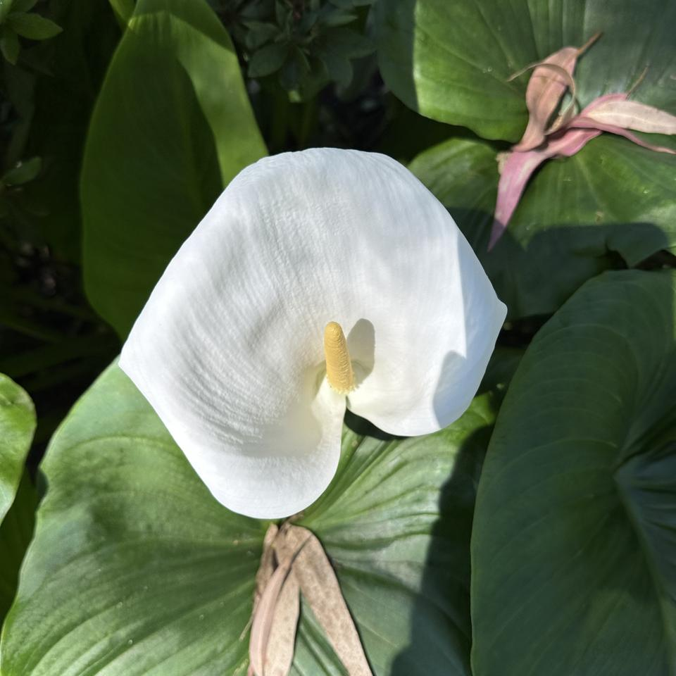
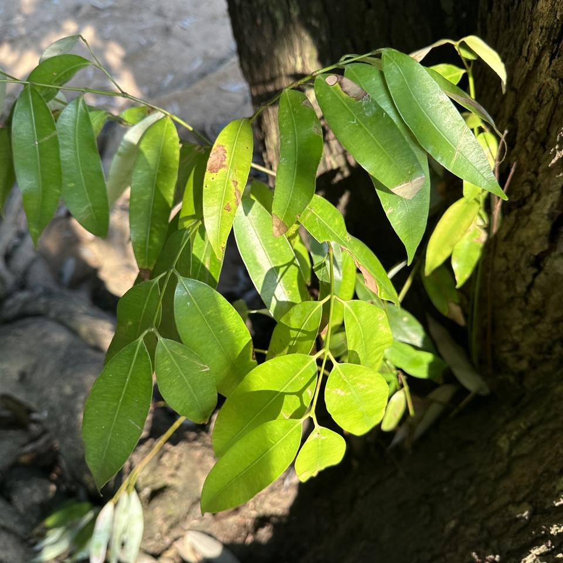
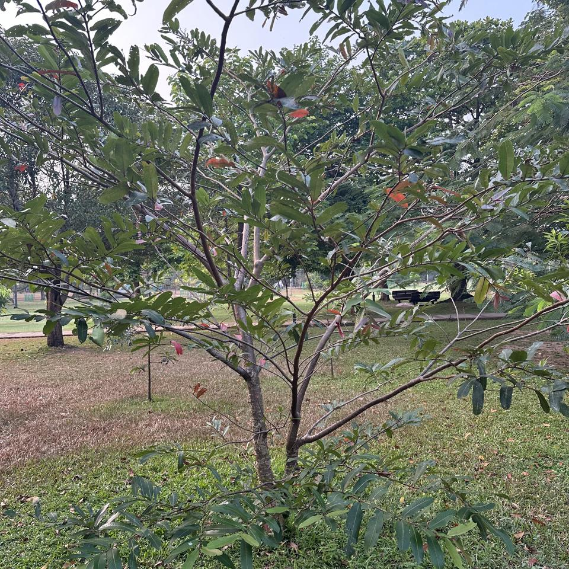
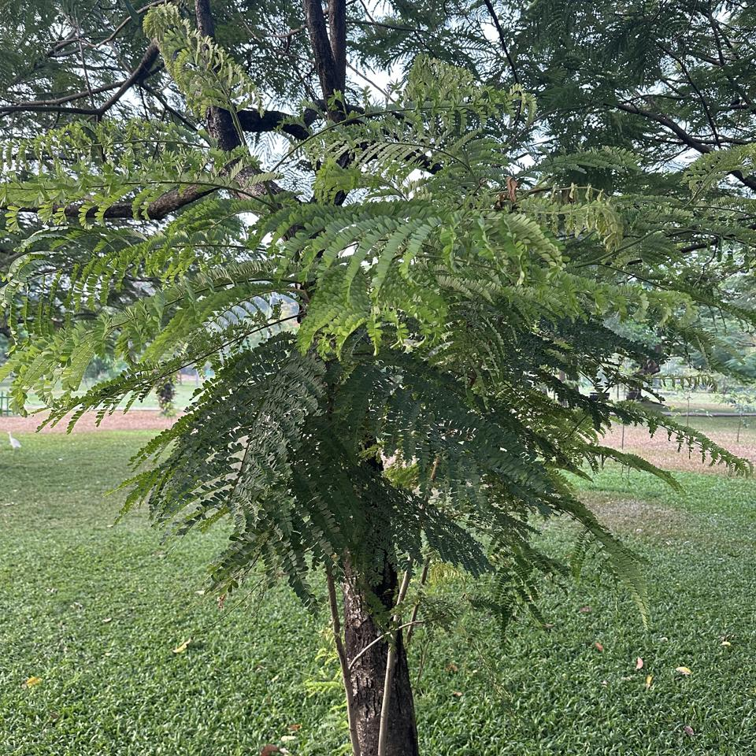

# [`Acanthaceae`](https://en.wikipedia.org/wiki/Acanthaceae)

## [`Avicennia`](https://en.wikipedia.org/wiki/Avicennia)

### *[`Avicennia marina`](https://en.wikipedia.org/wiki/Avicennia_marina)* (Forssk.) Vierh.

*`සි` *Manda* `த` *Kanna* `E` Grey mangrove, White mangrove, Gray mangrove*

(1 Example)

#### 07:53 AM (Dec 31, 2023) · [6.9137°N,79.8615°E](https://www.google.com/maps/place/6.913686N,79.861497E)

*🟥 Confidence [`Avicennia marina`](https://en.wikipedia.org/wiki/Avicennia_marina) (20.5%), [`Camellia sinensis`](https://en.wikipedia.org/wiki/Camellia_sinensis) (3.9%), [`Myrtus communis`](https://en.wikipedia.org/wiki/Myrtus_communis) (1.7%), [`Salix euxina`](https://en.wikipedia.org/wiki/Salix_euxina) (1.4%), [`Salix pentandra`](https://en.wikipedia.org/wiki/Salix_pentandra) (1.1%)*

## [`Thunbergia`](https://en.wikipedia.org/wiki/Thunbergia)

### *[`Thunbergia alata`](https://en.wikipedia.org/wiki/Thunbergia_alata)* Bojer ex Sims

*`E` Blackeyed Susan vine, Black Eyed Susan, Black-eyed-Susan-vine*

(1 Example)

#### 10:35 AM (Jan 27, 2024) · [6.9685°N,80.7653°E](https://www.google.com/maps/place/6.968511N,80.765311E)

*🟩 Confidence [`Thunbergia alata`](https://en.wikipedia.org/wiki/Thunbergia_alata) (93.7%), [`Thunbergia gregorii`](https://en.wikipedia.org/wiki/Thunbergia_gregorii) (1.2%), [`Uncarina grandidieri`](https://en.wikipedia.org/wiki/Uncarina_grandidieri) (0.7%), [`Thunbergia battiscombei`](https://en.wikipedia.org/wiki/Thunbergia_battiscombei) (0.2%)*

# [`Amaryllidaceae`](https://en.wikipedia.org/wiki/Amaryllidaceae)

## [`Clivia`](https://en.wikipedia.org/wiki/Clivia)

### *[`Clivia nobilis`](https://en.wikipedia.org/wiki/Clivia_nobilis)* Lindl.

*`E` Green-tip forest lily, Bush lily*

(2 Examples)

#### 10:35 AM (Jan 27, 2024) · [6.9686°N,80.7652°E](https://www.google.com/maps/place/6.968647N,80.765175E)

*🟨 Confidence [`Clivia nobilis`](https://en.wikipedia.org/wiki/Clivia_nobilis) (55.1%), [`Clivia × cyrtanthiflora`](https://en.wikipedia.org/wiki/Clivia_×_cyrtanthiflora) (29.7%), [`Clivia miniata`](https://en.wikipedia.org/wiki/Clivia_miniata) (2.9%), [`Cyrtanthus elatus`](https://en.wikipedia.org/wiki/Cyrtanthus_elatus) (0.2%), [`Agapanthus africanus`](https://en.wikipedia.org/wiki/Agapanthus_africanus) (0.1%)*

#### 10:36 AM (Jan 27, 2024) · [6.9683°N,80.7654°E](https://www.google.com/maps/place/6.968294N,80.765367E)

*🟨 Confidence [`Clivia nobilis`](https://en.wikipedia.org/wiki/Clivia_nobilis) (48.6%), [`Clivia × cyrtanthiflora`](https://en.wikipedia.org/wiki/Clivia_×_cyrtanthiflora) (15.6%), [`Clivia miniata`](https://en.wikipedia.org/wiki/Clivia_miniata) (12.1%), [`Cyrtanthus elatus`](https://en.wikipedia.org/wiki/Cyrtanthus_elatus) (1.0%), [`Clivia caulescens`](https://en.wikipedia.org/wiki/Clivia_caulescens) (0.5%)*

# [`Anacardiaceae`](https://en.wikipedia.org/wiki/Anacardiaceae)

## [`Anacardium`](https://en.wikipedia.org/wiki/Anacardium)

### *[`Anacardium occidentale`](https://en.wikipedia.org/wiki/Anacardium_occidentale)* L.

*`සි` *Kadju, kaju* `த` *muntiri, andimangottai* `E` Cashew, Cashewnut, Pomifera*

(1 Example)

#### 06:58 AM (Mar 08, 2024) · [6.9142°N,79.8640°E](https://www.google.com/maps/place/6.914239N,79.863975E)

*🟥 Confidence [`Anacardium occidentale`](https://en.wikipedia.org/wiki/Anacardium_occidentale) (16.5%), [`Kigelia africana`](https://en.wikipedia.org/wiki/Kigelia_africana) (12.0%), [`Schleichera oleosa`](https://en.wikipedia.org/wiki/Schleichera_oleosa) (11.6%), [`Psidium guajava`](https://en.wikipedia.org/wiki/Psidium_guajava) (9.8%), [`Trichilia dregeana`](https://en.wikipedia.org/wiki/Trichilia_dregeana) (4.6%)*

## [`Mangifera`](https://en.wikipedia.org/wiki/Mangifera)

### *[`Mangifera indica`](https://en.wikipedia.org/wiki/Mangifera_indica)* L.

*`සි` *Mee Amba, amba* `த` *Ma, Mamaram, Amiram, Mangai* `E` Mango, Mango Tree, आम*

(8 Examples)

#### 06:47 AM (Mar 10, 2024) · [6.9137°N,79.8584°E](https://www.google.com/maps/place/6.913742N,79.858422E)

*🟩 Confidence [`Mangifera indica`](https://en.wikipedia.org/wiki/Mangifera_indica) (72.4%), [`Pouteria caimito`](https://en.wikipedia.org/wiki/Pouteria_caimito) (9.5%), [`Tabernaemontana elegans`](https://en.wikipedia.org/wiki/Tabernaemontana_elegans) (1.2%), [`Ficus insipida`](https://en.wikipedia.org/wiki/Ficus_insipida) (0.8%), [`Pouteria campechiana`](https://en.wikipedia.org/wiki/Pouteria_campechiana) (0.6%)*

#### 06:47 AM (Mar 10, 2024) · [6.9137°N,79.8584°E](https://www.google.com/maps/place/6.913706N,79.858353E)

*🟩 Confidence [`Mangifera indica`](https://en.wikipedia.org/wiki/Mangifera_indica) (71.2%), [`Tabebuia rosea`](https://en.wikipedia.org/wiki/Tabebuia_rosea) (8.2%), [`Pouteria caimito`](https://en.wikipedia.org/wiki/Pouteria_caimito) (1.8%), [`Quercus imbricaria`](https://en.wikipedia.org/wiki/Quercus_imbricaria) (1.2%), [`Mimusops elengi`](https://en.wikipedia.org/wiki/Mimusops_elengi) (1.1%)*

#### 06:47 AM (Mar 10, 2024) · [6.9137°N,79.8584°E](https://www.google.com/maps/place/6.913744N,79.858422E)

*🟨 Confidence [`Mangifera indica`](https://en.wikipedia.org/wiki/Mangifera_indica) (49.7%), [`Pouteria caimito`](https://en.wikipedia.org/wiki/Pouteria_caimito) (32.0%), [`Ficus luschnathiana`](https://en.wikipedia.org/wiki/Ficus_luschnathiana) (1.0%), [`Pouteria campechiana`](https://en.wikipedia.org/wiki/Pouteria_campechiana) (0.7%), [`Ficus insipida`](https://en.wikipedia.org/wiki/Ficus_insipida) (0.6%)*

#### 07:56 AM (Mar 10, 2024) · [6.9132°N,79.8632°E](https://www.google.com/maps/place/6.913225N,79.863236E)

*🟨 Confidence [`Mangifera indica`](https://en.wikipedia.org/wiki/Mangifera_indica) (45.4%), [`Diospyros blancoi`](https://en.wikipedia.org/wiki/Diospyros_blancoi) (4.5%), [`Mimusops elengi`](https://en.wikipedia.org/wiki/Mimusops_elengi) (2.5%), [`Elateriospermum tapos`](https://en.wikipedia.org/wiki/Elateriospermum_tapos) (1.9%), [`Syzygium malaccense`](https://en.wikipedia.org/wiki/Syzygium_malaccense) (1.9%)*

#### 06:44 AM (Mar 10, 2024) · [6.9143°N,79.8594°E](https://www.google.com/maps/place/6.914314N,79.859419E)

*🟥 Confidence [`Mangifera indica`](https://en.wikipedia.org/wiki/Mangifera_indica) (20.7%), [`Pouteria campechiana`](https://en.wikipedia.org/wiki/Pouteria_campechiana) (7.3%), [`Tabernaemontana elegans`](https://en.wikipedia.org/wiki/Tabernaemontana_elegans) (5.4%), [`Pometia pinnata`](https://en.wikipedia.org/wiki/Pometia_pinnata) (5.3%), [`Melicoccus bijugatus`](https://en.wikipedia.org/wiki/Melicoccus_bijugatus) (4.8%)*

#### 07:06 AM (Mar 08, 2024) · [6.9153°N,79.8618°E](https://www.google.com/maps/place/6.915297N,79.8618E)

*🟥 Confidence [`Mangifera indica`](https://en.wikipedia.org/wiki/Mangifera_indica) (17.5%), [`× Chitalpa tashkentensis`](https://en.wikipedia.org/wiki/×_Chitalpa_tashkentensis) (5.0%), [`Mimusops elengi`](https://en.wikipedia.org/wiki/Mimusops_elengi) (4.9%), [`Quercus acutissima`](https://en.wikipedia.org/wiki/Quercus_acutissima) (3.5%), [`Acacia auriculiformis`](https://en.wikipedia.org/wiki/Acacia_auriculiformis) (3.4%)*

#### 06:55 AM (Mar 08, 2024) · [6.9137°N,79.8644°E](https://www.google.com/maps/place/6.913736N,79.864433E)

*🟥 Confidence [`Mangifera indica`](https://en.wikipedia.org/wiki/Mangifera_indica) (7.3%), [`Aegle marmelos`](https://en.wikipedia.org/wiki/Aegle_marmelos) (6.6%), [`Qualea parviflora`](https://en.wikipedia.org/wiki/Qualea_parviflora) (4.1%), [`Phytolacca dioica`](https://en.wikipedia.org/wiki/Phytolacca_dioica) (4.1%), [`Quercus humboldtii`](https://en.wikipedia.org/wiki/Quercus_humboldtii) (3.2%)*

#### 07:15 AM (Mar 08, 2024) · [6.9142°N,79.8621°E](https://www.google.com/maps/place/6.914233N,79.862061E)

*🟥 Confidence [`Mangifera indica`](https://en.wikipedia.org/wiki/Mangifera_indica) (7.3%), [`Monoon longifolium`](https://en.wikipedia.org/wiki/Monoon_longifolium) (4.1%), [`Ceiba pentandra`](https://en.wikipedia.org/wiki/Ceiba_pentandra) (3.2%), [`Pandanus tectorius`](https://en.wikipedia.org/wiki/Pandanus_tectorius) (3.0%), [`Phytolacca dioica`](https://en.wikipedia.org/wiki/Phytolacca_dioica) (2.6%)*

## [`Spondias`](https://en.wikipedia.org/wiki/Spondias)

### *[`Spondias purpurea`](https://en.wikipedia.org/wiki/Spondias_purpurea)* L.

*`E` Purple mombin, Red mombin, Spanish-plum*

(1 Example)

#### 06:59 AM (Mar 08, 2024) · [6.9141°N,79.8637°E](https://www.google.com/maps/place/6.914081N,79.863747E)

*🟥 Confidence [`Spondias purpurea`](https://en.wikipedia.org/wiki/Spondias_purpurea) (20.0%), [`Filicium decipiens`](https://en.wikipedia.org/wiki/Filicium_decipiens) (11.1%), [`Samanea saman`](https://en.wikipedia.org/wiki/Samanea_saman) (4.7%), [`Schinus terebinthifolia`](https://en.wikipedia.org/wiki/Schinus_terebinthifolia) (4.2%), [`Kigelia africana`](https://en.wikipedia.org/wiki/Kigelia_africana) (4.0%)*

# [`Annonaceae`](https://en.wikipedia.org/wiki/Annonaceae)

## [`Annona`](https://en.wikipedia.org/wiki/Annona)

### *[`Annona reticulata`](https://en.wikipedia.org/wiki/Annona_reticulata)* L.

*`සි` *Sinhala* `த` *Tamil* `E` Bullock's-heart, Custard-apple, Ox-heart*

(1 Example)

#### 07:58 AM (Mar 10, 2024) · [6.9140°N,79.8631°E](https://www.google.com/maps/place/6.914008N,79.863144E)

*🟥 Confidence [`Annona reticulata`](https://en.wikipedia.org/wiki/Annona_reticulata) (13.9%), [`Canarium album`](https://en.wikipedia.org/wiki/Canarium_album) (5.2%), [`Ficus lacor`](https://en.wikipedia.org/wiki/Ficus_lacor) (4.2%), [`Sloetia elongata`](https://en.wikipedia.org/wiki/Sloetia_elongata) (2.9%), [`Shorea roxburghii`](https://en.wikipedia.org/wiki/Shorea_roxburghii) (2.6%)*

## [`Monodora`](https://en.wikipedia.org/wiki/Monodora)

### *[`Monodora tenuifolia`](https://en.wikipedia.org/wiki/Monodora_tenuifolia)* Benth.

*`E` Orchidtree, African-nutmeg*

(1 Example)

#### 07:49 AM (Jan 10, 2024) · [6.9138°N,79.8600°E](https://www.google.com/maps/place/6.913781N,79.859978E)

*🟥 Confidence [`Monodora tenuifolia`](https://en.wikipedia.org/wiki/Monodora_tenuifolia) (1.2%), [`Chamaedorea elegans`](https://en.wikipedia.org/wiki/Chamaedorea_elegans) (1.0%), [`Mangifera indica`](https://en.wikipedia.org/wiki/Mangifera_indica) (0.9%), [`Vanda coerulea`](https://en.wikipedia.org/wiki/Vanda_coerulea) (0.9%), [`Cerbera manghas`](https://en.wikipedia.org/wiki/Cerbera_manghas) (0.9%)*

# [`Apocynaceae`](https://en.wikipedia.org/wiki/Apocynaceae)

## [`Allamanda`](https://en.wikipedia.org/wiki/Allamanda)

### *[`Allamanda cathartica`](https://en.wikipedia.org/wiki/Allamanda_cathartica)* L.

*`සි` *Val Ruk Attana* `E` Golden-trumpet, Allamanda, Yellow allamanda*

(1 Example)

#### 07:02 AM (Mar 08, 2024) · [6.9147°N,79.8631°E](https://www.google.com/maps/place/6.914694N,79.863053E)

*🟨 Confidence [`Allamanda cathartica`](https://en.wikipedia.org/wiki/Allamanda_cathartica) (52.8%), [`Allamanda schottii`](https://en.wikipedia.org/wiki/Allamanda_schottii) (34.4%), [`Hypericum lanceolatum`](https://en.wikipedia.org/wiki/Hypericum_lanceolatum) (0.5%), [`Hypericum revolutum`](https://en.wikipedia.org/wiki/Hypericum_revolutum) (0.3%), [`Polygala myrtifolia`](https://en.wikipedia.org/wiki/Polygala_myrtifolia) (0.2%)*

## [`Carissa`](https://en.wikipedia.org/wiki/Carissa)

### *[`Carissa carandas`](https://en.wikipedia.org/wiki/Carissa_carandas)* L.

*`සි` *Karanda, Maha Karamba* `த` *kila, kala* `E` Bengal-currants, Carandas-plum, Karanda*

(1 Example)

#### 08:02 AM (Jan 20, 2024) · [6.9121°N,79.8627°E](https://www.google.com/maps/place/6.912069N,79.862708E)

*🟥 Confidence [`Carissa carandas`](https://en.wikipedia.org/wiki/Carissa_carandas) (12.7%), [`Eugenia brasiliensis`](https://en.wikipedia.org/wiki/Eugenia_brasiliensis) (8.9%), [`Myrsine guianensis`](https://en.wikipedia.org/wiki/Myrsine_guianensis) (7.1%), [`Quercus humboldtii`](https://en.wikipedia.org/wiki/Quercus_humboldtii) (6.9%), [`Ixora chinensis`](https://en.wikipedia.org/wiki/Ixora_chinensis) (3.9%)*

## [`Plumeria`](https://en.wikipedia.org/wiki/Plumeria)

### *[`Plumeria obtusa`](https://en.wikipedia.org/wiki/Plumeria_obtusa)* L.

*`E` Frangipani, Singapore graveyard flower, దేవ గన్నేరు*

(2 Examples)

#### 07:09 AM (Mar 08, 2024) · [6.9149°N,79.8623°E](https://www.google.com/maps/place/6.914878N,79.862328E)

*🟨 Confidence [`Plumeria obtusa`](https://en.wikipedia.org/wiki/Plumeria_obtusa) (34.2%), [`Plumeria rubra`](https://en.wikipedia.org/wiki/Plumeria_rubra) (24.9%), [`Plumeria alba`](https://en.wikipedia.org/wiki/Plumeria_alba) (6.2%), [`Voacanga thouarsii`](https://en.wikipedia.org/wiki/Voacanga_thouarsii) (5.0%), [`Terminalia mantaly`](https://en.wikipedia.org/wiki/Terminalia_mantaly) (2.1%)*

#### 07:10 AM (Mar 08, 2024) · [6.9147°N,79.8624°E](https://www.google.com/maps/place/6.914736N,79.862428E)

*🟥 Confidence [`Plumeria obtusa`](https://en.wikipedia.org/wiki/Plumeria_obtusa) (23.9%), [`Plumeria alba`](https://en.wikipedia.org/wiki/Plumeria_alba) (17.1%), [`Plumeria rubra`](https://en.wikipedia.org/wiki/Plumeria_rubra) (9.8%), [`Pachypodium decaryi`](https://en.wikipedia.org/wiki/Pachypodium_decaryi) (3.2%), [`Ficus maxima`](https://en.wikipedia.org/wiki/Ficus_maxima) (2.1%)*

### *[`Plumeria rubra`](https://en.wikipedia.org/wiki/Plumeria_rubra)* L.

*`E` Frangipani, Plumeria, Pagoda-tree*

(3 Examples)

#### 06:47 AM (Mar 10, 2024) · [6.9136°N,79.8582°E](https://www.google.com/maps/place/6.913561N,79.858192E)

*🟩 Confidence [`Plumeria rubra`](https://en.wikipedia.org/wiki/Plumeria_rubra) (82.9%), [`Pseudobombax ellipticum`](https://en.wikipedia.org/wiki/Pseudobombax_ellipticum) (4.3%), [`Plumeria obtusa`](https://en.wikipedia.org/wiki/Plumeria_obtusa) (2.9%), [`Plumeria alba`](https://en.wikipedia.org/wiki/Plumeria_alba) (2.8%), [`Adenium obesum`](https://en.wikipedia.org/wiki/Adenium_obesum) (1.1%)*

#### 06:47 AM (Mar 10, 2024) · [6.9136°N,79.8582°E](https://www.google.com/maps/place/6.913614N,79.858217E)

*🟨 Confidence [`Plumeria rubra`](https://en.wikipedia.org/wiki/Plumeria_rubra) (65.5%), [`Plumeria alba`](https://en.wikipedia.org/wiki/Plumeria_alba) (10.7%), [`Plumeria obtusa`](https://en.wikipedia.org/wiki/Plumeria_obtusa) (5.4%), [`Pseudobombax ellipticum`](https://en.wikipedia.org/wiki/Pseudobombax_ellipticum) (4.0%), [`Adenium multiflorum`](https://en.wikipedia.org/wiki/Adenium_multiflorum) (1.1%)*

#### 06:45 AM (Mar 10, 2024) · [6.9142°N,79.8592°E](https://www.google.com/maps/place/6.914197N,79.8592E)

*🟨 Confidence [`Plumeria rubra`](https://en.wikipedia.org/wiki/Plumeria_rubra) (60.8%), [`Plumeria alba`](https://en.wikipedia.org/wiki/Plumeria_alba) (35.3%), [`Plumeria obtusa`](https://en.wikipedia.org/wiki/Plumeria_obtusa) (2.0%), [`Cerbera manghas`](https://en.wikipedia.org/wiki/Cerbera_manghas) (0.2%)*

## [`Tabernaemontana`](https://en.wikipedia.org/wiki/Tabernaemontana)

### *[`Tabernaemontana divaricata`](https://en.wikipedia.org/wiki/Tabernaemontana_divaricata)* (L.) R.Br. ex Roem. & Schult.

*`සි` *Wathu sudda, Watusudda, Watu sudda, Vathu sudda, Vathu sudda* `த` *adukkunandiyavattai, nandi battai, Nandiar vattai* `E` Crape-jasmine, Butterfly-gardenia, నందివర్ధనం*

(3 Examples)

#### 08:15 AM (Mar 10, 2024) · [6.9139°N,79.8618°E](https://www.google.com/maps/place/6.913933N,79.861778E)

*🟩 Confidence [`Tabernaemontana divaricata`](https://en.wikipedia.org/wiki/Tabernaemontana_divaricata) (82.0%), [`Tabernaemontana laeta`](https://en.wikipedia.org/wiki/Tabernaemontana_laeta) (0.9%), [`Tabernaemontana corymbosa`](https://en.wikipedia.org/wiki/Tabernaemontana_corymbosa) (0.8%), [`Jasminum grandiflorum`](https://en.wikipedia.org/wiki/Jasminum_grandiflorum) (0.6%), [`Tabernaemontana pandacaqui`](https://en.wikipedia.org/wiki/Tabernaemontana_pandacaqui) (0.3%)*

#### 07:57 AM (Feb 24, 2024) · [6.9133°N,79.8585°E](https://www.google.com/maps/place/6.913258N,79.858528E)

*🟩 Confidence [`Tabernaemontana divaricata`](https://en.wikipedia.org/wiki/Tabernaemontana_divaricata) (71.9%), [`Tabernaemontana catharinensis`](https://en.wikipedia.org/wiki/Tabernaemontana_catharinensis) (3.4%), [`Pittosporum undulatum`](https://en.wikipedia.org/wiki/Pittosporum_undulatum) (3.0%), [`Cestrum nocturnum`](https://en.wikipedia.org/wiki/Cestrum_nocturnum) (2.9%), [`Tabernaemontana elegans`](https://en.wikipedia.org/wiki/Tabernaemontana_elegans) (1.2%)*

#### 08:16 AM (Mar 10, 2024) · [6.9138°N,79.8617°E](https://www.google.com/maps/place/6.913844N,79.861733E)

*🟨 Confidence [`Tabernaemontana divaricata`](https://en.wikipedia.org/wiki/Tabernaemontana_divaricata) (66.1%), [`Tabernaemontana laeta`](https://en.wikipedia.org/wiki/Tabernaemontana_laeta) (3.2%), [`Tabernaemontana pandacaqui`](https://en.wikipedia.org/wiki/Tabernaemontana_pandacaqui) (1.7%), [`Tabernaemontana catharinensis`](https://en.wikipedia.org/wiki/Tabernaemontana_catharinensis) (0.9%), [`Jasminum grandiflorum`](https://en.wikipedia.org/wiki/Jasminum_grandiflorum) (0.8%)*

## [`Trachelospermum`](https://en.wikipedia.org/wiki/Trachelospermum)

### *[`Trachelospermum jasminoides`](https://en.wikipedia.org/wiki/Trachelospermum_jasminoides)* (Lindl.) Lem.

*`E` Star jasmine, Confederate jasmine, Chinese star-jessamine*

(1 Example)

#### 07:11 AM (Mar 08, 2024) · [6.9146°N,79.8625°E](https://www.google.com/maps/place/6.914644N,79.862525E)

*🟥 Confidence [`Trachelospermum jasminoides`](https://en.wikipedia.org/wiki/Trachelospermum_jasminoides) (10.0%), [`Trachelospermum asiaticum`](https://en.wikipedia.org/wiki/Trachelospermum_asiaticum) (8.4%), [`Ilex cornuta`](https://en.wikipedia.org/wiki/Ilex_cornuta) (4.9%), [`Atalantia buxifolia`](https://en.wikipedia.org/wiki/Atalantia_buxifolia) (3.8%), [`Psidium guajava`](https://en.wikipedia.org/wiki/Psidium_guajava) (3.3%)*

## [`Vinca`](https://en.wikipedia.org/wiki/Vinca)

### *[`Vinca major`](https://en.wikipedia.org/wiki/Vinca_major)* L.

*`E` Bigleaf periwinkle, Greater Periwinkle, Blue periwinkle*

(1 Example)

#### 10:37 AM (Jan 27, 2024) · [6.9680°N,80.7655°E](https://www.google.com/maps/place/6.968042N,80.76545E)

*🟩 Confidence [`Vinca major`](https://en.wikipedia.org/wiki/Vinca_major) (86.4%), [`Vinca difformis`](https://en.wikipedia.org/wiki/Vinca_difformis) (3.4%), [`Vinca herbacea`](https://en.wikipedia.org/wiki/Vinca_herbacea) (2.3%), [`Vinca minor`](https://en.wikipedia.org/wiki/Vinca_minor) (1.8%), [`Vinca erecta`](https://en.wikipedia.org/wiki/Vinca_erecta) (0.4%)*

## [`Wrightia`](https://en.wikipedia.org/wiki/Wrightia)

### *[`Wrightia religiosa`](https://en.wikipedia.org/wiki/Wrightia_religiosa)* (Teijsm. & Binn.) Benth. ex Kurz

*`සි` *Idda Mal* `E` Water Jasmine*

(1 Example)

#### 08:15 AM (Mar 10, 2024) · [6.9141°N,79.8619°E](https://www.google.com/maps/place/6.914086N,79.861856E)

*🟥 Confidence [`Wrightia religiosa`](https://en.wikipedia.org/wiki/Wrightia_religiosa) (12.8%), [`Wrightia antidysenterica`](https://en.wikipedia.org/wiki/Wrightia_antidysenterica) (10.8%), [`Brunfelsia americana`](https://en.wikipedia.org/wiki/Brunfelsia_americana) (7.2%), [`Holarrhena pubescens`](https://en.wikipedia.org/wiki/Holarrhena_pubescens) (5.4%), [`Jasminum sambac`](https://en.wikipedia.org/wiki/Jasminum_sambac) (5.3%)*

# [`Araceae`](https://en.wikipedia.org/wiki/Araceae)

## [`Zantedeschia`](https://en.wikipedia.org/wiki/Zantedeschia)

### *[`Zantedeschia aethiopica`](https://en.wikipedia.org/wiki/Zantedeschia_aethiopica)* (L.) Spreng.

*`E` Calla lily, Arum Lily, Altar-lily*

(1 Example)

#### 10:39 AM (Jan 27, 2024) · [6.9679°N,80.7656°E](https://www.google.com/maps/place/6.967878N,80.765586E)

*🟨 Confidence [`Zantedeschia aethiopica`](https://en.wikipedia.org/wiki/Zantedeschia_aethiopica) (33.6%), [`Calla palustris`](https://en.wikipedia.org/wiki/Calla_palustris) (25.6%), [`Spathiphyllum cannifolium`](https://en.wikipedia.org/wiki/Spathiphyllum_cannifolium) (3.4%), [`Spathiphyllum friedrichsthalii`](https://en.wikipedia.org/wiki/Spathiphyllum_friedrichsthalii) (1.0%), [`Zantedeschia rehmannii`](https://en.wikipedia.org/wiki/Zantedeschia_rehmannii) (0.9%)*

# [`Arecaceae`](https://en.wikipedia.org/wiki/Arecaceae)

## [`Dictyosperma`](https://en.wikipedia.org/wiki/Dictyosperma)

### *[`Dictyosperma album`](https://en.wikipedia.org/wiki/Dictyosperma_album)* (Bory) Scheff.

*`E` Common princess palm, Hurricane palm*

(1 Example)

#### 06:46 AM (Mar 08, 2024) · [6.9131°N,79.8617°E](https://www.google.com/maps/place/6.913108N,79.861708E)

*🟨 Confidence [`Dictyosperma album`](https://en.wikipedia.org/wiki/Dictyosperma_album) (33.8%), [`Roystonea oleracea`](https://en.wikipedia.org/wiki/Roystonea_oleracea) (7.1%), [`Roystonea regia`](https://en.wikipedia.org/wiki/Roystonea_regia) (6.3%), [`Euterpe oleracea`](https://en.wikipedia.org/wiki/Euterpe_oleracea) (2.8%), [`Archontophoenix cunninghamiana`](https://en.wikipedia.org/wiki/Archontophoenix_cunninghamiana) (2.5%)*

## [`Dypsis`](https://en.wikipedia.org/wiki/Dypsis)

### *[`Dypsis lutescens`](https://en.wikipedia.org/wiki/Dypsis_lutescens)* (H.Wendl.) Beentje & J.Dransf.

*`E` Areca palm, Yellow butterfly palm, Butterfly palm*

(2 Examples)

#### 08:15 AM (Mar 10, 2024) · [6.9139°N,79.8619°E](https://www.google.com/maps/place/6.913903N,79.861892E)

*🟩 Confidence [`Dypsis lutescens`](https://en.wikipedia.org/wiki/Dypsis_lutescens) (91.8%), [`Dypsis scottiana`](https://en.wikipedia.org/wiki/Dypsis_scottiana) (0.8%), [`Dypsis cabadae`](https://en.wikipedia.org/wiki/Dypsis_cabadae) (0.4%), [`Hyophorbe indica`](https://en.wikipedia.org/wiki/Hyophorbe_indica) (0.4%), [`Chamaedorea costaricana`](https://en.wikipedia.org/wiki/Chamaedorea_costaricana) (0.3%)*

#### 08:14 AM (Mar 10, 2024) · [6.9139°N,79.8619°E](https://www.google.com/maps/place/6.913858N,79.861908E)

*🟨 Confidence [`Dypsis lutescens`](https://en.wikipedia.org/wiki/Dypsis_lutescens) (59.9%), [`Dictyosperma album`](https://en.wikipedia.org/wiki/Dictyosperma_album) (3.5%), [`Archontophoenix cunninghamiana`](https://en.wikipedia.org/wiki/Archontophoenix_cunninghamiana) (1.9%), [`Adonidia merrillii`](https://en.wikipedia.org/wiki/Adonidia_merrillii) (1.5%), [`Hyophorbe indica`](https://en.wikipedia.org/wiki/Hyophorbe_indica) (1.4%)*

## [`Roystonea`](https://en.wikipedia.org/wiki/Roystonea)

### *[`Roystonea regia`](https://en.wikipedia.org/wiki/Roystonea_regia)* (Kunth) O.F.Cook

*`E` Cuban royal palm, Florida royal palm, Royal palm*

(3 Examples)

#### 07:17 AM (Mar 08, 2024) · [6.9135°N,79.8617°E](https://www.google.com/maps/place/6.913517N,79.861708E)

*🟩 Confidence [`Roystonea regia`](https://en.wikipedia.org/wiki/Roystonea_regia) (74.8%), [`Roystonea oleracea`](https://en.wikipedia.org/wiki/Roystonea_oleracea) (5.5%), [`Dictyosperma album`](https://en.wikipedia.org/wiki/Dictyosperma_album) (3.2%), [`Archontophoenix cunninghamiana`](https://en.wikipedia.org/wiki/Archontophoenix_cunninghamiana) (2.5%), [`Pseudophoenix sargentii`](https://en.wikipedia.org/wiki/Pseudophoenix_sargentii) (1.4%)*

#### 07:18 AM (Mar 08, 2024) · [6.9133°N,79.8615°E](https://www.google.com/maps/place/6.913325N,79.86155E)

*🟥 Confidence [`Roystonea regia`](https://en.wikipedia.org/wiki/Roystonea_regia) (26.9%), [`Euterpe oleracea`](https://en.wikipedia.org/wiki/Euterpe_oleracea) (9.7%), [`Phoenix reclinata`](https://en.wikipedia.org/wiki/Phoenix_reclinata) (8.4%), [`Dypsis lutescens`](https://en.wikipedia.org/wiki/Dypsis_lutescens) (7.3%), [`Roystonea oleracea`](https://en.wikipedia.org/wiki/Roystonea_oleracea) (5.7%)*

#### 06:42 AM (Mar 08, 2024) · [6.9143°N,79.8604°E](https://www.google.com/maps/place/6.91425N,79.860375E)

*🟥 Confidence [`Roystonea regia`](https://en.wikipedia.org/wiki/Roystonea_regia) (17.8%), [`Phoenix reclinata`](https://en.wikipedia.org/wiki/Phoenix_reclinata) (15.3%), [`Roystonea oleracea`](https://en.wikipedia.org/wiki/Roystonea_oleracea) (5.6%), [`Archontophoenix cunninghamiana`](https://en.wikipedia.org/wiki/Archontophoenix_cunninghamiana) (4.3%), [`Syagrus romanzoffiana`](https://en.wikipedia.org/wiki/Syagrus_romanzoffiana) (4.2%)*

## [`Wodyetia`](https://en.wikipedia.org/wiki/Wodyetia)

### *[`Wodyetia bifurcata`](https://en.wikipedia.org/wiki/Wodyetia_bifurcata)* A.K.Irvine

*`E` Foxtail palm*

(1 Example)

#### 07:19 AM (Mar 08, 2024) · [6.9132°N,79.8615°E](https://www.google.com/maps/place/6.913236N,79.861497E)

*🟨 Confidence [`Wodyetia bifurcata`](https://en.wikipedia.org/wiki/Wodyetia_bifurcata) (60.3%), [`Syagrus romanzoffiana`](https://en.wikipedia.org/wiki/Syagrus_romanzoffiana) (3.0%), [`Ptychosperma microcarpum`](https://en.wikipedia.org/wiki/Ptychosperma_microcarpum) (2.3%), [`Chamaedorea seifrizii`](https://en.wikipedia.org/wiki/Chamaedorea_seifrizii) (2.2%), [`Chamaedorea elegans`](https://en.wikipedia.org/wiki/Chamaedorea_elegans) (1.9%)*

# [`Asparagaceae`](https://en.wikipedia.org/wiki/Asparagaceae)

## [`Chlorophytum`](https://en.wikipedia.org/wiki/Chlorophytum)

### *[`Chlorophytum capense`](https://en.wikipedia.org/wiki/Chlorophytum_capense)* (L.) Voss

*`E` Spider plant, Bracketplant, گندمی*

(1 Example)

#### 06:45 AM (Mar 10, 2024) · [6.9141°N,79.8590°E](https://www.google.com/maps/place/6.914119N,79.859E)

*🟥 Confidence [`Chlorophytum capense`](https://en.wikipedia.org/wiki/Chlorophytum_capense) (27.2%), [`Pandanus tectorius`](https://en.wikipedia.org/wiki/Pandanus_tectorius) (23.9%), [`Pandanus pygmaeus`](https://en.wikipedia.org/wiki/Pandanus_pygmaeus) (13.3%), [`Chlorophytum comosum`](https://en.wikipedia.org/wiki/Chlorophytum_comosum) (6.8%), [`Phalaris arundinacea`](https://en.wikipedia.org/wiki/Phalaris_arundinacea) (4.0%)*

# [`Asteraceae`](https://en.wikipedia.org/wiki/Asteraceae)

## [`Ageratina`](https://en.wikipedia.org/wiki/Ageratina)

### *[`Ageratina riparia`](https://en.wikipedia.org/wiki/Ageratina_riparia)* (Regel) R.M.King & H.Rob.

*`E` Creeping croftonweed, Mist flower, River-eupatorium*

(1 Example)

#### 10:30 AM (Jan 27, 2024) · [6.9682°N,80.7643°E](https://www.google.com/maps/place/6.968231N,80.764253E)

*🟩 Confidence [`Ageratina riparia`](https://en.wikipedia.org/wiki/Ageratina_riparia) (91.7%), [`Ageratina altissima`](https://en.wikipedia.org/wiki/Ageratina_altissima) (3.2%), [`Ageratina adenophora`](https://en.wikipedia.org/wiki/Ageratina_adenophora) (2.8%), [`Ageratina aromatica`](https://en.wikipedia.org/wiki/Ageratina_aromatica) (0.3%)*

## [`Bidens`](https://en.wikipedia.org/wiki/Bidens)

### *[`Bidens pilosa`](https://en.wikipedia.org/wiki/Bidens_pilosa)* L.

*`E` Spanish-needles, Beggar-ticks, Black-jack*

(1 Example)

#### 10:59 AM (Jan 27, 2024) · [6.9711°N,80.7649°E](https://www.google.com/maps/place/6.97115N,80.764931E)

*🟩 Confidence [`Bidens pilosa`](https://en.wikipedia.org/wiki/Bidens_pilosa) (70.3%), [`Bidens alba`](https://en.wikipedia.org/wiki/Bidens_alba) (21.8%), [`Bidens bipinnata`](https://en.wikipedia.org/wiki/Bidens_bipinnata) (1.7%), [`Bidens aurea`](https://en.wikipedia.org/wiki/Bidens_aurea) (0.9%), [`Bidens biternata`](https://en.wikipedia.org/wiki/Bidens_biternata) (0.1%)*

# [`Balsaminaceae`](https://en.wikipedia.org/wiki/Balsaminaceae)

## [`Impatiens`](https://en.wikipedia.org/wiki/Impatiens)

### *[`Impatiens hawkeri`](https://en.wikipedia.org/wiki/Impatiens_hawkeri)* W.Bull

*`E` New Guinea Impatiens, Impatiens, گل حنا*

(4 Examples)

#### 10:36 AM (Jan 27, 2024) · [6.9682°N,80.7654°E](https://www.google.com/maps/place/6.968239N,80.765358E)

*🟩 Confidence [`Impatiens hawkeri`](https://en.wikipedia.org/wiki/Impatiens_hawkeri) (69.0%), [`Impatiens walleriana`](https://en.wikipedia.org/wiki/Impatiens_walleriana) (12.8%), [`Impatiens balsamina`](https://en.wikipedia.org/wiki/Impatiens_balsamina) (2.0%), [`Impatiens flaccida`](https://en.wikipedia.org/wiki/Impatiens_flaccida) (0.7%), [`Lobelia cardinalis`](https://en.wikipedia.org/wiki/Lobelia_cardinalis) (0.3%)*

#### 10:32 AM (Jan 27, 2024) · [6.9689°N,80.7646°E](https://www.google.com/maps/place/6.968867N,80.764556E)

*🟩 Confidence [`Impatiens hawkeri`](https://en.wikipedia.org/wiki/Impatiens_hawkeri) (67.5%), [`Impatiens walleriana`](https://en.wikipedia.org/wiki/Impatiens_walleriana) (28.1%), [`Impatiens flaccida`](https://en.wikipedia.org/wiki/Impatiens_flaccida) (0.5%), [`Impatiens balsamina`](https://en.wikipedia.org/wiki/Impatiens_balsamina) (0.3%)*

#### 10:32 AM (Jan 27, 2024) · [6.9689°N,80.7646°E](https://www.google.com/maps/place/6.968883N,80.764564E)

*🟩 Confidence [`Impatiens hawkeri`](https://en.wikipedia.org/wiki/Impatiens_hawkeri) (67.8%), [`Impatiens walleriana`](https://en.wikipedia.org/wiki/Impatiens_walleriana) (21.3%), [`Impatiens balsamina`](https://en.wikipedia.org/wiki/Impatiens_balsamina) (2.8%), [`Impatiens sodenii`](https://en.wikipedia.org/wiki/Impatiens_sodenii) (0.3%), [`Impatiens flaccida`](https://en.wikipedia.org/wiki/Impatiens_flaccida) (0.2%)*

#### 10:32 AM (Jan 27, 2024) · [6.9688°N,80.7646°E](https://www.google.com/maps/place/6.968819N,80.764564E)

*🟨 Confidence [`Impatiens hawkeri`](https://en.wikipedia.org/wiki/Impatiens_hawkeri) (38.2%), [`Impatiens walleriana`](https://en.wikipedia.org/wiki/Impatiens_walleriana) (13.4%), [`Impatiens balsamina`](https://en.wikipedia.org/wiki/Impatiens_balsamina) (10.6%), [`Impatiens sodenii`](https://en.wikipedia.org/wiki/Impatiens_sodenii) (6.6%), [`Impatiens flaccida`](https://en.wikipedia.org/wiki/Impatiens_flaccida) (3.4%)*

# [`Betulaceae`](https://en.wikipedia.org/wiki/Betulaceae)

## [`Betula`](https://en.wikipedia.org/wiki/Betula)

### *[`Betula nigra`](https://en.wikipedia.org/wiki/Betula_nigra)* L.

*`E` River birch, Red birch, Black Birch*

(1 Example)

#### 06:54 AM (Mar 08, 2024) · [6.9138°N,79.8644°E](https://www.google.com/maps/place/6.913758N,79.864433E)

*🟥 Confidence [`Betula nigra`](https://en.wikipedia.org/wiki/Betula_nigra) (14.9%), [`Platanus occidentalis`](https://en.wikipedia.org/wiki/Platanus_occidentalis) (5.3%), [`Ulmus americana`](https://en.wikipedia.org/wiki/Ulmus_americana) (3.9%), [`Liriodendron tulipifera`](https://en.wikipedia.org/wiki/Liriodendron_tulipifera) (3.2%), [`Morus nigra`](https://en.wikipedia.org/wiki/Morus_nigra) (3.0%)*

# [`Bignoniaceae`](https://en.wikipedia.org/wiki/Bignoniaceae)

## [`Jacaranda`](https://en.wikipedia.org/wiki/Jacaranda)

### *[`Jacaranda mimosifolia`](https://en.wikipedia.org/wiki/Jacaranda_mimosifolia)* D.Don

*`E` Jacaranda, Black poui, Fern-tree*

(1 Example)

#### 07:57 AM (Mar 10, 2024) · [6.9135°N,79.8632°E](https://www.google.com/maps/place/6.913536N,79.86325E)

*🟨 Confidence [`Jacaranda mimosifolia`](https://en.wikipedia.org/wiki/Jacaranda_mimosifolia) (35.2%), [`Peltophorum pterocarpum`](https://en.wikipedia.org/wiki/Peltophorum_pterocarpum) (8.7%), [`Peltophorum dubium`](https://en.wikipedia.org/wiki/Peltophorum_dubium) (4.2%), [`Jacaranda caucana`](https://en.wikipedia.org/wiki/Jacaranda_caucana) (3.1%), [`Cenostigma pluviosum`](https://en.wikipedia.org/wiki/Cenostigma_pluviosum) (2.8%)*

## [`Tabebuia`](https://en.wikipedia.org/wiki/Tabebuia)

### *[`Tabebuia pallida`](https://en.wikipedia.org/wiki/Tabebuia_pallida)* (Lindl.) Miers

*`E` Cuban pink trumpet-tree, White-cedar, Whitewood*

(2 Examples)

#### 07:09 AM (Mar 08, 2024) · [6.9149°N,79.8622°E](https://www.google.com/maps/place/6.914911N,79.862175E)

*🟨 Confidence [`Tabebuia pallida`](https://en.wikipedia.org/wiki/Tabebuia_pallida) (36.7%), [`Tabebuia heterophylla`](https://en.wikipedia.org/wiki/Tabebuia_heterophylla) (11.2%), [`Rosa banksiae`](https://en.wikipedia.org/wiki/Rosa_banksiae) (4.5%), [`Tabebuia roseoalba`](https://en.wikipedia.org/wiki/Tabebuia_roseoalba) (2.7%), [`Rosa moschata`](https://en.wikipedia.org/wiki/Rosa_moschata) (1.4%)*

#### 07:08 AM (Mar 08, 2024) · [6.9149°N,79.8622°E](https://www.google.com/maps/place/6.914925N,79.862189E)

*🟥 Confidence [`Tabebuia pallida`](https://en.wikipedia.org/wiki/Tabebuia_pallida) (28.3%), [`Tabebuia heterophylla`](https://en.wikipedia.org/wiki/Tabebuia_heterophylla) (12.6%), [`Ceiba glaziovii`](https://en.wikipedia.org/wiki/Ceiba_glaziovii) (1.9%), [`Tabebuia roseoalba`](https://en.wikipedia.org/wiki/Tabebuia_roseoalba) (1.8%), [`Moringa oleifera`](https://en.wikipedia.org/wiki/Moringa_oleifera) (1.5%)*

### *[`Tabebuia rosea`](https://en.wikipedia.org/wiki/Tabebuia_rosea)* (Bertol.) Bertero ex A.DC.

*`E` Pink poui, Pink trumpet-tree, Rosy trumpet-tree*

(6 Examples)

#### 07:05 AM (Mar 08, 2024) · [6.9155°N,79.8621°E](https://www.google.com/maps/place/6.915522N,79.862061E)

*🟨 Confidence [`Tabebuia rosea`](https://en.wikipedia.org/wiki/Tabebuia_rosea) (62.7%), [`Citharexylum myrianthum`](https://en.wikipedia.org/wiki/Citharexylum_myrianthum) (13.6%), [`Handroanthus ochraceus`](https://en.wikipedia.org/wiki/Handroanthus_ochraceus) (3.3%), [`Melia azedarach`](https://en.wikipedia.org/wiki/Melia_azedarach) (3.2%), [`Bischofia javanica`](https://en.wikipedia.org/wiki/Bischofia_javanica) (1.4%)*

#### 06:50 AM (Mar 08, 2024) · [6.9140°N,79.8634°E](https://www.google.com/maps/place/6.913964N,79.863358E)

*🟨 Confidence [`Tabebuia rosea`](https://en.wikipedia.org/wiki/Tabebuia_rosea) (57.3%), [`Tabebuia heterophylla`](https://en.wikipedia.org/wiki/Tabebuia_heterophylla) (15.6%), [`Handroanthus impetiginosus`](https://en.wikipedia.org/wiki/Handroanthus_impetiginosus) (4.2%), [`Handroanthus heptaphyllus`](https://en.wikipedia.org/wiki/Handroanthus_heptaphyllus) (2.1%), [`Tabebuia pallida`](https://en.wikipedia.org/wiki/Tabebuia_pallida) (0.4%)*

#### 06:48 AM (Mar 08, 2024) · [6.9144°N,79.8629°E](https://www.google.com/maps/place/6.914369N,79.862922E)

*🟥 Confidence [`Tabebuia rosea`](https://en.wikipedia.org/wiki/Tabebuia_rosea) (20.2%), [`Tipuana tipu`](https://en.wikipedia.org/wiki/Tipuana_tipu) (9.3%), [`Schinus terebinthifolia`](https://en.wikipedia.org/wiki/Schinus_terebinthifolia) (5.6%), [`Albizia lebbeck`](https://en.wikipedia.org/wiki/Albizia_lebbeck) (4.1%), [`Robinia hispida`](https://en.wikipedia.org/wiki/Robinia_hispida) (3.8%)*

#### 06:57 AM (Mar 08, 2024) · [6.9140°N,79.8642°E](https://www.google.com/maps/place/6.913983N,79.864236E)

*🟥 Confidence [`Tabebuia rosea`](https://en.wikipedia.org/wiki/Tabebuia_rosea) (11.5%), [`Handroanthus heptaphyllus`](https://en.wikipedia.org/wiki/Handroanthus_heptaphyllus) (9.2%), [`Celtis australis`](https://en.wikipedia.org/wiki/Celtis_australis) (8.2%), [`Ficus virens`](https://en.wikipedia.org/wiki/Ficus_virens) (4.3%), [`Quercus glauca`](https://en.wikipedia.org/wiki/Quercus_glauca) (3.7%)*

#### 06:52 AM (Mar 08, 2024) · [6.9137°N,79.8637°E](https://www.google.com/maps/place/6.913733N,79.863708E)

*🟥 Confidence [`Tabebuia rosea`](https://en.wikipedia.org/wiki/Tabebuia_rosea) (9.9%), [`Tabebuia pallida`](https://en.wikipedia.org/wiki/Tabebuia_pallida) (5.2%), [`Phytolacca dioica`](https://en.wikipedia.org/wiki/Phytolacca_dioica) (4.4%), [`Swietenia macrophylla`](https://en.wikipedia.org/wiki/Swietenia_macrophylla) (2.5%), [`Cinnamomum camphora`](https://en.wikipedia.org/wiki/Cinnamomum_camphora) (2.0%)*

#### 06:57 AM (Mar 08, 2024) · [6.9139°N,79.8642°E](https://www.google.com/maps/place/6.913917N,79.864236E)

*🟥 Confidence [`Tabebuia rosea`](https://en.wikipedia.org/wiki/Tabebuia_rosea) (9.7%), [`Melicoccus bijugatus`](https://en.wikipedia.org/wiki/Melicoccus_bijugatus) (2.6%), [`Inga edulis`](https://en.wikipedia.org/wiki/Inga_edulis) (2.5%), [`Licania ternatensis`](https://en.wikipedia.org/wiki/Licania_ternatensis) (2.3%), [`Inga laurina`](https://en.wikipedia.org/wiki/Inga_laurina) (2.1%)*

## [`Tecoma`](https://en.wikipedia.org/wiki/Tecoma)

### *[`Tecoma stans`](https://en.wikipedia.org/wiki/Tecoma_stans)* (L.) Juss. ex Kunth

*`සි` *rankaerali, Kelantissa , Kaelanitissa* `த` *tankarali, swarnaptti* `E` Yellow-bells, Yellow trumpet flower, Trumpet-flower*

(2 Examples)

#### 07:05 AM (Mar 10, 2024) · [6.9026°N,79.8589°E](https://www.google.com/maps/place/6.902558N,79.858908E)

*🟩 Confidence [`Tecoma stans`](https://en.wikipedia.org/wiki/Tecoma_stans) (71.0%), [`Dolichandra unguis-cati`](https://en.wikipedia.org/wiki/Dolichandra_unguis-cati) (11.4%), [`Tabernaemontana grandiflora`](https://en.wikipedia.org/wiki/Tabernaemontana_grandiflora) (2.7%), [`Handroanthus chrysotrichus`](https://en.wikipedia.org/wiki/Handroanthus_chrysotrichus) (0.5%), [`Pavonia spinifex`](https://en.wikipedia.org/wiki/Pavonia_spinifex) (0.3%)*

#### 07:05 AM (Mar 10, 2024) · [6.9026°N,79.8589°E](https://www.google.com/maps/place/6.902553N,79.858908E)

*🟩 Confidence [`Tecoma stans`](https://en.wikipedia.org/wiki/Tecoma_stans) (71.0%), [`Dolichandra unguis-cati`](https://en.wikipedia.org/wiki/Dolichandra_unguis-cati) (1.4%), [`Handroanthus chrysotrichus`](https://en.wikipedia.org/wiki/Handroanthus_chrysotrichus) (1.4%), [`Reinwardtia indica`](https://en.wikipedia.org/wiki/Reinwardtia_indica) (1.1%), [`Impatiens noli-tangere`](https://en.wikipedia.org/wiki/Impatiens_noli-tangere) (0.5%)*

# [`Boraginaceae`](https://en.wikipedia.org/wiki/Boraginaceae)

## [`Cordia`](https://en.wikipedia.org/wiki/Cordia)

### *[`Cordia dichotoma`](https://en.wikipedia.org/wiki/Cordia_dichotoma)* G.Forst.

*`த` *naruvili* `E` Fragrant manjack, Indian-cherry, Clammy-cherry*

(1 Example)

#### 06:43 AM (Mar 08, 2024) · [6.9139°N,79.8604°E](https://www.google.com/maps/place/6.91395N,79.860358E)

*🟥 Confidence [`Cordia dichotoma`](https://en.wikipedia.org/wiki/Cordia_dichotoma) (17.0%), [`Bauhinia × blakeana`](https://en.wikipedia.org/wiki/Bauhinia_×_blakeana) (9.1%), [`Cordia sebestena`](https://en.wikipedia.org/wiki/Cordia_sebestena) (5.5%), [`Celtis sinensis`](https://en.wikipedia.org/wiki/Celtis_sinensis) (4.8%), [`Bauhinia variegata`](https://en.wikipedia.org/wiki/Bauhinia_variegata) (4.4%)*

# [`Calophyllaceae`](https://en.wikipedia.org/wiki/Calophyllaceae)

## [`Mesua`](https://en.wikipedia.org/wiki/Mesua)

### *[`Mesua ferrea`](https://en.wikipedia.org/wiki/Mesua_ferrea)* L.

*`සි` *Na, Naa* `த` *nangu, cirunakappu* `E` Mesua, Iron Wood Tree, Ceylon Ironwood*

(5 Examples)

#### 08:05 AM (Mar 10, 2024) · [6.9137°N,79.8642°E](https://www.google.com/maps/place/6.913694N,79.864189E)

*🟩 Confidence [`Mesua ferrea`](https://en.wikipedia.org/wiki/Mesua_ferrea) (84.9%), [`Eucalyptus robusta`](https://en.wikipedia.org/wiki/Eucalyptus_robusta) (2.2%), [`Simarouba amara`](https://en.wikipedia.org/wiki/Simarouba_amara) (1.0%), [`Cinnamomum verum`](https://en.wikipedia.org/wiki/Cinnamomum_verum) (0.5%), [`Syzygium cumini`](https://en.wikipedia.org/wiki/Syzygium_cumini) (0.5%)*

#### 07:16 AM (Feb 22, 2024) · [6.9150°N,79.8627°E](https://www.google.com/maps/place/6.914983N,79.862703E)

*🟨 Confidence [`Mesua ferrea`](https://en.wikipedia.org/wiki/Mesua_ferrea) (60.5%), [`Monoon longifolium`](https://en.wikipedia.org/wiki/Monoon_longifolium) (8.2%), [`Quercus myrsinifolia`](https://en.wikipedia.org/wiki/Quercus_myrsinifolia) (4.6%), [`Ficus maclellandii`](https://en.wikipedia.org/wiki/Ficus_maclellandii) (1.9%), [`Saraca indica`](https://en.wikipedia.org/wiki/Saraca_indica) (0.8%)*

#### 06:43 AM (Mar 10, 2024) · [6.9146°N,79.8600°E](https://www.google.com/maps/place/6.914642N,79.859992E)

*🟨 Confidence [`Mesua ferrea`](https://en.wikipedia.org/wiki/Mesua_ferrea) (56.8%), [`Ficus maclellandii`](https://en.wikipedia.org/wiki/Ficus_maclellandii) (10.2%), [`Monoon longifolium`](https://en.wikipedia.org/wiki/Monoon_longifolium) (3.0%), [`Quercus myrsinifolia`](https://en.wikipedia.org/wiki/Quercus_myrsinifolia) (2.2%), [`Zelkova serrata`](https://en.wikipedia.org/wiki/Zelkova_serrata) (1.5%)*

#### 08:08 AM (Mar 10, 2024) · [6.9146°N,79.8633°E](https://www.google.com/maps/place/6.914633N,79.863319E)

*🟨 Confidence [`Mesua ferrea`](https://en.wikipedia.org/wiki/Mesua_ferrea) (53.8%), [`Ficus maclellandii`](https://en.wikipedia.org/wiki/Ficus_maclellandii) (9.8%), [`Monoon longifolium`](https://en.wikipedia.org/wiki/Monoon_longifolium) (5.1%), [`Quercus myrsinifolia`](https://en.wikipedia.org/wiki/Quercus_myrsinifolia) (1.3%), [`Ficus longifolia`](https://en.wikipedia.org/wiki/Ficus_longifolia) (1.1%)*

#### 08:04 AM (Mar 10, 2024) · [6.9135°N,79.8641°E](https://www.google.com/maps/place/6.913536N,79.864053E)

*🟥 Confidence [`Mesua ferrea`](https://en.wikipedia.org/wiki/Mesua_ferrea) (25.0%), [`Ficus maclellandii`](https://en.wikipedia.org/wiki/Ficus_maclellandii) (3.2%), [`Senna siamea`](https://en.wikipedia.org/wiki/Senna_siamea) (2.9%), [`Umbellularia californica`](https://en.wikipedia.org/wiki/Umbellularia_californica) (2.3%), [`Syzygium jambos`](https://en.wikipedia.org/wiki/Syzygium_jambos) (2.1%)*

# [`Caryocaraceae`](https://en.wikipedia.org/wiki/Caryocaraceae)

## [`Caryocar`](https://en.wikipedia.org/wiki/Caryocar)

### *[`Caryocar brasiliense`](https://en.wikipedia.org/wiki/Caryocar_brasiliense)* A.St.-Hil.

*`E` Pequi, Piki, Pekea nut*

(1 Example)

#### 07:03 AM (Mar 08, 2024) · [6.9150°N,79.8627°E](https://www.google.com/maps/place/6.915036N,79.862708E)

*🟥 Confidence [`Caryocar brasiliense`](https://en.wikipedia.org/wiki/Caryocar_brasiliense) (6.6%), [`Averrhoa carambola`](https://en.wikipedia.org/wiki/Averrhoa_carambola) (5.6%), [`Bauhinia variegata`](https://en.wikipedia.org/wiki/Bauhinia_variegata) (5.1%), [`Bauhinia purpurea`](https://en.wikipedia.org/wiki/Bauhinia_purpurea) (4.8%), [`Tipuana tipu`](https://en.wikipedia.org/wiki/Tipuana_tipu) (3.8%)*

# [`Casuarinaceae`](https://en.wikipedia.org/wiki/Casuarinaceae)

## [`Casuarina`](https://en.wikipedia.org/wiki/Casuarina)

### *[`Casuarina equisetifolia`](https://en.wikipedia.org/wiki/Casuarina_equisetifolia)* L.

*`E` Beach sheoak, Australian beefwood, Australian-pine*

(3 Examples)

#### 06:50 AM (Mar 08, 2024) · [6.9141°N,79.8632°E](https://www.google.com/maps/place/6.914147N,79.863236E)

*🟩 Confidence [`Casuarina equisetifolia`](https://en.wikipedia.org/wiki/Casuarina_equisetifolia) (75.0%), [`Casuarina cunninghamiana`](https://en.wikipedia.org/wiki/Casuarina_cunninghamiana) (14.9%), [`Pinus pinea`](https://en.wikipedia.org/wiki/Pinus_pinea) (1.1%), [`Pinus wallichiana`](https://en.wikipedia.org/wiki/Pinus_wallichiana) (0.9%), [`Parkinsonia aculeata`](https://en.wikipedia.org/wiki/Parkinsonia_aculeata) (0.3%)*

#### 07:16 AM (Mar 08, 2024) · [6.9138°N,79.8621°E](https://www.google.com/maps/place/6.913772N,79.862083E)

*🟨 Confidence [`Casuarina equisetifolia`](https://en.wikipedia.org/wiki/Casuarina_equisetifolia) (62.2%), [`Casuarina cunninghamiana`](https://en.wikipedia.org/wiki/Casuarina_cunninghamiana) (30.5%), [`Tamarix gallica`](https://en.wikipedia.org/wiki/Tamarix_gallica) (1.4%), [`Tamarix ramosissima`](https://en.wikipedia.org/wiki/Tamarix_ramosissima) (0.5%), [`Casuarina glauca`](https://en.wikipedia.org/wiki/Casuarina_glauca) (0.3%)*

#### 07:16 AM (Mar 08, 2024) · [6.9137°N,79.8621°E](https://www.google.com/maps/place/6.913722N,79.862144E)

*🟨 Confidence [`Casuarina equisetifolia`](https://en.wikipedia.org/wiki/Casuarina_equisetifolia) (47.9%), [`Casuarina cunninghamiana`](https://en.wikipedia.org/wiki/Casuarina_cunninghamiana) (26.5%), [`Melaleuca armillaris`](https://en.wikipedia.org/wiki/Melaleuca_armillaris) (1.9%), [`Pinus pinea`](https://en.wikipedia.org/wiki/Pinus_pinea) (1.3%), [`Casuarina glauca`](https://en.wikipedia.org/wiki/Casuarina_glauca) (1.2%)*

# [`Chrysobalanaceae`](https://en.wikipedia.org/wiki/Chrysobalanaceae)

## [`Moquilea`](https://en.wikipedia.org/wiki/Moquilea)

### *[`Moquilea tomentosa`](https://en.wikipedia.org/wiki/Moquilea_tomentosa)* Benth.

*`E` Oiti (Portuguese GRIN )*

(1 Example)

#### 07:00 AM (Mar 08, 2024) · [6.9143°N,79.8636°E](https://www.google.com/maps/place/6.914269N,79.863578E)

*🟥 Confidence [`Moquilea tomentosa`](https://en.wikipedia.org/wiki/Moquilea_tomentosa) (7.9%), [`Guarea guidonia`](https://en.wikipedia.org/wiki/Guarea_guidonia) (4.7%), [`Syzygium cumini`](https://en.wikipedia.org/wiki/Syzygium_cumini) (4.5%), [`Lagerstroemia speciosa`](https://en.wikipedia.org/wiki/Lagerstroemia_speciosa) (3.8%), [`Carpinus betulus`](https://en.wikipedia.org/wiki/Carpinus_betulus) (2.7%)*

# [`Combretaceae`](https://en.wikipedia.org/wiki/Combretaceae)

## [`Terminalia`](https://en.wikipedia.org/wiki/Terminalia)

### *[`Terminalia arjuna`](https://en.wikipedia.org/wiki/Terminalia_arjuna)* (Roxb. ex DC.) Wight & Arn.

*`සි` *Kumbuk* `த` *maruthu, marutu* `E` Arjun, White murdh, Kumbuk*

(5 Examples)

#### 06:44 AM (Mar 10, 2024) · [6.9143°N,79.8595°E](https://www.google.com/maps/place/6.914333N,79.859536E)

*🟩 Confidence [`Terminalia arjuna`](https://en.wikipedia.org/wiki/Terminalia_arjuna) (68.9%), [`Syzygium jambos`](https://en.wikipedia.org/wiki/Syzygium_jambos) (2.5%), [`Polyalthia suberosa`](https://en.wikipedia.org/wiki/Polyalthia_suberosa) (2.0%), [`Annona muricata`](https://en.wikipedia.org/wiki/Annona_muricata) (0.6%), [`Psidium guajava`](https://en.wikipedia.org/wiki/Psidium_guajava) (0.6%)*

#### 07:56 AM (Mar 10, 2024) · [6.9131°N,79.8630°E](https://www.google.com/maps/place/6.913114N,79.863036E)

*🟨 Confidence [`Terminalia arjuna`](https://en.wikipedia.org/wiki/Terminalia_arjuna) (48.6%), [`Hexalobus monopetalus`](https://en.wikipedia.org/wiki/Hexalobus_monopetalus) (5.3%), [`Calliandra tweediei`](https://en.wikipedia.org/wiki/Calliandra_tweediei) (4.8%), [`Diospyros blancoi`](https://en.wikipedia.org/wiki/Diospyros_blancoi) (4.7%), [`Syzygium samarangense`](https://en.wikipedia.org/wiki/Syzygium_samarangense) (1.2%)*

#### 06:58 AM (Mar 08, 2024) · [6.9142°N,79.8638°E](https://www.google.com/maps/place/6.914247N,79.863831E)

*🟥 Confidence [`Terminalia arjuna`](https://en.wikipedia.org/wiki/Terminalia_arjuna) (30.4%), [`Psidium guajava`](https://en.wikipedia.org/wiki/Psidium_guajava) (23.7%), [`Lagerstroemia speciosa`](https://en.wikipedia.org/wiki/Lagerstroemia_speciosa) (9.9%), [`Syzygium jambos`](https://en.wikipedia.org/wiki/Syzygium_jambos) (3.6%), [`Licania ternatensis`](https://en.wikipedia.org/wiki/Licania_ternatensis) (1.5%)*

#### 06:44 AM (Mar 08, 2024) · [6.9136°N,79.8605°E](https://www.google.com/maps/place/6.913642N,79.860481E)

*🟥 Confidence [`Terminalia arjuna`](https://en.wikipedia.org/wiki/Terminalia_arjuna) (16.2%), [`Quercus phellos`](https://en.wikipedia.org/wiki/Quercus_phellos) (10.4%), [`Polyalthia suberosa`](https://en.wikipedia.org/wiki/Polyalthia_suberosa) (9.0%), [`Brownea grandiceps`](https://en.wikipedia.org/wiki/Brownea_grandiceps) (4.6%), [`Syzygium jambos`](https://en.wikipedia.org/wiki/Syzygium_jambos) (2.6%)*

#### 07:55 AM (Mar 10, 2024) · [6.9131°N,79.8631°E](https://www.google.com/maps/place/6.913094N,79.863067E)

*🟥 Confidence [`Terminalia arjuna`](https://en.wikipedia.org/wiki/Terminalia_arjuna) (4.4%), [`Polyalthia suberosa`](https://en.wikipedia.org/wiki/Polyalthia_suberosa) (2.2%), [`Holarrhena pubescens`](https://en.wikipedia.org/wiki/Holarrhena_pubescens) (2.1%), [`Cassia roxburghii`](https://en.wikipedia.org/wiki/Cassia_roxburghii) (1.7%), [`Schotia brachypetala`](https://en.wikipedia.org/wiki/Schotia_brachypetala) (1.4%)*

### *[`Terminalia catappa`](https://en.wikipedia.org/wiki/Terminalia_catappa)* L.

*`සි` *Kottan, Kottamba* `த` *nattuvadumai, nattu vadam* `E` Tropical almond, Indian-almond, Country-almond*

(4 Examples)

#### 06:47 AM (Mar 10, 2024) · [6.9137°N,79.8583°E](https://www.google.com/maps/place/6.913681N,79.8583E)

*🟩 Confidence [`Terminalia catappa`](https://en.wikipedia.org/wiki/Terminalia_catappa) (95.2%), [`Tectona grandis`](https://en.wikipedia.org/wiki/Tectona_grandis) (0.9%), [`Cordia dichotoma`](https://en.wikipedia.org/wiki/Cordia_dichotoma) (0.3%), [`Handroanthus ochraceus`](https://en.wikipedia.org/wiki/Handroanthus_ochraceus) (0.2%), [`Dillenia philippinensis`](https://en.wikipedia.org/wiki/Dillenia_philippinensis) (0.2%)*

#### 07:07 AM (Mar 08, 2024) · [6.9153°N,79.8618°E](https://www.google.com/maps/place/6.915267N,79.861847E)

*🟩 Confidence [`Terminalia catappa`](https://en.wikipedia.org/wiki/Terminalia_catappa) (94.1%), [`Tectona grandis`](https://en.wikipedia.org/wiki/Tectona_grandis) (0.7%), [`Careya arborea`](https://en.wikipedia.org/wiki/Careya_arborea) (0.5%), [`Anacardium occidentale`](https://en.wikipedia.org/wiki/Anacardium_occidentale) (0.3%), [`Anthocleista grandiflora`](https://en.wikipedia.org/wiki/Anthocleista_grandiflora) (0.2%)*

#### 07:56 AM (Mar 10, 2024) · [6.9131°N,79.8632°E](https://www.google.com/maps/place/6.913106N,79.863158E)

*🟩 Confidence [`Terminalia catappa`](https://en.wikipedia.org/wiki/Terminalia_catappa) (93.0%), [`Anacardium occidentale`](https://en.wikipedia.org/wiki/Anacardium_occidentale) (1.0%), [`Magnolia macrophylla`](https://en.wikipedia.org/wiki/Magnolia_macrophylla) (0.4%), [`Anthocleista grandiflora`](https://en.wikipedia.org/wiki/Anthocleista_grandiflora) (0.4%), [`Tectona grandis`](https://en.wikipedia.org/wiki/Tectona_grandis) (0.3%)*

#### 07:55 AM (Mar 10, 2024) · [6.9129°N,79.8632°E](https://www.google.com/maps/place/6.9129N,79.863236E)

*🟥 Confidence [`Terminalia catappa`](https://en.wikipedia.org/wiki/Terminalia_catappa) (31.1%), [`Anacardium occidentale`](https://en.wikipedia.org/wiki/Anacardium_occidentale) (9.9%), [`Beilschmiedia miersii`](https://en.wikipedia.org/wiki/Beilschmiedia_miersii) (6.6%), [`Artocarpus heterophyllus`](https://en.wikipedia.org/wiki/Artocarpus_heterophyllus) (4.3%), [`Phytolacca dioica`](https://en.wikipedia.org/wiki/Phytolacca_dioica) (2.7%)*

### *[`Terminalia mantaly`](https://en.wikipedia.org/wiki/Terminalia_mantaly)* H.Perrier

*`E` Satellite Tree., Amandier de Madagascar, Ketapang Kencana*

(1 Example)

#### 07:04 AM (Mar 08, 2024) · [6.9153°N,79.8626°E](https://www.google.com/maps/place/6.915325N,79.862556E)

*🟥 Confidence [`Terminalia mantaly`](https://en.wikipedia.org/wiki/Terminalia_mantaly) (11.8%), [`Ficus microcarpa`](https://en.wikipedia.org/wiki/Ficus_microcarpa) (10.4%), [`Ficus elastica`](https://en.wikipedia.org/wiki/Ficus_elastica) (6.3%), [`Ficus benghalensis`](https://en.wikipedia.org/wiki/Ficus_benghalensis) (6.2%), [`Ficus sycomorus`](https://en.wikipedia.org/wiki/Ficus_sycomorus) (4.0%)*

# [`Commelinaceae`](https://en.wikipedia.org/wiki/Commelinaceae)

## [`Tradescantia`](https://en.wikipedia.org/wiki/Tradescantia)

### *[`Tradescantia spathacea`](https://en.wikipedia.org/wiki/Tradescantia_spathacea)* Sw.

*`E` Moses-in-the-cradle, موسی در گهواره, Boat lily*

(1 Example)

#### 08:17 AM (Mar 10, 2024) · [6.9132°N,79.8615°E](https://www.google.com/maps/place/6.913197N,79.86145E)

*🟩 Confidence [`Tradescantia spathacea`](https://en.wikipedia.org/wiki/Tradescantia_spathacea) (89.7%), [`Tradescantia pallida`](https://en.wikipedia.org/wiki/Tradescantia_pallida) (0.6%), [`Dianthus chinensis`](https://en.wikipedia.org/wiki/Dianthus_chinensis) (0.4%), [`Allium tricoccum`](https://en.wikipedia.org/wiki/Allium_tricoccum) (0.2%), [`Cordyline stricta`](https://en.wikipedia.org/wiki/Cordyline_stricta) (0.2%)*

# [`Ebenaceae`](https://en.wikipedia.org/wiki/Ebenaceae)

## [`Diospyros`](https://en.wikipedia.org/wiki/Diospyros)

### *[`Diospyros buxifolia`](https://en.wikipedia.org/wiki/Diospyros_buxifolia)* (Blume) Hiern

*`E` Black ebony*

(1 Example)

#### 07:23 AM (Jan 19, 2024) · [6.9141°N,79.8622°E](https://www.google.com/maps/place/6.914128N,79.862206E)

*🟥 Confidence [`Diospyros buxifolia`](https://en.wikipedia.org/wiki/Diospyros_buxifolia) (8.6%), [`Zanthoxylum rhoifolium`](https://en.wikipedia.org/wiki/Zanthoxylum_rhoifolium) (3.0%), [`Lagerstroemia speciosa`](https://en.wikipedia.org/wiki/Lagerstroemia_speciosa) (2.2%), [`Inga edulis`](https://en.wikipedia.org/wiki/Inga_edulis) (2.1%), [`Pterocarpus indicus`](https://en.wikipedia.org/wiki/Pterocarpus_indicus) (2.0%)*

# [`Ericaceae`](https://en.wikipedia.org/wiki/Ericaceae)

## [`Rhododendron`](https://en.wikipedia.org/wiki/Rhododendron)

### *[`Rhododendron simsii`](https://en.wikipedia.org/wiki/Rhododendron_simsii)* Planch.

*`E` Azalea, Rhododendron, Pot Azalea*

(2 Examples)

#### 10:36 AM (Jan 27, 2024) · [6.9684°N,80.7653°E](https://www.google.com/maps/place/6.968447N,80.765328E)

*🟨 Confidence [`Rhododendron simsii`](https://en.wikipedia.org/wiki/Rhododendron_simsii) (48.3%), [`Rhododendron indicum`](https://en.wikipedia.org/wiki/Rhododendron_indicum) (8.1%), [`Rhododendron augustinii`](https://en.wikipedia.org/wiki/Rhododendron_augustinii) (2.3%), [`Rhododendron kiusianum`](https://en.wikipedia.org/wiki/Rhododendron_kiusianum) (1.9%), [`Rhododendron occidentale`](https://en.wikipedia.org/wiki/Rhododendron_occidentale) (1.7%)*

#### 10:36 AM (Jan 27, 2024) · [6.9684°N,80.7653°E](https://www.google.com/maps/place/6.968397N,80.765328E)

*🟨 Confidence [`Rhododendron simsii`](https://en.wikipedia.org/wiki/Rhododendron_simsii) (33.4%), [`Rhododendron indicum`](https://en.wikipedia.org/wiki/Rhododendron_indicum) (29.2%), [`Rhododendron ferrugineum`](https://en.wikipedia.org/wiki/Rhododendron_ferrugineum) (3.7%), [`Rhododendron roseum`](https://en.wikipedia.org/wiki/Rhododendron_roseum) (2.3%), [`Rhododendron nakaharae`](https://en.wikipedia.org/wiki/Rhododendron_nakaharae) (1.7%)*

# [`Euphorbiaceae`](https://en.wikipedia.org/wiki/Euphorbiaceae)

## [`Acalypha`](https://en.wikipedia.org/wiki/Acalypha)

### *[`Acalypha wilkesiana`](https://en.wikipedia.org/wiki/Acalypha_wilkesiana)* Müll.Arg.

*`E` Copper leaf, Capa de obispo, Beefsteak plant*

(1 Example)

#### 06:48 AM (Mar 08, 2024) · [6.9144°N,79.8628°E](https://www.google.com/maps/place/6.914431N,79.862839E)

*🟨 Confidence [`Acalypha wilkesiana`](https://en.wikipedia.org/wiki/Acalypha_wilkesiana) (37.0%), [`Amaranthus tricolor`](https://en.wikipedia.org/wiki/Amaranthus_tricolor) (8.5%), [`Alternanthera brasiliana`](https://en.wikipedia.org/wiki/Alternanthera_brasiliana) (4.0%), [`Amaranthus hybridus`](https://en.wikipedia.org/wiki/Amaranthus_hybridus) (2.3%), [`Amaranthus cruentus`](https://en.wikipedia.org/wiki/Amaranthus_cruentus) (2.2%)*

# [`Fabaceae`](https://en.wikipedia.org/wiki/Fabaceae)

## [`Afzelia`](https://en.wikipedia.org/wiki/Afzelia)

### *[`Afzelia africana`](https://en.wikipedia.org/wiki/Afzelia_africana)* Sm. ex Pers.

*`E` African-mahogany, Afzelia*

(1 Example)

#### 07:08 AM (Mar 08, 2024) · [6.9151°N,79.8620°E](https://www.google.com/maps/place/6.915136N,79.862E)

*🟥 Confidence [`Afzelia africana`](https://en.wikipedia.org/wiki/Afzelia_africana) (29.3%), [`Terminalia chebula`](https://en.wikipedia.org/wiki/Terminalia_chebula) (5.1%), [`Afzelia quanzensis`](https://en.wikipedia.org/wiki/Afzelia_quanzensis) (5.0%), [`Tabebuia rosea`](https://en.wikipedia.org/wiki/Tabebuia_rosea) (3.3%), [`Pterocarpus angolensis`](https://en.wikipedia.org/wiki/Pterocarpus_angolensis) (2.5%)*

## [`Amorpha`](https://en.wikipedia.org/wiki/Amorpha)

### *[`Amorpha fruticosa`](https://en.wikipedia.org/wiki/Amorpha_fruticosa)* L.

*`E` False indigo, Bastard indigo-bush, Bastard-indigo*

(1 Example)

#### 06:47 AM (Mar 10, 2024) · [6.9137°N,79.8584°E](https://www.google.com/maps/place/6.913742N,79.858428E)

*🟥 Confidence [`Amorpha fruticosa`](https://en.wikipedia.org/wiki/Amorpha_fruticosa) (17.2%), [`Cassia javanica`](https://en.wikipedia.org/wiki/Cassia_javanica) (14.4%), [`Senna spectabilis`](https://en.wikipedia.org/wiki/Senna_spectabilis) (3.8%), [`Cassia leptophylla`](https://en.wikipedia.org/wiki/Cassia_leptophylla) (3.6%), [`Cassia abbreviata`](https://en.wikipedia.org/wiki/Cassia_abbreviata) (2.9%)*

## [`Bauhinia`](https://en.wikipedia.org/wiki/Bauhinia)

### *[`Bauhinia purpurea`](https://en.wikipedia.org/wiki/Bauhinia_purpurea)* L.

*`සි` *Sinhala ratu kanchana* `த` *Tamil mandarai* `E` Orchid Tree, গুলপীয়া কাঞ্চন, Camel's-foot*

(1 Example)

#### 07:41 AM (Mar 10, 2024) · [6.9071°N,79.8616°E](https://www.google.com/maps/place/6.907094N,79.861647E)

*🟨 Confidence [`Bauhinia purpurea`](https://en.wikipedia.org/wiki/Bauhinia_purpurea) (60.0%), [`Bauhinia variegata`](https://en.wikipedia.org/wiki/Bauhinia_variegata) (15.3%), [`Bauhinia × blakeana`](https://en.wikipedia.org/wiki/Bauhinia_×_blakeana) (12.4%), [`Bauhinia monandra`](https://en.wikipedia.org/wiki/Bauhinia_monandra) (2.6%), [`Bauhinia forficata`](https://en.wikipedia.org/wiki/Bauhinia_forficata) (0.2%)*

### *[`Bauhinia tomentosa`](https://en.wikipedia.org/wiki/Bauhinia_tomentosa)* L.

*`සි` *Sinhala Petan, Kaha Penath, Kaha Petan* `த` *Tamil kattatti,tiruvatti* `E` Bell bauhinia, Yellow bauhinia, St. Thomas-tree*

(1 Example)

#### 08:20 AM (Mar 10, 2024) · [6.9139°N,79.8604°E](https://www.google.com/maps/place/6.913922N,79.860436E)

*🟨 Confidence [`Bauhinia tomentosa`](https://en.wikipedia.org/wiki/Bauhinia_tomentosa) (45.5%), [`Bauhinia purpurea`](https://en.wikipedia.org/wiki/Bauhinia_purpurea) (15.9%), [`Bauhinia forficata`](https://en.wikipedia.org/wiki/Bauhinia_forficata) (13.1%), [`Bauhinia variegata`](https://en.wikipedia.org/wiki/Bauhinia_variegata) (5.6%), [`Bauhinia monandra`](https://en.wikipedia.org/wiki/Bauhinia_monandra) (4.8%)*

### *[`Bauhinia variegata`](https://en.wikipedia.org/wiki/Bauhinia_variegata)* L.

*`සි` *Sinhala Koboleela, a type of Udavaedia plant* `த` *Tamil segappumandrai, tiruvatti* `E` Mountain ebony, Orchidtree, Butterfly tree*

(1 Example)

#### 06:54 AM (Mar 08, 2024) · [6.9138°N,79.8645°E](https://www.google.com/maps/place/6.913811N,79.864517E)

*🟥 Confidence [`Bauhinia variegata`](https://en.wikipedia.org/wiki/Bauhinia_variegata) (20.1%), [`Bauhinia purpurea`](https://en.wikipedia.org/wiki/Bauhinia_purpurea) (15.3%), [`Hamamelis virginiana`](https://en.wikipedia.org/wiki/Hamamelis_virginiana) (5.3%), [`Cordia sebestena`](https://en.wikipedia.org/wiki/Cordia_sebestena) (2.9%), [`Cordia dichotoma`](https://en.wikipedia.org/wiki/Cordia_dichotoma) (2.4%)*

## [`Cassia`](https://en.wikipedia.org/wiki/Cassia)

### *[`Cassia fistula`](https://en.wikipedia.org/wiki/Cassia_fistula)* L.

*`සි` *Aehaela, Ehela* `த` *konrai, konnai, Mullaimaram* `E` Golden Shower Tree, Indian-laburnum, Amaltas*

(4 Examples)

#### 07:09 AM (Mar 08, 2024) · [6.9148°N,79.8624°E](https://www.google.com/maps/place/6.914814N,79.862433E)

*🟩 Confidence [`Cassia fistula`](https://en.wikipedia.org/wiki/Cassia_fistula) (91.8%), [`Cassia abbreviata`](https://en.wikipedia.org/wiki/Cassia_abbreviata) (0.5%), [`Aegle marmelos`](https://en.wikipedia.org/wiki/Aegle_marmelos) (0.5%), [`Senna surattensis`](https://en.wikipedia.org/wiki/Senna_surattensis) (0.3%), [`Tipuana tipu`](https://en.wikipedia.org/wiki/Tipuana_tipu) (0.2%)*

#### 08:13 AM (Mar 10, 2024) · [6.9145°N,79.8624°E](https://www.google.com/maps/place/6.914453N,79.86245E)

*🟩 Confidence [`Cassia fistula`](https://en.wikipedia.org/wiki/Cassia_fistula) (90.4%), [`Cassia sieberiana`](https://en.wikipedia.org/wiki/Cassia_sieberiana) (2.3%), [`Senna multijuga`](https://en.wikipedia.org/wiki/Senna_multijuga) (0.5%), [`Cassia abbreviata`](https://en.wikipedia.org/wiki/Cassia_abbreviata) (0.2%), [`Pterocarpus indicus`](https://en.wikipedia.org/wiki/Pterocarpus_indicus) (0.2%)*

#### 06:46 AM (Mar 10, 2024) · [6.9139°N,79.8587°E](https://www.google.com/maps/place/6.913928N,79.858672E)

*🟩 Confidence [`Cassia fistula`](https://en.wikipedia.org/wiki/Cassia_fistula) (89.2%), [`Cassia leptophylla`](https://en.wikipedia.org/wiki/Cassia_leptophylla) (0.2%), [`Tipuana tipu`](https://en.wikipedia.org/wiki/Tipuana_tipu) (0.1%), [`Styphnolobium japonicum`](https://en.wikipedia.org/wiki/Styphnolobium_japonicum) (0.1%), [`Cassia abbreviata`](https://en.wikipedia.org/wiki/Cassia_abbreviata) (0.1%)*

#### 07:13 AM (Mar 08, 2024) · [6.9143°N,79.8623°E](https://www.google.com/maps/place/6.914278N,79.862275E)

*🟥 Confidence [`Cassia fistula`](https://en.wikipedia.org/wiki/Cassia_fistula) (9.0%), [`Holarrhena pubescens`](https://en.wikipedia.org/wiki/Holarrhena_pubescens) (6.0%), [`Pleiogynium timoriense`](https://en.wikipedia.org/wiki/Pleiogynium_timoriense) (4.0%), [`Paubrasilia echinata`](https://en.wikipedia.org/wiki/Paubrasilia_echinata) (3.5%), [`Copaifera langsdorffii`](https://en.wikipedia.org/wiki/Copaifera_langsdorffii) (2.4%)*

### *[`Cassia grandis`](https://en.wikipedia.org/wiki/Cassia_grandis)* L.f.

*`E` Appleblossom cassia, Coral shower, Horse cassia*

(1 Example)

#### 07:31 AM (Jan 18, 2024) · [6.9133°N,79.8590°E](https://www.google.com/maps/place/6.913269N,79.858994E)

*🟥 Confidence [`Cassia grandis`](https://en.wikipedia.org/wiki/Cassia_grandis) (25.4%), [`Albizia julibrissin`](https://en.wikipedia.org/wiki/Albizia_julibrissin) (6.8%), [`Enterolobium contortisiliquum`](https://en.wikipedia.org/wiki/Enterolobium_contortisiliquum) (5.1%), [`Albizia lebbeck`](https://en.wikipedia.org/wiki/Albizia_lebbeck) (4.4%), [`Peltophorum pterocarpum`](https://en.wikipedia.org/wiki/Peltophorum_pterocarpum) (4.3%)*

## [`Delonix`](https://en.wikipedia.org/wiki/Delonix)

### *[`Delonix regia`](https://en.wikipedia.org/wiki/Delonix_regia)* (Bojer) Raf.

*`E` Flamboyant, Flame-of-the-forest, Flametree*

(2 Examples)

#### 06:43 AM (Mar 10, 2024) · [6.9146°N,79.8598°E](https://www.google.com/maps/place/6.914553N,79.859817E)

*🟨 Confidence [`Delonix regia`](https://en.wikipedia.org/wiki/Delonix_regia) (47.9%), [`Ceiba pentandra`](https://en.wikipedia.org/wiki/Ceiba_pentandra) (0.8%), [`Enterolobium cyclocarpum`](https://en.wikipedia.org/wiki/Enterolobium_cyclocarpum) (0.6%), [`Senna spectabilis`](https://en.wikipedia.org/wiki/Senna_spectabilis) (0.6%), [`Peltophorum pterocarpum`](https://en.wikipedia.org/wiki/Peltophorum_pterocarpum) (0.4%)*

#### 07:12 AM (Mar 08, 2024) · [6.9145°N,79.8624°E](https://www.google.com/maps/place/6.914486N,79.86235E)

*🟥 Confidence [`Delonix regia`](https://en.wikipedia.org/wiki/Delonix_regia) (4.0%), [`Hymenaea courbaril`](https://en.wikipedia.org/wiki/Hymenaea_courbaril) (2.4%), [`Elaeocarpus serratus`](https://en.wikipedia.org/wiki/Elaeocarpus_serratus) (2.4%), [`Ceiba pentandra`](https://en.wikipedia.org/wiki/Ceiba_pentandra) (1.2%), [`Disocactus ackermannii`](https://en.wikipedia.org/wiki/Disocactus_ackermannii) (1.2%)*

## [`Erythrina`](https://en.wikipedia.org/wiki/Erythrina)

### *[`Erythrina poeppigiana`](https://en.wikipedia.org/wiki/Erythrina_poeppigiana)* (Walp.) O.F.Cook

*`E` Coral tree, Immortelle-tree, Mountain immortelle*

(1 Example)

#### 07:59 AM (Dec 30, 2023) · [6.9132°N,79.8612°E](https://www.google.com/maps/place/6.913214N,79.861183E)

*🟥 Confidence [`Erythrina poeppigiana`](https://en.wikipedia.org/wiki/Erythrina_poeppigiana) (11.9%), [`Erythrina fusca`](https://en.wikipedia.org/wiki/Erythrina_fusca) (10.6%), [`Ficus benghalensis`](https://en.wikipedia.org/wiki/Ficus_benghalensis) (4.6%), [`Erythrina speciosa`](https://en.wikipedia.org/wiki/Erythrina_speciosa) (2.1%), [`Erythrina amazonica`](https://en.wikipedia.org/wiki/Erythrina_amazonica) (2.0%)*

## [`Gliricidia`](https://en.wikipedia.org/wiki/Gliricidia)

### *[`Gliricidia sepium`](https://en.wikipedia.org/wiki/Gliricidia_sepium)* (Jacq.)Walp.

*`த` *Vivasaaya Thegarai, Seemai agathi, Girisidia* `E` Gliricidia, Quickstick, Cough Bush*

(1 Example)

#### 08:17 AM (Mar 10, 2024) · [6.9132°N,79.8614°E](https://www.google.com/maps/place/6.913203N,79.861419E)

*🟥 Confidence [`Gliricidia sepium`](https://en.wikipedia.org/wiki/Gliricidia_sepium) (20.9%), [`Pterocarpus indicus`](https://en.wikipedia.org/wiki/Pterocarpus_indicus) (13.7%), [`Averrhoa carambola`](https://en.wikipedia.org/wiki/Averrhoa_carambola) (1.6%), [`Dalbergia sissoo`](https://en.wikipedia.org/wiki/Dalbergia_sissoo) (1.1%), [`Phyllanthus acidus`](https://en.wikipedia.org/wiki/Phyllanthus_acidus) (0.7%)*

## [`Inga`](https://en.wikipedia.org/wiki/Inga)

### *[`Inga edulis`](https://en.wikipedia.org/wiki/Inga_edulis)* Mart.

*`E` Ice-cream-bean, Guaba, Pois Doux*

(1 Example)

#### 07:11 AM (Mar 08, 2024) · [6.9146°N,79.8626°E](https://www.google.com/maps/place/6.914606N,79.862586E)

*🟥 Confidence [`Inga edulis`](https://en.wikipedia.org/wiki/Inga_edulis) (16.9%), [`Hymenaea courbaril`](https://en.wikipedia.org/wiki/Hymenaea_courbaril) (11.3%), [`Tabebuia rosea`](https://en.wikipedia.org/wiki/Tabebuia_rosea) (7.4%), [`Inga uraguensis`](https://en.wikipedia.org/wiki/Inga_uraguensis) (6.3%), [`Eugenia candolleana`](https://en.wikipedia.org/wiki/Eugenia_candolleana) (3.1%)*

### *[`Inga uraguensis`](https://en.wikipedia.org/wiki/Inga_uraguensis)* Hook. & Arn.

*`E` -*

(1 Example)

#### 07:05 AM (Mar 08, 2024) · [6.9154°N,79.8621°E](https://www.google.com/maps/place/6.915444N,79.862131E)

*🟥 Confidence [`Inga uraguensis`](https://en.wikipedia.org/wiki/Inga_uraguensis) (18.1%), [`Swietenia macrophylla`](https://en.wikipedia.org/wiki/Swietenia_macrophylla) (2.0%), [`Tabebuia rosea`](https://en.wikipedia.org/wiki/Tabebuia_rosea) (1.9%), [`Spathodea campanulata`](https://en.wikipedia.org/wiki/Spathodea_campanulata) (1.9%), [`Handroanthus impetiginosus`](https://en.wikipedia.org/wiki/Handroanthus_impetiginosus) (1.8%)*

## [`Paubrasilia`](https://en.wikipedia.org/wiki/Paubrasilia)

### *[`Paubrasilia echinata`](https://en.wikipedia.org/wiki/Paubrasilia_echinata)* (Lam.) Gagnon, H.C.Lima & G.P.Lewis

*`E` Orabutá (Portuguese), Pau-rosado (Portuguese)*

(2 Examples)

#### 07:37 AM (Dec 19, 2023) · [6.9143°N,79.8623°E](https://www.google.com/maps/place/6.914261N,79.862342E)

*🟨 Confidence [`Paubrasilia echinata`](https://en.wikipedia.org/wiki/Paubrasilia_echinata) (41.8%), [`Pterocarya stenoptera`](https://en.wikipedia.org/wiki/Pterocarya_stenoptera) (6.8%), [`Samanea saman`](https://en.wikipedia.org/wiki/Samanea_saman) (1.3%), [`Pterocarya fraxinifolia`](https://en.wikipedia.org/wiki/Pterocarya_fraxinifolia) (1.3%), [`Guaiacum sanctum`](https://en.wikipedia.org/wiki/Guaiacum_sanctum) (0.9%)*

#### 07:23 AM (Jan 19, 2024) · [6.9141°N,79.8622°E](https://www.google.com/maps/place/6.914117N,79.862189E)

*🟥 Confidence [`Paubrasilia echinata`](https://en.wikipedia.org/wiki/Paubrasilia_echinata) (9.9%), [`Diospyros buxifolia`](https://en.wikipedia.org/wiki/Diospyros_buxifolia) (5.4%), [`Senna siamea`](https://en.wikipedia.org/wiki/Senna_siamea) (3.5%), [`Pterocarya stenoptera`](https://en.wikipedia.org/wiki/Pterocarya_stenoptera) (1.8%), [`Tipuana tipu`](https://en.wikipedia.org/wiki/Tipuana_tipu) (1.6%)*

## [`Peltophorum`](https://en.wikipedia.org/wiki/Peltophorum)

### *[`Peltophorum dubium`](https://en.wikipedia.org/wiki/Peltophorum_dubium)* (Spreng.) Taub.

*`E` Caña-Fístula, Ibirá-Pitá, Horsebush*

(1 Example)

#### 06:44 AM (Mar 10, 2024) · [6.9145°N,79.8597°E](https://www.google.com/maps/place/6.914453N,79.859689E)

*🟥 Confidence [`Peltophorum dubium`](https://en.wikipedia.org/wiki/Peltophorum_dubium) (14.6%), [`Jacaranda mimosifolia`](https://en.wikipedia.org/wiki/Jacaranda_mimosifolia) (9.3%), [`Delonix regia`](https://en.wikipedia.org/wiki/Delonix_regia) (8.2%), [`Peltophorum africanum`](https://en.wikipedia.org/wiki/Peltophorum_africanum) (7.5%), [`Cassia javanica`](https://en.wikipedia.org/wiki/Cassia_javanica) (3.4%)*

### *[`Peltophorum pterocarpum`](https://en.wikipedia.org/wiki/Peltophorum_pterocarpum)* (DC.) Backer ex K.Heyne

*`සි` *Maara, Kaha maara* `த` *Nilalvakai, Kona Maram* `E` Yellow flame, Copperpod, Yellow flametree*

(2 Examples)

#### 07:57 AM (Mar 10, 2024) · [6.9138°N,79.8633°E](https://www.google.com/maps/place/6.913786N,79.863275E)

*🟥 Confidence [`Peltophorum pterocarpum`](https://en.wikipedia.org/wiki/Peltophorum_pterocarpum) (31.6%), [`Delonix regia`](https://en.wikipedia.org/wiki/Delonix_regia) (13.6%), [`Peltophorum dubium`](https://en.wikipedia.org/wiki/Peltophorum_dubium) (9.2%), [`Enterolobium cyclocarpum`](https://en.wikipedia.org/wiki/Enterolobium_cyclocarpum) (6.3%), [`Jacaranda mimosifolia`](https://en.wikipedia.org/wiki/Jacaranda_mimosifolia) (2.0%)*

#### 07:58 AM (Mar 10, 2024) · [6.9140°N,79.8631°E](https://www.google.com/maps/place/6.913964N,79.863097E)

*🟥 Confidence [`Peltophorum pterocarpum`](https://en.wikipedia.org/wiki/Peltophorum_pterocarpum) (12.4%), [`Jacaranda mimosifolia`](https://en.wikipedia.org/wiki/Jacaranda_mimosifolia) (6.7%), [`Pterocarya stenoptera`](https://en.wikipedia.org/wiki/Pterocarya_stenoptera) (3.8%), [`Senegalia galpinii`](https://en.wikipedia.org/wiki/Senegalia_galpinii) (3.6%), [`Pterocarya fraxinifolia`](https://en.wikipedia.org/wiki/Pterocarya_fraxinifolia) (2.4%)*

## [`Pithecellobium`](https://en.wikipedia.org/wiki/Pithecellobium)

### *[`Pithecellobium dulce`](https://en.wikipedia.org/wiki/Pithecellobium_dulce)* (Roxb.)Benth.

*`E` Black beard, Monkeypod, Madrasthorn*

(1 Example)

#### 08:04 AM (Mar 10, 2024) · [6.9135°N,79.8641°E](https://www.google.com/maps/place/6.913522N,79.864114E)

*🟩 Confidence [`Pithecellobium dulce`](https://en.wikipedia.org/wiki/Pithecellobium_dulce) (66.8%), [`Pithecellobium unguis-cati`](https://en.wikipedia.org/wiki/Pithecellobium_unguis-cati) (0.4%), [`Haematoxylum campechianum`](https://en.wikipedia.org/wiki/Haematoxylum_campechianum) (0.4%)*

## [`Pongamia`](https://en.wikipedia.org/wiki/Pongamia)

### *[`Pongamia pinnata`](https://en.wikipedia.org/wiki/Pongamia_pinnata)* (L.) Pierre

*`සි` *Sinhala Karanda* `த` *Tamil kolliyam, pomka, punku* `E` Karanj, Indian Beech, Pongam*

(2 Examples)

#### 06:45 AM (Mar 10, 2024) · [6.9142°N,79.8591°E](https://www.google.com/maps/place/6.914167N,79.859147E)

*🟩 Confidence [`Pongamia pinnata`](https://en.wikipedia.org/wiki/Pongamia_pinnata) (82.8%), [`Inga laurina`](https://en.wikipedia.org/wiki/Inga_laurina) (7.0%), [`Inga edulis`](https://en.wikipedia.org/wiki/Inga_edulis) (1.1%), [`Cynometra ramiflora`](https://en.wikipedia.org/wiki/Cynometra_ramiflora) (0.5%), [`Senna papillosa`](https://en.wikipedia.org/wiki/Senna_papillosa) (0.4%)*

#### 08:14 AM (Mar 10, 2024) · [6.9142°N,79.8623°E](https://www.google.com/maps/place/6.914222N,79.862297E)

*🟥 Confidence [`Pongamia pinnata`](https://en.wikipedia.org/wiki/Pongamia_pinnata) (7.9%), [`Copaifera langsdorffii`](https://en.wikipedia.org/wiki/Copaifera_langsdorffii) (4.7%), [`Guazuma ulmifolia`](https://en.wikipedia.org/wiki/Guazuma_ulmifolia) (4.5%), [`Pterocarpus indicus`](https://en.wikipedia.org/wiki/Pterocarpus_indicus) (2.8%), [`Paubrasilia echinata`](https://en.wikipedia.org/wiki/Paubrasilia_echinata) (1.9%)*

## [`Pterocarpus`](https://en.wikipedia.org/wiki/Pterocarpus)

### *[`Pterocarpus indicus`](https://en.wikipedia.org/wiki/Pterocarpus_indicus)* Willd.

*`E` Amboyna-wood, Malay padauk, Papua New Guinea rosewood*

(1 Example)

#### 07:55 AM (Mar 10, 2024) · [6.9132°N,79.8632°E](https://www.google.com/maps/place/6.913158N,79.863219E)

*🟨 Confidence [`Pterocarpus indicus`](https://en.wikipedia.org/wiki/Pterocarpus_indicus) (41.3%), [`Ficus vallis-choudae`](https://en.wikipedia.org/wiki/Ficus_vallis-choudae) (6.7%), [`Ficus sycomorus`](https://en.wikipedia.org/wiki/Ficus_sycomorus) (5.9%), [`Pterocarpus michelianus`](https://en.wikipedia.org/wiki/Pterocarpus_michelianus) (3.4%), [`Campomanesia xanthocarpa`](https://en.wikipedia.org/wiki/Campomanesia_xanthocarpa) (2.6%)*

## [`Tamarindus`](https://en.wikipedia.org/wiki/Tamarindus)

### *[`Tamarindus indica`](https://en.wikipedia.org/wiki/Tamarindus_indica)* L.

*`සි` *Siyambala* `த` *puli, puliyamaram* `E` Tamarind, Kilytree, Indian tamarind*

(1 Example)

#### 06:46 AM (Mar 10, 2024) · [6.9139°N,79.8586°E](https://www.google.com/maps/place/6.913856N,79.858597E)

*🟥 Confidence [`Tamarindus indica`](https://en.wikipedia.org/wiki/Tamarindus_indica) (28.4%), [`Tipuana tipu`](https://en.wikipedia.org/wiki/Tipuana_tipu) (25.9%), [`Metasequoia glyptostroboides`](https://en.wikipedia.org/wiki/Metasequoia_glyptostroboides) (7.0%), [`Senegalia galpinii`](https://en.wikipedia.org/wiki/Senegalia_galpinii) (4.7%), [`Vachellia farnesiana`](https://en.wikipedia.org/wiki/Vachellia_farnesiana) (2.2%)*

## [`Vachellia`](https://en.wikipedia.org/wiki/Vachellia)

### *[`Vachellia nilotica`](https://en.wikipedia.org/wiki/Vachellia_nilotica)* (L.) P.J.H.Hurter & Mabb.

*`E` Gum arabic tree, Black Piquant, Cassie*

(1 Example)

#### 07:05 AM (Mar 08, 2024) · [6.9156°N,79.8618°E](https://www.google.com/maps/place/6.915586N,79.861817E)

*🟥 Confidence [`Vachellia nilotica`](https://en.wikipedia.org/wiki/Vachellia_nilotica) (16.5%), [`Vachellia farnesiana`](https://en.wikipedia.org/wiki/Vachellia_farnesiana) (5.1%), [`Nothofagus antarctica`](https://en.wikipedia.org/wiki/Nothofagus_antarctica) (4.4%), [`Tamarindus indica`](https://en.wikipedia.org/wiki/Tamarindus_indica) (3.9%), [`Ulmus pumila`](https://en.wikipedia.org/wiki/Ulmus_pumila) (2.4%)*

# [`Fagaceae`](https://en.wikipedia.org/wiki/Fagaceae)

## [`Quercus`](https://en.wikipedia.org/wiki/Quercus)

### *[`Quercus phellos`](https://en.wikipedia.org/wiki/Quercus_phellos)* L.

*`E` Willow oak, Dean*

(2 Examples)

#### 07:56 AM (Mar 10, 2024) · [6.9131°N,79.8630°E](https://www.google.com/maps/place/6.913097N,79.863044E)

*🟥 Confidence [`Quercus phellos`](https://en.wikipedia.org/wiki/Quercus_phellos) (23.9%), [`Terminalia arjuna`](https://en.wikipedia.org/wiki/Terminalia_arjuna) (7.5%), [`Quercus fusiformis`](https://en.wikipedia.org/wiki/Quercus_fusiformis) (5.2%), [`Umbellularia californica`](https://en.wikipedia.org/wiki/Umbellularia_californica) (3.8%), [`Quercus virginiana`](https://en.wikipedia.org/wiki/Quercus_virginiana) (3.6%)*

#### 06:45 AM (Mar 10, 2024) · [6.9142°N,79.8592°E](https://www.google.com/maps/place/6.914206N,79.859231E)

*🟥 Confidence [`Quercus phellos`](https://en.wikipedia.org/wiki/Quercus_phellos) (16.4%), [`Madhuca longifolia`](https://en.wikipedia.org/wiki/Madhuca_longifolia) (6.8%), [`Syzygium jambos`](https://en.wikipedia.org/wiki/Syzygium_jambos) (3.2%), [`Quercus humboldtii`](https://en.wikipedia.org/wiki/Quercus_humboldtii) (2.7%), [`Quercus castaneifolia`](https://en.wikipedia.org/wiki/Quercus_castaneifolia) (2.1%)*

### *[`Quercus virginiana`](https://en.wikipedia.org/wiki/Quercus_virginiana)* Mill.

*`E` Southern live oak, Live oak, Virginia Live Oak*

(1 Example)

#### 07:19 AM (Mar 08, 2024) · [6.9132°N,79.8614°E](https://www.google.com/maps/place/6.913156N,79.861436E)

*🟥 Confidence [`Quercus virginiana`](https://en.wikipedia.org/wiki/Quercus_virginiana) (12.7%), [`Ficus religiosa`](https://en.wikipedia.org/wiki/Ficus_religiosa) (7.4%), [`Inga laurina`](https://en.wikipedia.org/wiki/Inga_laurina) (6.9%), [`Pistacia atlantica`](https://en.wikipedia.org/wiki/Pistacia_atlantica) (4.8%), [`Swietenia mahagoni`](https://en.wikipedia.org/wiki/Swietenia_mahagoni) (4.0%)*

# [`Hydrangeaceae`](https://en.wikipedia.org/wiki/Hydrangeaceae)

## [`Hydrangea`](https://en.wikipedia.org/wiki/Hydrangea)

### *[`Hydrangea macrophylla`](https://en.wikipedia.org/wiki/Hydrangea_macrophylla)* (Thunb.) Ser.

*`E` Hydrangea, Hortensia, Bigleaf Hydrangea*

(1 Example)

#### 10:33 AM (Jan 27, 2024) · [6.9690°N,80.7646°E](https://www.google.com/maps/place/6.969036N,80.764564E)

*🟥 Confidence [`Hydrangea macrophylla`](https://en.wikipedia.org/wiki/Hydrangea_macrophylla) (26.2%), [`Hydrangea arborescens`](https://en.wikipedia.org/wiki/Hydrangea_arborescens) (8.0%), [`Hydrangea paniculata`](https://en.wikipedia.org/wiki/Hydrangea_paniculata) (2.5%), [`Viburnum carlesii`](https://en.wikipedia.org/wiki/Viburnum_carlesii) (0.6%), [`Caldcluvia paniculata`](https://en.wikipedia.org/wiki/Caldcluvia_paniculata) (0.4%)*

### *[`Hydrangea spp.`](https://en.wikipedia.org/wiki/Hydrangea_spp.)* 

*`E` Hydrangea, Hortensia, Garden Hydrangea*

(1 Example)

#### 10:33 AM (Jan 27, 2024) · [6.9691°N,80.7646°E](https://www.google.com/maps/place/6.969086N,80.764572E)

*🟨 Confidence [`Hydrangea spp.`](https://en.wikipedia.org/wiki/Hydrangea_spp.) (58.6%), [`Hydrangea macrophylla`](https://en.wikipedia.org/wiki/Hydrangea_macrophylla) (12.2%), [`Hydrangea arborescens`](https://en.wikipedia.org/wiki/Hydrangea_arborescens) (6.9%), [`Hydrangea paniculata`](https://en.wikipedia.org/wiki/Hydrangea_paniculata) (0.6%), [`Viburnum plicatum`](https://en.wikipedia.org/wiki/Viburnum_plicatum) (0.4%)*

# [`Juglandaceae`](https://en.wikipedia.org/wiki/Juglandaceae)

## [`Juglans`](https://en.wikipedia.org/wiki/Juglans)

### *[`Juglans nigra`](https://en.wikipedia.org/wiki/Juglans_nigra)* L.

*`E` Black walnut, American Walnut, Otaesémenôtse*

(1 Example)

#### 07:10 AM (Feb 22, 2024) · [6.9139°N,79.8632°E](https://www.google.com/maps/place/6.913933N,79.863183E)

*🟨 Confidence [`Juglans nigra`](https://en.wikipedia.org/wiki/Juglans_nigra) (36.6%), [`Ulmus americana`](https://en.wikipedia.org/wiki/Ulmus_americana) (7.1%), [`Juglans cinerea`](https://en.wikipedia.org/wiki/Juglans_cinerea) (5.5%), [`Ulmus thomasii`](https://en.wikipedia.org/wiki/Ulmus_thomasii) (3.4%), [`Quercus macrocarpa`](https://en.wikipedia.org/wiki/Quercus_macrocarpa) (3.4%)*

### *[`Juglans regia`](https://en.wikipedia.org/wiki/Juglans_regia)* L.

*`සි` *Aettakottam* `E` Black Walnut, English walnut, Carpathian walnut*

(1 Example)

#### 07:51 AM (Dec 31, 2023) · [6.9146°N,79.8625°E](https://www.google.com/maps/place/6.914558N,79.862511E)

*🟥 Confidence [`Juglans regia`](https://en.wikipedia.org/wiki/Juglans_regia) (7.8%), [`Carya illinoinensis`](https://en.wikipedia.org/wiki/Carya_illinoinensis) (4.9%), [`Fraxinus excelsior`](https://en.wikipedia.org/wiki/Fraxinus_excelsior) (4.8%), [`Alnus japonica`](https://en.wikipedia.org/wiki/Alnus_japonica) (2.0%), [`Pterodon emarginatus`](https://en.wikipedia.org/wiki/Pterodon_emarginatus) (1.5%)*

# [`Lamiaceae`](https://en.wikipedia.org/wiki/Lamiaceae)

## [`Salvia`](https://en.wikipedia.org/wiki/Salvia)

### *[`Salvia splendens`](https://en.wikipedia.org/wiki/Salvia_splendens)* Sellow ex Nees

*`E` Bonfire salvia, Scarlet sage, Tropical sage*

(1 Example)

#### 10:39 AM (Jan 27, 2024) · [6.9680°N,80.7653°E](https://www.google.com/maps/place/6.967972N,80.765306E)

*🟨 Confidence [`Salvia splendens`](https://en.wikipedia.org/wiki/Salvia_splendens) (47.1%), [`Salvia coccinea`](https://en.wikipedia.org/wiki/Salvia_coccinea) (0.5%), [`Salvia regla`](https://en.wikipedia.org/wiki/Salvia_regla) (0.3%), [`Salvia elegans`](https://en.wikipedia.org/wiki/Salvia_elegans) (0.2%), [`Lobelia cardinalis`](https://en.wikipedia.org/wiki/Lobelia_cardinalis) (0.1%)*

## [`Tectona`](https://en.wikipedia.org/wiki/Tectona)

### *[`Tectona grandis`](https://en.wikipedia.org/wiki/Tectona_grandis)* L.f.

*`සි` *The kka signify long sound* `த` *thekku* `E` Teak, Bankok teak, Indian-oak*

(1 Example)

#### 06:58 AM (Mar 08, 2024) · [6.9142°N,79.8640°E](https://www.google.com/maps/place/6.914164N,79.863992E)

*🟥 Confidence [`Tectona grandis`](https://en.wikipedia.org/wiki/Tectona_grandis) (7.8%), [`Lagerstroemia speciosa`](https://en.wikipedia.org/wiki/Lagerstroemia_speciosa) (7.2%), [`Magnolia kobus`](https://en.wikipedia.org/wiki/Magnolia_kobus) (5.4%), [`Magnolia acuminata`](https://en.wikipedia.org/wiki/Magnolia_acuminata) (3.8%), [`Holarrhena pubescens`](https://en.wikipedia.org/wiki/Holarrhena_pubescens) (3.4%)*

# [`Lauraceae`](https://en.wikipedia.org/wiki/Lauraceae)

## [`Cinnamomum`](https://en.wikipedia.org/wiki/Cinnamomum)

### *[`Cinnamomum camphora`](https://en.wikipedia.org/wiki/Cinnamomum_camphora)* (L.) J.Presl

*`සි` *Kapuru* `த` *karppuram* `E` Camphor-laurel, Camphortree, Japanese camphor*

(1 Example)

#### 07:00 AM (Mar 08, 2024) · [6.9144°N,79.8635°E](https://www.google.com/maps/place/6.914403N,79.863472E)

*🟥 Confidence [`Cinnamomum camphora`](https://en.wikipedia.org/wiki/Cinnamomum_camphora) (8.6%), [`Mimusops elengi`](https://en.wikipedia.org/wiki/Mimusops_elengi) (7.7%), [`Syzygium cumini`](https://en.wikipedia.org/wiki/Syzygium_cumini) (7.1%), [`Phytolacca dioica`](https://en.wikipedia.org/wiki/Phytolacca_dioica) (6.3%), [`Ligustrum lucidum`](https://en.wikipedia.org/wiki/Ligustrum_lucidum) (3.4%)*

## [`Laurus`](https://en.wikipedia.org/wiki/Laurus)

### *[`Laurus nobilis`](https://en.wikipedia.org/wiki/Laurus_nobilis)* L.

*`සි` *This plant of Mediterranean origin is not known in Sinhala* `த` *click for a short note and images in Wikipedia* `E` (Sweet) Bay leaf, Bay Laurel, Sweet bay*

(1 Example)

#### 07:04 AM (Mar 08, 2024) · [6.9155°N,79.8623°E](https://www.google.com/maps/place/6.915464N,79.862336E)

*🟥 Confidence [`Laurus nobilis`](https://en.wikipedia.org/wiki/Laurus_nobilis) (14.7%), [`Laurus azorica`](https://en.wikipedia.org/wiki/Laurus_azorica) (3.4%), [`Ruprechtia laxiflora`](https://en.wikipedia.org/wiki/Ruprechtia_laxiflora) (3.3%), [`Gymnanthemum amygdalinum`](https://en.wikipedia.org/wiki/Gymnanthemum_amygdalinum) (2.7%), [`Combretum kraussii`](https://en.wikipedia.org/wiki/Combretum_kraussii) (2.2%)*

# [`Lecythidaceae`](https://en.wikipedia.org/wiki/Lecythidaceae)

## [`Couroupita`](https://en.wikipedia.org/wiki/Couroupita)

### *[`Couroupita guianensis`](https://en.wikipedia.org/wiki/Couroupita_guianensis)* Aubl.

*`සි` *Salgaha* `த` *Naagalingam tree, Kunturukkam* `E` Cannonball-tree, నాగ మల్లి, Cannon ball tree*

(1 Example)

#### 07:42 AM (Mar 10, 2024) · [6.9071°N,79.8615°E](https://www.google.com/maps/place/6.907072N,79.861533E)

*🟩 Confidence [`Couroupita guianensis`](https://en.wikipedia.org/wiki/Couroupita_guianensis) (93.5%)*

# [`Lythraceae`](https://en.wikipedia.org/wiki/Lythraceae)

## [`Cuphea`](https://en.wikipedia.org/wiki/Cuphea)

### *[`Cuphea hyssopifolia`](https://en.wikipedia.org/wiki/Cuphea_hyssopifolia)* Kunth

*`E` Elfin Herb, Mexican Heather, False heather*

(1 Example)

#### 10:35 AM (Jan 27, 2024) · [6.9687°N,80.7651°E](https://www.google.com/maps/place/6.96865N,80.765144E)

*🟨 Confidence [`Cuphea hyssopifolia`](https://en.wikipedia.org/wiki/Cuphea_hyssopifolia) (50.9%), [`Cuphea hookeriana`](https://en.wikipedia.org/wiki/Cuphea_hookeriana) (14.8%), [`Lythrum junceum`](https://en.wikipedia.org/wiki/Lythrum_junceum) (5.7%), [`Cuphea aspera`](https://en.wikipedia.org/wiki/Cuphea_aspera) (0.7%), [`Cuphea fruticosa`](https://en.wikipedia.org/wiki/Cuphea_fruticosa) (0.4%)*

# [`Malpighiaceae`](https://en.wikipedia.org/wiki/Malpighiaceae)

## [`Bunchosia`](https://en.wikipedia.org/wiki/Bunchosia)

### *[`Bunchosia armeniaca`](https://en.wikipedia.org/wiki/Bunchosia_armeniaca)* (Cav.) DC.

*`E` Peanut butter fruit, Sunset fruit*

(1 Example)

#### 07:06 AM (Mar 08, 2024) · [6.9156°N,79.8618°E](https://www.google.com/maps/place/6.915556N,79.861839E)

*🟥 Confidence [`Bunchosia armeniaca`](https://en.wikipedia.org/wiki/Bunchosia_armeniaca) (11.3%), [`Ehretia anacua`](https://en.wikipedia.org/wiki/Ehretia_anacua) (10.4%), [`Flacourtia jangomas`](https://en.wikipedia.org/wiki/Flacourtia_jangomas) (3.4%), [`Malpighia glabra`](https://en.wikipedia.org/wiki/Malpighia_glabra) (3.3%), [`Campomanesia xanthocarpa`](https://en.wikipedia.org/wiki/Campomanesia_xanthocarpa) (2.4%)*

# [`Malvaceae`](https://en.wikipedia.org/wiki/Malvaceae)

## [`Hibiscus`](https://en.wikipedia.org/wiki/Hibiscus)

### *[`Hibiscus rosa-sinensis`](https://en.wikipedia.org/wiki/Hibiscus_rosa-sinensis)* L.

*`E` Hawaiian hibiscus, Hibiscus, गुड़हल*

(1 Example)

#### 06:55 AM (Mar 08, 2024) · [6.9136°N,79.8644°E](https://www.google.com/maps/place/6.913614N,79.864411E)

*🟥 Confidence [`Hibiscus rosa-sinensis`](https://en.wikipedia.org/wiki/Hibiscus_rosa-sinensis) (12.9%), [`Hibiscus fragilis`](https://en.wikipedia.org/wiki/Hibiscus_fragilis) (5.6%), [`Hibiscus schizopetalus`](https://en.wikipedia.org/wiki/Hibiscus_schizopetalus) (4.4%), [`Lantana camara`](https://en.wikipedia.org/wiki/Lantana_camara) (2.5%), [`Crataegus persimilis`](https://en.wikipedia.org/wiki/Crataegus_persimilis) (0.8%)*

# [`Meliaceae`](https://en.wikipedia.org/wiki/Meliaceae)

## [`Swietenia`](https://en.wikipedia.org/wiki/Swietenia)

### *[`Swietenia mahagoni`](https://en.wikipedia.org/wiki/Swietenia_mahagoni)* (L.) Jacq.

*`E` Cuban mahogany, West Indian mahogany, Spanish mahogany*

(1 Example)

#### 06:51 AM (Mar 08, 2024) · [6.9138°N,79.8636°E](https://www.google.com/maps/place/6.913839N,79.863647E)

*🟥 Confidence [`Swietenia mahagoni`](https://en.wikipedia.org/wiki/Swietenia_mahagoni) (20.4%), [`Fraxinus pennsylvanica`](https://en.wikipedia.org/wiki/Fraxinus_pennsylvanica) (19.6%), [`Carya illinoinensis`](https://en.wikipedia.org/wiki/Carya_illinoinensis) (11.2%), [`Swietenia macrophylla`](https://en.wikipedia.org/wiki/Swietenia_macrophylla) (3.5%), [`Tabebuia rosea`](https://en.wikipedia.org/wiki/Tabebuia_rosea) (3.2%)*

## [`Toona`](https://en.wikipedia.org/wiki/Toona)

### *[`Toona ciliata`](https://en.wikipedia.org/wiki/Toona_ciliata)* M.Roem.

*`E` Red Cedar, Australian redcedar, Australian red-cedar*

(3 Examples)

#### 07:14 AM (Mar 08, 2024) · [6.9142°N,79.8622°E](https://www.google.com/maps/place/6.914192N,79.862214E)

*🟨 Confidence [`Toona ciliata`](https://en.wikipedia.org/wiki/Toona_ciliata) (35.0%), [`Pterocarpus indicus`](https://en.wikipedia.org/wiki/Pterocarpus_indicus) (4.6%), [`Spathodea campanulata`](https://en.wikipedia.org/wiki/Spathodea_campanulata) (2.7%), [`Amburana cearensis`](https://en.wikipedia.org/wiki/Amburana_cearensis) (2.5%), [`Azadirachta indica`](https://en.wikipedia.org/wiki/Azadirachta_indica) (2.4%)*

#### 07:07 AM (Mar 08, 2024) · [6.9153°N,79.8619°E](https://www.google.com/maps/place/6.915258N,79.861908E)

*🟥 Confidence [`Toona ciliata`](https://en.wikipedia.org/wiki/Toona_ciliata) (25.5%), [`Handroanthus serratifolius`](https://en.wikipedia.org/wiki/Handroanthus_serratifolius) (20.3%), [`Pleiogynium timoriense`](https://en.wikipedia.org/wiki/Pleiogynium_timoriense) (9.6%), [`Pterocarpus indicus`](https://en.wikipedia.org/wiki/Pterocarpus_indicus) (8.7%), [`Cassia fistula`](https://en.wikipedia.org/wiki/Cassia_fistula) (4.3%)*

#### 06:42 AM (Mar 08, 2024) · [6.9143°N,79.8604°E](https://www.google.com/maps/place/6.914306N,79.860419E)

*🟥 Confidence [`Toona ciliata`](https://en.wikipedia.org/wiki/Toona_ciliata) (15.8%), [`Lagerstroemia speciosa`](https://en.wikipedia.org/wiki/Lagerstroemia_speciosa) (13.2%), [`Casimiroa edulis`](https://en.wikipedia.org/wiki/Casimiroa_edulis) (4.3%), [`Bridelia micrantha`](https://en.wikipedia.org/wiki/Bridelia_micrantha) (3.6%), [`Cassia fistula`](https://en.wikipedia.org/wiki/Cassia_fistula) (3.4%)*

# [`Moraceae`](https://en.wikipedia.org/wiki/Moraceae)

## [`Artocarpus`](https://en.wikipedia.org/wiki/Artocarpus)

### *[`Artocarpus heterophyllus`](https://en.wikipedia.org/wiki/Artocarpus_heterophyllus)* Lam.

*`සි` *Herali, Kos, Vaela, Waraka see Artocarpus Indica* `த` *pila, pala, Palavu Tamil* `E` Jackfruit, কাঠাল, పనస*

(2 Examples)

#### 07:07 AM (Mar 08, 2024) · [6.9152°N,79.8619°E](https://www.google.com/maps/place/6.915197N,79.861947E)

*🟩 Confidence [`Artocarpus heterophyllus`](https://en.wikipedia.org/wiki/Artocarpus_heterophyllus) (94.2%), [`Artocarpus integer`](https://en.wikipedia.org/wiki/Artocarpus_integer) (3.4%), [`Ficus benghalensis`](https://en.wikipedia.org/wiki/Ficus_benghalensis) (0.1%)*

#### 06:55 AM (Mar 08, 2024) · [6.9139°N,79.8645°E](https://www.google.com/maps/place/6.913894N,79.864494E)

*🟥 Confidence [`Artocarpus heterophyllus`](https://en.wikipedia.org/wiki/Artocarpus_heterophyllus) (20.8%), [`Magnolia virginiana`](https://en.wikipedia.org/wiki/Magnolia_virginiana) (5.1%), [`Terminalia catappa`](https://en.wikipedia.org/wiki/Terminalia_catappa) (4.7%), [`Artocarpus integer`](https://en.wikipedia.org/wiki/Artocarpus_integer) (4.5%), [`Viburnum odoratissimum`](https://en.wikipedia.org/wiki/Viburnum_odoratissimum) (2.1%)*

## [`Ficus`](https://en.wikipedia.org/wiki/Ficus)

### *[`Ficus aurea`](https://en.wikipedia.org/wiki/Ficus_aurea)* Nutt.

*`E` Florida strangler, Florida strangler fig*

(3 Examples)

#### 08:03 AM (Mar 10, 2024) · [6.9137°N,79.8639°E](https://www.google.com/maps/place/6.913667N,79.863875E)

*🟥 Confidence [`Ficus aurea`](https://en.wikipedia.org/wiki/Ficus_aurea) (25.8%), [`Ficus cordata`](https://en.wikipedia.org/wiki/Ficus_cordata) (9.4%), [`Ficus maclellandii`](https://en.wikipedia.org/wiki/Ficus_maclellandii) (3.3%), [`Ficus citrifolia`](https://en.wikipedia.org/wiki/Ficus_citrifolia) (2.8%), [`Ficus salicifolia`](https://en.wikipedia.org/wiki/Ficus_salicifolia) (2.4%)*

#### 06:52 AM (Mar 08, 2024) · [6.9137°N,79.8639°E](https://www.google.com/maps/place/6.913653N,79.863853E)

*🟥 Confidence [`Ficus aurea`](https://en.wikipedia.org/wiki/Ficus_aurea) (21.4%), [`Ficus luschnathiana`](https://en.wikipedia.org/wiki/Ficus_luschnathiana) (11.9%), [`Ficus insipida`](https://en.wikipedia.org/wiki/Ficus_insipida) (8.0%), [`Ficus septica`](https://en.wikipedia.org/wiki/Ficus_septica) (5.5%), [`Ficus virens`](https://en.wikipedia.org/wiki/Ficus_virens) (4.1%)*

#### 06:46 AM (Mar 10, 2024) · [6.9140°N,79.8588°E](https://www.google.com/maps/place/6.914003N,79.858825E)

*🟥 Confidence [`Ficus aurea`](https://en.wikipedia.org/wiki/Ficus_aurea) (17.5%), [`Ficus luschnathiana`](https://en.wikipedia.org/wiki/Ficus_luschnathiana) (15.3%), [`Mangifera indica`](https://en.wikipedia.org/wiki/Mangifera_indica) (6.8%), [`Ficus thonningii`](https://en.wikipedia.org/wiki/Ficus_thonningii) (6.1%), [`Ficus virens`](https://en.wikipedia.org/wiki/Ficus_virens) (5.7%)*

### *[`Ficus benghalensis`](https://en.wikipedia.org/wiki/Ficus_benghalensis)* L.

*`සි` *Nuga, Mahanuga* `த` *alamaram, kottam , Nakar, Nakaram, Niyaman* `E` Indian banyan, Ficus Audrey, Bengal banyan*

(2 Examples)

#### 06:56 AM (Mar 08, 2024) · [6.9137°N,79.8642°E](https://www.google.com/maps/place/6.913725N,79.864197E)

*🟨 Confidence [`Ficus benghalensis`](https://en.wikipedia.org/wiki/Ficus_benghalensis) (48.5%), [`Ficus septica`](https://en.wikipedia.org/wiki/Ficus_septica) (9.2%), [`Ficus aurea`](https://en.wikipedia.org/wiki/Ficus_aurea) (6.7%), [`Ficus callosa`](https://en.wikipedia.org/wiki/Ficus_callosa) (5.0%), [`Ficus altissima`](https://en.wikipedia.org/wiki/Ficus_altissima) (3.6%)*

#### 07:12 AM (Mar 08, 2024) · [6.9145°N,79.8621°E](https://www.google.com/maps/place/6.914483N,79.862144E)

*🟨 Confidence [`Ficus benghalensis`](https://en.wikipedia.org/wiki/Ficus_benghalensis) (42.6%), [`Ficus altissima`](https://en.wikipedia.org/wiki/Ficus_altissima) (14.5%), [`Ficus elastica`](https://en.wikipedia.org/wiki/Ficus_elastica) (11.8%), [`Ficus aurea`](https://en.wikipedia.org/wiki/Ficus_aurea) (5.0%), [`Ficus virens`](https://en.wikipedia.org/wiki/Ficus_virens) (2.9%)*

### *[`Ficus elastica`](https://en.wikipedia.org/wiki/Ficus_elastica)* Roxb. ex Hornem.

*`E` Rubberplant, فیکوس, فیکوس الاستیکا*

(2 Examples)

#### 06:49 AM (Mar 08, 2024) · [6.9142°N,79.8631°E](https://www.google.com/maps/place/6.914217N,79.863136E)

*🟨 Confidence [`Ficus elastica`](https://en.wikipedia.org/wiki/Ficus_elastica) (42.1%), [`Ficus altissima`](https://en.wikipedia.org/wiki/Ficus_altissima) (12.9%), [`Ficus lutea`](https://en.wikipedia.org/wiki/Ficus_lutea) (8.9%), [`Ficus benghalensis`](https://en.wikipedia.org/wiki/Ficus_benghalensis) (7.6%), [`Ficus virens`](https://en.wikipedia.org/wiki/Ficus_virens) (1.7%)*

#### 06:53 AM (Mar 08, 2024) · [6.9136°N,79.8641°E](https://www.google.com/maps/place/6.913567N,79.864144E)

*🟥 Confidence [`Ficus elastica`](https://en.wikipedia.org/wiki/Ficus_elastica) (29.1%), [`Ficus benghalensis`](https://en.wikipedia.org/wiki/Ficus_benghalensis) (18.4%), [`Ficus religiosa`](https://en.wikipedia.org/wiki/Ficus_religiosa) (7.8%), [`Ficus nymphaeifolia`](https://en.wikipedia.org/wiki/Ficus_nymphaeifolia) (6.2%), [`Ficus altissima`](https://en.wikipedia.org/wiki/Ficus_altissima) (5.7%)*

### *[`Ficus hispida`](https://en.wikipedia.org/wiki/Ficus_hispida)* L.f.

*`සි` *Kota Dimbul* `த` *peyatti, kattatti* `E` Hairy fig, River fig, Rough-leaf fig*

(1 Example)

#### 07:57 AM (Mar 10, 2024) · [6.9136°N,79.8632°E](https://www.google.com/maps/place/6.913558N,79.863219E)

*🟥 Confidence [`Ficus hispida`](https://en.wikipedia.org/wiki/Ficus_hispida) (8.1%), [`Bridelia micrantha`](https://en.wikipedia.org/wiki/Bridelia_micrantha) (6.5%), [`Ficus racemosa`](https://en.wikipedia.org/wiki/Ficus_racemosa) (6.4%), [`Philenoptera violacea`](https://en.wikipedia.org/wiki/Philenoptera_violacea) (5.6%), [`Holarrhena pubescens`](https://en.wikipedia.org/wiki/Holarrhena_pubescens) (3.7%)*

### *[`Ficus ingens`](https://en.wikipedia.org/wiki/Ficus_ingens)* (Miq.) Miq.

*`E` Red-leaved rock fig*

(1 Example)

#### 08:04 AM (Mar 10, 2024) · [6.9136°N,79.8642°E](https://www.google.com/maps/place/6.913567N,79.86425E)

*🟥 Confidence [`Ficus ingens`](https://en.wikipedia.org/wiki/Ficus_ingens) (21.3%), [`Ficus insipida`](https://en.wikipedia.org/wiki/Ficus_insipida) (10.1%), [`Persicaria amphibia`](https://en.wikipedia.org/wiki/Persicaria_amphibia) (4.9%), [`Mangifera indica`](https://en.wikipedia.org/wiki/Mangifera_indica) (4.1%), [`Ficus cordata`](https://en.wikipedia.org/wiki/Ficus_cordata) (1.8%)*

### *[`Ficus insipida`](https://en.wikipedia.org/wiki/Ficus_insipida)* Willd.

*`E` -*

(1 Example)

#### 06:43 AM (Mar 08, 2024) · [6.9141°N,79.8604°E](https://www.google.com/maps/place/6.914133N,79.860358E)

*🟨 Confidence [`Ficus insipida`](https://en.wikipedia.org/wiki/Ficus_insipida) (53.0%), [`Ficus virens`](https://en.wikipedia.org/wiki/Ficus_virens) (9.6%), [`Ficus lutea`](https://en.wikipedia.org/wiki/Ficus_lutea) (5.1%), [`Syzygium cumini`](https://en.wikipedia.org/wiki/Syzygium_cumini) (2.7%), [`Inga uraguensis`](https://en.wikipedia.org/wiki/Inga_uraguensis) (2.0%)*

### *[`Ficus religiosa`](https://en.wikipedia.org/wiki/Ficus_religiosa)* L.

*`සි` *Bo, Bodhi* `த` *asvattam, arasu* `E` Peepal tree, Sacred fig, రావి*

(3 Examples)

#### 07:58 AM (Mar 10, 2024) · [6.9139°N,79.8631°E](https://www.google.com/maps/place/6.913878N,79.863106E)

*🟩 Confidence [`Ficus religiosa`](https://en.wikipedia.org/wiki/Ficus_religiosa) (92.1%), [`Ficus citrifolia`](https://en.wikipedia.org/wiki/Ficus_citrifolia) (0.6%), [`Maclura pomifera`](https://en.wikipedia.org/wiki/Maclura_pomifera) (0.3%), [`Ficus nymphaeifolia`](https://en.wikipedia.org/wiki/Ficus_nymphaeifolia) (0.3%), [`Ficus ingens`](https://en.wikipedia.org/wiki/Ficus_ingens) (0.3%)*

#### 08:02 AM (Mar 10, 2024) · [6.9137°N,79.8638°E](https://www.google.com/maps/place/6.913692N,79.863831E)

*🟩 Confidence [`Ficus religiosa`](https://en.wikipedia.org/wiki/Ficus_religiosa) (92.3%), [`Croton urucurana`](https://en.wikipedia.org/wiki/Croton_urucurana) (0.5%), [`Triadica sebifera`](https://en.wikipedia.org/wiki/Triadica_sebifera) (0.4%), [`Populus balsamifera`](https://en.wikipedia.org/wiki/Populus_balsamifera) (0.3%), [`Ficus ingens`](https://en.wikipedia.org/wiki/Ficus_ingens) (0.2%)*

#### 07:14 AM (Mar 08, 2024) · [6.9142°N,79.8621°E](https://www.google.com/maps/place/6.914203N,79.862136E)

*🟩 Confidence [`Ficus religiosa`](https://en.wikipedia.org/wiki/Ficus_religiosa) (84.2%), [`Hura crepitans`](https://en.wikipedia.org/wiki/Hura_crepitans) (2.3%), [`Bischofia javanica`](https://en.wikipedia.org/wiki/Bischofia_javanica) (1.4%), [`Triadica sebifera`](https://en.wikipedia.org/wiki/Triadica_sebifera) (1.4%), [`Ficus virens`](https://en.wikipedia.org/wiki/Ficus_virens) (0.9%)*

### *[`Ficus retusa`](https://en.wikipedia.org/wiki/Ficus_retusa)* L.

*`E` Indian laurel, Indian Laurel Fig, Ficus nitida*

(1 Example)

#### 06:41 AM (Mar 08, 2024) · [6.9147°N,79.8602°E](https://www.google.com/maps/place/6.914742N,79.860231E)

*🟥 Confidence [`Ficus retusa`](https://en.wikipedia.org/wiki/Ficus_retusa) (20.8%), [`Ficus benjamina`](https://en.wikipedia.org/wiki/Ficus_benjamina) (18.5%), [`Osmanthus fragrans`](https://en.wikipedia.org/wiki/Osmanthus_fragrans) (11.6%), [`Quercus glauca`](https://en.wikipedia.org/wiki/Quercus_glauca) (2.8%), [`Cinnamomum camphora`](https://en.wikipedia.org/wiki/Cinnamomum_camphora) (2.5%)*

### *[`Ficus tinctoria`](https://en.wikipedia.org/wiki/Ficus_tinctoria)* G.Forst.

*`සි` *Ehetu* `த` *kallitti,irattiri* `E` Fig*

(1 Example)

#### 08:05 AM (Mar 10, 2024) · [6.9136°N,79.8641°E](https://www.google.com/maps/place/6.913631N,79.864119E)

*🟥 Confidence [`Ficus tinctoria`](https://en.wikipedia.org/wiki/Ficus_tinctoria) (14.3%), [`Oplismenus undulatifolius`](https://en.wikipedia.org/wiki/Oplismenus_undulatifolius) (2.7%), [`Oplismenus compositus`](https://en.wikipedia.org/wiki/Oplismenus_compositus) (2.6%), [`Parsonsia straminea`](https://en.wikipedia.org/wiki/Parsonsia_straminea) (1.9%), [`Ficus heterophylla`](https://en.wikipedia.org/wiki/Ficus_heterophylla) (1.9%)*

# [`Moringaceae`](https://en.wikipedia.org/wiki/Moringaceae)

## [`Moringa`](https://en.wikipedia.org/wiki/Moringa)

### *[`Moringa oleifera`](https://en.wikipedia.org/wiki/Moringa_oleifera)* Lam.

*`සි` *Murunga, Murunga karal is the Sinhala* `த` *Tamil murunkai, murungai* `E` Moringa, Drumstick Tree, Moringa Tree*

(1 Example)

#### 07:13 AM (Mar 08, 2024) · [6.9143°N,79.8623°E](https://www.google.com/maps/place/6.914325N,79.862328E)

*🟥 Confidence [`Moringa oleifera`](https://en.wikipedia.org/wiki/Moringa_oleifera) (16.6%), [`Ficus religiosa`](https://en.wikipedia.org/wiki/Ficus_religiosa) (12.7%), [`Tabebuia rosea`](https://en.wikipedia.org/wiki/Tabebuia_rosea) (5.7%), [`Ipomoea arborescens`](https://en.wikipedia.org/wiki/Ipomoea_arborescens) (2.1%), [`Amburana cearensis`](https://en.wikipedia.org/wiki/Amburana_cearensis) (1.5%)*

# [`Myrtaceae`](https://en.wikipedia.org/wiki/Myrtaceae)

## [`Eucalyptus`](https://en.wikipedia.org/wiki/Eucalyptus)

### *[`Eucalyptus robusta`](https://en.wikipedia.org/wiki/Eucalyptus_robusta)* Sm.

*`E` Swamp messmate, Swamp stringybark, Swamp-mahogany*

(1 Example)

#### 07:55 AM (Mar 10, 2024) · [6.9131°N,79.8632°E](https://www.google.com/maps/place/6.913106N,79.863175E)

*🟥 Confidence [`Eucalyptus robusta`](https://en.wikipedia.org/wiki/Eucalyptus_robusta) (4.7%), [`Dipterocarpus costulatus`](https://en.wikipedia.org/wiki/Dipterocarpus_costulatus) (4.2%), [`Planchonella cinerea`](https://en.wikipedia.org/wiki/Planchonella_cinerea) (4.0%), [`Quercus alba`](https://en.wikipedia.org/wiki/Quercus_alba) (3.8%), [`Terminalia bellirica`](https://en.wikipedia.org/wiki/Terminalia_bellirica) (2.3%)*

### *[`Eucalyptus sideroxylon`](https://en.wikipedia.org/wiki/Eucalyptus_sideroxylon)* A.Cunn. ex Woolls

*`E` Red ironbark, Black ironbark, Ironbark*

(1 Example)

#### 06:52 AM (Mar 08, 2024) · [6.9138°N,79.8637°E](https://www.google.com/maps/place/6.913761N,79.863686E)

*🟨 Confidence [`Eucalyptus sideroxylon`](https://en.wikipedia.org/wiki/Eucalyptus_sideroxylon) (35.4%), [`Mesua ferrea`](https://en.wikipedia.org/wiki/Mesua_ferrea) (11.2%), [`Celtis australis`](https://en.wikipedia.org/wiki/Celtis_australis) (3.2%), [`Eugenia jambosoides`](https://en.wikipedia.org/wiki/Eugenia_jambosoides) (3.0%), [`Eucalyptus obliqua`](https://en.wikipedia.org/wiki/Eucalyptus_obliqua) (2.3%)*

## [`Melaleuca`](https://en.wikipedia.org/wiki/Melaleuca)

### *[`Melaleuca leucadendra`](https://en.wikipedia.org/wiki/Melaleuca_leucadendra)* (L.) L.

*`E` Cajaput-tree, Longleaf paperbark, Paperbark*

(1 Example)

#### 06:49 AM (Mar 08, 2024) · [6.9143°N,79.8630°E](https://www.google.com/maps/place/6.914319N,79.862992E)

*🟥 Confidence [`Melaleuca leucadendra`](https://en.wikipedia.org/wiki/Melaleuca_leucadendra) (6.4%), [`Celtis australis`](https://en.wikipedia.org/wiki/Celtis_australis) (5.6%), [`Eucalyptus robusta`](https://en.wikipedia.org/wiki/Eucalyptus_robusta) (4.3%), [`Mesua ferrea`](https://en.wikipedia.org/wiki/Mesua_ferrea) (2.3%), [`Eucalyptus globulus`](https://en.wikipedia.org/wiki/Eucalyptus_globulus) (2.3%)*

### *[`Melaleuca quinquenervia`](https://en.wikipedia.org/wiki/Melaleuca_quinquenervia)* (Cav.) S.T.Blake

*`E` Punktree, Belbowrie, Bottle brush tree*

(4 Examples)

#### 06:58 AM (Mar 08, 2024) · [6.9143°N,79.8639°E](https://www.google.com/maps/place/6.914267N,79.863883E)

*🟩 Confidence [`Melaleuca quinquenervia`](https://en.wikipedia.org/wiki/Melaleuca_quinquenervia) (98.5%), [`Melaleuca leucadendra`](https://en.wikipedia.org/wiki/Melaleuca_leucadendra) (0.6%), [`Melaleuca styphelioides`](https://en.wikipedia.org/wiki/Melaleuca_styphelioides) (0.2%)*

#### 06:57 AM (Mar 08, 2024) · [6.9141°N,79.8642°E](https://www.google.com/maps/place/6.914072N,79.864206E)

*🟩 Confidence [`Melaleuca quinquenervia`](https://en.wikipedia.org/wiki/Melaleuca_quinquenervia) (77.0%), [`Melaleuca leucadendra`](https://en.wikipedia.org/wiki/Melaleuca_leucadendra) (5.8%), [`Melaleuca styphelioides`](https://en.wikipedia.org/wiki/Melaleuca_styphelioides) (1.8%), [`Acacia spirorbis`](https://en.wikipedia.org/wiki/Acacia_spirorbis) (0.8%), [`Acacia longifolia`](https://en.wikipedia.org/wiki/Acacia_longifolia) (0.4%)*

#### 07:01 AM (Mar 08, 2024) · [6.9145°N,79.8635°E](https://www.google.com/maps/place/6.914506N,79.863547E)

*🟥 Confidence [`Melaleuca quinquenervia`](https://en.wikipedia.org/wiki/Melaleuca_quinquenervia) (33.3%), [`Banksia integrifolia`](https://en.wikipedia.org/wiki/Banksia_integrifolia) (4.5%), [`Byrsonima crassifolia`](https://en.wikipedia.org/wiki/Byrsonima_crassifolia) (4.5%), [`Melaleuca leucadendra`](https://en.wikipedia.org/wiki/Melaleuca_leucadendra) (4.2%), [`Umbellularia californica`](https://en.wikipedia.org/wiki/Umbellularia_californica) (3.2%)*

#### 06:57 AM (Mar 08, 2024) · [6.9141°N,79.8641°E](https://www.google.com/maps/place/6.914108N,79.864106E)

*🟥 Confidence [`Melaleuca quinquenervia`](https://en.wikipedia.org/wiki/Melaleuca_quinquenervia) (12.6%), [`Olea europaea`](https://en.wikipedia.org/wiki/Olea_europaea) (9.1%), [`Melaleuca citrina`](https://en.wikipedia.org/wiki/Melaleuca_citrina) (6.0%), [`Melaleuca viminalis`](https://en.wikipedia.org/wiki/Melaleuca_viminalis) (2.6%), [`Tristaniopsis laurina`](https://en.wikipedia.org/wiki/Tristaniopsis_laurina) (2.5%)*

## [`Syzygium`](https://en.wikipedia.org/wiki/Syzygium)

### *[`Syzygium cumini`](https://en.wikipedia.org/wiki/Syzygium_cumini)* (L.) Skeels

*`සි` *kalu dan, Kaadan, Madan* `த` *naavali, Naaval Pazham* `E` जामुन, Jaman, అల్లనేరేడు*

(2 Examples)

#### 06:59 AM (Mar 08, 2024) · [6.9142°N,79.8637°E](https://www.google.com/maps/place/6.914189N,79.8637E)

*🟥 Confidence [`Syzygium cumini`](https://en.wikipedia.org/wiki/Syzygium_cumini) (24.1%), [`Juglans regia`](https://en.wikipedia.org/wiki/Juglans_regia) (6.8%), [`Syzygium malaccense`](https://en.wikipedia.org/wiki/Syzygium_malaccense) (3.5%), [`Ficus altissima`](https://en.wikipedia.org/wiki/Ficus_altissima) (2.9%), [`Ficus lacor`](https://en.wikipedia.org/wiki/Ficus_lacor) (2.7%)*

#### 07:00 AM (Mar 08, 2024) · [6.9142°N,79.8637°E](https://www.google.com/maps/place/6.914189N,79.863678E)

*🟥 Confidence [`Syzygium cumini`](https://en.wikipedia.org/wiki/Syzygium_cumini) (17.2%), [`Annona purpurea`](https://en.wikipedia.org/wiki/Annona_purpurea) (7.8%), [`Juglans regia`](https://en.wikipedia.org/wiki/Juglans_regia) (4.9%), [`Diospyros blancoi`](https://en.wikipedia.org/wiki/Diospyros_blancoi) (2.9%), [`Eugenia jambosoides`](https://en.wikipedia.org/wiki/Eugenia_jambosoides) (2.6%)*

# [`Oleaceae`](https://en.wikipedia.org/wiki/Oleaceae)

## [`Fraxinus`](https://en.wikipedia.org/wiki/Fraxinus)

### *[`Fraxinus chinensis`](https://en.wikipedia.org/wiki/Fraxinus_chinensis)* Roxb.

*`E` Chinese ash*

(1 Example)

#### 07:12 AM (Mar 08, 2024) · [6.9145°N,79.8625°E](https://www.google.com/maps/place/6.914511N,79.862481E)

*🟥 Confidence [`Fraxinus chinensis`](https://en.wikipedia.org/wiki/Fraxinus_chinensis) (19.2%), [`Tabebuia roseoalba`](https://en.wikipedia.org/wiki/Tabebuia_roseoalba) (8.6%), [`Tabebuia rosea`](https://en.wikipedia.org/wiki/Tabebuia_rosea) (6.2%), [`Clerodendrum quadriloculare`](https://en.wikipedia.org/wiki/Clerodendrum_quadriloculare) (2.8%), [`Handroanthus ochraceus`](https://en.wikipedia.org/wiki/Handroanthus_ochraceus) (2.1%)*

## [`Phillyrea`](https://en.wikipedia.org/wiki/Phillyrea)

### *[`Phillyrea latifolia`](https://en.wikipedia.org/wiki/Phillyrea_latifolia)* L.

*`E` Phillyrea, Green Olive Tree*

(1 Example)

#### 06:54 AM (Mar 08, 2024) · [6.9138°N,79.8643°E](https://www.google.com/maps/place/6.913775N,79.864267E)

*🟥 Confidence [`Phillyrea latifolia`](https://en.wikipedia.org/wiki/Phillyrea_latifolia) (8.5%), [`Terminalia mantaly`](https://en.wikipedia.org/wiki/Terminalia_mantaly) (3.5%), [`Quercus suber`](https://en.wikipedia.org/wiki/Quercus_suber) (2.9%), [`Sloanea terniflora`](https://en.wikipedia.org/wiki/Sloanea_terniflora) (2.3%), [`Ulmus pumila`](https://en.wikipedia.org/wiki/Ulmus_pumila) (1.9%)*

# [`Oxalidaceae`](https://en.wikipedia.org/wiki/Oxalidaceae)

## [`Averrhoa`](https://en.wikipedia.org/wiki/Averrhoa)

### *[`Averrhoa bilimbi`](https://en.wikipedia.org/wiki/Averrhoa_bilimbi)* L.

*`E` Bilimbi, Tree-sorrel, Bilimbi-tree*

(2 Examples)

#### 06:47 AM (Mar 10, 2024) · [6.9137°N,79.8584°E](https://www.google.com/maps/place/6.913739N,79.858428E)

*🟥 Confidence [`Averrhoa bilimbi`](https://en.wikipedia.org/wiki/Averrhoa_bilimbi) (17.5%), [`Cassia javanica`](https://en.wikipedia.org/wiki/Cassia_javanica) (15.7%), [`Schizolobium parahyba`](https://en.wikipedia.org/wiki/Schizolobium_parahyba) (8.8%), [`Senna spectabilis`](https://en.wikipedia.org/wiki/Senna_spectabilis) (5.3%), [`Phyllanthus juglandifolius`](https://en.wikipedia.org/wiki/Phyllanthus_juglandifolius) (4.2%)*

#### 07:17 AM (Feb 22, 2024) · [6.9151°N,79.8626°E](https://www.google.com/maps/place/6.915089N,79.862572E)

*🟥 Confidence [`Averrhoa bilimbi`](https://en.wikipedia.org/wiki/Averrhoa_bilimbi) (10.9%), [`Lagerstroemia speciosa`](https://en.wikipedia.org/wiki/Lagerstroemia_speciosa) (7.7%), [`Brownea grandiceps`](https://en.wikipedia.org/wiki/Brownea_grandiceps) (5.7%), [`Phyllanthus acidus`](https://en.wikipedia.org/wiki/Phyllanthus_acidus) (4.9%), [`Koelreuteria bipinnata`](https://en.wikipedia.org/wiki/Koelreuteria_bipinnata) (4.4%)*

# [`Pittosporaceae`](https://en.wikipedia.org/wiki/Pittosporaceae)

## [`Pittosporum`](https://en.wikipedia.org/wiki/Pittosporum)

### *[`Pittosporum undulatum`](https://en.wikipedia.org/wiki/Pittosporum_undulatum)* Vent.

*`E` Australian cheesewood, Cheesewood, Orange-berry pittosporum*

(2 Examples)

#### 06:45 AM (Mar 10, 2024) · [6.9141°N,79.8590°E](https://www.google.com/maps/place/6.914119N,79.859031E)

*🟥 Confidence [`Pittosporum undulatum`](https://en.wikipedia.org/wiki/Pittosporum_undulatum) (30.1%), [`Persea americana`](https://en.wikipedia.org/wiki/Persea_americana) (4.2%), [`Lophostemon confertus`](https://en.wikipedia.org/wiki/Lophostemon_confertus) (3.6%), [`Litsea glutinosa`](https://en.wikipedia.org/wiki/Litsea_glutinosa) (2.6%), [`Artocarpus heterophyllus`](https://en.wikipedia.org/wiki/Artocarpus_heterophyllus) (1.0%)*

#### 08:03 AM (Feb 10, 2024) · [6.9136°N,79.8615°E](https://www.google.com/maps/place/6.913619N,79.86145E)

*🟥 Confidence [`Pittosporum undulatum`](https://en.wikipedia.org/wiki/Pittosporum_undulatum) (5.3%), [`Melaleuca alternifolia`](https://en.wikipedia.org/wiki/Melaleuca_alternifolia) (3.4%), [`Camellia sinensis`](https://en.wikipedia.org/wiki/Camellia_sinensis) (3.2%), [`Pittosporum senacia`](https://en.wikipedia.org/wiki/Pittosporum_senacia) (2.3%), [`Cornus florida`](https://en.wikipedia.org/wiki/Cornus_florida) (2.1%)*

# [`Poaceae`](https://en.wikipedia.org/wiki/Poaceae)

## [`Bambusa`](https://en.wikipedia.org/wiki/Bambusa)

### *[`Bambusa multiplex`](https://en.wikipedia.org/wiki/Bambusa_multiplex)* (Lour.) Raeusch. ex Schult.

*`E` Hedge bamboo, Chinese dwarf bamboo, Chinese-goddess bamboo*

(1 Example)

#### 06:42 AM (Mar 08, 2024) · [6.9147°N,79.8604°E](https://www.google.com/maps/place/6.914669N,79.860358E)

*🟥 Confidence [`Bambusa multiplex`](https://en.wikipedia.org/wiki/Bambusa_multiplex) (32.2%), [`Bambusa vulgaris`](https://en.wikipedia.org/wiki/Bambusa_vulgaris) (6.6%), [`Phyllostachys aurea`](https://en.wikipedia.org/wiki/Phyllostachys_aurea) (2.3%), [`Phyllostachys nigra`](https://en.wikipedia.org/wiki/Phyllostachys_nigra) (1.0%), [`Bambusa tuldoides`](https://en.wikipedia.org/wiki/Bambusa_tuldoides) (0.7%)*

# [`Podocarpaceae`](https://en.wikipedia.org/wiki/Podocarpaceae)

## [`Nageia`](https://en.wikipedia.org/wiki/Nageia)

### *[`Nageia nagi`](https://en.wikipedia.org/wiki/Nageia_nagi)* (Thunb.) Kuntze

*`E` Kaphal, Asian bayberry, Nagi*

(1 Example)

#### 07:20 AM (Mar 08, 2024) · [6.9130°N,79.8614°E](https://www.google.com/maps/place/6.912992N,79.861442E)

*🟨 Confidence [`Nageia nagi`](https://en.wikipedia.org/wiki/Nageia_nagi) (49.5%), [`Myristica fragrans`](https://en.wikipedia.org/wiki/Myristica_fragrans) (1.7%), [`Diospyros buxifolia`](https://en.wikipedia.org/wiki/Diospyros_buxifolia) (1.7%), [`Elaeocarpus reticulatus`](https://en.wikipedia.org/wiki/Elaeocarpus_reticulatus) (1.4%), [`Prunus caroliniana`](https://en.wikipedia.org/wiki/Prunus_caroliniana) (1.3%)*

# [`Polypodiaceae`](https://en.wikipedia.org/wiki/Polypodiaceae)

## [`Nephrolepis`](https://en.wikipedia.org/wiki/Nephrolepis)

### *[`Nephrolepis falcata`](https://en.wikipedia.org/wiki/Nephrolepis_falcata)* (Cav.) C.Chr.

*`E` Fishtail swordfern*

(1 Example)

#### 07:19 AM (Mar 08, 2024) · [6.9132°N,79.8614°E](https://www.google.com/maps/place/6.913178N,79.861419E)

*🟩 Confidence [`Nephrolepis falcata`](https://en.wikipedia.org/wiki/Nephrolepis_falcata) (84.0%), [`Nephrolepis biserrata`](https://en.wikipedia.org/wiki/Nephrolepis_biserrata) (6.5%), [`Nephrolepis abrupta`](https://en.wikipedia.org/wiki/Nephrolepis_abrupta) (1.1%), [`Phymatosorus scolopendria`](https://en.wikipedia.org/wiki/Phymatosorus_scolopendria) (0.5%), [`Nephrolepis exaltata`](https://en.wikipedia.org/wiki/Nephrolepis_exaltata) (0.3%)*

# [`Proteaceae`](https://en.wikipedia.org/wiki/Proteaceae)

## [`Macadamia`](https://en.wikipedia.org/wiki/Macadamia)

### *[`Macadamia integrifolia`](https://en.wikipedia.org/wiki/Macadamia_integrifolia)* Maiden & Betche

*`E` Queenslandnut, Smooth-shell Queenslandnut, Macadamia-nut*

(1 Example)

#### 06:45 AM (Mar 10, 2024) · [6.9141°N,79.8590°E](https://www.google.com/maps/place/6.914142N,79.859047E)

*🟨 Confidence [`Macadamia integrifolia`](https://en.wikipedia.org/wiki/Macadamia_integrifolia) (44.4%), [`Pouteria caimito`](https://en.wikipedia.org/wiki/Pouteria_caimito) (9.4%), [`Pittosporum coccineum`](https://en.wikipedia.org/wiki/Pittosporum_coccineum) (3.3%), [`Oxera sulfurea`](https://en.wikipedia.org/wiki/Oxera_sulfurea) (2.9%), [`Pittosporum undulatum`](https://en.wikipedia.org/wiki/Pittosporum_undulatum) (2.6%)*

# [`Rosaceae`](https://en.wikipedia.org/wiki/Rosaceae)

## [`Rosa`](https://en.wikipedia.org/wiki/Rosa)

### *[`Rosa spp.`](https://en.wikipedia.org/wiki/Rosa_spp.)* 

*`E` Rose, Double Delight, Common Rose*

(1 Example)

#### 10:32 AM (Jan 27, 2024) · [6.9689°N,80.7646°E](https://www.google.com/maps/place/6.968922N,80.764594E)

*🟥 Confidence [`Rosa spp.`](https://en.wikipedia.org/wiki/Rosa_spp.) (26.4%), [`Rosa gallica`](https://en.wikipedia.org/wiki/Rosa_gallica) (24.6%), [`Rosa pendulina`](https://en.wikipedia.org/wiki/Rosa_pendulina) (9.2%), [`Rosa lucieae`](https://en.wikipedia.org/wiki/Rosa_lucieae) (9.1%), [`Rosa rubiginosa`](https://en.wikipedia.org/wiki/Rosa_rubiginosa) (2.6%)*

### *[`Rosa × damascena`](https://en.wikipedia.org/wiki/Rosa_×_damascena)* Herrm.

*`E` Damask rose, Portland rose, York-and-Lancaster rose*

(1 Example)

#### 10:32 AM (Jan 27, 2024) · [6.9689°N,80.7646°E](https://www.google.com/maps/place/6.968872N,80.764564E)

*🟨 Confidence [`Rosa × damascena`](https://en.wikipedia.org/wiki/Rosa_×_damascena) (41.8%), [`Rosa abietina`](https://en.wikipedia.org/wiki/Rosa_abietina) (21.8%), [`Rosa lucieae`](https://en.wikipedia.org/wiki/Rosa_lucieae) (20.5%), [`Rosa gallica`](https://en.wikipedia.org/wiki/Rosa_gallica) (3.4%), [`Rosa chinensis`](https://en.wikipedia.org/wiki/Rosa_chinensis) (0.7%)*

# [`Rubiaceae`](https://en.wikipedia.org/wiki/Rubiaceae)

## [`Hamelia`](https://en.wikipedia.org/wiki/Hamelia)

### *[`Hamelia patens`](https://en.wikipedia.org/wiki/Hamelia_patens)* Jacq.

*`E` Fire bush, Redhead, Scarletbush*

(1 Example)

#### 07:15 AM (Mar 08, 2024) · [6.9140°N,79.8622°E](https://www.google.com/maps/place/6.913983N,79.862244E)

*🟩 Confidence [`Hamelia patens`](https://en.wikipedia.org/wiki/Hamelia_patens) (97.4%), [`Weigela florida`](https://en.wikipedia.org/wiki/Weigela_florida) (0.3%), [`Mussaenda erythrophylla`](https://en.wikipedia.org/wiki/Mussaenda_erythrophylla) (0.2%), [`Viburnum farreri`](https://en.wikipedia.org/wiki/Viburnum_farreri) (0.1%), [`Viburnum plicatum`](https://en.wikipedia.org/wiki/Viburnum_plicatum) (0.1%)*

# [`Sapindaceae`](https://en.wikipedia.org/wiki/Sapindaceae)

## [`Filicium`](https://en.wikipedia.org/wiki/Filicium)

### *[`Filicium decipiens`](https://en.wikipedia.org/wiki/Filicium_decipiens)* (Wight & Arn.) Thwaites

*`E` Ferntree*

(1 Example)

#### 06:59 AM (Mar 08, 2024) · [6.9140°N,79.8639°E](https://www.google.com/maps/place/6.913964N,79.863922E)

*🟥 Confidence [`Filicium decipiens`](https://en.wikipedia.org/wiki/Filicium_decipiens) (12.5%), [`Myrica faya`](https://en.wikipedia.org/wiki/Myrica_faya) (5.9%), [`Banksia integrifolia`](https://en.wikipedia.org/wiki/Banksia_integrifolia) (4.4%), [`Acacia longifolia`](https://en.wikipedia.org/wiki/Acacia_longifolia) (3.0%), [`Licania ternatensis`](https://en.wikipedia.org/wiki/Licania_ternatensis) (2.7%)*

# [`Sapotaceae`](https://en.wikipedia.org/wiki/Sapotaceae)

## [`Mimusops`](https://en.wikipedia.org/wiki/Mimusops)

### *[`Mimusops elengi`](https://en.wikipedia.org/wiki/Mimusops_elengi)* L.

*`සි` *Moonamal* `த` *magizha,magilam* `E` Medlar, Tanjongtree, Spanish-cherry*

(1 Example)

#### 07:01 AM (Mar 08, 2024) · [6.9145°N,79.8634°E](https://www.google.com/maps/place/6.914475N,79.863442E)

*🟥 Confidence [`Mimusops elengi`](https://en.wikipedia.org/wiki/Mimusops_elengi) (7.5%), [`Ligustrum lucidum`](https://en.wikipedia.org/wiki/Ligustrum_lucidum) (5.9%), [`Syzygium cumini`](https://en.wikipedia.org/wiki/Syzygium_cumini) (5.6%), [`Plinia cauliflora`](https://en.wikipedia.org/wiki/Plinia_cauliflora) (4.7%), [`Quercus glauca`](https://en.wikipedia.org/wiki/Quercus_glauca) (3.5%)*

# [`Theaceae`](https://en.wikipedia.org/wiki/Theaceae)

## [`Camellia`](https://en.wikipedia.org/wiki/Camellia)

### *[`Camellia sasanqua`](https://en.wikipedia.org/wiki/Camellia_sasanqua)* Thunb.

*`E` Camellia, Sasanqua camellia, کاملیا*

(1 Example)

#### 10:36 AM (Jan 27, 2024) · [6.9681°N,80.7655°E](https://www.google.com/maps/place/6.968125N,80.76545E)

*🟨 Confidence [`Camellia sasanqua`](https://en.wikipedia.org/wiki/Camellia_sasanqua) (66.5%), [`Camellia japonica`](https://en.wikipedia.org/wiki/Camellia_japonica) (9.1%), [`Camellia saluenensis`](https://en.wikipedia.org/wiki/Camellia_saluenensis) (2.5%), [`Camellia caudata`](https://en.wikipedia.org/wiki/Camellia_caudata) (0.2%), [`Camellia cuspidata`](https://en.wikipedia.org/wiki/Camellia_cuspidata) (0.2%)*

# [`Ulmaceae`](https://en.wikipedia.org/wiki/Ulmaceae)

## [`Ulmus`](https://en.wikipedia.org/wiki/Ulmus)

### *[`Ulmus parvifolia`](https://en.wikipedia.org/wiki/Ulmus_parvifolia)* Jacq.

*`E` Chinese elm, Lacebark, Lacebark elm*

(1 Example)

#### 06:46 AM (Mar 10, 2024) · [6.9141°N,79.8589°E](https://www.google.com/maps/place/6.914053N,79.858939E)

*🟥 Confidence [`Ulmus parvifolia`](https://en.wikipedia.org/wiki/Ulmus_parvifolia) (16.2%), [`Tipuana tipu`](https://en.wikipedia.org/wiki/Tipuana_tipu) (5.5%), [`Styphnolobium japonicum`](https://en.wikipedia.org/wiki/Styphnolobium_japonicum) (5.1%), [`Pithecellobium dulce`](https://en.wikipedia.org/wiki/Pithecellobium_dulce) (3.6%), [`Ginkgo biloba`](https://en.wikipedia.org/wiki/Ginkgo_biloba) (2.6%)*

