# Plants of Sri Lanka :sri_lanka:

## About

This project aims to use Computer Vision and Artificial Intelligence to identify plants in Sri Lanka's public parks, beginning with Viharamahadevi Park, Colombo.

🤖 *This report was automatically generated on  **Mar 26, 2024 (05:19 PM)**, and is based on **330** plant photos.*

## [PlantNet](https://plantnet.org)

Plant Identifications are from  [PlantNet](https://plantnet.org), a citizen science project for automatic plant identification through photographs and based on machine learning.

*We only consider results where the model's identification confidence is **‚â• 20%.***

## The [Plants](https://nuuuwan.github.io/plants) App

Results can be directly inspected using our [Plants](https://nuuuwan.github.io/plants) App.

## Viharamahadevi Park

Viharamahadevi Park (Sinhala: විහාරමහාදේවී උද්‍යානය; formerly Victoria Park, Sinhala: වික්ටෝරියා පාක්) is a public park located in Cinnamon Gardens, in [Colombo](https://en.wikipedia.org/wiki/Colombo), situated in front of the colonial-era Town Hall in Sri Lanka. It was built by the British colonial administration and is the oldest and largest park of Colombo. The park was originally named "Victoria Park" after Queen Victoria but was renamed after Queen Viharamahadevi, the mother of King Dutugamunu on July 18, 1958. [[Wikipedia](https://en.wikipedia.org/wiki/Viharamahadevi_Park)]

Viharamahadevi Park is 24.27ha, and has an estimated [green cover](https://en.wikipedia.org/wiki/Vegetation) of 14.39ha (59% from the total area). The estimated crown cover 12.25ha (50%). [[Madurapperuma et al](https://www.researchgate.net/publication/282250239_CrownTree_cover_of_Viharamahadevi_Park_Colombo)]

## Most Common Species

### [*Mesua ferrea*](https://en.wikipedia.org/wiki/Mesua_ferrea) ([*Calophyllaceae*](https://en.wikipedia.org/wiki/Calophyllaceae))

*26 Photos*

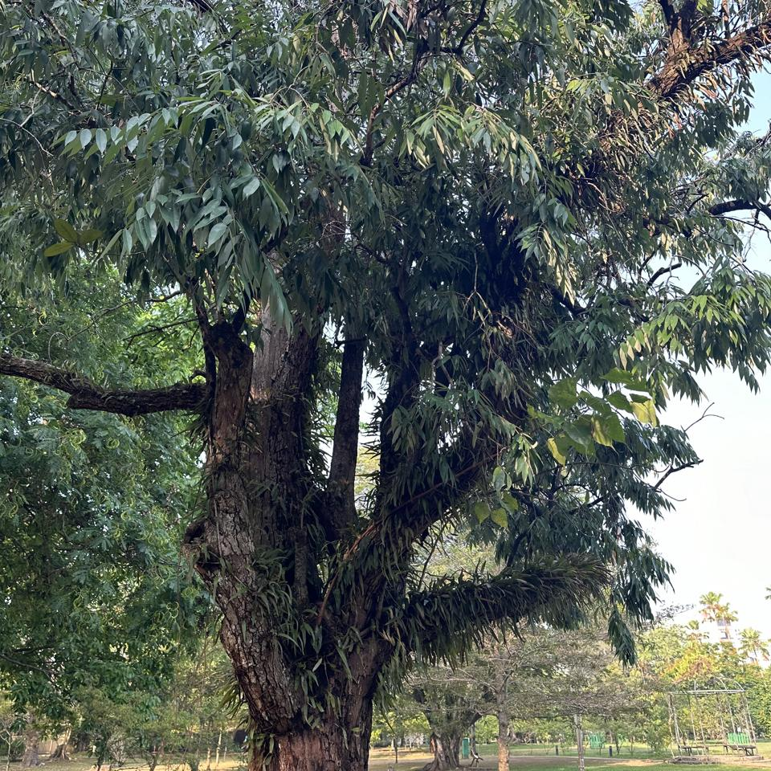 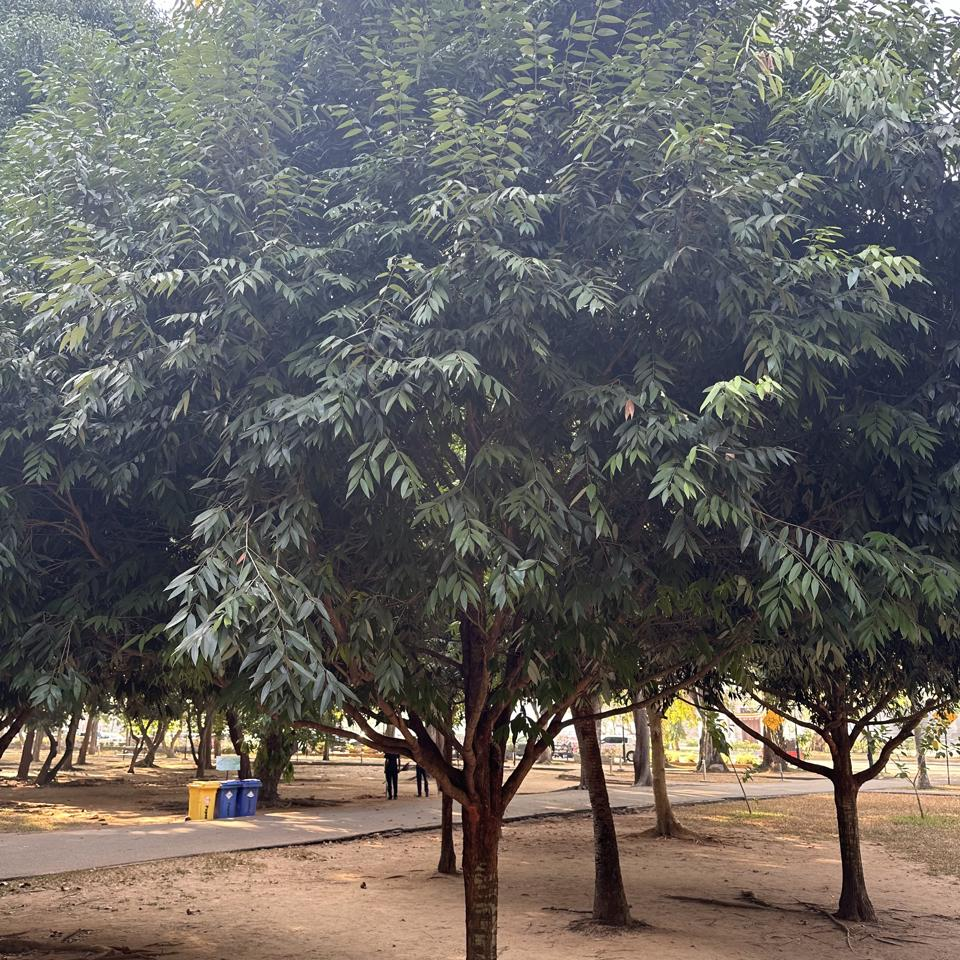 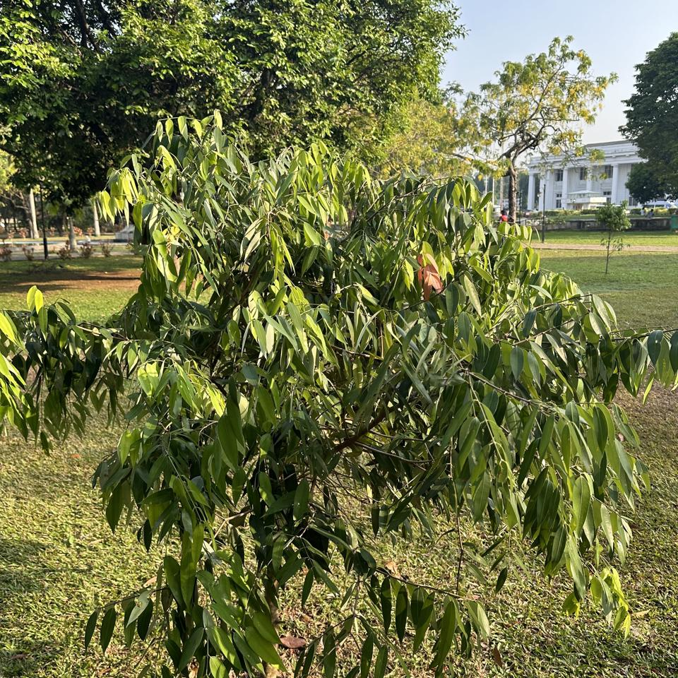

*Ceylon Ironwood, Cirunakappu, Iron Wood Tree, Mesua, Na, Naa, Nagakesarah Nagapuspa, Nangu*

Mesua ferrea, the Ceylon ironwood,  or cobra saffron, is a species in the family Calophyllaceae native to the Indomalayan realm. This slow-growing tree is named after the heaviness and hardness of its timber. It is widely cultivated as an ornamental for its graceful shape, grayish-green foliage with a beautiful pink to red flush of drooping young leaves, and large, fragrant white flowers. It is the national tree of Sri Lanka, as well as the state tree of Mizoram and state flower of Tripura in India. [[Wikipedia](https://en.wikipedia.org/wiki/Mesua_ferrea)]

### [*Terminalia arjuna*](https://en.wikipedia.org/wiki/Terminalia_arjuna) ([*Combretaceae*](https://en.wikipedia.org/wiki/Combretaceae))

*16 Photos*

  

*Arjun, Kakubha, Kumbuk, Maruthu, Marutu, White murdh*

Terminalia arjuna is a tree of the genus Terminalia. It is commonly known as arjuna or arjun tree in English. [[Wikipedia](https://en.wikipedia.org/wiki/Terminalia_arjuna)]

### [*Mangifera indica*](https://en.wikipedia.org/wiki/Mangifera_indica) ([*Anacardiaceae*](https://en.wikipedia.org/wiki/Anacardiaceae))

*14 Photos*

 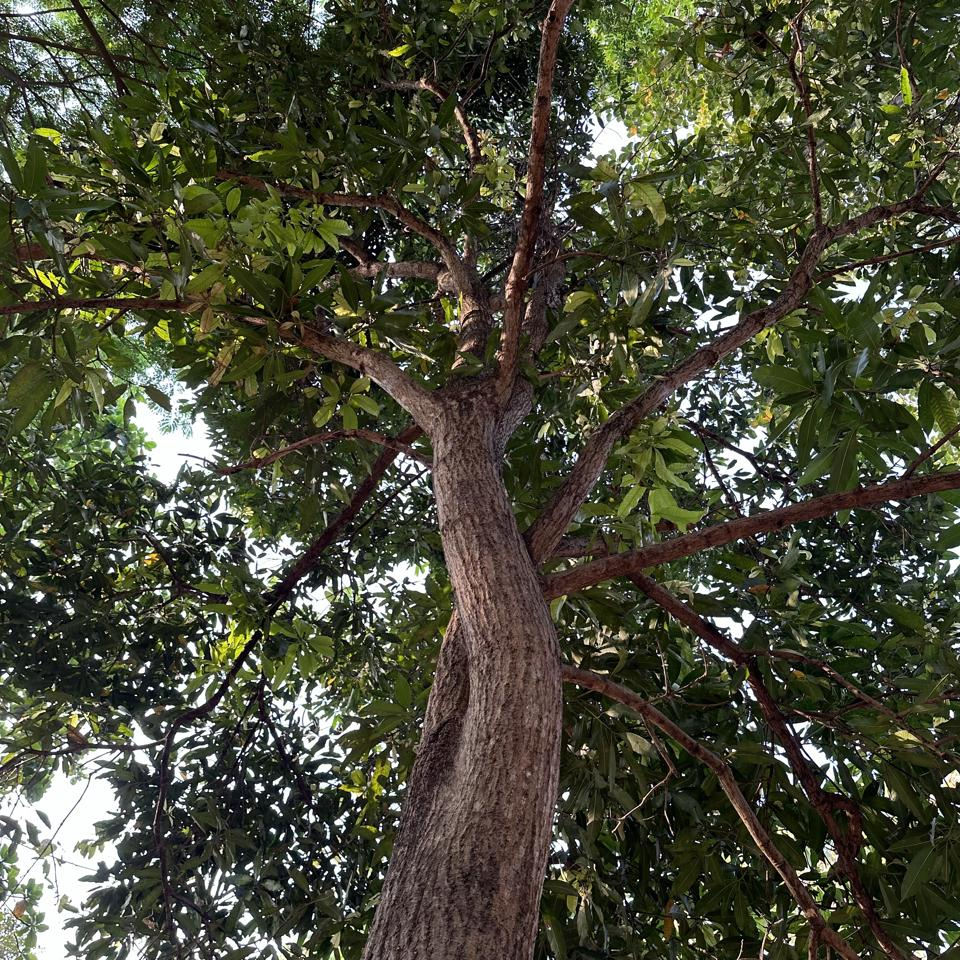 

*Amba, Amiram, Amra, Ma, Mamaram, Mangai, Mango, Mango Tree, Mee Amba, Sahakara, आम*

Mangifera indica, commonly known as mango, is a species of flowering plant in the family Anacardiaceae. It is a large fruit tree, capable of growing to a height of 30 metres (100 feet). There are two distinct genetic populations in modern mangoes – the "Indian type" and the "Southeast Asian type". [[Wikipedia](https://en.wikipedia.org/wiki/Mangifera_indica)]

### [*Terminalia catappa*](https://en.wikipedia.org/wiki/Terminalia_catappa) ([*Combretaceae*](https://en.wikipedia.org/wiki/Combretaceae))

*13 Photos*

  

*Country-almond, Indian-almond, Kottamba, Kottan, Nattu Vadam, Nattuvadumai, Tailaphala, Tropical almond*

Terminalia catappa is a large tropical tree in the leadwood tree family, Combretaceae, native to Asia, Australia, the Pacific, Madagascar and Seychelles. Common names in English include country almond, Indian almond, Malabar almond, sea almond, tropical almond, beach almond and false kamani. [[Wikipedia](https://en.wikipedia.org/wiki/Terminalia_catappa)]

### [*Artocarpus heterophyllus*](https://en.wikipedia.org/wiki/Artocarpus_heterophyllus) ([*Moraceae*](https://en.wikipedia.org/wiki/Moraceae))

*10 Photos*

  

*Herali, Jackfruit, Kos, Pala, Palavu, Panasam, Pila, Vaela, Waraka See Artocarpus Indica, কাঠাল, పనస*

The jackfruit is the fruit of jack tree Artocarpus heterophyllus, a species of tree in the fig, mulberry, and breadfruit family (Moraceae). The jackfruit is the largest tree fruit, reaching as much as 55 kg (120 pounds) in weight, 90 cm (35 inches) in length, and 50 cm (20 inches) in diameter. A mature jackfruit tree produces some 200 fruits per year, with older trees bearing up to 500 fruits in a year. The jackfruit is a multiple fruit composed of hundreds to thousands of individual flowers, and the fleshy petals of the unripe fruit are eaten.The jackfruit tree is well-suited to tropical lowlands and is widely cultivated throughout tropical regions of the world, including India, Bangladesh, Sri Lanka, and the rainforests of the Philippines, Indonesia, Malaysia, and Australia.The ripe fruit is sweet (depending on variety) and is commonly used in desserts. Canned green jackfruit has a mild taste and meat-like texture that lends itself to being called "vegetable meat". Jackfruit is commonly used in South and Southeast Asian cuisines. Both ripe and unripe fruits are consumed. It is available internationally, canned or frozen, and in chilled meals, as are various products derived from the fruit, such as noodles and chips. [[Wikipedia](https://en.wikipedia.org/wiki/Artocarpus_heterophyllus)]

### [*Cassia fistula*](https://en.wikipedia.org/wiki/Cassia_fistula) ([*Fabaceae*](https://en.wikipedia.org/wiki/Fabaceae))

*9 Photos*

  

*Aehaela, Amaltas, Aragvadha, Ehela, Golden Shower Tree, Indian-laburnum, Konnai, Konrai, Mullaimaram*

Cassia fistula, also known as golden shower, purging cassia, Indian laburnum, Kani Konna (Malayalam: കണിക്കൊന്ന),, Konna Poo or pudding-pipe tree, is a flowering plant in the family Fabaceae. The species is native to the Indian subcontinent and adjacent regions of Southeast Asia. It is the official state flower of Kerala state in India. It is also a popular ornamental plant and is also used in herbal medicine. [[Wikipedia](https://en.wikipedia.org/wiki/Cassia_fistula)]

### [*Tabernaemontana divaricata*](https://en.wikipedia.org/wiki/Tabernaemontana_divaricata) ([*Apocynaceae*](https://en.wikipedia.org/wiki/Apocynaceae))

*9 Photos*

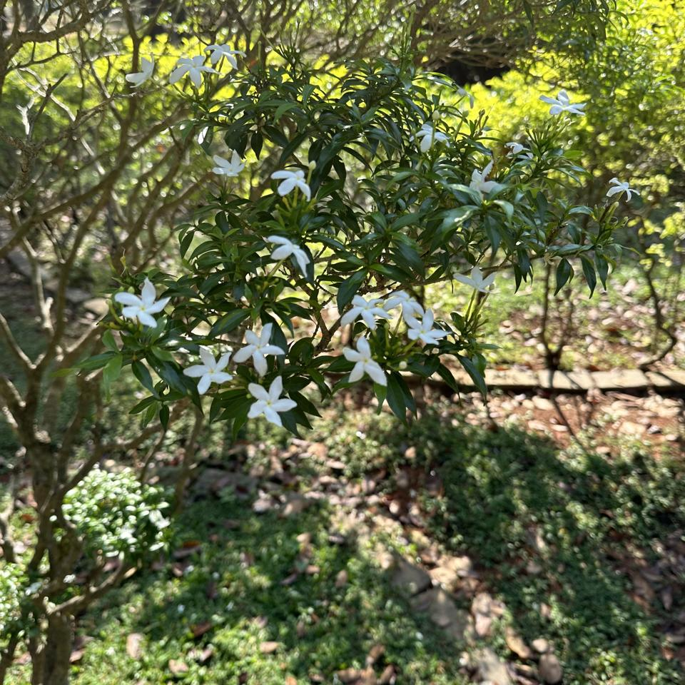  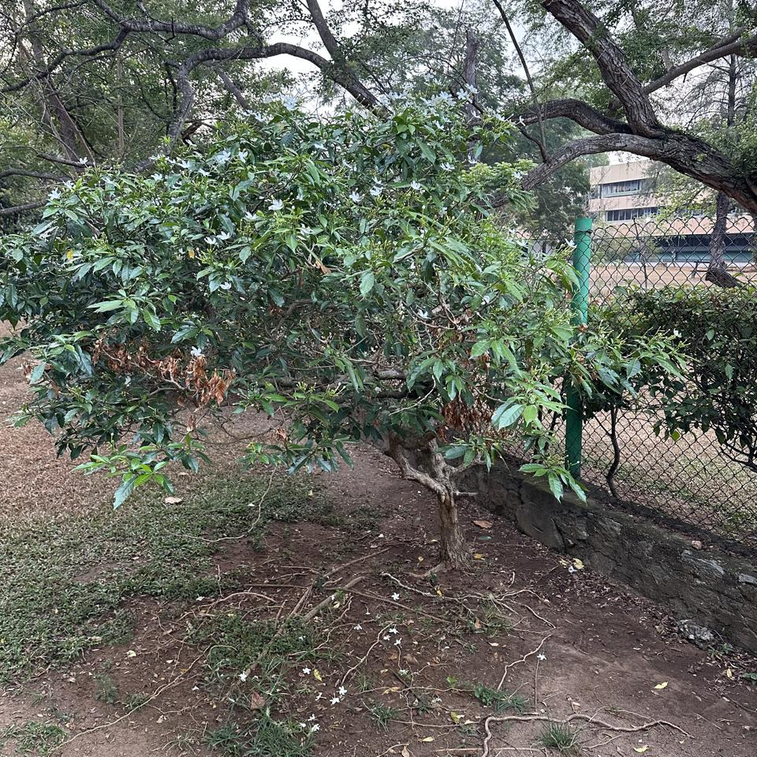

*Adukkunandiyavattai, Butterfly-gardenia, Crape-jasmine, Nandi Battai, Nandiar Vattai, Nandivrksah, Vathu Sudda, Wathu Sudda, Watu Sudda, Watusudda, నందివర్ధనం*

Tabernaemontana divaricata, commonly called pinwheel flower, crape jasmine, East India rosebay, and Nero's crown, is an evergreen shrub or small tree native to South Asia, Southeast Asia and China. In zones where it is not hardy it is grown as a house/glasshouse plant for its attractive flowers and foliage. The stem exudes a milky latex when broken, whence comes the name milk flower [[Wikipedia](https://en.wikipedia.org/wiki/Tabernaemontana_divaricata)]

### [*Casuarina equisetifolia*](https://en.wikipedia.org/wiki/Casuarina_equisetifolia) ([*Casuarinaceae*](https://en.wikipedia.org/wiki/Casuarinaceae))

*8 Photos*

  

*Australian beefwood, Australian-pine, Beach sheoak*

Casuarina equisetifolia, commonly known as coastal she-oak, horsetail she-oak, ironwood, beach sheoak, beach casuarina or whistling tree  is a species of flowering plant in the family Casuarinaceae and is native to Australia, New Guinea, Southeast Asia and India. It is a small to medium-sized, monoecious tree with scaly or furrowed bark on older specimens, drooping branchlets, the leaves reduced to scales in whorls of 7 or 8, the fruit 10–24 mm (0.39–0.94 in) long containing winged seeds (samaras) 6–8 mm (0.24–0.31 in) long. [[Wikipedia](https://en.wikipedia.org/wiki/Casuarina_equisetifolia)]

### [*Filicium decipiens*](https://en.wikipedia.org/wiki/Filicium_decipiens) ([*Sapindaceae*](https://en.wikipedia.org/wiki/Sapindaceae))

*8 Photos*

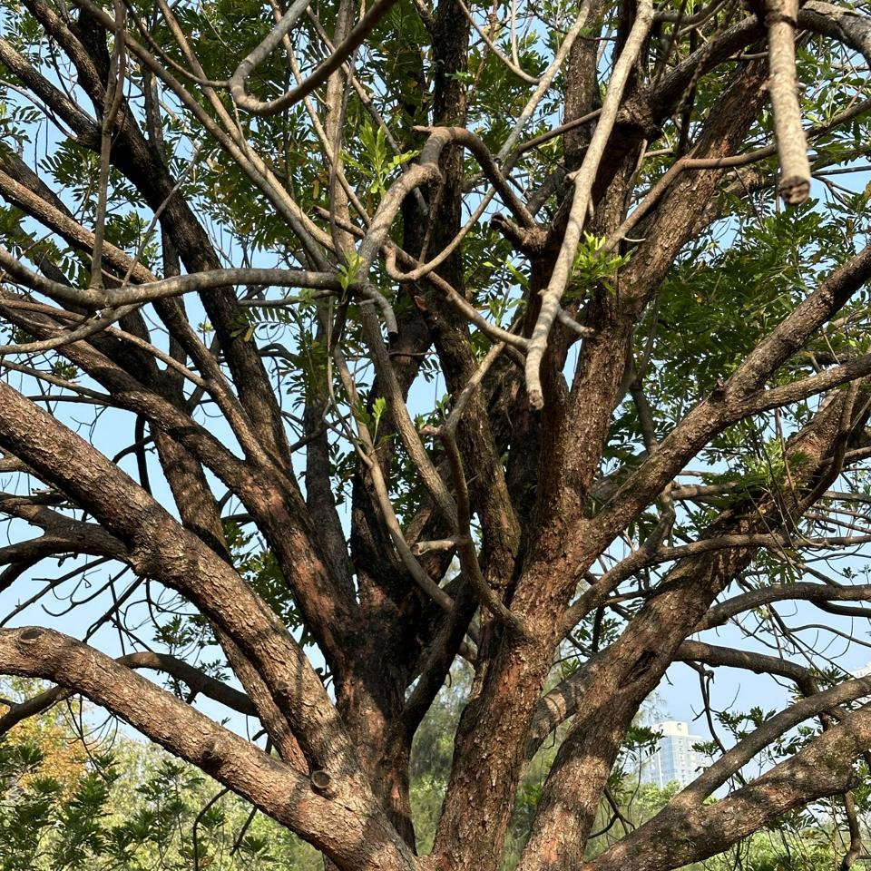  

*Ferntree*

Filicium decipiens, called the ferntree, fern tree or fern leaf tree, is a species of Filicium found in east Africa, Madagascar, India and Sri Lanka. It is planted as an ornamental tree in the Indian subcontinent, Indonesia, Hawaii, and elsewhere.

== References == [[Wikipedia](https://en.wikipedia.org/wiki/Filicium_decipiens)]

### [*Peltophorum pterocarpum*](https://en.wikipedia.org/wiki/Peltophorum_pterocarpum) ([*Fabaceae*](https://en.wikipedia.org/wiki/Fabaceae))

*8 Photos*

 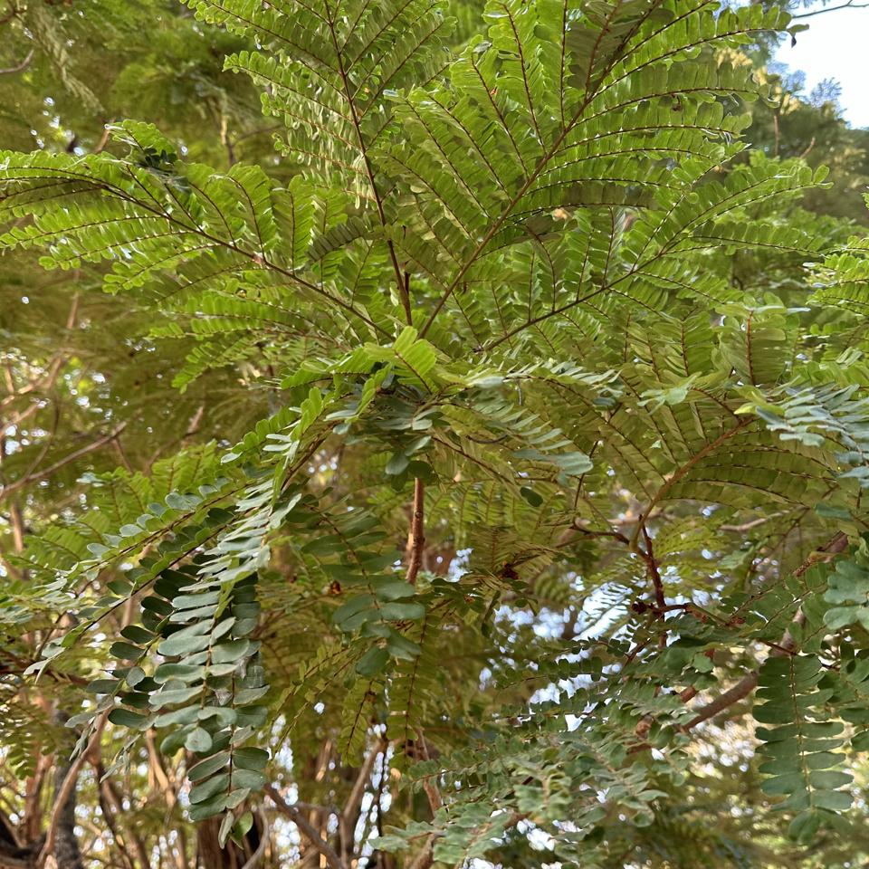 

*Copperpod, Kaha Maara, Kona Maram, Maara, Nilalvakai, Yellow flame, Yellow flametree*

Peltophorum pterocarpum (commonly known as copperpod, yellow-flamboyant, yellow flametree, yellow poinciana or yellow-flame) is a species of Peltophorum, native to tropical southeastern Asia and a popular ornamental tree grown around the world. [[Wikipedia](https://en.wikipedia.org/wiki/Peltophorum_pterocarpum)]

## Statistics by Taxonomy

### Species

**120** unique Species.

| # | Species | n(Photos) | % |
| ---: | :--- | ---: | ---: |
| 1 | [*Mesua ferrea*](https://en.wikipedia.org/wiki/Mesua_ferrea) | 26 | 7.9% |
| 2 | [*Terminalia arjuna*](https://en.wikipedia.org/wiki/Terminalia_arjuna) | 16 | 4.8% |
| 3 | [*Mangifera indica*](https://en.wikipedia.org/wiki/Mangifera_indica) | 14 | 4.2% |
| 4 | [*Terminalia catappa*](https://en.wikipedia.org/wiki/Terminalia_catappa) | 13 | 3.9% |
| 5 | [*Artocarpus heterophyllus*](https://en.wikipedia.org/wiki/Artocarpus_heterophyllus) | 10 | 3.0% |
| 6 | [*Cassia fistula*](https://en.wikipedia.org/wiki/Cassia_fistula) | 9 | 2.7% |
| 7 | [*Tabernaemontana divaricata*](https://en.wikipedia.org/wiki/Tabernaemontana_divaricata) | 9 | 2.7% |
| 8 | [*Casuarina equisetifolia*](https://en.wikipedia.org/wiki/Casuarina_equisetifolia) | 8 | 2.4% |
| 9 | [*Filicium decipiens*](https://en.wikipedia.org/wiki/Filicium_decipiens) | 8 | 2.4% |
| 10 | [*Peltophorum pterocarpum*](https://en.wikipedia.org/wiki/Peltophorum_pterocarpum) | 8 | 2.4% |
|  | *(All Others)* | 220 | 66.7% |

### Genera

**95** unique Genera.

| # | Genera | n(Photos) | % |
| ---: | :--- | ---: | ---: |
| 1 | [*Terminalia*](https://en.wikipedia.org/wiki/Terminalia) | 29 | 8.8% |
| 2 | [*Mesua*](https://en.wikipedia.org/wiki/Mesua) | 26 | 7.9% |
| 3 | [*Ficus*](https://en.wikipedia.org/wiki/Ficus) | 18 | 5.5% |
| 4 | [*Mangifera*](https://en.wikipedia.org/wiki/Mangifera) | 14 | 4.2% |
| 5 | [*Cassia*](https://en.wikipedia.org/wiki/Cassia) | 10 | 3.0% |
| 6 | [*Artocarpus*](https://en.wikipedia.org/wiki/Artocarpus) | 10 | 3.0% |
| 7 | [*Peltophorum*](https://en.wikipedia.org/wiki/Peltophorum) | 10 | 3.0% |
| 8 | [*Casuarina*](https://en.wikipedia.org/wiki/Casuarina) | 9 | 2.7% |
| 9 | [*Tabernaemontana*](https://en.wikipedia.org/wiki/Tabernaemontana) | 9 | 2.7% |
| 10 | [*Filicium*](https://en.wikipedia.org/wiki/Filicium) | 8 | 2.4% |
|  | *(All Others)* | 170 | 51.5% |

### Families

**43** unique Families.

| # | Families | n(Photos) | % |
| ---: | :--- | ---: | ---: |
| 1 | [*Fabaceae*](https://en.wikipedia.org/wiki/Fabaceae) | 65 | 19.7% |
| 2 | [*Combretaceae*](https://en.wikipedia.org/wiki/Combretaceae) | 31 | 9.4% |
| 3 | [*Moraceae*](https://en.wikipedia.org/wiki/Moraceae) | 28 | 8.5% |
| 4 | [*Calophyllaceae*](https://en.wikipedia.org/wiki/Calophyllaceae) | 28 | 8.5% |
| 5 | [*Apocynaceae*](https://en.wikipedia.org/wiki/Apocynaceae) | 18 | 5.5% |
| 6 | [*Anacardiaceae*](https://en.wikipedia.org/wiki/Anacardiaceae) | 18 | 5.5% |
| 7 | [*Bignoniaceae*](https://en.wikipedia.org/wiki/Bignoniaceae) | 16 | 4.8% |
| 8 | [*Myrtaceae*](https://en.wikipedia.org/wiki/Myrtaceae) | 14 | 4.2% |
| 9 | [*Meliaceae*](https://en.wikipedia.org/wiki/Meliaceae) | 12 | 3.6% |
| 10 | [*Sapindaceae*](https://en.wikipedia.org/wiki/Sapindaceae) | 11 | 3.3% |
|  | *(All Others)* | 66 | 20.0% |

## Sample of Plant Photos difficult to Identify

Photos where the identification confidence is **< 20%**.

### Photo-2024-03-26-08-01-11

* 16.1% *Mimusops elengi*
* 10.5% *Ficus benjamina*
* 10.2% *Ficus retusa*

### Photo-2024-03-26-07-49-00

* 8.6% *Vitex altissima*
* 6.3% *Adansonia digitata*
* 5.5% *Vitex pinnata*

### Photo-2024-03-15-07-07-08

* 5.5% *Azadirachta indica*
* 2.6% *Tipuana tipu*
* 1.5% *Diospyros buxifolia*

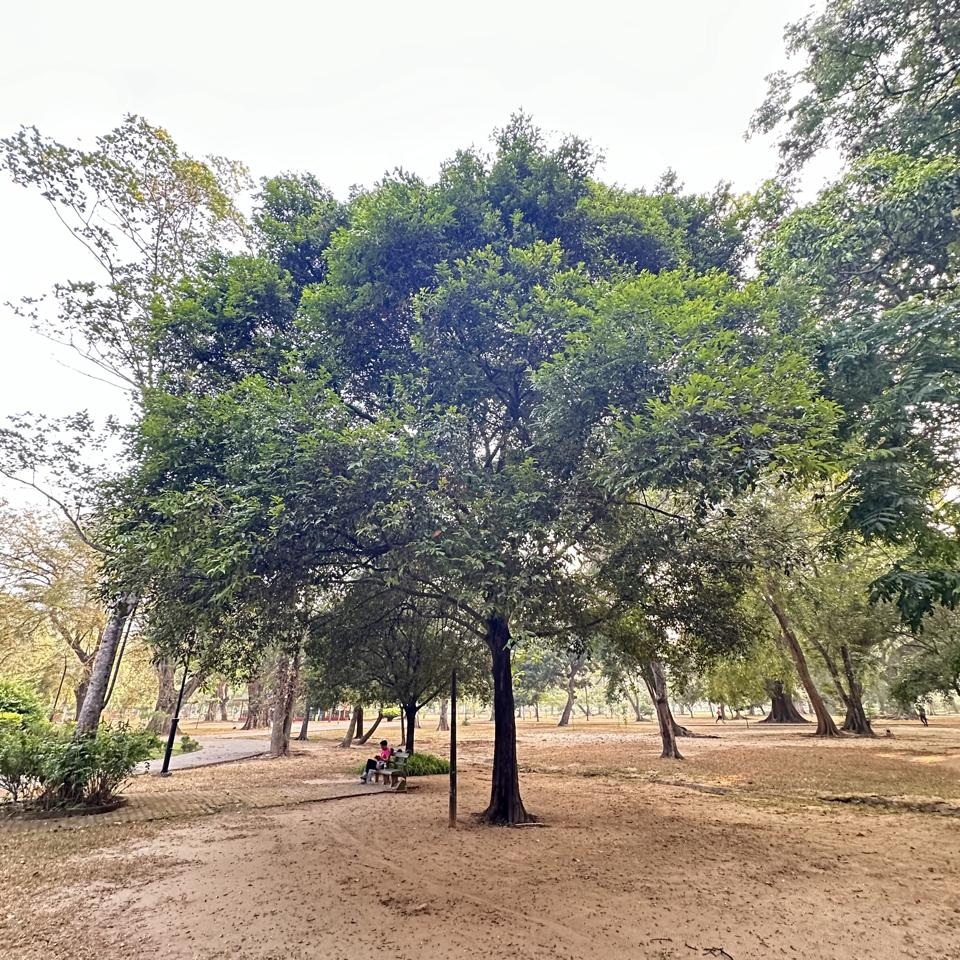

### Photo-2024-03-19-07-15-40

* 4.3% *Peltophorum dubium*
* 3.4% *Peltophorum africanum*
* 1.7% *Samanea saman*

### Photo-2024-03-19-07-11-49

* 3.8% *Albizia lebbeck*
* 3.3% *Pometia pinnata*
* 2.1% *Pterocarpus indicus*

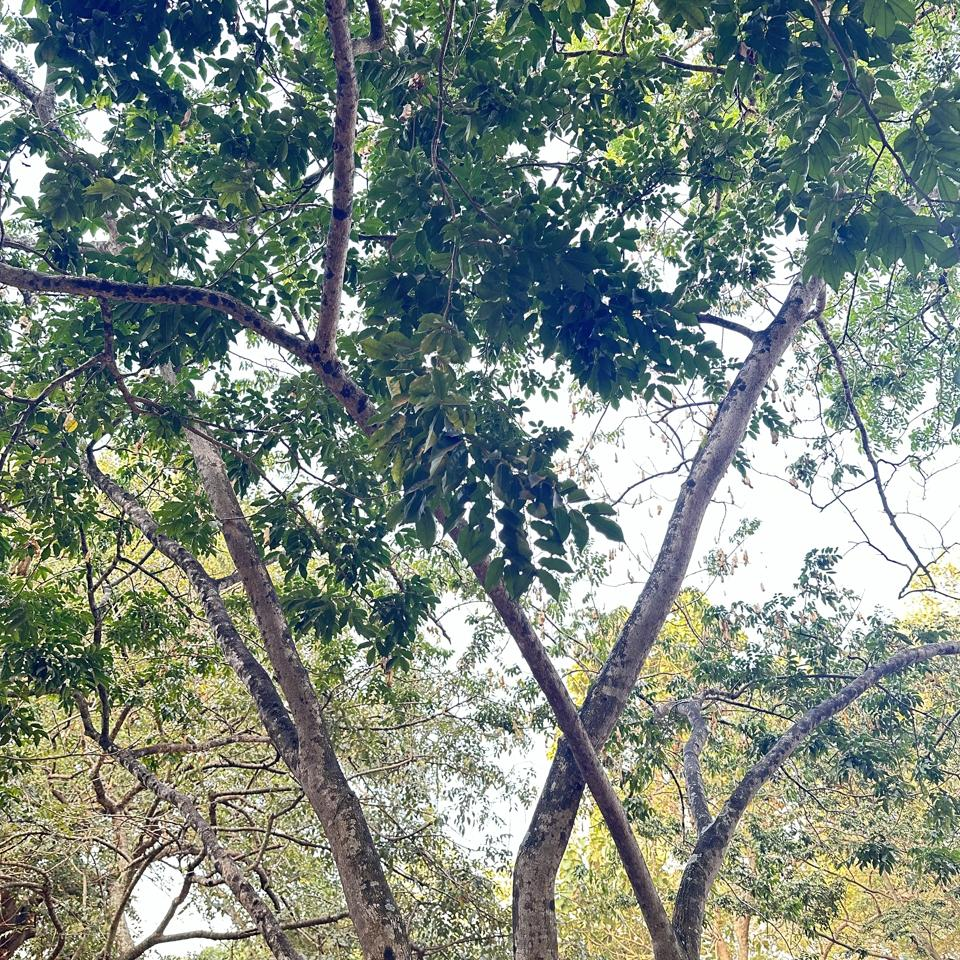

### Photo-2024-03-11-06-46-20

* 10.7% *Terminalia arjuna*
* 6.1% *Punica granatum*
* 2.6% *Nephelium lappaceum*

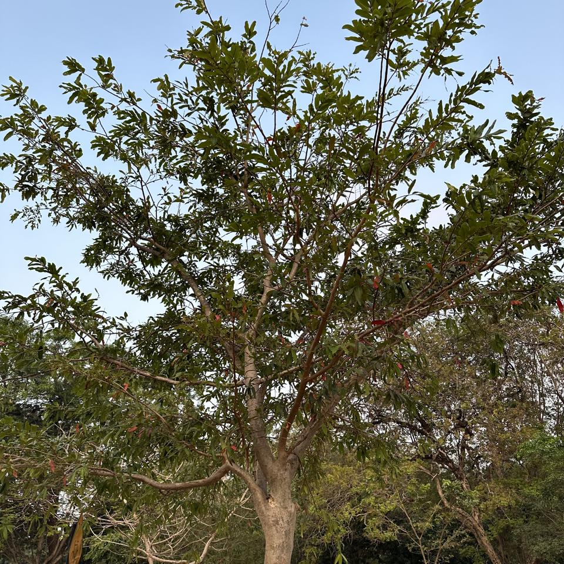

### Photo-2024-03-11-06-43-18

* 9.0% *Filicium decipiens*
* 6.0% *Prosopis glandulosa*
* 5.0% *Peronema canescens*

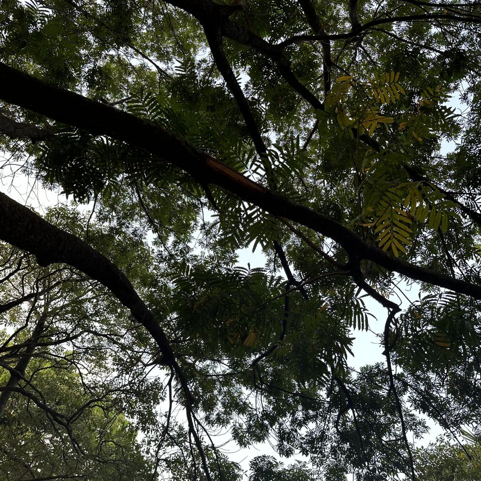

### Photo-2024-03-26-07-48-19

* 16.1% *Swietenia macrophylla*
* 5.0% *Swietenia mahagoni*
* 4.6% *Spondias mombin*

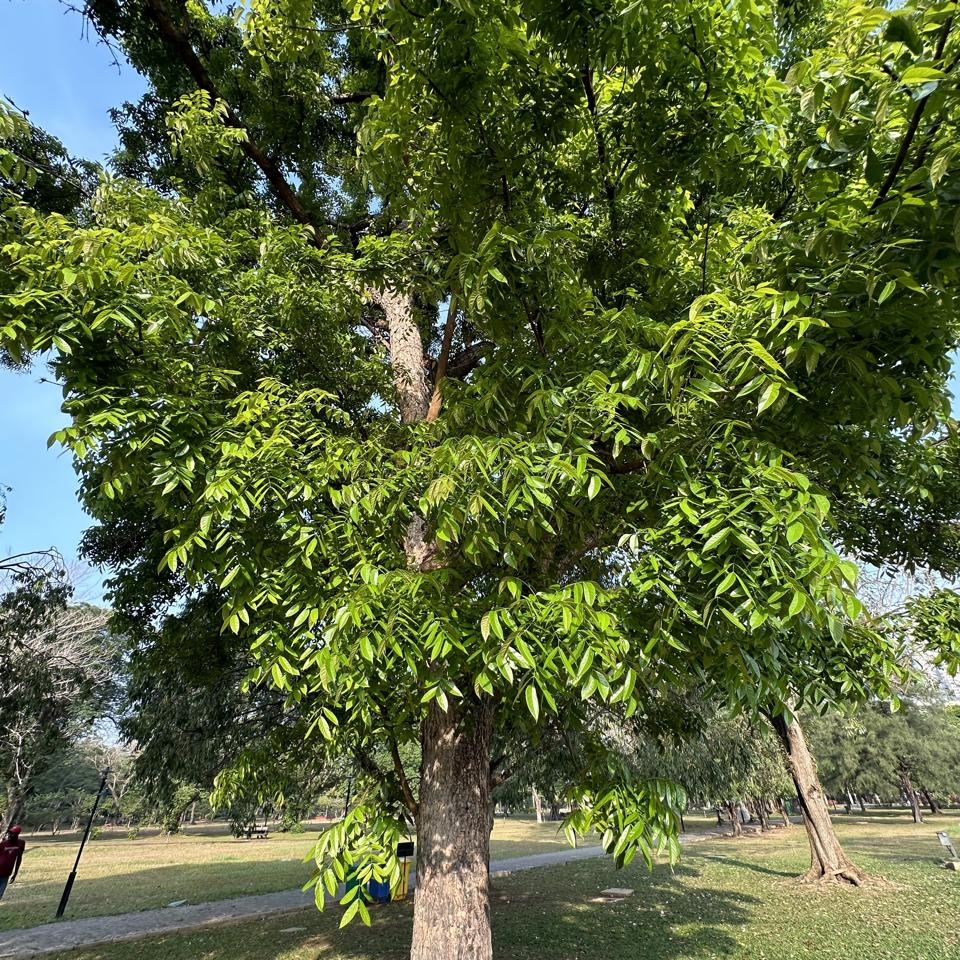

### Photo-2024-03-15-07-10-58

* 13.7% *Peltophorum pterocarpum*
* 6.1% *Libidibia ferrea*
* 1.9% *Biancaea sappan*

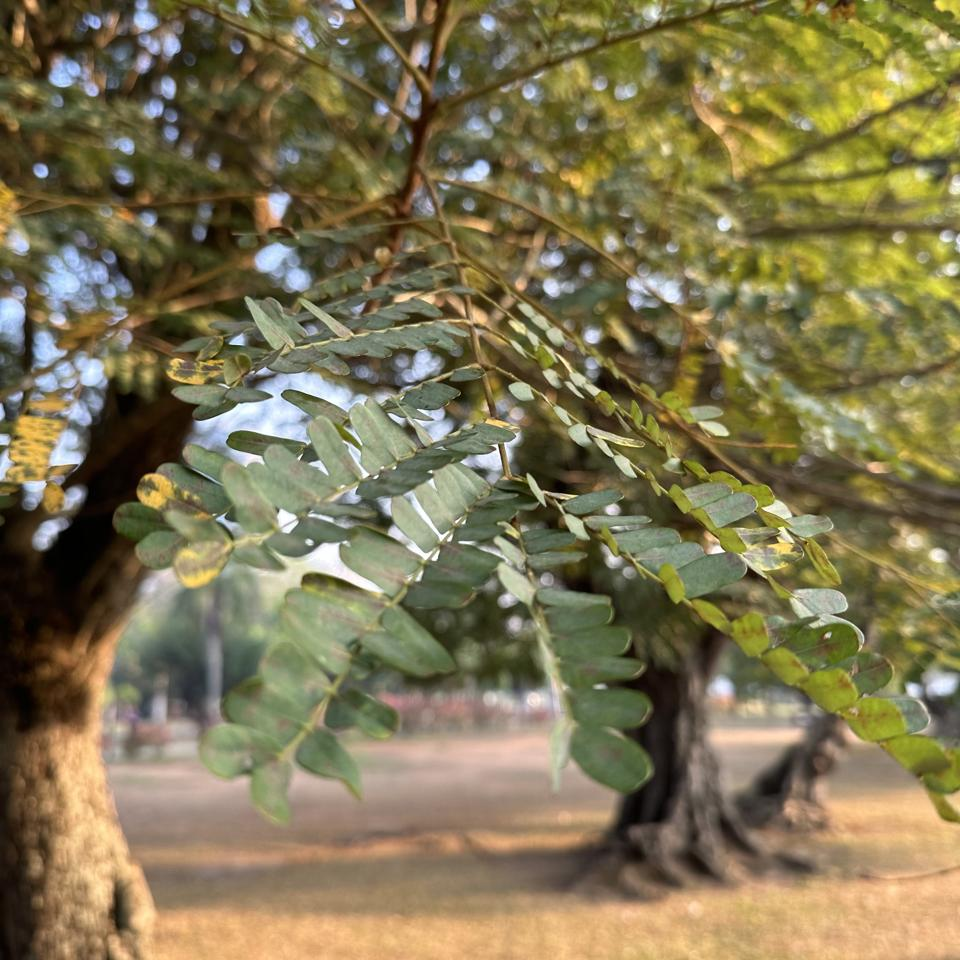

### Photo-2024-03-21-08-16-49

* 5.5% *Jacaranda mimosifolia*
* 3.1% *Pterocarpus indicus*
* 2.9% *Albizia procera*

### Photo-2024-03-20-07-44-37

* 8.0% *Lagerstroemia speciosa*
* 4.3% *Diospyros melanoxylon*
* 2.3% *Strychnos nux-vomica*

### Photo-2024-03-26-07-39-39

* 7.4% *Ficus altissima*
* 1.8% *Cassia grandis*
* 1.1% *Ficus virens*

### Photo-2024-03-08-06-55-50

* 12.9% *Hibiscus rosa-sinensis*
* 5.6% *Hibiscus fragilis*
* 4.4% *Hibiscus schizopetalus*

### Photo-2024-03-21-07-49-57

* 19.6% *Areca triandra*
* 3.6% *Dendrocalamus giganteus*
* 0.2% *Areca catechu*

### Photo-2024-03-21-08-16-00

* 4.7% *Terminalia arjuna*
* 2.7% *Syzygium samarangense*
* 1.9% *Psidium guajava*

### Photo-2024-03-15-07-06-42

* 5.7% *Madhuca longifolia*
* 4.9% *Alstonia macrophylla*
* 2.1% *Mangifera indica*

### Photo-2024-03-21-08-13-46

* 5.2% *Manilkara zapota*
* 3.9% *Madhuca longifolia*
* 0.6% *Elaeocarpus angustifolius*

### Photo-2024-03-15-07-09-14

* 14.3% *Terminalia arjuna*
* 6.1% *Syzygium cumini*
* 3.3% *Syzygium jambos*

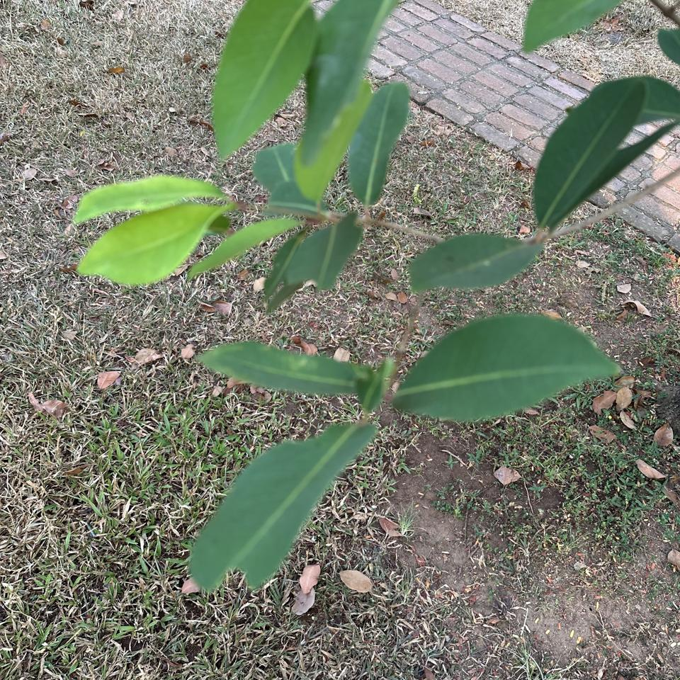

### Photo-2024-03-26-07-59-09

* 1.6% *Syzygium jambos*
* 0.9% *Corymbia maculata*
* 0.5% *Syzygium cymosum*

### Photo-2024-02-10-08-03-25

* 5.3% *Pittosporum undulatum*
* 3.4% *Melaleuca alternifolia*
* 3.2% *Camellia sinensis*

