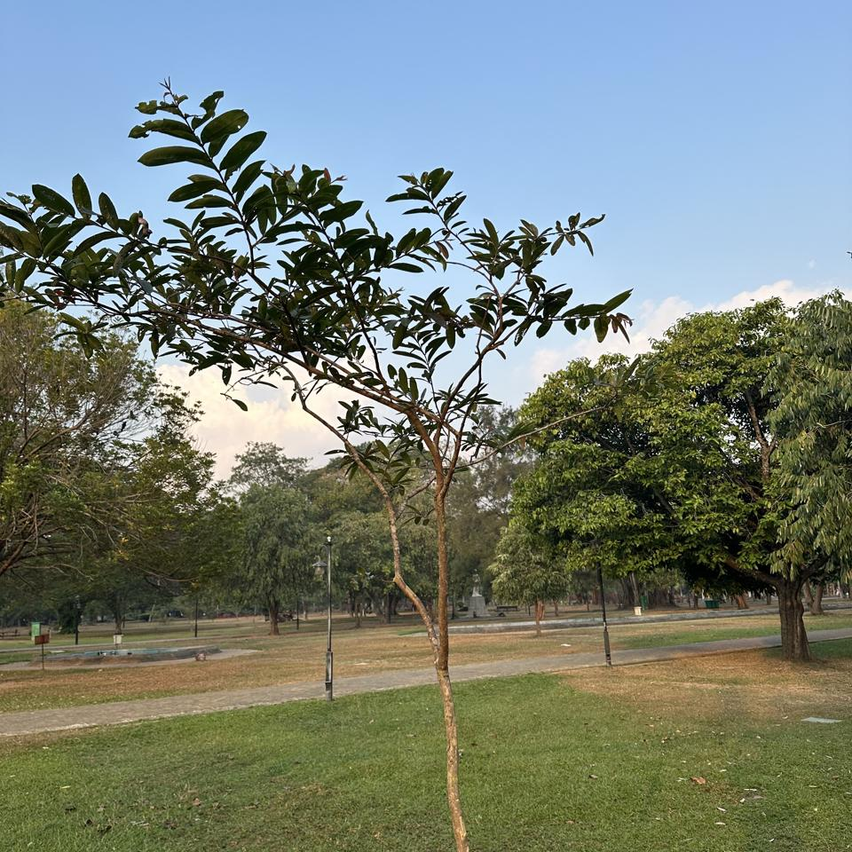
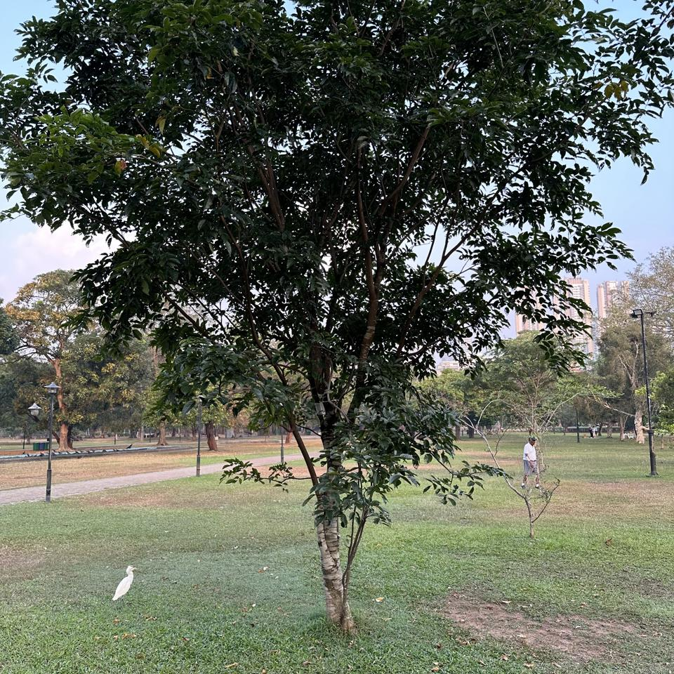

# Viharamahadevi Park, Colombo, Sri Lanka

## Summary Statistics

|  |  |  |
| --- | ---: | --- |
| **Unique Families** | 35 | Fabaceae (12), Moraceae (10), Bignoniaceae (8), Myrtaceae (8), Apocynaceae (6) |
| **Unique Genera** | 56 | Tabebuia (Bignoniaceae) (8), Ficus (Moraceae) (8), Melaleuca (Myrtaceae) (5), Terminalia (Combretaceae) (4), Mangifera (Anacardiaceae) (3) |
| **Unique Species** | 68 | Tabebuia rosea (6), Melaleuca quinquenervia (4), Mangifera indica (3), Toona ciliata (3), Roystonea regia (3) |
| **Total Plants** | 93 | |
## ❓ [Vachellia nilotica](https://en.wikipedia.org/wiki/Vachellia_nilotica) ([6.9156°N,79.8618°E](https://www.google.com/maps/place/6.915586N,79.861817E))

|  |  |
| --- | --- |
| **Scientific Name** | *[Vachellia nilotica](https://en.wikipedia.org/wiki/Vachellia_nilotica)* (L.) P.J.H.Hurter & Mabb. |
| **Genus** | Vachellia |
| **Family** | Fabaceae |
| **Common Names** | Gum arabic tree, Black Piquant, Cassie |
| **Identification Confidence** | ❓ 16.5% |
| **Other Candidates** | Vachellia farnesiana (5.1%), Nothofagus antarctica (4.4%), Tamarindus indica (3.9%), Ulmus pumila (2.4%) |
|  |  |
| **Time** | 07:03 AM (Mar 08, 2024) |
| **Camera Direction** | 289.9° (W) |
| **Location** | [6.9156°N,79.8618°E](https://www.google.com/maps/place/6.915586N,79.861817E) |
| **Altitude** | 12.3m |

## ❓ [Bunchosia armeniaca](https://en.wikipedia.org/wiki/Bunchosia_armeniaca) ([6.9156°N,79.8618°E](https://www.google.com/maps/place/6.915556N,79.861839E))

|  |  |
| --- | --- |
| **Scientific Name** | *[Bunchosia armeniaca](https://en.wikipedia.org/wiki/Bunchosia_armeniaca)* (Cav.) DC. |
| **Genus** | Bunchosia |
| **Family** | Malpighiaceae |
| **Common Names** | Peanut butter fruit, Sunset fruit |
| **Identification Confidence** | ❓ 11.3% |
| **Other Candidates** | Ehretia anacua (10.4%), Flacourtia jangomas (3.4%), Malpighia glabra (3.3%), Campomanesia xanthocarpa (2.4%) |
|  |  |
| **Time** | 07:03 AM (Mar 08, 2024) |
| **Camera Direction** | 210.1° (SW) |
| **Location** | [6.9156°N,79.8618°E](https://www.google.com/maps/place/6.915556N,79.861839E) |
| **Altitude** | 11.0m |

## 🌳 [Tabebuia rosea](https://en.wikipedia.org/wiki/Tabebuia_rosea) ([6.9155°N,79.8621°E](https://www.google.com/maps/place/6.915522N,79.862061E))

|  |  |
| --- | --- |
| **Scientific Name** | *[Tabebuia rosea](https://en.wikipedia.org/wiki/Tabebuia_rosea)* (Bertol.) Bertero ex A.DC. |
| **Genus** | Tabebuia |
| **Family** | Bignoniaceae |
| **Common Names** | Pink poui, Pink trumpet-tree, Rosy trumpet-tree |
| **Identification Confidence** | 🌳 62.7% |
| **Other Candidates** | Citharexylum myrianthum (13.6%), Handroanthus ochraceus (3.3%), Melia azedarach (3.2%), Bischofia javanica (1.4%) |
|  |  |
| **Time** | 07:03 AM (Mar 08, 2024) |
| **Camera Direction** | 346.8° (N) |
| **Location** | [6.9155°N,79.8621°E](https://www.google.com/maps/place/6.915522N,79.862061E) |
| **Altitude** | 10.0m |

## ❓ [Laurus nobilis](https://en.wikipedia.org/wiki/Laurus_nobilis) ([6.9155°N,79.8623°E](https://www.google.com/maps/place/6.915464N,79.862336E))

|  |  |
| --- | --- |
| **Scientific Name** | *[Laurus nobilis](https://en.wikipedia.org/wiki/Laurus_nobilis)* L. |
| **Genus** | Laurus |
| **Family** | Lauraceae |
| **Common Names** | (Sweet) Bay leaf, Bay Laurel, Sweet bay |
| **Identification Confidence** | ❓ 14.7% |
| **Other Candidates** | Laurus azorica (3.4%), Ruprechtia laxiflora (3.3%), Gymnanthemum amygdalinum (2.7%), Combretum kraussii (2.2%) |
|  |  |
| **Time** | 07:03 AM (Mar 08, 2024) |
| **Camera Direction** | 303.6° (NW) |
| **Location** | [6.9155°N,79.8623°E](https://www.google.com/maps/place/6.915464N,79.862336E) |
| **Altitude** | 7.8m |

## ❓ [Inga uraguensis](https://en.wikipedia.org/wiki/Inga_uraguensis) ([6.9154°N,79.8621°E](https://www.google.com/maps/place/6.915444N,79.862131E))

|  |  |
| --- | --- |
| **Scientific Name** | *[Inga uraguensis](https://en.wikipedia.org/wiki/Inga_uraguensis)* Hook. & Arn. |
| **Genus** | Inga |
| **Family** | Fabaceae |
| **Common Names** |  |
| **Identification Confidence** | ❓ 18.1% |
| **Other Candidates** | Swietenia macrophylla (2.0%), Tabebuia rosea (1.9%), Spathodea campanulata (1.9%), Handroanthus impetiginosus (1.8%) |
|  |  |
| **Time** | 07:03 AM (Mar 08, 2024) |
| **Camera Direction** | 356.1° (N) |
| **Location** | [6.9154°N,79.8621°E](https://www.google.com/maps/place/6.915444N,79.862131E) |
| **Altitude** | 11.0m |

## ❓ [Terminalia mantaly](https://en.wikipedia.org/wiki/Terminalia_mantaly) ([6.9153°N,79.8626°E](https://www.google.com/maps/place/6.915325N,79.862556E))

|  |  |
| --- | --- |
| **Scientific Name** | *[Terminalia mantaly](https://en.wikipedia.org/wiki/Terminalia_mantaly)* H.Perrier |
| **Genus** | Terminalia |
| **Family** | Combretaceae |
| **Common Names** | Satellite Tree., Amandier de Madagascar, Ketapang Kencana |
| **Identification Confidence** | ❓ 11.8% |
| **Other Candidates** | Ficus microcarpa (10.4%), Ficus elastica (6.3%), Ficus benghalensis (6.2%), Ficus sycomorus (4.0%) |
|  |  |
| **Time** | 07:03 AM (Mar 08, 2024) |
| **Camera Direction** | 349.7° (N) |
| **Location** | [6.9153°N,79.8626°E](https://www.google.com/maps/place/6.915325N,79.862556E) |
| **Altitude** | 9.1m |

## ❓ [Mangifera indica](https://en.wikipedia.org/wiki/Mangifera_indica) ([6.9153°N,79.8618°E](https://www.google.com/maps/place/6.915297N,79.8618E))

|  |  |
| --- | --- |
| **Scientific Name** | *[Mangifera indica](https://en.wikipedia.org/wiki/Mangifera_indica)* L. |
| **Genus** | Mangifera |
| **Family** | Anacardiaceae |
| **Common Names** | Mango, Mango Tree, आम |
| **Identification Confidence** | ❓ 17.5% |
| **Other Candidates** | × Chitalpa tashkentensis (5.0%), Mimusops elengi (4.9%), Quercus acutissima (3.5%), Acacia auriculiformis (3.4%) |
|  |  |
| **Time** | 07:03 AM (Mar 08, 2024) |
| **Camera Direction** | 331.8° (NW) |
| **Location** | [6.9153°N,79.8618°E](https://www.google.com/maps/place/6.915297N,79.8618E) |
| **Altitude** | 9.5m |

## 🌳 [Terminalia catappa](https://en.wikipedia.org/wiki/Terminalia_catappa) ([6.9153°N,79.8618°E](https://www.google.com/maps/place/6.915267N,79.861847E))

|  |  |
| --- | --- |
| **Scientific Name** | *[Terminalia catappa](https://en.wikipedia.org/wiki/Terminalia_catappa)* L. |
| **Genus** | Terminalia |
| **Family** | Combretaceae |
| **Common Names** | Tropical almond, Indian-almond, Country-almond |
| **Identification Confidence** | 🌳 94.1% |
| **Other Candidates** | Tectona grandis (0.7%), Careya arborea (0.5%), Anacardium occidentale (0.3%), Anthocleista grandiflora (0.2%) |
|  |  |
| **Time** | 07:03 AM (Mar 08, 2024) |
| **Camera Direction** | 273.6° (W) |
| **Location** | [6.9153°N,79.8618°E](https://www.google.com/maps/place/6.915267N,79.861847E) |
| **Altitude** | 10.5m |

## ❓ [Toona ciliata](https://en.wikipedia.org/wiki/Toona_ciliata) ([6.9153°N,79.8619°E](https://www.google.com/maps/place/6.915258N,79.861908E))

|  |  |
| --- | --- |
| **Scientific Name** | *[Toona ciliata](https://en.wikipedia.org/wiki/Toona_ciliata)* M.Roem. |
| **Genus** | Toona |
| **Family** | Meliaceae |
| **Common Names** | Red Cedar, Australian redcedar, Australian red-cedar |
| **Identification Confidence** | ❓ 25.5% |
| **Other Candidates** | Handroanthus serratifolius (20.3%), Pleiogynium timoriense (9.6%), Pterocarpus indicus (8.7%), Cassia fistula (4.3%) |
|  |  |
| **Time** | 07:03 AM (Mar 08, 2024) |
| **Camera Direction** | 342.5° (N) |
| **Location** | [6.9153°N,79.8619°E](https://www.google.com/maps/place/6.915258N,79.861908E) |
| **Altitude** | 11.1m |

## 🌳 [Artocarpus heterophyllus](https://en.wikipedia.org/wiki/Artocarpus_heterophyllus) ([6.9152°N,79.8619°E](https://www.google.com/maps/place/6.915197N,79.861947E))

|  |  |
| --- | --- |
| **Scientific Name** | *[Artocarpus heterophyllus](https://en.wikipedia.org/wiki/Artocarpus_heterophyllus)* Lam. |
| **Genus** | Artocarpus |
| **Family** | Moraceae |
| **Common Names** | Jackfruit, কাঠাল, పనస |
| **Identification Confidence** | 🌳 94.2% |
| **Other Candidates** | Artocarpus integer (3.4%), Ficus benghalensis (0.1%) |
|  |  |
| **Time** | 07:03 AM (Mar 08, 2024) |
| **Camera Direction** | 259.6° (W) |
| **Location** | [6.9152°N,79.8619°E](https://www.google.com/maps/place/6.915197N,79.861947E) |
| **Altitude** | 10.0m |

## ❓ [Afzelia africana](https://en.wikipedia.org/wiki/Afzelia_africana) ([6.9151°N,79.8620°E](https://www.google.com/maps/place/6.915136N,79.862E))

|  |  |
| --- | --- |
| **Scientific Name** | *[Afzelia africana](https://en.wikipedia.org/wiki/Afzelia_africana)* Sm. ex Pers. |
| **Genus** | Afzelia |
| **Family** | Fabaceae |
| **Common Names** | African-mahogany, Afzelia |
| **Identification Confidence** | ❓ 29.3% |
| **Other Candidates** | Terminalia chebula (5.1%), Afzelia quanzensis (5.0%), Tabebuia rosea (3.3%), Pterocarpus angolensis (2.5%) |
|  |  |
| **Time** | 07:03 AM (Mar 08, 2024) |
| **Camera Direction** | 350.4° (N) |
| **Location** | [6.9151°N,79.8620°E](https://www.google.com/maps/place/6.915136N,79.862E) |
| **Altitude** | 10.1m |

## ❓ [Averrhoa bilimbi](https://en.wikipedia.org/wiki/Averrhoa_bilimbi) ([6.9151°N,79.8626°E](https://www.google.com/maps/place/6.915089N,79.862572E))

|  |  |
| --- | --- |
| **Scientific Name** | *[Averrhoa bilimbi](https://en.wikipedia.org/wiki/Averrhoa_bilimbi)* L. |
| **Genus** | Averrhoa |
| **Family** | Oxalidaceae |
| **Common Names** | Bilimbi, Tree-sorrel, Bilimbi-tree |
| **Identification Confidence** | ❓ 10.9% |
| **Other Candidates** | Lagerstroemia speciosa (7.7%), Brownea grandiceps (5.7%), Phyllanthus acidus (4.9%), Koelreuteria bipinnata (4.4%) |
|  |  |
| **Time** | 07:02 AM (Feb 22, 2024) |
| **Camera Direction** | 278.6° (W) |
| **Location** | [6.9151°N,79.8626°E](https://www.google.com/maps/place/6.915089N,79.862572E) |
| **Altitude** | 6.6m |

## ❓ [Caryocar brasiliense](https://en.wikipedia.org/wiki/Caryocar_brasiliense) ([6.9150°N,79.8627°E](https://www.google.com/maps/place/6.915036N,79.862708E))

|  |  |
| --- | --- |
| **Scientific Name** | *[Caryocar brasiliense](https://en.wikipedia.org/wiki/Caryocar_brasiliense)* A.St.-Hil. |
| **Genus** | Caryocar |
| **Family** | Caryocaraceae |
| **Common Names** | Pequi, Piki, Pekea nut |
| **Identification Confidence** | ❓ 6.6% |
| **Other Candidates** | Averrhoa carambola (5.6%), Bauhinia variegata (5.1%), Bauhinia purpurea (4.8%), Tipuana tipu (3.8%) |
|  |  |
| **Time** | 07:03 AM (Mar 08, 2024) |
| **Camera Direction** | 277.3° (W) |
| **Location** | [6.9150°N,79.8627°E](https://www.google.com/maps/place/6.915036N,79.862708E) |
| **Altitude** | 7.6m |

## 🌳 [Mesua ferrea](https://en.wikipedia.org/wiki/Mesua_ferrea) ([6.9150°N,79.8627°E](https://www.google.com/maps/place/6.914983N,79.862703E))

|  |  |
| --- | --- |
| **Scientific Name** | *[Mesua ferrea](https://en.wikipedia.org/wiki/Mesua_ferrea)* L. |
| **Genus** | Mesua |
| **Family** | Calophyllaceae |
| **Common Names** | Mesua, Iron Wood Tree, Ceylon Ironwood |
| **Identification Confidence** | 🌳 60.5% |
| **Other Candidates** | Monoon longifolium (8.2%), Quercus myrsinifolia (4.6%), Ficus maclellandii (1.9%), Saraca indica (0.8%) |
|  |  |
| **Time** | 07:02 AM (Feb 22, 2024) |
| **Camera Direction** | 267.7° (W) |
| **Location** | [6.9150°N,79.8627°E](https://www.google.com/maps/place/6.914983N,79.862703E) |
| **Altitude** | 10.8m |

## ❓ [Tabebuia pallida](https://en.wikipedia.org/wiki/Tabebuia_pallida) ([6.9149°N,79.8622°E](https://www.google.com/maps/place/6.914925N,79.862189E))

|  |  |
| --- | --- |
| **Scientific Name** | *[Tabebuia pallida](https://en.wikipedia.org/wiki/Tabebuia_pallida)* (Lindl.) Miers |
| **Genus** | Tabebuia |
| **Family** | Bignoniaceae |
| **Common Names** | Cuban pink trumpet-tree, White-cedar, Whitewood |
| **Identification Confidence** | ❓ 28.3% |
| **Other Candidates** | Tabebuia heterophylla (12.6%), Ceiba glaziovii (1.9%), Tabebuia roseoalba (1.8%), Moringa oleifera (1.5%) |
|  |  |
| **Time** | 07:03 AM (Mar 08, 2024) |
| **Camera Direction** | 240.1° (SW) |
| **Location** | [6.9149°N,79.8622°E](https://www.google.com/maps/place/6.914925N,79.862189E) |
| **Altitude** | 11.4m |

## ❓ [Tabebuia pallida](https://en.wikipedia.org/wiki/Tabebuia_pallida) ([6.9149°N,79.8622°E](https://www.google.com/maps/place/6.914911N,79.862175E))

|  |  |
| --- | --- |
| **Scientific Name** | *[Tabebuia pallida](https://en.wikipedia.org/wiki/Tabebuia_pallida)* (Lindl.) Miers |
| **Genus** | Tabebuia |
| **Family** | Bignoniaceae |
| **Common Names** | Cuban pink trumpet-tree, White-cedar, Whitewood |
| **Identification Confidence** | ❓ 36.7% |
| **Other Candidates** | Tabebuia heterophylla (11.2%), Rosa banksiae (4.5%), Tabebuia roseoalba (2.7%), Rosa moschata (1.4%) |
|  |  |
| **Time** | 07:03 AM (Mar 08, 2024) |
| **Camera Direction** | 241.5° (SW) |
| **Location** | [6.9149°N,79.8622°E](https://www.google.com/maps/place/6.914911N,79.862175E) |
| **Altitude** | 11.5m |

## ❓ [Plumeria obtusa](https://en.wikipedia.org/wiki/Plumeria_obtusa) ([6.9149°N,79.8623°E](https://www.google.com/maps/place/6.914878N,79.862328E))

|  |  |
| --- | --- |
| **Scientific Name** | *[Plumeria obtusa](https://en.wikipedia.org/wiki/Plumeria_obtusa)* L. |
| **Genus** | Plumeria |
| **Family** | Apocynaceae |
| **Common Names** | Frangipani, Singapore graveyard flower, దేవ గన్నేరు |
| **Identification Confidence** | ❓ 34.2% |
| **Other Candidates** | Plumeria rubra (24.9%), Plumeria alba (6.2%), Voacanga thouarsii (5.0%), Terminalia mantaly (2.1%) |
|  |  |
| **Time** | 07:03 AM (Mar 08, 2024) |
| **Camera Direction** | 264.4° (W) |
| **Location** | [6.9149°N,79.8623°E](https://www.google.com/maps/place/6.914878N,79.862328E) |
| **Altitude** | 10.2m |

## 🌳 [Cassia fistula](https://en.wikipedia.org/wiki/Cassia_fistula) ([6.9148°N,79.8624°E](https://www.google.com/maps/place/6.914814N,79.862433E))

|  |  |
| --- | --- |
| **Scientific Name** | *[Cassia fistula](https://en.wikipedia.org/wiki/Cassia_fistula)* L. |
| **Genus** | Cassia |
| **Family** | Fabaceae |
| **Common Names** | Golden Shower Tree, Indian-laburnum, Amaltas |
| **Identification Confidence** | 🌳 91.8% |
| **Other Candidates** | Cassia abbreviata (0.5%), Aegle marmelos (0.5%), Senna surattensis (0.3%), Tipuana tipu (0.2%) |
|  |  |
| **Time** | 07:03 AM (Mar 08, 2024) |
| **Camera Direction** | 11.5° (N) |
| **Location** | [6.9148°N,79.8624°E](https://www.google.com/maps/place/6.914814N,79.862433E) |
| **Altitude** | 6.8m |

## ❓ [Ficus retusa](https://en.wikipedia.org/wiki/Ficus_retusa) ([6.9147°N,79.8602°E](https://www.google.com/maps/place/6.914742N,79.860231E))

|  |  |
| --- | --- |
| **Scientific Name** | *[Ficus retusa](https://en.wikipedia.org/wiki/Ficus_retusa)* L. |
| **Genus** | Ficus |
| **Family** | Moraceae |
| **Common Names** | Indian laurel, Indian Laurel Fig, Ficus nitida |
| **Identification Confidence** | ❓ 20.8% |
| **Other Candidates** | Ficus benjamina (18.5%), Osmanthus fragrans (11.6%), Quercus glauca (2.8%), Cinnamomum camphora (2.5%) |
|  |  |
| **Time** | 06:03 AM (Mar 08, 2024) |
| **Camera Direction** | 77.1° (E) |
| **Location** | [6.9147°N,79.8602°E](https://www.google.com/maps/place/6.914742N,79.860231E) |
| **Altitude** | 13.4m |

## ❓ [Plumeria obtusa](https://en.wikipedia.org/wiki/Plumeria_obtusa) ([6.9147°N,79.8624°E](https://www.google.com/maps/place/6.914736N,79.862428E))

|  |  |
| --- | --- |
| **Scientific Name** | *[Plumeria obtusa](https://en.wikipedia.org/wiki/Plumeria_obtusa)* L. |
| **Genus** | Plumeria |
| **Family** | Apocynaceae |
| **Common Names** | Frangipani, Singapore graveyard flower, దేవ గన్నేరు |
| **Identification Confidence** | ❓ 23.9% |
| **Other Candidates** | Plumeria alba (17.1%), Plumeria rubra (9.8%), Pachypodium decaryi (3.2%), Ficus maxima (2.1%) |
|  |  |
| **Time** | 07:03 AM (Mar 08, 2024) |
| **Camera Direction** | 229.4° (SW) |
| **Location** | [6.9147°N,79.8624°E](https://www.google.com/maps/place/6.914736N,79.862428E) |
| **Altitude** | 10.5m |

## 🌳 [Allamanda cathartica](https://en.wikipedia.org/wiki/Allamanda_cathartica) ([6.9147°N,79.8631°E](https://www.google.com/maps/place/6.914694N,79.863053E))

|  |  |
| --- | --- |
| **Scientific Name** | *[Allamanda cathartica](https://en.wikipedia.org/wiki/Allamanda_cathartica)* L. |
| **Genus** | Allamanda |
| **Family** | Apocynaceae |
| **Common Names** | Golden-trumpet, Allamanda, Yellow allamanda |
| **Identification Confidence** | 🌳 52.8% |
| **Other Candidates** | Allamanda schottii (34.4%), Hypericum lanceolatum (0.5%), Hypericum revolutum (0.3%), Polygala myrtifolia (0.2%) |
|  |  |
| **Time** | 07:03 AM (Mar 08, 2024) |
| **Camera Direction** | 19.5° (N) |
| **Location** | [6.9147°N,79.8631°E](https://www.google.com/maps/place/6.914694N,79.863053E) |
| **Altitude** | 8.5m |

## ❓ [Bambusa multiplex](https://en.wikipedia.org/wiki/Bambusa_multiplex) ([6.9147°N,79.8604°E](https://www.google.com/maps/place/6.914669N,79.860358E))

|  |  |
| --- | --- |
| **Scientific Name** | *[Bambusa multiplex](https://en.wikipedia.org/wiki/Bambusa_multiplex)* (Lour.) Raeusch. ex Schult. |
| **Genus** | Bambusa |
| **Family** | Poaceae |
| **Common Names** | Hedge bamboo, Chinese dwarf bamboo, Chinese-goddess bamboo |
| **Identification Confidence** | ❓ 32.2% |
| **Other Candidates** | Bambusa vulgaris (6.6%), Phyllostachys aurea (2.3%), Phyllostachys nigra (1.0%), Bambusa tuldoides (0.7%) |
|  |  |
| **Time** | 06:03 AM (Mar 08, 2024) |
| **Camera Direction** | 180.2° (S) |
| **Location** | [6.9147°N,79.8604°E](https://www.google.com/maps/place/6.914669N,79.860358E) |
| **Altitude** | 6.0m |

## ❓ [Trachelospermum jasminoides](https://en.wikipedia.org/wiki/Trachelospermum_jasminoides) ([6.9146°N,79.8625°E](https://www.google.com/maps/place/6.914644N,79.862525E))

|  |  |
| --- | --- |
| **Scientific Name** | *[Trachelospermum jasminoides](https://en.wikipedia.org/wiki/Trachelospermum_jasminoides)* (Lindl.) Lem. |
| **Genus** | Trachelospermum |
| **Family** | Apocynaceae |
| **Common Names** | Star jasmine, Confederate jasmine, Chinese star-jessamine |
| **Identification Confidence** | ❓ 10.0% |
| **Other Candidates** | Trachelospermum asiaticum (8.4%), Ilex cornuta (4.9%), Atalantia buxifolia (3.8%), Psidium guajava (3.3%) |
|  |  |
| **Time** | 07:03 AM (Mar 08, 2024) |
| **Camera Direction** | 262.0° (W) |
| **Location** | [6.9146°N,79.8625°E](https://www.google.com/maps/place/6.914644N,79.862525E) |
| **Altitude** | 5.9m |

## ❓ [Inga edulis](https://en.wikipedia.org/wiki/Inga_edulis) ([6.9146°N,79.8626°E](https://www.google.com/maps/place/6.914606N,79.862586E))

|  |  |
| --- | --- |
| **Scientific Name** | *[Inga edulis](https://en.wikipedia.org/wiki/Inga_edulis)* Mart. |
| **Genus** | Inga |
| **Family** | Fabaceae |
| **Common Names** | Ice-cream-bean, Guaba, Pois Doux |
| **Identification Confidence** | ❓ 16.9% |
| **Other Candidates** | Hymenaea courbaril (11.3%), Tabebuia rosea (7.4%), Inga uraguensis (6.3%), Eugenia candolleana (3.1%) |
|  |  |
| **Time** | 07:03 AM (Mar 08, 2024) |
| **Camera Direction** | 250.0° (W) |
| **Location** | [6.9146°N,79.8626°E](https://www.google.com/maps/place/6.914606N,79.862586E) |
| **Altitude** | 9.3m |

## ❓ [Juglans regia](https://en.wikipedia.org/wiki/Juglans_regia) ([6.9146°N,79.8625°E](https://www.google.com/maps/place/6.914558N,79.862511E))

|  |  |
| --- | --- |
| **Scientific Name** | *[Juglans regia](https://en.wikipedia.org/wiki/Juglans_regia)* L. |
| **Genus** | Juglans |
| **Family** | Juglandaceae |
| **Common Names** | Black Walnut, English walnut, Carpathian walnut |
| **Identification Confidence** | ❓ 7.8% |
| **Other Candidates** | Carya illinoinensis (4.9%), Fraxinus excelsior (4.8%), Alnus japonica (2.0%), Pterodon emarginatus (1.5%) |
|  |  |
| **Time** | 07:12 AM (Dec 31, 2023) |
| **Camera Direction** | 271.5° (W) |
| **Location** | [6.9146°N,79.8625°E](https://www.google.com/maps/place/6.914558N,79.862511E) |
| **Altitude** | 12.2m |

## ❓ [Fraxinus chinensis](https://en.wikipedia.org/wiki/Fraxinus_chinensis) ([6.9145°N,79.8625°E](https://www.google.com/maps/place/6.914511N,79.862481E))

|  |  |
| --- | --- |
| **Scientific Name** | *[Fraxinus chinensis](https://en.wikipedia.org/wiki/Fraxinus_chinensis)* Roxb. |
| **Genus** | Fraxinus |
| **Family** | Oleaceae |
| **Common Names** | Chinese ash |
| **Identification Confidence** | ❓ 19.2% |
| **Other Candidates** | Tabebuia roseoalba (8.6%), Tabebuia rosea (6.2%), Clerodendrum quadriloculare (2.8%), Handroanthus ochraceus (2.1%) |
|  |  |
| **Time** | 07:03 AM (Mar 08, 2024) |
| **Camera Direction** | 267.0° (W) |
| **Location** | [6.9145°N,79.8625°E](https://www.google.com/maps/place/6.914511N,79.862481E) |
| **Altitude** | 8.6m |

## ❓ [Melaleuca quinquenervia](https://en.wikipedia.org/wiki/Melaleuca_quinquenervia) ([6.9145°N,79.8635°E](https://www.google.com/maps/place/6.914506N,79.863547E))

|  |  |
| --- | --- |
| **Scientific Name** | *[Melaleuca quinquenervia](https://en.wikipedia.org/wiki/Melaleuca_quinquenervia)* (Cav.) S.T.Blake |
| **Genus** | Melaleuca |
| **Family** | Myrtaceae |
| **Common Names** | Punktree, Belbowrie, Bottle brush tree |
| **Identification Confidence** | ❓ 33.3% |
| **Other Candidates** | Banksia integrifolia (4.5%), Byrsonima crassifolia (4.5%), Melaleuca leucadendra (4.2%), Umbellularia californica (3.2%) |
|  |  |
| **Time** | 07:03 AM (Mar 08, 2024) |
| **Camera Direction** | 4.1° (N) |
| **Location** | [6.9145°N,79.8635°E](https://www.google.com/maps/place/6.914506N,79.863547E) |
| **Altitude** | 7.9m |

## ❓ [Delonix regia](https://en.wikipedia.org/wiki/Delonix_regia) ([6.9145°N,79.8624°E](https://www.google.com/maps/place/6.914486N,79.86235E))

|  |  |
| --- | --- |
| **Scientific Name** | *[Delonix regia](https://en.wikipedia.org/wiki/Delonix_regia)* (Bojer) Raf. |
| **Genus** | Delonix |
| **Family** | Fabaceae |
| **Common Names** | Flamboyant, Flame-of-the-forest, Flametree |
| **Identification Confidence** | ❓ 4.0% |
| **Other Candidates** | Hymenaea courbaril (2.4%), Elaeocarpus serratus (2.4%), Ceiba pentandra (1.2%), Disocactus ackermannii (1.2%) |
|  |  |
| **Time** | 07:03 AM (Mar 08, 2024) |
| **Camera Direction** | 255.8° (W) |
| **Location** | [6.9145°N,79.8624°E](https://www.google.com/maps/place/6.914486N,79.86235E) |
| **Altitude** | 8.6m |

## ❓ [Ficus benghalensis](https://en.wikipedia.org/wiki/Ficus_benghalensis) ([6.9145°N,79.8621°E](https://www.google.com/maps/place/6.914483N,79.862144E))

|  |  |
| --- | --- |
| **Scientific Name** | *[Ficus benghalensis](https://en.wikipedia.org/wiki/Ficus_benghalensis)* L. |
| **Genus** | Ficus |
| **Family** | Moraceae |
| **Common Names** | Indian banyan, Ficus Audrey, Bengal banyan |
| **Identification Confidence** | ❓ 42.6% |
| **Other Candidates** | Ficus altissima (14.5%), Ficus elastica (11.8%), Ficus aurea (5.0%), Ficus virens (2.9%) |
|  |  |
| **Time** | 07:03 AM (Mar 08, 2024) |
| **Camera Direction** | 246.3° (SW) |
| **Location** | [6.9145°N,79.8621°E](https://www.google.com/maps/place/6.914483N,79.862144E) |
| **Altitude** | 8.0m |

## ❓ [Mimusops elengi](https://en.wikipedia.org/wiki/Mimusops_elengi) ([6.9145°N,79.8634°E](https://www.google.com/maps/place/6.914475N,79.863442E))

|  |  |
| --- | --- |
| **Scientific Name** | *[Mimusops elengi](https://en.wikipedia.org/wiki/Mimusops_elengi)* L. |
| **Genus** | Mimusops |
| **Family** | Sapotaceae |
| **Common Names** | Medlar, Tanjongtree, Spanish-cherry |
| **Identification Confidence** | ❓ 7.5% |
| **Other Candidates** | Ligustrum lucidum (5.9%), Syzygium cumini (5.6%), Plinia cauliflora (4.7%), Quercus glauca (3.5%) |
|  |  |
| **Time** | 07:03 AM (Mar 08, 2024) |
| **Camera Direction** | 299.7° (NW) |
| **Location** | [6.9145°N,79.8634°E](https://www.google.com/maps/place/6.914475N,79.863442E) |
| **Altitude** | 10.8m |

## ❓ [Acalypha wilkesiana](https://en.wikipedia.org/wiki/Acalypha_wilkesiana) ([6.9144°N,79.8628°E](https://www.google.com/maps/place/6.914431N,79.862839E))

|  |  |
| --- | --- |
| **Scientific Name** | *[Acalypha wilkesiana](https://en.wikipedia.org/wiki/Acalypha_wilkesiana)* Müll.Arg. |
| **Genus** | Acalypha |
| **Family** | Euphorbiaceae |
| **Common Names** | Copper leaf, Capa de obispo, Beefsteak plant |
| **Identification Confidence** | ❓ 37.0% |
| **Other Candidates** | Amaranthus tricolor (8.5%), Alternanthera brasiliana (4.0%), Amaranthus hybridus (2.3%), Amaranthus cruentus (2.2%) |
|  |  |
| **Time** | 06:03 AM (Mar 08, 2024) |
| **Camera Direction** | 166.2° (S) |
| **Location** | [6.9144°N,79.8628°E](https://www.google.com/maps/place/6.914431N,79.862839E) |
| **Altitude** | 10.4m |

## ❓ [Cinnamomum camphora](https://en.wikipedia.org/wiki/Cinnamomum_camphora) ([6.9144°N,79.8635°E](https://www.google.com/maps/place/6.914403N,79.863472E))

|  |  |
| --- | --- |
| **Scientific Name** | *[Cinnamomum camphora](https://en.wikipedia.org/wiki/Cinnamomum_camphora)* (L.) J.Presl |
| **Genus** | Cinnamomum |
| **Family** | Lauraceae |
| **Common Names** | Camphor-laurel, Camphortree, Japanese camphor |
| **Identification Confidence** | ❓ 8.6% |
| **Other Candidates** | Mimusops elengi (7.7%), Syzygium cumini (7.1%), Phytolacca dioica (6.3%), Ligustrum lucidum (3.4%) |
|  |  |
| **Time** | 07:03 AM (Mar 08, 2024) |
| **Camera Direction** | 311.0° (NW) |
| **Location** | [6.9144°N,79.8635°E](https://www.google.com/maps/place/6.914403N,79.863472E) |
| **Altitude** | 10.4m |

## ❓ [Tabebuia rosea](https://en.wikipedia.org/wiki/Tabebuia_rosea) ([6.9144°N,79.8629°E](https://www.google.com/maps/place/6.914369N,79.862922E))

|  |  |
| --- | --- |
| **Scientific Name** | *[Tabebuia rosea](https://en.wikipedia.org/wiki/Tabebuia_rosea)* (Bertol.) Bertero ex A.DC. |
| **Genus** | Tabebuia |
| **Family** | Bignoniaceae |
| **Common Names** | Pink poui, Pink trumpet-tree, Rosy trumpet-tree |
| **Identification Confidence** | ❓ 20.2% |
| **Other Candidates** | Tipuana tipu (9.3%), Schinus terebinthifolia (5.6%), Albizia lebbeck (4.1%), Robinia hispida (3.8%) |
|  |  |
| **Time** | 06:03 AM (Mar 08, 2024) |
| **Camera Direction** | 267.9° (W) |
| **Location** | [6.9144°N,79.8629°E](https://www.google.com/maps/place/6.914369N,79.862922E) |
| **Altitude** | 9.9m |

## ❓ [Moringa oleifera](https://en.wikipedia.org/wiki/Moringa_oleifera) ([6.9143°N,79.8623°E](https://www.google.com/maps/place/6.914325N,79.862328E))

|  |  |
| --- | --- |
| **Scientific Name** | *[Moringa oleifera](https://en.wikipedia.org/wiki/Moringa_oleifera)* Lam. |
| **Genus** | Moringa |
| **Family** | Moringaceae |
| **Common Names** | Moringa, Drumstick Tree, Moringa Tree |
| **Identification Confidence** | ❓ 16.6% |
| **Other Candidates** | Ficus religiosa (12.7%), Tabebuia rosea (5.7%), Ipomoea arborescens (2.1%), Amburana cearensis (1.5%) |
|  |  |
| **Time** | 07:03 AM (Mar 08, 2024) |
| **Camera Direction** | 230.4° (SW) |
| **Location** | [6.9143°N,79.8623°E](https://www.google.com/maps/place/6.914325N,79.862328E) |
| **Altitude** | 8.3m |

## ❓ [Melaleuca leucadendra](https://en.wikipedia.org/wiki/Melaleuca_leucadendra) ([6.9143°N,79.8630°E](https://www.google.com/maps/place/6.914319N,79.862992E))

|  |  |
| --- | --- |
| **Scientific Name** | *[Melaleuca leucadendra](https://en.wikipedia.org/wiki/Melaleuca_leucadendra)* (L.) L. |
| **Genus** | Melaleuca |
| **Family** | Myrtaceae |
| **Common Names** | Cajaput-tree, Longleaf paperbark, Paperbark |
| **Identification Confidence** | ❓ 6.4% |
| **Other Candidates** | Celtis australis (5.6%), Eucalyptus robusta (4.3%), Mesua ferrea (2.3%), Eucalyptus globulus (2.3%) |
|  |  |
| **Time** | 06:03 AM (Mar 08, 2024) |
| **Camera Direction** | 337.3° (NW) |
| **Location** | [6.9143°N,79.8630°E](https://www.google.com/maps/place/6.914319N,79.862992E) |
| **Altitude** | 7.6m |

## ❓ [Toona ciliata](https://en.wikipedia.org/wiki/Toona_ciliata) ([6.9143°N,79.8604°E](https://www.google.com/maps/place/6.914306N,79.860419E))

|  |  |
| --- | --- |
| **Scientific Name** | *[Toona ciliata](https://en.wikipedia.org/wiki/Toona_ciliata)* M.Roem. |
| **Genus** | Toona |
| **Family** | Meliaceae |
| **Common Names** | Red Cedar, Australian redcedar, Australian red-cedar |
| **Identification Confidence** | ❓ 15.8% |
| **Other Candidates** | Lagerstroemia speciosa (13.2%), Casimiroa edulis (4.3%), Bridelia micrantha (3.6%), Cassia fistula (3.4%) |
|  |  |
| **Time** | 06:03 AM (Mar 08, 2024) |
| **Camera Direction** | 162.9° (S) |
| **Location** | [6.9143°N,79.8604°E](https://www.google.com/maps/place/6.914306N,79.860419E) |
| **Altitude** | 10.7m |

## ❓ [Cassia fistula](https://en.wikipedia.org/wiki/Cassia_fistula) ([6.9143°N,79.8623°E](https://www.google.com/maps/place/6.914278N,79.862275E))

|  |  |
| --- | --- |
| **Scientific Name** | *[Cassia fistula](https://en.wikipedia.org/wiki/Cassia_fistula)* L. |
| **Genus** | Cassia |
| **Family** | Fabaceae |
| **Common Names** | Golden Shower Tree, Indian-laburnum, Amaltas |
| **Identification Confidence** | ❓ 9.0% |
| **Other Candidates** | Holarrhena pubescens (6.0%), Pleiogynium timoriense (4.0%), Paubrasilia echinata (3.5%), Copaifera langsdorffii (2.4%) |
|  |  |
| **Time** | 07:03 AM (Mar 08, 2024) |
| **Camera Direction** | 230.0° (SW) |
| **Location** | [6.9143°N,79.8623°E](https://www.google.com/maps/place/6.914278N,79.862275E) |
| **Altitude** | 8.2m |

## ❓ [Moquilea tomentosa](https://en.wikipedia.org/wiki/Moquilea_tomentosa) ([6.9143°N,79.8636°E](https://www.google.com/maps/place/6.914269N,79.863578E))

|  |  |
| --- | --- |
| **Scientific Name** | *[Moquilea tomentosa](https://en.wikipedia.org/wiki/Moquilea_tomentosa)* Benth. |
| **Genus** | Moquilea |
| **Family** | Chrysobalanaceae |
| **Common Names** | Oiti (Portuguese GRIN ) |
| **Identification Confidence** | ❓ 7.9% |
| **Other Candidates** | Guarea guidonia (4.7%), Syzygium cumini (4.5%), Lagerstroemia speciosa (3.8%), Carpinus betulus (2.7%) |
|  |  |
| **Time** | 07:03 AM (Mar 08, 2024) |
| **Camera Direction** | 334.7° (NW) |
| **Location** | [6.9143°N,79.8636°E](https://www.google.com/maps/place/6.914269N,79.863578E) |
| **Altitude** | 12.8m |

## 🌳 [Melaleuca quinquenervia](https://en.wikipedia.org/wiki/Melaleuca_quinquenervia) ([6.9143°N,79.8639°E](https://www.google.com/maps/place/6.914267N,79.863883E))

|  |  |
| --- | --- |
| **Scientific Name** | *[Melaleuca quinquenervia](https://en.wikipedia.org/wiki/Melaleuca_quinquenervia)* (Cav.) S.T.Blake |
| **Genus** | Melaleuca |
| **Family** | Myrtaceae |
| **Common Names** | Punktree, Belbowrie, Bottle brush tree |
| **Identification Confidence** | 🌳 98.5% |
| **Other Candidates** | Melaleuca leucadendra (0.6%), Melaleuca styphelioides (0.2%) |
|  |  |
| **Time** | 06:03 AM (Mar 08, 2024) |
| **Camera Direction** | 327.3° (NW) |
| **Location** | [6.9143°N,79.8639°E](https://www.google.com/maps/place/6.914267N,79.863883E) |
| **Altitude** | 10.9m |

## ❓ [Paubrasilia echinata](https://en.wikipedia.org/wiki/Paubrasilia_echinata) ([6.9143°N,79.8623°E](https://www.google.com/maps/place/6.914261N,79.862342E))

|  |  |
| --- | --- |
| **Scientific Name** | *[Paubrasilia echinata](https://en.wikipedia.org/wiki/Paubrasilia_echinata)* (Lam.) Gagnon, H.C.Lima & G.P.Lewis |
| **Genus** | Paubrasilia |
| **Family** | Fabaceae |
| **Common Names** | Orabutá (Portuguese), Pau-rosado (Portuguese) |
| **Identification Confidence** | ❓ 41.8% |
| **Other Candidates** | Pterocarya stenoptera (6.8%), Samanea saman (1.3%), Pterocarya fraxinifolia (1.3%), Guaiacum sanctum (0.9%) |
|  |  |
| **Time** | 07:12 AM (Dec 19, 2023) |
| **Camera Direction** | 251.7° (W) |
| **Location** | [6.9143°N,79.8623°E](https://www.google.com/maps/place/6.914261N,79.862342E) |
| **Altitude** | 11.8m |

## ❓ [Terminalia arjuna](https://en.wikipedia.org/wiki/Terminalia_arjuna) ([6.9142°N,79.8638°E](https://www.google.com/maps/place/6.914247N,79.863831E))

|  |  |
| --- | --- |
| **Scientific Name** | *[Terminalia arjuna](https://en.wikipedia.org/wiki/Terminalia_arjuna)* (Roxb. ex DC.) Wight & Arn. |
| **Genus** | Terminalia |
| **Family** | Combretaceae |
| **Common Names** | Arjun, White murdh, Kumbuk |
| **Identification Confidence** | ❓ 30.4% |
| **Other Candidates** | Psidium guajava (23.7%), Lagerstroemia speciosa (9.9%), Syzygium jambos (3.6%), Licania ternatensis (1.5%) |
|  |  |
| **Time** | 06:03 AM (Mar 08, 2024) |
| **Camera Direction** | 257.7° (W) |
| **Location** | [6.9142°N,79.8638°E](https://www.google.com/maps/place/6.914247N,79.863831E) |
| **Altitude** | 9.8m |

## ❓ [Roystonea regia](https://en.wikipedia.org/wiki/Roystonea_regia) ([6.9143°N,79.8604°E](https://www.google.com/maps/place/6.91425N,79.860375E))

|  |  |
| --- | --- |
| **Scientific Name** | *[Roystonea regia](https://en.wikipedia.org/wiki/Roystonea_regia)* (Kunth) O.F.Cook |
| **Genus** | Roystonea |
| **Family** | Arecaceae |
| **Common Names** | Cuban royal palm, Florida royal palm, Royal palm |
| **Identification Confidence** | ❓ 17.8% |
| **Other Candidates** | Phoenix reclinata (15.3%), Roystonea oleracea (5.6%), Archontophoenix cunninghamiana (4.3%), Syagrus romanzoffiana (4.2%) |
|  |  |
| **Time** | 06:03 AM (Mar 08, 2024) |
| **Camera Direction** | 179.0° (S) |
| **Location** | [6.9143°N,79.8604°E](https://www.google.com/maps/place/6.91425N,79.860375E) |
| **Altitude** | 10.0m |

## ❓ [Anacardium occidentale](https://en.wikipedia.org/wiki/Anacardium_occidentale) ([6.9142°N,79.8640°E](https://www.google.com/maps/place/6.914239N,79.863975E))

|  |  |
| --- | --- |
| **Scientific Name** | *[Anacardium occidentale](https://en.wikipedia.org/wiki/Anacardium_occidentale)* L. |
| **Genus** | Anacardium |
| **Family** | Anacardiaceae |
| **Common Names** | Cashew, Cashewnut, Pomifera |
| **Identification Confidence** | ❓ 16.5% |
| **Other Candidates** | Kigelia africana (12.0%), Schleichera oleosa (11.6%), Psidium guajava (9.8%), Trichilia dregeana (4.6%) |
|  |  |
| **Time** | 06:03 AM (Mar 08, 2024) |
| **Camera Direction** | 311.7° (NW) |
| **Location** | [6.9142°N,79.8640°E](https://www.google.com/maps/place/6.914239N,79.863975E) |
| **Altitude** | 10.4m |

## ❓ [Mangifera indica](https://en.wikipedia.org/wiki/Mangifera_indica) ([6.9142°N,79.8621°E](https://www.google.com/maps/place/6.914233N,79.862061E))

|  |  |
| --- | --- |
| **Scientific Name** | *[Mangifera indica](https://en.wikipedia.org/wiki/Mangifera_indica)* L. |
| **Genus** | Mangifera |
| **Family** | Anacardiaceae |
| **Common Names** | Mango, Mango Tree, आम |
| **Identification Confidence** | ❓ 7.3% |
| **Other Candidates** | Monoon longifolium (4.1%), Ceiba pentandra (3.2%), Pandanus tectorius (3.0%), Phytolacca dioica (2.6%) |
|  |  |
| **Time** | 07:03 AM (Mar 08, 2024) |
| **Camera Direction** | 276.7° (W) |
| **Location** | [6.9142°N,79.8621°E](https://www.google.com/maps/place/6.914233N,79.862061E) |
| **Altitude** | 11.0m |

## ❓ [Ficus elastica](https://en.wikipedia.org/wiki/Ficus_elastica) ([6.9142°N,79.8631°E](https://www.google.com/maps/place/6.914217N,79.863136E))

|  |  |
| --- | --- |
| **Scientific Name** | *[Ficus elastica](https://en.wikipedia.org/wiki/Ficus_elastica)* Roxb. ex Hornem. |
| **Genus** | Ficus |
| **Family** | Moraceae |
| **Common Names** | Rubberplant, فیکوس, فیکوس الاستیکا |
| **Identification Confidence** | ❓ 42.1% |
| **Other Candidates** | Ficus altissima (12.9%), Ficus lutea (8.9%), Ficus benghalensis (7.6%), Ficus virens (1.7%) |
|  |  |
| **Time** | 06:03 AM (Mar 08, 2024) |
| **Camera Direction** | 277.9° (W) |
| **Location** | [6.9142°N,79.8631°E](https://www.google.com/maps/place/6.914217N,79.863136E) |
| **Altitude** | 8.7m |

## 🌳 [Ficus religiosa](https://en.wikipedia.org/wiki/Ficus_religiosa) ([6.9142°N,79.8621°E](https://www.google.com/maps/place/6.914203N,79.862136E))

|  |  |
| --- | --- |
| **Scientific Name** | *[Ficus religiosa](https://en.wikipedia.org/wiki/Ficus_religiosa)* L. |
| **Genus** | Ficus |
| **Family** | Moraceae |
| **Common Names** | Peepal tree, Sacred fig, రావి |
| **Identification Confidence** | 🌳 84.2% |
| **Other Candidates** | Hura crepitans (2.3%), Bischofia javanica (1.4%), Triadica sebifera (1.4%), Ficus virens (0.9%) |
|  |  |
| **Time** | 07:03 AM (Mar 08, 2024) |
| **Camera Direction** | 219.1° (SW) |
| **Location** | [6.9142°N,79.8621°E](https://www.google.com/maps/place/6.914203N,79.862136E) |
| **Altitude** | 9.5m |

## ❓ [Toona ciliata](https://en.wikipedia.org/wiki/Toona_ciliata) ([6.9142°N,79.8622°E](https://www.google.com/maps/place/6.914192N,79.862214E))

|  |  |
| --- | --- |
| **Scientific Name** | *[Toona ciliata](https://en.wikipedia.org/wiki/Toona_ciliata)* M.Roem. |
| **Genus** | Toona |
| **Family** | Meliaceae |
| **Common Names** | Red Cedar, Australian redcedar, Australian red-cedar |
| **Identification Confidence** | ❓ 35.0% |
| **Other Candidates** | Pterocarpus indicus (4.6%), Spathodea campanulata (2.7%), Amburana cearensis (2.5%), Azadirachta indica (2.4%) |
|  |  |
| **Time** | 07:03 AM (Mar 08, 2024) |
| **Camera Direction** | 219.9° (SW) |
| **Location** | [6.9142°N,79.8622°E](https://www.google.com/maps/place/6.914192N,79.862214E) |
| **Altitude** | 10.7m |

## ❓ [Syzygium cumini](https://en.wikipedia.org/wiki/Syzygium_cumini) ([6.9142°N,79.8637°E](https://www.google.com/maps/place/6.914189N,79.8637E))

|  |  |
| --- | --- |
| **Scientific Name** | *[Syzygium cumini](https://en.wikipedia.org/wiki/Syzygium_cumini)* (L.) Skeels |
| **Genus** | Syzygium |
| **Family** | Myrtaceae |
| **Common Names** | जामुन, Jaman, అల్లనేరేడు |
| **Identification Confidence** | ❓ 24.1% |
| **Other Candidates** | Juglans regia (6.8%), Syzygium malaccense (3.5%), Ficus altissima (2.9%), Ficus lacor (2.7%) |
|  |  |
| **Time** | 06:03 AM (Mar 08, 2024) |
| **Camera Direction** | 338.1° (N) |
| **Location** | [6.9142°N,79.8637°E](https://www.google.com/maps/place/6.914189N,79.8637E) |
| **Altitude** | 9.7m |

## ❓ [Syzygium cumini](https://en.wikipedia.org/wiki/Syzygium_cumini) ([6.9142°N,79.8637°E](https://www.google.com/maps/place/6.914189N,79.863678E))

|  |  |
| --- | --- |
| **Scientific Name** | *[Syzygium cumini](https://en.wikipedia.org/wiki/Syzygium_cumini)* (L.) Skeels |
| **Genus** | Syzygium |
| **Family** | Myrtaceae |
| **Common Names** | जामुन, Jaman, అల్లనేరేడు |
| **Identification Confidence** | ❓ 17.2% |
| **Other Candidates** | Annona purpurea (7.8%), Juglans regia (4.9%), Diospyros blancoi (2.9%), Eugenia jambosoides (2.6%) |
|  |  |
| **Time** | 07:03 AM (Mar 08, 2024) |
| **Camera Direction** | 334.2° (NW) |
| **Location** | [6.9142°N,79.8637°E](https://www.google.com/maps/place/6.914189N,79.863678E) |
| **Altitude** | 11.9m |

## ❓ [Tectona grandis](https://en.wikipedia.org/wiki/Tectona_grandis) ([6.9142°N,79.8640°E](https://www.google.com/maps/place/6.914164N,79.863992E))

|  |  |
| --- | --- |
| **Scientific Name** | *[Tectona grandis](https://en.wikipedia.org/wiki/Tectona_grandis)* L.f. |
| **Genus** | Tectona |
| **Family** | Lamiaceae |
| **Common Names** | Teak, Bankok teak, Indian-oak |
| **Identification Confidence** | ❓ 7.8% |
| **Other Candidates** | Lagerstroemia speciosa (7.2%), Magnolia kobus (5.4%), Magnolia acuminata (3.8%), Holarrhena pubescens (3.4%) |
|  |  |
| **Time** | 06:03 AM (Mar 08, 2024) |
| **Camera Direction** | 4.5° (N) |
| **Location** | [6.9142°N,79.8640°E](https://www.google.com/maps/place/6.914164N,79.863992E) |
| **Altitude** | 7.7m |

## 🌳 [Casuarina equisetifolia](https://en.wikipedia.org/wiki/Casuarina_equisetifolia) ([6.9141°N,79.8632°E](https://www.google.com/maps/place/6.914147N,79.863236E))

|  |  |
| --- | --- |
| **Scientific Name** | *[Casuarina equisetifolia](https://en.wikipedia.org/wiki/Casuarina_equisetifolia)* L. |
| **Genus** | Casuarina |
| **Family** | Casuarinaceae |
| **Common Names** | Beach sheoak, Australian beefwood, Australian-pine |
| **Identification Confidence** | 🌳 75.0% |
| **Other Candidates** | Casuarina cunninghamiana (14.9%), Pinus pinea (1.1%), Pinus wallichiana (0.9%), Parkinsonia aculeata (0.3%) |
|  |  |
| **Time** | 06:03 AM (Mar 08, 2024) |
| **Camera Direction** | 71.2° (E) |
| **Location** | [6.9141°N,79.8632°E](https://www.google.com/maps/place/6.914147N,79.863236E) |
| **Altitude** | 7.8m |

## 🌳 [Ficus insipida](https://en.wikipedia.org/wiki/Ficus_insipida) ([6.9141°N,79.8604°E](https://www.google.com/maps/place/6.914133N,79.860358E))

|  |  |
| --- | --- |
| **Scientific Name** | *[Ficus insipida](https://en.wikipedia.org/wiki/Ficus_insipida)* Willd. |
| **Genus** | Ficus |
| **Family** | Moraceae |
| **Common Names** |  |
| **Identification Confidence** | 🌳 53.0% |
| **Other Candidates** | Ficus virens (9.6%), Ficus lutea (5.1%), Syzygium cumini (2.7%), Inga uraguensis (2.0%) |
|  |  |
| **Time** | 06:03 AM (Mar 08, 2024) |
| **Camera Direction** | 137.3° (SE) |
| **Location** | [6.9141°N,79.8604°E](https://www.google.com/maps/place/6.914133N,79.860358E) |
| **Altitude** | 10.8m |

## ❓ [Diospyros buxifolia](https://en.wikipedia.org/wiki/Diospyros_buxifolia) ([6.9141°N,79.8622°E](https://www.google.com/maps/place/6.914128N,79.862206E))

|  |  |
| --- | --- |
| **Scientific Name** | *[Diospyros buxifolia](https://en.wikipedia.org/wiki/Diospyros_buxifolia)* (Blume) Hiern |
| **Genus** | Diospyros |
| **Family** | Ebenaceae |
| **Common Names** | Black ebony |
| **Identification Confidence** | ❓ 8.6% |
| **Other Candidates** | Zanthoxylum rhoifolium (3.0%), Lagerstroemia speciosa (2.2%), Inga edulis (2.1%), Pterocarpus indicus (2.0%) |
|  |  |
| **Time** | 07:01 AM (Jan 19, 2024) |
| **Camera Direction** | 345.8° (N) |
| **Location** | [6.9141°N,79.8622°E](https://www.google.com/maps/place/6.914128N,79.862206E) |
| **Altitude** | 7.6m |

## ❓ [Paubrasilia echinata](https://en.wikipedia.org/wiki/Paubrasilia_echinata) ([6.9141°N,79.8622°E](https://www.google.com/maps/place/6.914117N,79.862189E))

|  |  |
| --- | --- |
| **Scientific Name** | *[Paubrasilia echinata](https://en.wikipedia.org/wiki/Paubrasilia_echinata)* (Lam.) Gagnon, H.C.Lima & G.P.Lewis |
| **Genus** | Paubrasilia |
| **Family** | Fabaceae |
| **Common Names** | Orabutá (Portuguese), Pau-rosado (Portuguese) |
| **Identification Confidence** | ❓ 9.9% |
| **Other Candidates** | Diospyros buxifolia (5.4%), Senna siamea (3.5%), Pterocarya stenoptera (1.8%), Tipuana tipu (1.6%) |
|  |  |
| **Time** | 07:01 AM (Jan 19, 2024) |
| **Camera Direction** | 358.2° (N) |
| **Location** | [6.9141°N,79.8622°E](https://www.google.com/maps/place/6.914117N,79.862189E) |
| **Altitude** | 7.1m |

## ❓ [Melaleuca quinquenervia](https://en.wikipedia.org/wiki/Melaleuca_quinquenervia) ([6.9141°N,79.8641°E](https://www.google.com/maps/place/6.914108N,79.864106E))

|  |  |
| --- | --- |
| **Scientific Name** | *[Melaleuca quinquenervia](https://en.wikipedia.org/wiki/Melaleuca_quinquenervia)* (Cav.) S.T.Blake |
| **Genus** | Melaleuca |
| **Family** | Myrtaceae |
| **Common Names** | Punktree, Belbowrie, Bottle brush tree |
| **Identification Confidence** | ❓ 12.6% |
| **Other Candidates** | Olea europaea (9.1%), Melaleuca citrina (6.0%), Melaleuca viminalis (2.6%), Tristaniopsis laurina (2.5%) |
|  |  |
| **Time** | 06:03 AM (Mar 08, 2024) |
| **Camera Direction** | 302.5° (NW) |
| **Location** | [6.9141°N,79.8641°E](https://www.google.com/maps/place/6.914108N,79.864106E) |
| **Altitude** | 9.8m |

## ❓ [Spondias purpurea](https://en.wikipedia.org/wiki/Spondias_purpurea) ([6.9141°N,79.8637°E](https://www.google.com/maps/place/6.914081N,79.863747E))

|  |  |
| --- | --- |
| **Scientific Name** | *[Spondias purpurea](https://en.wikipedia.org/wiki/Spondias_purpurea)* L. |
| **Genus** | Spondias |
| **Family** | Anacardiaceae |
| **Common Names** | Purple mombin, Red mombin, Spanish-plum |
| **Identification Confidence** | ❓ 20.0% |
| **Other Candidates** | Filicium decipiens (11.1%), Samanea saman (4.7%), Schinus terebinthifolia (4.2%), Kigelia africana (4.0%) |
|  |  |
| **Time** | 06:03 AM (Mar 08, 2024) |
| **Camera Direction** | 266.9° (W) |
| **Location** | [6.9141°N,79.8637°E](https://www.google.com/maps/place/6.914081N,79.863747E) |
| **Altitude** | 8.9m |

## 🌳 [Melaleuca quinquenervia](https://en.wikipedia.org/wiki/Melaleuca_quinquenervia) ([6.9141°N,79.8642°E](https://www.google.com/maps/place/6.914072N,79.864206E))

|  |  |
| --- | --- |
| **Scientific Name** | *[Melaleuca quinquenervia](https://en.wikipedia.org/wiki/Melaleuca_quinquenervia)* (Cav.) S.T.Blake |
| **Genus** | Melaleuca |
| **Family** | Myrtaceae |
| **Common Names** | Punktree, Belbowrie, Bottle brush tree |
| **Identification Confidence** | 🌳 77.0% |
| **Other Candidates** | Melaleuca leucadendra (5.8%), Melaleuca styphelioides (1.8%), Acacia spirorbis (0.8%), Acacia longifolia (0.4%) |
|  |  |
| **Time** | 06:03 AM (Mar 08, 2024) |
| **Camera Direction** | 308.4° (NW) |
| **Location** | [6.9141°N,79.8642°E](https://www.google.com/maps/place/6.914072N,79.864206E) |
| **Altitude** | 10.5m |

## ❓ [Tabebuia rosea](https://en.wikipedia.org/wiki/Tabebuia_rosea) ([6.9140°N,79.8642°E](https://www.google.com/maps/place/6.913983N,79.864236E))

|  |  |
| --- | --- |
| **Scientific Name** | *[Tabebuia rosea](https://en.wikipedia.org/wiki/Tabebuia_rosea)* (Bertol.) Bertero ex A.DC. |
| **Genus** | Tabebuia |
| **Family** | Bignoniaceae |
| **Common Names** | Pink poui, Pink trumpet-tree, Rosy trumpet-tree |
| **Identification Confidence** | ❓ 11.5% |
| **Other Candidates** | Handroanthus heptaphyllus (9.2%), Celtis australis (8.2%), Ficus virens (4.3%), Quercus glauca (3.7%) |
|  |  |
| **Time** | 06:03 AM (Mar 08, 2024) |
| **Camera Direction** | 96.7° (E) |
| **Location** | [6.9140°N,79.8642°E](https://www.google.com/maps/place/6.913983N,79.864236E) |
| **Altitude** | 10.3m |

## 🌳 [Hamelia patens](https://en.wikipedia.org/wiki/Hamelia_patens) ([6.9140°N,79.8622°E](https://www.google.com/maps/place/6.913983N,79.862244E))

|  |  |
| --- | --- |
| **Scientific Name** | *[Hamelia patens](https://en.wikipedia.org/wiki/Hamelia_patens)* Jacq. |
| **Genus** | Hamelia |
| **Family** | Rubiaceae |
| **Common Names** | Fire bush, Redhead, Scarletbush |
| **Identification Confidence** | 🌳 97.4% |
| **Other Candidates** | Weigela florida (0.3%), Mussaenda erythrophylla (0.2%), Viburnum farreri (0.1%), Viburnum plicatum (0.1%) |
|  |  |
| **Time** | 07:03 AM (Mar 08, 2024) |
| **Camera Direction** | 240.4° (SW) |
| **Location** | [6.9140°N,79.8622°E](https://www.google.com/maps/place/6.913983N,79.862244E) |
| **Altitude** | 12.6m |

## ❓ [Filicium decipiens](https://en.wikipedia.org/wiki/Filicium_decipiens) ([6.9140°N,79.8639°E](https://www.google.com/maps/place/6.913964N,79.863922E))

|  |  |
| --- | --- |
| **Scientific Name** | *[Filicium decipiens](https://en.wikipedia.org/wiki/Filicium_decipiens)* (Wight & Arn.) Thwaites |
| **Genus** | Filicium |
| **Family** | Sapindaceae |
| **Common Names** | Ferntree |
| **Identification Confidence** | ❓ 12.5% |
| **Other Candidates** | Myrica faya (5.9%), Banksia integrifolia (4.4%), Acacia longifolia (3.0%), Licania ternatensis (2.7%) |
|  |  |
| **Time** | 06:03 AM (Mar 08, 2024) |
| **Camera Direction** | 266.5° (W) |
| **Location** | [6.9140°N,79.8639°E](https://www.google.com/maps/place/6.913964N,79.863922E) |
| **Altitude** | 9.2m |

## 🌳 [Tabebuia rosea](https://en.wikipedia.org/wiki/Tabebuia_rosea) ([6.9140°N,79.8634°E](https://www.google.com/maps/place/6.913964N,79.863358E))

|  |  |
| --- | --- |
| **Scientific Name** | *[Tabebuia rosea](https://en.wikipedia.org/wiki/Tabebuia_rosea)* (Bertol.) Bertero ex A.DC. |
| **Genus** | Tabebuia |
| **Family** | Bignoniaceae |
| **Common Names** | Pink poui, Pink trumpet-tree, Rosy trumpet-tree |
| **Identification Confidence** | 🌳 57.3% |
| **Other Candidates** | Tabebuia heterophylla (15.6%), Handroanthus impetiginosus (4.2%), Handroanthus heptaphyllus (2.1%), Tabebuia pallida (0.4%) |
|  |  |
| **Time** | 06:03 AM (Mar 08, 2024) |
| **Camera Direction** | 276.5° (W) |
| **Location** | [6.9140°N,79.8634°E](https://www.google.com/maps/place/6.913964N,79.863358E) |
| **Altitude** | 7.6m |

## ❓ [Cordia dichotoma](https://en.wikipedia.org/wiki/Cordia_dichotoma) ([6.9139°N,79.8604°E](https://www.google.com/maps/place/6.91395N,79.860358E))

|  |  |
| --- | --- |
| **Scientific Name** | *[Cordia dichotoma](https://en.wikipedia.org/wiki/Cordia_dichotoma)* G.Forst. |
| **Genus** | Cordia |
| **Family** | Boraginaceae |
| **Common Names** | Fragrant manjack, Indian-cherry, Clammy-cherry |
| **Identification Confidence** | ❓ 17.0% |
| **Other Candidates** | Bauhinia × blakeana (9.1%), Cordia sebestena (5.5%), Celtis sinensis (4.8%), Bauhinia variegata (4.4%) |
|  |  |
| **Time** | 06:03 AM (Mar 08, 2024) |
| **Camera Direction** | 109.8° (E) |
| **Location** | [6.9139°N,79.8604°E](https://www.google.com/maps/place/6.91395N,79.860358E) |
| **Altitude** | 8.9m |

## ❓ [Juglans nigra](https://en.wikipedia.org/wiki/Juglans_nigra) ([6.9139°N,79.8632°E](https://www.google.com/maps/place/6.913933N,79.863183E))

|  |  |
| --- | --- |
| **Scientific Name** | *[Juglans nigra](https://en.wikipedia.org/wiki/Juglans_nigra)* L. |
| **Genus** | Juglans |
| **Family** | Juglandaceae |
| **Common Names** | Black walnut, American Walnut, Otaesémenôtse |
| **Identification Confidence** | ❓ 36.6% |
| **Other Candidates** | Ulmus americana (7.1%), Juglans cinerea (5.5%), Ulmus thomasii (3.4%), Quercus macrocarpa (3.4%) |
|  |  |
| **Time** | 07:02 AM (Feb 22, 2024) |
| **Camera Direction** | 100.4° (E) |
| **Location** | [6.9139°N,79.8632°E](https://www.google.com/maps/place/6.913933N,79.863183E) |
| **Altitude** | 8.1m |

## ❓ [Tabebuia rosea](https://en.wikipedia.org/wiki/Tabebuia_rosea) ([6.9139°N,79.8642°E](https://www.google.com/maps/place/6.913917N,79.864236E))

|  |  |
| --- | --- |
| **Scientific Name** | *[Tabebuia rosea](https://en.wikipedia.org/wiki/Tabebuia_rosea)* (Bertol.) Bertero ex A.DC. |
| **Genus** | Tabebuia |
| **Family** | Bignoniaceae |
| **Common Names** | Pink poui, Pink trumpet-tree, Rosy trumpet-tree |
| **Identification Confidence** | ❓ 9.7% |
| **Other Candidates** | Melicoccus bijugatus (2.6%), Inga edulis (2.5%), Licania ternatensis (2.3%), Inga laurina (2.1%) |
|  |  |
| **Time** | 06:03 AM (Mar 08, 2024) |
| **Camera Direction** | 292.3° (W) |
| **Location** | [6.9139°N,79.8642°E](https://www.google.com/maps/place/6.913917N,79.864236E) |
| **Altitude** | 10.7m |

## ❓ [Artocarpus heterophyllus](https://en.wikipedia.org/wiki/Artocarpus_heterophyllus) ([6.9139°N,79.8645°E](https://www.google.com/maps/place/6.913894N,79.864494E))

|  |  |
| --- | --- |
| **Scientific Name** | *[Artocarpus heterophyllus](https://en.wikipedia.org/wiki/Artocarpus_heterophyllus)* Lam. |
| **Genus** | Artocarpus |
| **Family** | Moraceae |
| **Common Names** | Jackfruit, কাঠাল, పనస |
| **Identification Confidence** | ❓ 20.8% |
| **Other Candidates** | Magnolia virginiana (5.1%), Terminalia catappa (4.7%), Artocarpus integer (4.5%), Viburnum odoratissimum (2.1%) |
|  |  |
| **Time** | 06:03 AM (Mar 08, 2024) |
| **Camera Direction** | 300.3° (NW) |
| **Location** | [6.9139°N,79.8645°E](https://www.google.com/maps/place/6.913894N,79.864494E) |
| **Altitude** | 9.5m |

## ❓ [Swietenia mahagoni](https://en.wikipedia.org/wiki/Swietenia_mahagoni) ([6.9138°N,79.8636°E](https://www.google.com/maps/place/6.913839N,79.863647E))

|  |  |
| --- | --- |
| **Scientific Name** | *[Swietenia mahagoni](https://en.wikipedia.org/wiki/Swietenia_mahagoni)* (L.) Jacq. |
| **Genus** | Swietenia |
| **Family** | Meliaceae |
| **Common Names** | Cuban mahogany, West Indian mahogany, Spanish mahogany |
| **Identification Confidence** | ❓ 20.4% |
| **Other Candidates** | Fraxinus pennsylvanica (19.6%), Carya illinoinensis (11.2%), Swietenia macrophylla (3.5%), Tabebuia rosea (3.2%) |
|  |  |
| **Time** | 06:03 AM (Mar 08, 2024) |
| **Camera Direction** | 36.1° (NE) |
| **Location** | [6.9138°N,79.8636°E](https://www.google.com/maps/place/6.913839N,79.863647E) |
| **Altitude** | 9.4m |

## ❓ [Bauhinia variegata](https://en.wikipedia.org/wiki/Bauhinia_variegata) ([6.9138°N,79.8645°E](https://www.google.com/maps/place/6.913811N,79.864517E))

|  |  |
| --- | --- |
| **Scientific Name** | *[Bauhinia variegata](https://en.wikipedia.org/wiki/Bauhinia_variegata)* L. |
| **Genus** | Bauhinia |
| **Family** | Fabaceae |
| **Common Names** | Mountain ebony, Orchidtree, Butterfly tree |
| **Identification Confidence** | ❓ 20.1% |
| **Other Candidates** | Bauhinia purpurea (15.3%), Hamamelis virginiana (5.3%), Cordia sebestena (2.9%), Cordia dichotoma (2.4%) |
|  |  |
| **Time** | 06:03 AM (Mar 08, 2024) |
| **Camera Direction** | 256.8° (W) |
| **Location** | [6.9138°N,79.8645°E](https://www.google.com/maps/place/6.913811N,79.864517E) |
| **Altitude** | 10.2m |

## ❓ [Monodora tenuifolia](https://en.wikipedia.org/wiki/Monodora_tenuifolia) ([6.9138°N,79.8600°E](https://www.google.com/maps/place/6.913781N,79.859978E))

|  |  |
| --- | --- |
| **Scientific Name** | *[Monodora tenuifolia](https://en.wikipedia.org/wiki/Monodora_tenuifolia)* Benth. |
| **Genus** | Monodora |
| **Family** | Annonaceae |
| **Common Names** | Orchidtree, African-nutmeg |
| **Identification Confidence** | ❓ 1.2% |
| **Other Candidates** | Chamaedorea elegans (1.0%), Mangifera indica (0.9%), Vanda coerulea (0.9%), Cerbera manghas (0.9%) |
|  |  |
| **Time** | 07:01 AM (Jan 10, 2024) |
| **Camera Direction** | 230.7° (SW) |
| **Location** | [6.9138°N,79.8600°E](https://www.google.com/maps/place/6.913781N,79.859978E) |
| **Altitude** | 11.2m |

## ❓ [Phillyrea latifolia](https://en.wikipedia.org/wiki/Phillyrea_latifolia) ([6.9138°N,79.8643°E](https://www.google.com/maps/place/6.913775N,79.864267E))

|  |  |
| --- | --- |
| **Scientific Name** | *[Phillyrea latifolia](https://en.wikipedia.org/wiki/Phillyrea_latifolia)* L. |
| **Genus** | Phillyrea |
| **Family** | Oleaceae |
| **Common Names** | Phillyrea, Green Olive Tree |
| **Identification Confidence** | ❓ 8.5% |
| **Other Candidates** | Terminalia mantaly (3.5%), Quercus suber (2.9%), Sloanea terniflora (2.3%), Ulmus pumila (1.9%) |
|  |  |
| **Time** | 06:03 AM (Mar 08, 2024) |
| **Camera Direction** | 24.7° (NE) |
| **Location** | [6.9138°N,79.8643°E](https://www.google.com/maps/place/6.913775N,79.864267E) |
| **Altitude** | 9.5m |

## 🌳 [Casuarina equisetifolia](https://en.wikipedia.org/wiki/Casuarina_equisetifolia) ([6.9138°N,79.8621°E](https://www.google.com/maps/place/6.913772N,79.862083E))

|  |  |
| --- | --- |
| **Scientific Name** | *[Casuarina equisetifolia](https://en.wikipedia.org/wiki/Casuarina_equisetifolia)* L. |
| **Genus** | Casuarina |
| **Family** | Casuarinaceae |
| **Common Names** | Beach sheoak, Australian beefwood, Australian-pine |
| **Identification Confidence** | 🌳 62.2% |
| **Other Candidates** | Casuarina cunninghamiana (30.5%), Tamarix gallica (1.4%), Tamarix ramosissima (0.5%), Casuarina glauca (0.3%) |
|  |  |
| **Time** | 07:03 AM (Mar 08, 2024) |
| **Camera Direction** | 260.6° (W) |
| **Location** | [6.9138°N,79.8621°E](https://www.google.com/maps/place/6.913772N,79.862083E) |
| **Altitude** | 9.5m |

## ❓ [Eucalyptus sideroxylon](https://en.wikipedia.org/wiki/Eucalyptus_sideroxylon) ([6.9138°N,79.8637°E](https://www.google.com/maps/place/6.913761N,79.863686E))

|  |  |
| --- | --- |
| **Scientific Name** | *[Eucalyptus sideroxylon](https://en.wikipedia.org/wiki/Eucalyptus_sideroxylon)* A.Cunn. ex Woolls |
| **Genus** | Eucalyptus |
| **Family** | Myrtaceae |
| **Common Names** | Red ironbark, Black ironbark, Ironbark |
| **Identification Confidence** | ❓ 35.4% |
| **Other Candidates** | Mesua ferrea (11.2%), Celtis australis (3.2%), Eugenia jambosoides (3.0%), Eucalyptus obliqua (2.3%) |
|  |  |
| **Time** | 06:03 AM (Mar 08, 2024) |
| **Camera Direction** | 338.0° (N) |
| **Location** | [6.9138°N,79.8637°E](https://www.google.com/maps/place/6.913761N,79.863686E) |
| **Altitude** | 8.2m |

## ❓ [Betula nigra](https://en.wikipedia.org/wiki/Betula_nigra) ([6.9138°N,79.8644°E](https://www.google.com/maps/place/6.913758N,79.864433E))

|  |  |
| --- | --- |
| **Scientific Name** | *[Betula nigra](https://en.wikipedia.org/wiki/Betula_nigra)* L. |
| **Genus** | Betula |
| **Family** | Betulaceae |
| **Common Names** | River birch, Red birch, Black Birch |
| **Identification Confidence** | ❓ 14.9% |
| **Other Candidates** | Platanus occidentalis (5.3%), Ulmus americana (3.9%), Liriodendron tulipifera (3.2%), Morus nigra (3.0%) |
|  |  |
| **Time** | 06:03 AM (Mar 08, 2024) |
| **Camera Direction** | 284.9° (W) |
| **Location** | [6.9138°N,79.8644°E](https://www.google.com/maps/place/6.913758N,79.864433E) |
| **Altitude** | 9.8m |

## ❓ [Mangifera indica](https://en.wikipedia.org/wiki/Mangifera_indica) ([6.9137°N,79.8644°E](https://www.google.com/maps/place/6.913736N,79.864433E))

|  |  |
| --- | --- |
| **Scientific Name** | *[Mangifera indica](https://en.wikipedia.org/wiki/Mangifera_indica)* L. |
| **Genus** | Mangifera |
| **Family** | Anacardiaceae |
| **Common Names** | Mango, Mango Tree, आम |
| **Identification Confidence** | ❓ 7.3% |
| **Other Candidates** | Aegle marmelos (6.6%), Qualea parviflora (4.1%), Phytolacca dioica (4.1%), Quercus humboldtii (3.2%) |
|  |  |
| **Time** | 06:03 AM (Mar 08, 2024) |
| **Camera Direction** | 207.1° (SW) |
| **Location** | [6.9137°N,79.8644°E](https://www.google.com/maps/place/6.913736N,79.864433E) |
| **Altitude** | 10.4m |

## ❓ [Tabebuia rosea](https://en.wikipedia.org/wiki/Tabebuia_rosea) ([6.9137°N,79.8637°E](https://www.google.com/maps/place/6.913733N,79.863708E))

|  |  |
| --- | --- |
| **Scientific Name** | *[Tabebuia rosea](https://en.wikipedia.org/wiki/Tabebuia_rosea)* (Bertol.) Bertero ex A.DC. |
| **Genus** | Tabebuia |
| **Family** | Bignoniaceae |
| **Common Names** | Pink poui, Pink trumpet-tree, Rosy trumpet-tree |
| **Identification Confidence** | ❓ 9.9% |
| **Other Candidates** | Tabebuia pallida (5.2%), Phytolacca dioica (4.4%), Swietenia macrophylla (2.5%), Cinnamomum camphora (2.0%) |
|  |  |
| **Time** | 06:03 AM (Mar 08, 2024) |
| **Camera Direction** | 54.8° (NE) |
| **Location** | [6.9137°N,79.8637°E](https://www.google.com/maps/place/6.913733N,79.863708E) |
| **Altitude** | 7.3m |

## ❓ [Ficus benghalensis](https://en.wikipedia.org/wiki/Ficus_benghalensis) ([6.9137°N,79.8642°E](https://www.google.com/maps/place/6.913725N,79.864197E))

|  |  |
| --- | --- |
| **Scientific Name** | *[Ficus benghalensis](https://en.wikipedia.org/wiki/Ficus_benghalensis)* L. |
| **Genus** | Ficus |
| **Family** | Moraceae |
| **Common Names** | Indian banyan, Ficus Audrey, Bengal banyan |
| **Identification Confidence** | ❓ 48.5% |
| **Other Candidates** | Ficus septica (9.2%), Ficus aurea (6.7%), Ficus callosa (5.0%), Ficus altissima (3.6%) |
|  |  |
| **Time** | 06:03 AM (Mar 08, 2024) |
| **Camera Direction** | 226.4° (SW) |
| **Location** | [6.9137°N,79.8642°E](https://www.google.com/maps/place/6.913725N,79.864197E) |
| **Altitude** | 7.5m |

## ❓ [Casuarina equisetifolia](https://en.wikipedia.org/wiki/Casuarina_equisetifolia) ([6.9137°N,79.8621°E](https://www.google.com/maps/place/6.913722N,79.862144E))

|  |  |
| --- | --- |
| **Scientific Name** | *[Casuarina equisetifolia](https://en.wikipedia.org/wiki/Casuarina_equisetifolia)* L. |
| **Genus** | Casuarina |
| **Family** | Casuarinaceae |
| **Common Names** | Beach sheoak, Australian beefwood, Australian-pine |
| **Identification Confidence** | ❓ 47.9% |
| **Other Candidates** | Casuarina cunninghamiana (26.5%), Melaleuca armillaris (1.9%), Pinus pinea (1.3%), Casuarina glauca (1.2%) |
|  |  |
| **Time** | 07:03 AM (Mar 08, 2024) |
| **Camera Direction** | 256.3° (W) |
| **Location** | [6.9137°N,79.8621°E](https://www.google.com/maps/place/6.913722N,79.862144E) |
| **Altitude** | 10.2m |

## ❓ [Avicennia marina](https://en.wikipedia.org/wiki/Avicennia_marina) ([6.9137°N,79.8615°E](https://www.google.com/maps/place/6.913686N,79.861497E))

|  |  |
| --- | --- |
| **Scientific Name** | *[Avicennia marina](https://en.wikipedia.org/wiki/Avicennia_marina)* (Forssk.) Vierh. |
| **Genus** | Avicennia |
| **Family** | Acanthaceae |
| **Common Names** | Grey mangrove, White mangrove, Gray mangrove |
| **Identification Confidence** | ❓ 20.5% |
| **Other Candidates** | Camellia sinensis (3.9%), Myrtus communis (1.7%), Salix euxina (1.4%), Salix pentandra (1.1%) |
|  |  |
| **Time** | 07:12 AM (Dec 31, 2023) |
| **Camera Direction** | 180.4° (S) |
| **Location** | [6.9137°N,79.8615°E](https://www.google.com/maps/place/6.913686N,79.861497E) |
| **Altitude** | 13.8m |

## ❓ [Ficus aurea](https://en.wikipedia.org/wiki/Ficus_aurea) ([6.9137°N,79.8639°E](https://www.google.com/maps/place/6.913653N,79.863853E))

|  |  |
| --- | --- |
| **Scientific Name** | *[Ficus aurea](https://en.wikipedia.org/wiki/Ficus_aurea)* Nutt. |
| **Genus** | Ficus |
| **Family** | Moraceae |
| **Common Names** | Florida strangler, Florida strangler fig |
| **Identification Confidence** | ❓ 21.4% |
| **Other Candidates** | Ficus luschnathiana (11.9%), Ficus insipida (8.0%), Ficus septica (5.5%), Ficus virens (4.1%) |
|  |  |
| **Time** | 06:03 AM (Mar 08, 2024) |
| **Camera Direction** | 51.0° (NE) |
| **Location** | [6.9137°N,79.8639°E](https://www.google.com/maps/place/6.913653N,79.863853E) |
| **Altitude** | 8.6m |

## ❓ [Terminalia arjuna](https://en.wikipedia.org/wiki/Terminalia_arjuna) ([6.9136°N,79.8605°E](https://www.google.com/maps/place/6.913642N,79.860481E))

|  |  |
| --- | --- |
| **Scientific Name** | *[Terminalia arjuna](https://en.wikipedia.org/wiki/Terminalia_arjuna)* (Roxb. ex DC.) Wight & Arn. |
| **Genus** | Terminalia |
| **Family** | Combretaceae |
| **Common Names** | Arjun, White murdh, Kumbuk |
| **Identification Confidence** | ❓ 16.2% |
| **Other Candidates** | Quercus phellos (10.4%), Polyalthia suberosa (9.0%), Brownea grandiceps (4.6%), Syzygium jambos (2.6%) |
|  |  |
| **Time** | 06:03 AM (Mar 08, 2024) |
| **Camera Direction** | 182.7° (S) |
| **Location** | [6.9136°N,79.8605°E](https://www.google.com/maps/place/6.913642N,79.860481E) |
| **Altitude** | 9.0m |

## ❓ [Pittosporum undulatum](https://en.wikipedia.org/wiki/Pittosporum_undulatum) ([6.9136°N,79.8615°E](https://www.google.com/maps/place/6.913619N,79.86145E))

|  |  |
| --- | --- |
| **Scientific Name** | *[Pittosporum undulatum](https://en.wikipedia.org/wiki/Pittosporum_undulatum)* Vent. |
| **Genus** | Pittosporum |
| **Family** | Pittosporaceae |
| **Common Names** | Australian cheesewood, Cheesewood, Orange-berry pittosporum |
| **Identification Confidence** | ❓ 5.3% |
| **Other Candidates** | Melaleuca alternifolia (3.4%), Camellia sinensis (3.2%), Pittosporum senacia (2.3%), Cornus florida (2.1%) |
|  |  |
| **Time** | 08:02 AM (Feb 10, 2024) |
| **Camera Direction** | 90.5° (E) |
| **Location** | [6.9136°N,79.8615°E](https://www.google.com/maps/place/6.913619N,79.86145E) |
| **Altitude** | 9.8m |

## ❓ [Hibiscus rosa-sinensis](https://en.wikipedia.org/wiki/Hibiscus_rosa-sinensis) ([6.9136°N,79.8644°E](https://www.google.com/maps/place/6.913614N,79.864411E))

|  |  |
| --- | --- |
| **Scientific Name** | *[Hibiscus rosa-sinensis](https://en.wikipedia.org/wiki/Hibiscus_rosa-sinensis)* L. |
| **Genus** | Hibiscus |
| **Family** | Malvaceae |
| **Common Names** | Hawaiian hibiscus, Hibiscus, गुड़हल |
| **Identification Confidence** | ❓ 12.9% |
| **Other Candidates** | Hibiscus fragilis (5.6%), Hibiscus schizopetalus (4.4%), Lantana camara (2.5%), Crataegus persimilis (0.8%) |
|  |  |
| **Time** | 06:03 AM (Mar 08, 2024) |
| **Camera Direction** | 213.0° (SW) |
| **Location** | [6.9136°N,79.8644°E](https://www.google.com/maps/place/6.913614N,79.864411E) |
| **Altitude** | 10.5m |

## ❓ [Ficus elastica](https://en.wikipedia.org/wiki/Ficus_elastica) ([6.9136°N,79.8641°E](https://www.google.com/maps/place/6.913567N,79.864144E))

|  |  |
| --- | --- |
| **Scientific Name** | *[Ficus elastica](https://en.wikipedia.org/wiki/Ficus_elastica)* Roxb. ex Hornem. |
| **Genus** | Ficus |
| **Family** | Moraceae |
| **Common Names** | Rubberplant, فیکوس, فیکوس الاستیکا |
| **Identification Confidence** | ❓ 29.1% |
| **Other Candidates** | Ficus benghalensis (18.4%), Ficus religiosa (7.8%), Ficus nymphaeifolia (6.2%), Ficus altissima (5.7%) |
|  |  |
| **Time** | 06:03 AM (Mar 08, 2024) |
| **Camera Direction** | 85.7° (E) |
| **Location** | [6.9136°N,79.8641°E](https://www.google.com/maps/place/6.913567N,79.864144E) |
| **Altitude** | 10.1m |

## 🌳 [Roystonea regia](https://en.wikipedia.org/wiki/Roystonea_regia) ([6.9135°N,79.8617°E](https://www.google.com/maps/place/6.913517N,79.861708E))

|  |  |
| --- | --- |
| **Scientific Name** | *[Roystonea regia](https://en.wikipedia.org/wiki/Roystonea_regia)* (Kunth) O.F.Cook |
| **Genus** | Roystonea |
| **Family** | Arecaceae |
| **Common Names** | Cuban royal palm, Florida royal palm, Royal palm |
| **Identification Confidence** | 🌳 74.8% |
| **Other Candidates** | Roystonea oleracea (5.5%), Dictyosperma album (3.2%), Archontophoenix cunninghamiana (2.5%), Pseudophoenix sargentii (1.4%) |
|  |  |
| **Time** | 07:03 AM (Mar 08, 2024) |
| **Camera Direction** | 81.0° (E) |
| **Location** | [6.9135°N,79.8617°E](https://www.google.com/maps/place/6.913517N,79.861708E) |
| **Altitude** | 11.6m |

## ❓ [Roystonea regia](https://en.wikipedia.org/wiki/Roystonea_regia) ([6.9133°N,79.8615°E](https://www.google.com/maps/place/6.913325N,79.86155E))

|  |  |
| --- | --- |
| **Scientific Name** | *[Roystonea regia](https://en.wikipedia.org/wiki/Roystonea_regia)* (Kunth) O.F.Cook |
| **Genus** | Roystonea |
| **Family** | Arecaceae |
| **Common Names** | Cuban royal palm, Florida royal palm, Royal palm |
| **Identification Confidence** | ❓ 26.9% |
| **Other Candidates** | Euterpe oleracea (9.7%), Phoenix reclinata (8.4%), Dypsis lutescens (7.3%), Roystonea oleracea (5.7%) |
|  |  |
| **Time** | 07:03 AM (Mar 08, 2024) |
| **Camera Direction** | 73.5° (E) |
| **Location** | [6.9133°N,79.8615°E](https://www.google.com/maps/place/6.913325N,79.86155E) |
| **Altitude** | 11.2m |

## ❓ [Cassia grandis](https://en.wikipedia.org/wiki/Cassia_grandis) ([6.9133°N,79.8590°E](https://www.google.com/maps/place/6.913269N,79.858994E))

|  |  |
| --- | --- |
| **Scientific Name** | *[Cassia grandis](https://en.wikipedia.org/wiki/Cassia_grandis)* L.f. |
| **Genus** | Cassia |
| **Family** | Fabaceae |
| **Common Names** | Appleblossom cassia, Coral shower, Horse cassia |
| **Identification Confidence** | ❓ 25.4% |
| **Other Candidates** | Albizia julibrissin (6.8%), Enterolobium contortisiliquum (5.1%), Albizia lebbeck (4.4%), Peltophorum pterocarpum (4.3%) |
|  |  |
| **Time** | 07:01 AM (Jan 18, 2024) |
| **Camera Direction** | 304.8° (NW) |
| **Location** | [6.9133°N,79.8590°E](https://www.google.com/maps/place/6.913269N,79.858994E) |
| **Altitude** | 9.6m |

## 🌳 [Tabernaemontana divaricata](https://en.wikipedia.org/wiki/Tabernaemontana_divaricata) ([6.9133°N,79.8585°E](https://www.google.com/maps/place/6.913258N,79.858528E))

|  |  |
| --- | --- |
| **Scientific Name** | *[Tabernaemontana divaricata](https://en.wikipedia.org/wiki/Tabernaemontana_divaricata)* (L.) R.Br. ex Roem. & Schult. |
| **Genus** | Tabernaemontana |
| **Family** | Apocynaceae |
| **Common Names** | Crape-jasmine, Butterfly-gardenia, నందివర్ధనం |
| **Identification Confidence** | 🌳 71.9% |
| **Other Candidates** | Tabernaemontana catharinensis (3.4%), Pittosporum undulatum (3.0%), Cestrum nocturnum (2.9%), Tabernaemontana elegans (1.2%) |
|  |  |
| **Time** | 07:02 AM (Feb 24, 2024) |
| **Camera Direction** | 142.0° (SE) |
| **Location** | [6.9133°N,79.8585°E](https://www.google.com/maps/place/6.913258N,79.858528E) |
| **Altitude** | 9.0m |

## 🌳 [Wodyetia bifurcata](https://en.wikipedia.org/wiki/Wodyetia_bifurcata) ([6.9132°N,79.8615°E](https://www.google.com/maps/place/6.913236N,79.861497E))

|  |  |
| --- | --- |
| **Scientific Name** | *[Wodyetia bifurcata](https://en.wikipedia.org/wiki/Wodyetia_bifurcata)* A.K.Irvine |
| **Genus** | Wodyetia |
| **Family** | Arecaceae |
| **Common Names** | Foxtail palm |
| **Identification Confidence** | 🌳 60.3% |
| **Other Candidates** | Syagrus romanzoffiana (3.0%), Ptychosperma microcarpum (2.3%), Chamaedorea seifrizii (2.2%), Chamaedorea elegans (1.9%) |
|  |  |
| **Time** | 07:03 AM (Mar 08, 2024) |
| **Camera Direction** | 104.9° (E) |
| **Location** | [6.9132°N,79.8615°E](https://www.google.com/maps/place/6.913236N,79.861497E) |
| **Altitude** | 12.4m |

## ❓ [Erythrina poeppigiana](https://en.wikipedia.org/wiki/Erythrina_poeppigiana) ([6.9132°N,79.8612°E](https://www.google.com/maps/place/6.913214N,79.861183E))

|  |  |
| --- | --- |
| **Scientific Name** | *[Erythrina poeppigiana](https://en.wikipedia.org/wiki/Erythrina_poeppigiana)* (Walp.) O.F.Cook |
| **Genus** | Erythrina |
| **Family** | Fabaceae |
| **Common Names** | Coral tree, Immortelle-tree, Mountain immortelle |
| **Identification Confidence** | ❓ 11.9% |
| **Other Candidates** | Erythrina fusca (10.6%), Ficus benghalensis (4.6%), Erythrina speciosa (2.1%), Erythrina amazonica (2.0%) |
|  |  |
| **Time** | 07:12 AM (Dec 30, 2023) |
| **Camera Direction** | 46.4° (NE) |
| **Location** | [6.9132°N,79.8612°E](https://www.google.com/maps/place/6.913214N,79.861183E) |
| **Altitude** | 9.2m |

## 🌳 [Nephrolepis falcata](https://en.wikipedia.org/wiki/Nephrolepis_falcata) ([6.9132°N,79.8614°E](https://www.google.com/maps/place/6.913178N,79.861419E))

|  |  |
| --- | --- |
| **Scientific Name** | *[Nephrolepis falcata](https://en.wikipedia.org/wiki/Nephrolepis_falcata)* (Cav.) C.Chr. |
| **Genus** | Nephrolepis |
| **Family** | Polypodiaceae |
| **Common Names** | Fishtail swordfern |
| **Identification Confidence** | 🌳 84.0% |
| **Other Candidates** | Nephrolepis biserrata (6.5%), Nephrolepis abrupta (1.1%), Phymatosorus scolopendria (0.5%), Nephrolepis exaltata (0.3%) |
|  |  |
| **Time** | 07:03 AM (Mar 08, 2024) |
| **Camera Direction** | 282.8° (W) |
| **Location** | [6.9132°N,79.8614°E](https://www.google.com/maps/place/6.913178N,79.861419E) |
| **Altitude** | 9.2m |

## ❓ [Quercus virginiana](https://en.wikipedia.org/wiki/Quercus_virginiana) ([6.9132°N,79.8614°E](https://www.google.com/maps/place/6.913156N,79.861436E))

|  |  |
| --- | --- |
| **Scientific Name** | *[Quercus virginiana](https://en.wikipedia.org/wiki/Quercus_virginiana)* Mill. |
| **Genus** | Quercus |
| **Family** | Fagaceae |
| **Common Names** | Southern live oak, Live oak, Virginia Live Oak |
| **Identification Confidence** | ❓ 12.7% |
| **Other Candidates** | Ficus religiosa (7.4%), Inga laurina (6.9%), Pistacia atlantica (4.8%), Swietenia mahagoni (4.0%) |
|  |  |
| **Time** | 07:03 AM (Mar 08, 2024) |
| **Camera Direction** | 159.1° (S) |
| **Location** | [6.9132°N,79.8614°E](https://www.google.com/maps/place/6.913156N,79.861436E) |
| **Altitude** | 11.0m |

## ❓ [Dictyosperma album](https://en.wikipedia.org/wiki/Dictyosperma_album) ([6.9131°N,79.8617°E](https://www.google.com/maps/place/6.913108N,79.861708E))

|  |  |
| --- | --- |
| **Scientific Name** | *[Dictyosperma album](https://en.wikipedia.org/wiki/Dictyosperma_album)* (Bory) Scheff. |
| **Genus** | Dictyosperma |
| **Family** | Arecaceae |
| **Common Names** | Common princess palm, Hurricane palm |
| **Identification Confidence** | ❓ 33.8% |
| **Other Candidates** | Roystonea oleracea (7.1%), Roystonea regia (6.3%), Euterpe oleracea (2.8%), Archontophoenix cunninghamiana (2.5%) |
|  |  |
| **Time** | 06:03 AM (Mar 08, 2024) |
| **Camera Direction** | 6.0° (N) |
| **Location** | [6.9131°N,79.8617°E](https://www.google.com/maps/place/6.913108N,79.861708E) |
| **Altitude** | 6.2m |

## ❓ [Nageia nagi](https://en.wikipedia.org/wiki/Nageia_nagi) ([6.9130°N,79.8614°E](https://www.google.com/maps/place/6.912992N,79.861442E))

|  |  |
| --- | --- |
| **Scientific Name** | *[Nageia nagi](https://en.wikipedia.org/wiki/Nageia_nagi)* (Thunb.) Kuntze |
| **Genus** | Nageia |
| **Family** | Podocarpaceae |
| **Common Names** | Kaphal, Asian bayberry, Nagi |
| **Identification Confidence** | ❓ 49.5% |
| **Other Candidates** | Myristica fragrans (1.7%), Diospyros buxifolia (1.7%), Elaeocarpus reticulatus (1.4%), Prunus caroliniana (1.3%) |
|  |  |
| **Time** | 07:03 AM (Mar 08, 2024) |
| **Camera Direction** | 272.0° (W) |
| **Location** | [6.9130°N,79.8614°E](https://www.google.com/maps/place/6.912992N,79.861442E) |
| **Altitude** | 11.7m |

## ❓ [Carissa carandas](https://en.wikipedia.org/wiki/Carissa_carandas) ([6.9121°N,79.8627°E](https://www.google.com/maps/place/6.912069N,79.862708E))

|  |  |
| --- | --- |
| **Scientific Name** | *[Carissa carandas](https://en.wikipedia.org/wiki/Carissa_carandas)* L. |
| **Genus** | Carissa |
| **Family** | Apocynaceae |
| **Common Names** | Bengal-currants, Carandas-plum, Karanda |
| **Identification Confidence** | ❓ 12.7% |
| **Other Candidates** | Eugenia brasiliensis (8.9%), Myrsine guianensis (7.1%), Quercus humboldtii (6.9%), Ixora chinensis (3.9%) |
|  |  |
| **Time** | 08:01 AM (Jan 20, 2024) |
| **Camera Direction** | 306.2° (NW) |
| **Location** | [6.9121°N,79.8627°E](https://www.google.com/maps/place/6.912069N,79.862708E) |
| **Altitude** | 7.5m |
