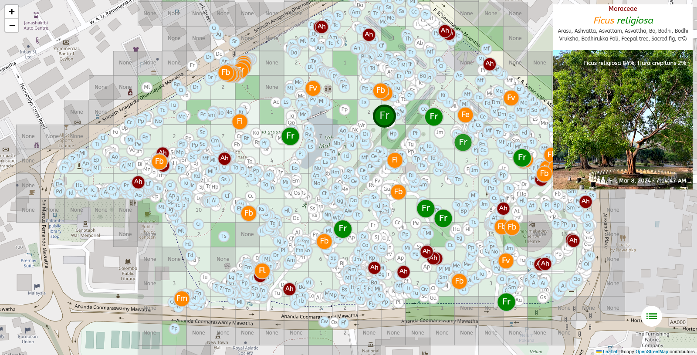

# Plants of Vihaaramahadevi Park :sri_lanka:

*This analysis was automatically generated on  **Mar 25, 2024 (09:07 AM)**, and is based on  **566** plant photos.*

## Background

Viharamahadevi Park (Sinhala: විහාරමහාදේවී උද්‍යානය; formerly Victoria Park, Sinhala: වික්ටෝරියා පාක්) is a public park located in Cinnamon Gardens, in [Colombo](https://en.wikipedia.org/wiki/Colombo), situated in front of the colonial-era Town Hall in Sri Lanka. It was built by the British colonial administration and is the oldest and largest park of Colombo. The park was originally named "Victoria Park" after Queen Victoria but was renamed after Queen Viharamahadevi, the mother of King Dutugamunu on July 18, 1958. [[Wikipedia](https://en.wikipedia.org/wiki/Viharamahadevi_Park)]

Viharamahadevi Park is 24.27ha, and has an estimated [green cover](https://en.wikipedia.org/wiki/Vegetation) of 14.39ha (59% from the total area). The estimated crown cover 12.25ha (50%). [[Madurapperuma et al](https://www.researchgate.net/publication/282250239_CrownTree_cover_of_Viharamahadevi_Park_Colombo)]

## [PlantNet](https://plantnet.org)

Plant Identifications are from  [PlantNet](https://plantnet.org), a citizen science project for automatic plant identification through photographs and based on machine learning.

*We only consider results where the model's identification confidence is **≥ 20%.***

## The [Plants](https://nuuuwan.github.io/plants) App

Results can be directly inspected using our [Plants](https://nuuuwan.github.io/plants) App.

## Summary Statistics

### Species

**163** unique Species.

| # | Species | n(Photos) | % |
| ---: | :--- | ---: | ---: |
| 1 | [*Mesua ferrea*](https://en.wikipedia.org/wiki/Mesua_ferrea) | 42 | 7.4% |
| 2 | [*Terminalia arjuna*](https://en.wikipedia.org/wiki/Terminalia_arjuna) | 29 | 5.1% |
| 3 | [*Mangifera indica*](https://en.wikipedia.org/wiki/Mangifera_indica) | 25 | 4.4% |
| 4 | [*Tectona grandis*](https://en.wikipedia.org/wiki/Tectona_grandis) | 20 | 3.5% |
| 5 | [*Tabernaemontana divaricata*](https://en.wikipedia.org/wiki/Tabernaemontana_divaricata) | 18 | 3.2% |
| 6 | [*Artocarpus heterophyllus*](https://en.wikipedia.org/wiki/Artocarpus_heterophyllus) | 17 | 3.0% |
| 7 | [*Tecoma stans*](https://en.wikipedia.org/wiki/Tecoma_stans) | 16 | 2.8% |
| 8 | [*Terminalia catappa*](https://en.wikipedia.org/wiki/Terminalia_catappa) | 16 | 2.8% |
| 9 | [*Pongamia pinnata*](https://en.wikipedia.org/wiki/Pongamia_pinnata) | 15 | 2.7% |
| 10 | [*Cassia fistula*](https://en.wikipedia.org/wiki/Cassia_fistula) | 13 | 2.3% |
|  | *(All Others)* | 306 | 54.1% |

### Genera

**126** unique Genera.

| # | Genera | n(Photos) | % |
| ---: | :--- | ---: | ---: |
| 1 | [*Terminalia*](https://en.wikipedia.org/wiki/Terminalia) | 47 | 8.3% |
| 2 | [*Mesua*](https://en.wikipedia.org/wiki/Mesua) | 42 | 7.4% |
| 3 | [*Ficus*](https://en.wikipedia.org/wiki/Ficus) | 28 | 4.9% |
| 4 | [*Mangifera*](https://en.wikipedia.org/wiki/Mangifera) | 25 | 4.4% |
| 5 | [*Tectona*](https://en.wikipedia.org/wiki/Tectona) | 20 | 3.5% |
| 6 | [*Tabernaemontana*](https://en.wikipedia.org/wiki/Tabernaemontana) | 18 | 3.2% |
| 7 | [*Cassia*](https://en.wikipedia.org/wiki/Cassia) | 17 | 3.0% |
| 8 | [*Artocarpus*](https://en.wikipedia.org/wiki/Artocarpus) | 17 | 3.0% |
| 9 | [*Tecoma*](https://en.wikipedia.org/wiki/Tecoma) | 16 | 2.8% |
| 10 | [*Peltophorum*](https://en.wikipedia.org/wiki/Peltophorum) | 16 | 2.8% |
|  | *(All Others)* | 232 | 41.0% |

### Families

**58** unique Families.

| # | Families | n(Photos) | % |
| ---: | :--- | ---: | ---: |
| 1 | [*Fabaceae*](https://en.wikipedia.org/wiki/Fabaceae) | 106 | 18.7% |
| 2 | [*Combretaceae*](https://en.wikipedia.org/wiki/Combretaceae) | 49 | 8.7% |
| 3 | [*Calophyllaceae*](https://en.wikipedia.org/wiki/Calophyllaceae) | 46 | 8.1% |
| 4 | [*Moraceae*](https://en.wikipedia.org/wiki/Moraceae) | 45 | 8.0% |
| 5 | [*Apocynaceae*](https://en.wikipedia.org/wiki/Apocynaceae) | 38 | 6.7% |
| 6 | [*Anacardiaceae*](https://en.wikipedia.org/wiki/Anacardiaceae) | 36 | 6.4% |
| 7 | [*Bignoniaceae*](https://en.wikipedia.org/wiki/Bignoniaceae) | 34 | 6.0% |
| 8 | [*Myrtaceae*](https://en.wikipedia.org/wiki/Myrtaceae) | 21 | 3.7% |
| 9 | [*Lamiaceae*](https://en.wikipedia.org/wiki/Lamiaceae) | 21 | 3.7% |
| 10 | [*Meliaceae*](https://en.wikipedia.org/wiki/Meliaceae) | 19 | 3.4% |
|  | *(All Others)* | 96 | 17.0% |

## Identification Confidence

## Pairs of Plant Species, likely confused during identification (at least 3 times)

| Species 1 | Species 2 | n(Photos) |
| :--- | :--- | ---: |
| *Peltophorum dubium* | *Peltophorum pterocarpum* | 3 |
| *Jacaranda mimosifolia* | *Peltophorum pterocarpum* | 3 |
