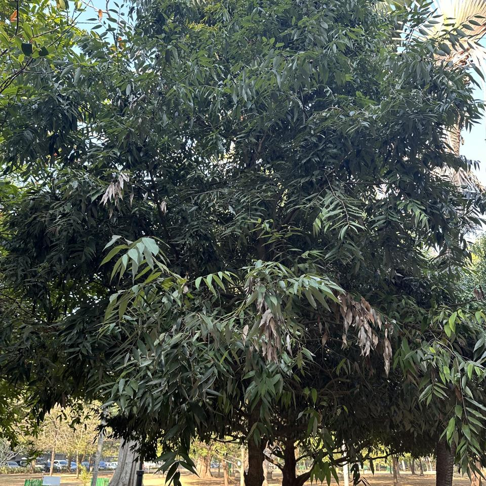
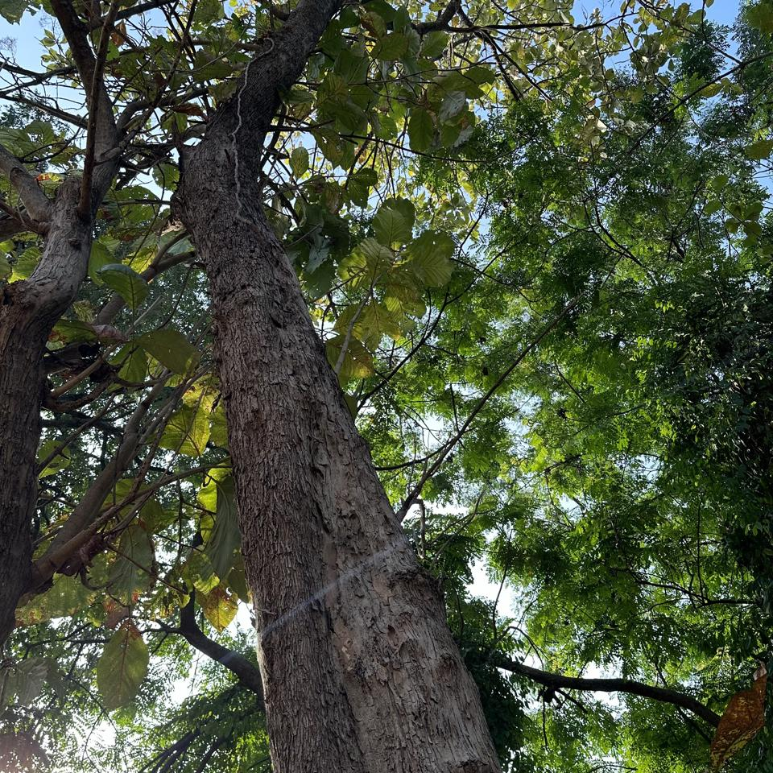
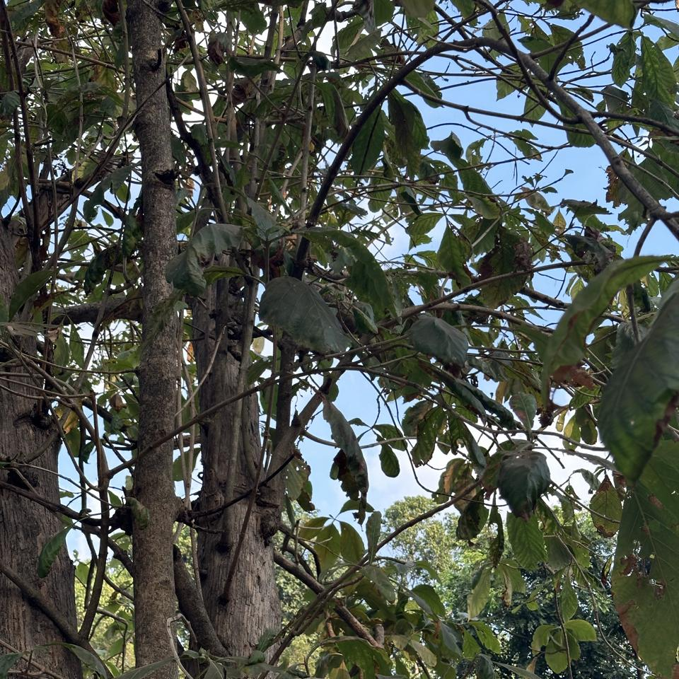

# Plants of Sri Lanka :sri_lanka:

## About

This project aims to use Computer Vision and Artificial Intelligence to identify plants in Sri Lanka's public parks, beginning with Viharamahadevi Park, Colombo.

🤖 *This report was automatically generated on  **Mar 27, 2024 (10:33 AM)**, and is based on **613** plant photos.*

## [PlantNet](https://plantnet.org)

Plant Identifications are from  [PlantNet](https://plantnet.org), a citizen science project for automatic plant identification through photographs and based on machine learning.

*We only consider results where the model's identification confidence is **≥ 20%.***

## The [Plants](https://nuuuwan.github.io/plants) App

Results can be directly inspected using our [Plants](https://nuuuwan.github.io/plants) App.

## Viharamahadevi Park

Viharamahadevi Park (Sinhala: විහාරමහාදේවී උද්‍යානය; formerly Victoria Park, Sinhala: වික්ටෝරියා පාක්) is a public park located in Cinnamon Gardens, in [Colombo](https://en.wikipedia.org/wiki/Colombo), situated in front of the colonial-era Town Hall in Sri Lanka. It was built by the British colonial administration and is the oldest and largest park of Colombo. The park was originally named "Victoria Park" after Queen Victoria but was renamed after Queen Viharamahadevi, the mother of King Dutugamunu on July 18, 1958. [[Wikipedia](https://en.wikipedia.org/wiki/Viharamahadevi_Park)]

Viharamahadevi Park is 24.27ha, and has an estimated [green cover](https://en.wikipedia.org/wiki/Vegetation) of 14.39ha (59% from the total area). The estimated crown cover 12.25ha (50%). [[Madurapperuma et al](https://www.researchgate.net/publication/282250239_CrownTree_cover_of_Viharamahadevi_Park_Colombo)]

## Plant Photo Funnel

Of all the photos taken (**All**)
 we filter photos that are
 within the desired geographical area (**In Geo**)

Next we filter out photos that might be 
duplicates (**Deduped**).

Finally, we only consider identifications
 where the model confidence is at least 
20% (**≥ 20%**). 
We list statistics for 5% and 10% as well.

## Most Common Species

### [*Mesua ferrea*](https://en.wikipedia.org/wiki/Mesua_ferrea) ([*Calophyllaceae*](https://en.wikipedia.org/wiki/Calophyllaceae))

*46 Photos*

  

*Ceylon Ironwood, Cirunakappu, Iron Wood Tree, Mesua, Na, Naa, Nagakesarah Nagapuspa, Nangu*

Mesua ferrea, the Ceylon ironwood,  or cobra saffron, is a species in the family Calophyllaceae native to the Indomalayan realm. This slow-growing tree is named after the heaviness and hardness of its timber. It is widely cultivated as an ornamental for its graceful shape, grayish-green foliage with a beautiful pink to red flush of drooping young leaves, and large, fragrant white flowers. It is the national tree of Sri Lanka, as well as the state tree of Mizoram and state flower of Tripura in India. [[Wikipedia](https://en.wikipedia.org/wiki/Mesua_ferrea)]

### [*Mangifera indica*](https://en.wikipedia.org/wiki/Mangifera_indica) ([*Anacardiaceae*](https://en.wikipedia.org/wiki/Anacardiaceae))

*31 Photos*

  

*Amba, Amiram, Amra, Ma, Mamaram, Mangai, Mango, Mango Tree, Mee Amba, Sahakara, आम*

Mangifera indica, commonly known as mango, is a species of flowering plant in the family Anacardiaceae. It is a large fruit tree, capable of growing to a height of 30 metres (100 feet). There are two distinct genetic populations in modern mangoes – the "Indian type" and the "Southeast Asian type". [[Wikipedia](https://en.wikipedia.org/wiki/Mangifera_indica)]

### [*Terminalia arjuna*](https://en.wikipedia.org/wiki/Terminalia_arjuna) ([*Combretaceae*](https://en.wikipedia.org/wiki/Combretaceae))

*29 Photos*

  

*Arjun, Kakubha, Kumbuk, Maruthu, Marutu, White murdh*

Terminalia arjuna is a tree of the genus Terminalia. It is commonly known as arjuna or arjun tree in English. [[Wikipedia](https://en.wikipedia.org/wiki/Terminalia_arjuna)]

### [*Artocarpus heterophyllus*](https://en.wikipedia.org/wiki/Artocarpus_heterophyllus) ([*Moraceae*](https://en.wikipedia.org/wiki/Moraceae))

*22 Photos*

  

*Herali, Jackfruit, Kos, Pala, Palavu, Panasam, Pila, Vaela, Waraka See Artocarpus Indica, কাঠাল, పనస*

The jackfruit is the fruit of jack tree Artocarpus heterophyllus, a species of tree in the fig, mulberry, and breadfruit family (Moraceae). The jackfruit is the largest tree fruit, reaching as much as 55 kg (120 pounds) in weight, 90 cm (35 inches) in length, and 50 cm (20 inches) in diameter. A mature jackfruit tree produces some 200 fruits per year, with older trees bearing up to 500 fruits in a year. The jackfruit is a multiple fruit composed of hundreds to thousands of individual flowers, and the fleshy petals of the unripe fruit are eaten.The jackfruit tree is well-suited to tropical lowlands and is widely cultivated throughout tropical regions of the world, including India, Bangladesh, Sri Lanka, and the rainforests of the Philippines, Indonesia, Malaysia, and Australia.The ripe fruit is sweet (depending on variety) and is commonly used in desserts. Canned green jackfruit has a mild taste and meat-like texture that lends itself to being called "vegetable meat". Jackfruit is commonly used in South and Southeast Asian cuisines. Both ripe and unripe fruits are consumed. It is available internationally, canned or frozen, and in chilled meals, as are various products derived from the fruit, such as noodles and chips. [[Wikipedia](https://en.wikipedia.org/wiki/Artocarpus_heterophyllus)]

### [*Tectona grandis*](https://en.wikipedia.org/wiki/Tectona_grandis) ([*Lamiaceae*](https://en.wikipedia.org/wiki/Lamiaceae))

*21 Photos*

  

*Bankok teak, Bardaru, Bhumisah, Dwardaru, Indian-oak, Kharchchada, Kolaphala, Saaka, Sabarasaara, Teak, The Kka Signify Long Sound, Thekku*

Teak (Tectona grandis) is a tropical hardwood tree species in the family Lamiaceae. It is a large, deciduous tree that occurs in mixed hardwood forests. Tectona grandis has small, fragrant white flowers arranged in dense clusters (panicles) at the end of the branches. These flowers contain both types of reproductive organs (perfect flowers). The large, papery leaves of teak trees are often hairy on the lower surface. Teak wood has a leather-like smell when it is freshly milled and is particularly valued for its durability and water resistance. The wood is used for boat building, exterior construction, veneer, furniture, carving, turnings, and various small projects.Tectona grandis is native to south and southeast Asia, mainly Bangladesh, India, Indonesia, Malaysia, Myanmar, Thailand, and Sri Lanka, but is naturalised and cultivated in many countries in Africa and the Caribbean. Myanmar's teak forests account for nearly half of the world's naturally occurring teak. Molecular studies show that there are two centres of the genetic origin of teak: one in India and the other in Myanmar and Laos. [[Wikipedia](https://en.wikipedia.org/wiki/Tectona_grandis)]

### [*Terminalia catappa*](https://en.wikipedia.org/wiki/Terminalia_catappa) ([*Combretaceae*](https://en.wikipedia.org/wiki/Combretaceae))

*17 Photos*

  

*Country-almond, Indian-almond, Kottamba, Kottan, Nattu Vadam, Nattuvadumai, Tailaphala, Tropical almond*

Terminalia catappa is a large tropical tree in the leadwood tree family, Combretaceae, native to Asia, Australia, the Pacific, Madagascar and Seychelles. Common names in English include country almond, Indian almond, Malabar almond, sea almond, tropical almond, beach almond and false kamani. [[Wikipedia](https://en.wikipedia.org/wiki/Terminalia_catappa)]

### [*Pongamia pinnata*](https://en.wikipedia.org/wiki/Pongamia_pinnata) ([*Fabaceae*](https://en.wikipedia.org/wiki/Fabaceae))

*17 Photos*

  

*Indian Beech, Karanda, Karanj, Kolliyam, Naktamaala, Pomka, Pongam, Punku*

Pongamia pinnata is a species of tree in the pea family, Fabaceae, native to eastern and tropical Asia, Australia, and the Pacific islands. It is the sole species in genus Pongamia. It is often known by the synonym Millettia pinnata. Its common names include Indian beech and Pongame oiltree. [[Wikipedia](https://en.wikipedia.org/wiki/Pongamia_pinnata)]

### [*Tecoma stans*](https://en.wikipedia.org/wiki/Tecoma_stans) ([*Bignoniaceae*](https://en.wikipedia.org/wiki/Bignoniaceae))

*16 Photos*

  

*Kaelanitissa, Kelantissa, Rankaerali, Swarnaptti, Tankarali, Trumpet-flower, Yellow trumpet flower, Yellow-bells*

Tecoma stans is a species of flowering perennial shrub in the trumpet vine family, Bignoniaceae, that is native to the Americas.  Common names include yellow trumpetbush, yellow bells, yellow elder, ginger Thomas. Tecoma stans is the official flower of the United States Virgin Islands and the floral emblem of The Bahamas. [[Wikipedia](https://en.wikipedia.org/wiki/Tecoma_stans)]

### [*Tabernaemontana divaricata*](https://en.wikipedia.org/wiki/Tabernaemontana_divaricata) ([*Apocynaceae*](https://en.wikipedia.org/wiki/Apocynaceae))

*16 Photos*

  

*Adukkunandiyavattai, Butterfly-gardenia, Crape-jasmine, Nandi Battai, Nandiar Vattai, Nandivrksah, Vathu Sudda, Wathu Sudda, Watu Sudda, Watusudda, నందివర్ధనం*

Tabernaemontana divaricata, commonly called pinwheel flower, crape jasmine, East India rosebay, and Nero's crown, is an evergreen shrub or small tree native to South Asia, Southeast Asia and China. In zones where it is not hardy it is grown as a house/glasshouse plant for its attractive flowers and foliage. The stem exudes a milky latex when broken, whence comes the name milk flower [[Wikipedia](https://en.wikipedia.org/wiki/Tabernaemontana_divaricata)]

### [*Peltophorum pterocarpum*](https://en.wikipedia.org/wiki/Peltophorum_pterocarpum) ([*Fabaceae*](https://en.wikipedia.org/wiki/Fabaceae))

*16 Photos*

  

*Copperpod, Kaha Maara, Kona Maram, Maara, Nilalvakai, Yellow flame, Yellow flametree*

Peltophorum pterocarpum (commonly known as copperpod, yellow-flamboyant, yellow flametree, yellow poinciana or yellow-flame) is a species of Peltophorum, native to tropical southeastern Asia and a popular ornamental tree grown around the world. [[Wikipedia](https://en.wikipedia.org/wiki/Peltophorum_pterocarpum)]

## Statistics by Taxonomy

### Species

**165** unique Species.

| # | Species | n(Photos) | % |
| ---: | :--- | ---: | ---: |
| 1 | [*Mesua ferrea*](https://en.wikipedia.org/wiki/Mesua_ferrea) | 46 | 7.5% |
| 2 | [*Mangifera indica*](https://en.wikipedia.org/wiki/Mangifera_indica) | 31 | 5.1% |
| 3 | [*Terminalia arjuna*](https://en.wikipedia.org/wiki/Terminalia_arjuna) | 29 | 4.7% |
| 4 | [*Artocarpus heterophyllus*](https://en.wikipedia.org/wiki/Artocarpus_heterophyllus) | 22 | 3.6% |
| 5 | [*Tectona grandis*](https://en.wikipedia.org/wiki/Tectona_grandis) | 21 | 3.4% |
| 6 | [*Terminalia catappa*](https://en.wikipedia.org/wiki/Terminalia_catappa) | 17 | 2.8% |
| 7 | [*Pongamia pinnata*](https://en.wikipedia.org/wiki/Pongamia_pinnata) | 17 | 2.8% |
| 8 | [*Tecoma stans*](https://en.wikipedia.org/wiki/Tecoma_stans) | 16 | 2.6% |
| 9 | [*Tabernaemontana divaricata*](https://en.wikipedia.org/wiki/Tabernaemontana_divaricata) | 16 | 2.6% |
| 10 | [*Peltophorum pterocarpum*](https://en.wikipedia.org/wiki/Peltophorum_pterocarpum) | 16 | 2.6% |
|  | *(All Others)* | 310 | 50.6% |

### Genera

**127** unique Genera.

| # | Genera | n(Photos) | % |
| ---: | :--- | ---: | ---: |
| 1 | [*Terminalia*](https://en.wikipedia.org/wiki/Terminalia) | 48 | 7.8% |
| 2 | [*Mesua*](https://en.wikipedia.org/wiki/Mesua) | 46 | 7.5% |
| 3 | [*Mangifera*](https://en.wikipedia.org/wiki/Mangifera) | 31 | 5.1% |
| 4 | [*Ficus*](https://en.wikipedia.org/wiki/Ficus) | 30 | 4.9% |
| 5 | [*Artocarpus*](https://en.wikipedia.org/wiki/Artocarpus) | 22 | 3.6% |
| 6 | [*Tectona*](https://en.wikipedia.org/wiki/Tectona) | 21 | 3.4% |
| 7 | [*Peltophorum*](https://en.wikipedia.org/wiki/Peltophorum) | 19 | 3.1% |
| 8 | [*Cassia*](https://en.wikipedia.org/wiki/Cassia) | 17 | 2.8% |
| 9 | [*Pongamia*](https://en.wikipedia.org/wiki/Pongamia) | 17 | 2.8% |
| 10 | [*Tecoma*](https://en.wikipedia.org/wiki/Tecoma) | 16 | 2.6% |
|  | *(All Others)* | 234 | 38.2% |

### Families

**58** unique Families.

| # | Families | n(Photos) | % |
| ---: | :--- | ---: | ---: |
| 1 | [*Fabaceae*](https://en.wikipedia.org/wiki/Fabaceae) | 119 | 19.4% |
| 2 | [*Moraceae*](https://en.wikipedia.org/wiki/Moraceae) | 52 | 8.5% |
| 3 | [*Calophyllaceae*](https://en.wikipedia.org/wiki/Calophyllaceae) | 50 | 8.2% |
| 4 | [*Combretaceae*](https://en.wikipedia.org/wiki/Combretaceae) | 50 | 8.2% |
| 5 | [*Anacardiaceae*](https://en.wikipedia.org/wiki/Anacardiaceae) | 42 | 6.9% |
| 6 | [*Bignoniaceae*](https://en.wikipedia.org/wiki/Bignoniaceae) | 35 | 5.7% |
| 7 | [*Apocynaceae*](https://en.wikipedia.org/wiki/Apocynaceae) | 35 | 5.7% |
| 8 | [*Myrtaceae*](https://en.wikipedia.org/wiki/Myrtaceae) | 23 | 3.8% |
| 9 | [*Lamiaceae*](https://en.wikipedia.org/wiki/Lamiaceae) | 22 | 3.6% |
| 10 | [*Meliaceae*](https://en.wikipedia.org/wiki/Meliaceae) | 21 | 3.4% |
|  | *(All Others)* | 96 | 15.7% |

## Sample of Plant Photos difficult to Identify

Photos where the identification confidence is **< 20%**.

### Photo-2024-03-15-07-01-10

* 3.5% *Melaleuca viminalis*
* 3.4% *Bambusa vulgaris*
* 2.0% *Dendrocalamus giganteus*

### Photo-2024-03-08-07-06-01

* 11.3% *Bunchosia armeniaca*
* 10.4% *Ehretia anacua*
* 3.4% *Flacourtia jangomas*

### Photo-2024-03-15-07-19-26

* 8.7% *Eucalyptus globulus*
* 7.3% *Mesua ferrea*
* 2.4% *Eucalyptus sideroxylon*

### Photo-2024-03-27-07-40-31

* 19.6% *Cassia javanica*
* 3.8% *Pterocarpus indicus*
* 3.2% *Cassia moschata*

### Photo-2024-03-20-07-39-52

* 5.6% *Morus nigra*
* 3.6% *Pyrus calleryana*
* 2.9% *Ziziphus mauritiana*

### Photo-2024-03-17-08-04-11

* 1.1% *Melaleuca viminalis*
* 0.9% *Chamaecytisus prolifer*
* 0.9% *Podocarpus neriifolius*

### Photo-2024-03-08-06-55-50

* 12.9% *Hibiscus rosa-sinensis*
* 5.6% *Hibiscus fragilis*
* 4.4% *Hibiscus schizopetalus*

### Photo-2024-03-17-08-08-35

* 0.1% *Schizolobium parahyba*

### Photo-2024-03-20-07-46-15

* 11.5% *Peltophorum pterocarpum*
* 6.2% *Delonix regia*
* 3.4% *Jacaranda mimosifolia*

### Photo-2024-03-21-08-11-20

* 12.8% *Madhuca longifolia*
* 1.6% *Cestrum parqui*
* 1.4% *Asclepias curassavica*

### Photo-2024-03-20-07-03-23

* 7.8% *Cordia dichotoma*
* 7.4% *Pterocarpus santalinus*
* 3.9% *Dalbergia latifolia*

### Photo-2024-03-17-08-13-55

* 3.9% *Holarrhena pubescens*
* 2.8% *Annona squamosa*
* 2.4% *Citharexylum spinosum*

### Photo-2024-03-22-08-04-50

* 6.0% *Tabernaemontana divaricata*
* 3.4% *Syzygium jambos*
* 1.1% *Ludwigia octovalvis*

### Photo-2024-03-20-07-03-36

* 9.2% *Dimocarpus longan*
* 9.1% *Saraca indica*
* 7.4% *Saraca asoca*

### Photo-2024-03-20-07-38-35

* 3.1% *Quercus acutissima*
* 1.3% *Santalum album*
* 1.2% *Persea americana*

### Photo-2024-03-11-06-37-43

* 11.8% *Alnus formosana*
* 10.0% *Quercus humboldtii*
* 7.7% *Santalum album*

### Photo-2024-02-10-08-03-25

* 5.3% *Pittosporum undulatum*
* 3.4% *Melaleuca alternifolia*
* 3.2% *Camellia sinensis*

### Photo-2024-03-14-07-50-17

* 13.5% *Ficus religiosa*
* 1.9% *Strychnos nux-vomica*
* 1.8% *Spondias mombin*

### Photo-2024-03-22-08-03-23

* 17.3% *Mesua ferrea*
* 2.7% *Eucalyptus robusta*
* 2.2% *Toona ciliata*

### Photo-2024-03-12-07-19-55

* 11.8% *Calophyllum inophyllum*
* 11.0% *Tabebuia pallida*
* 4.2% *Ficus rubiginosa*

## Duplicates

If the location of two plant photos is very close to each other, we tag these as *duplicates* and exclude them from our analysis.

